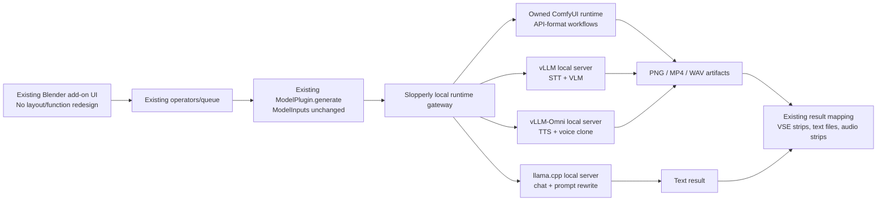
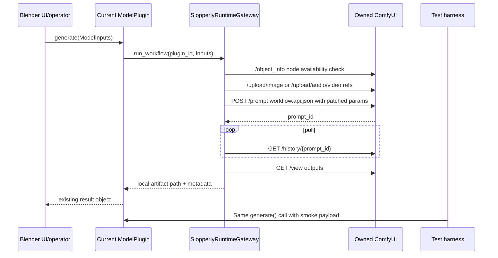
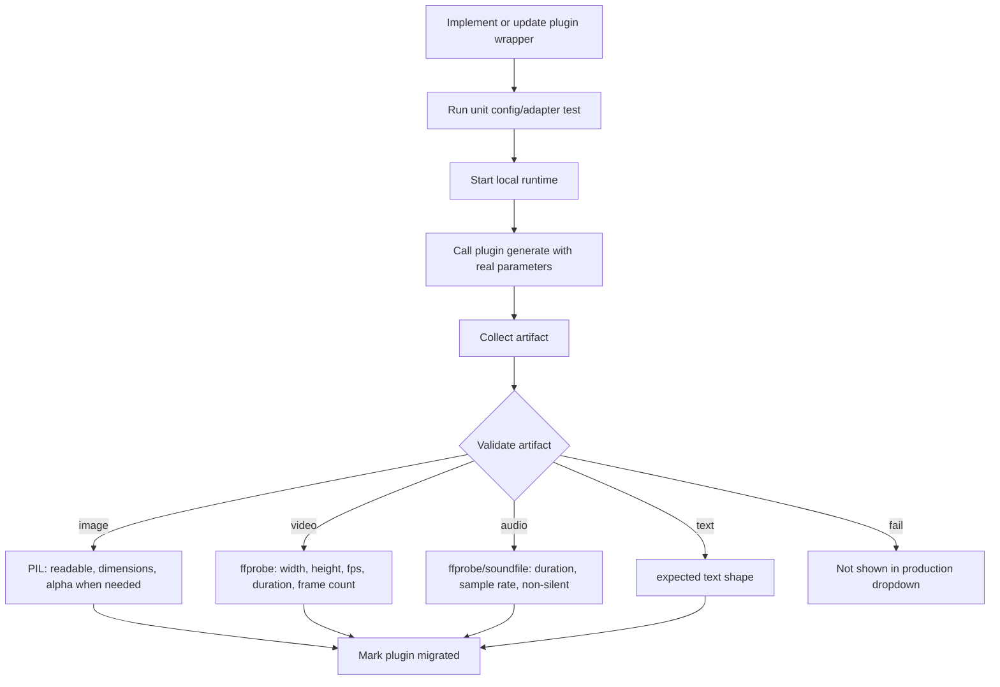

# Slopperly local backend migration specification

This document is the handoff target for the implementation agent. Read and update this document every time you work.

All work must be performed in the **WIP** branch and committed and pushed after each block of changes to maintain a complete history of tracked changes in case anything needs to be fixed or reverted.

Always read this document before starting work and do not deviate from it. Mark each line as completed before moving on to the next one until everything is tested, complete, and production-ready.

For testing, you are free to set up Python environments, ComfyUI, download required models, and test any workflows you create. An example of a working **LTX 2.3** video generation workflow (1080p, 24 FPS, 20 seconds, CPU/GPU weight offloading) for porting to ComfyUI is available in the `workflows` folder.

Run and validate **vLLM**, **Llama**, **ComfyUI**, and related components on the available RTX 4090. When porting functionality, ensure everything works correctly. All functions and workflows must be live-tested using real inputs and generated artifacts.

Be careful when selecting text encoders. If a text encoder can reasonably fit within 16 GB of VRAM with CPU offloading where appropriate, prefer the original **Safetensors** model over **GGUF**, unless GGUF is fully and properly supported as a text encoder for the specific image or video workflow.


You are the lead implementation agent for the Palladium-to-Slopperly fork.

Your task is to build local ai fork of the Palladium. Slopperly implementation must remove all external AI providers and route all generation, inference, speech, transcription, image, video, background removal, and workflow execution through local runtimes only.

This is not a prototype. Do not stub, mock, comment out, or cosmetically rename features. A feature is complete only when the existing UI button/flow still works end-to-end through the new local backend, or when you have documented the exact blocking reason with evidence and preserved a non-breaking UI state.

Primary goal:
Port Palladium into Slopperly as a local-only Ubuntu x64 CUDA application using only these AI execution backends:
1. llama.cpp for direct chat, prompt enhancement, planning, metadata generation, and other low-latency or long-context text inference OpenAI-compatible text, multimodal,
2. vLLM and vLLM-Omni for local  speech-to-text, and text-to-speech voice cloning, etc etc.
3. ComfyUI for image, video, image-editing, video-editing, frame interpolation, background removal, and node-graph workflows.
4. Blender only where the existing app already uses or requires Blender-style 3D/render logic.

No OpenAI, Anthropic, Gemini, Replicate, ElevenLabs, Runway, Stability hosted APIs, cloud Comfy services, hosted Hugging Face inference APIs, or other external inference providers may remain in the production Slopperly path. Hugging Face may be used only as a model artifact source for local download/cache.

## 0. Non-negotiable behavior

The Blender add-on UI is not to be redesigned. The existing panels, buttons, operator flow, strip picking, prompt fields, negative prompt fields, image/video/audio strip selectors, resolution controls, frame controls, seed, steps, guidance, strength, LoRA controls, and output insertion behavior stay intact.

The allowed UI changes are only these:

1. Remove external/cloud provider settings, API key prompts, and remote cloud backend discovery from production Slopperly.
2. Replace provider/runtime settings with local runtime settings for owned ComfyUI, vLLM, vLLM-Omni, and llama.cpp.
3. Replace cloud-only model dropdown entries with local model entries or saved-project compatibility aliases.
4. Remove or hide a dropdown model entry when there is no committed local workflow and no passing artifact test.
5. Rename Palladium to Slopperly.

The migration path is not “replace every old model with some newer model.” Existing local models already present in the add-on must be migrated to the permitted execution backends. For image/video/audio diffusion models, that means ComfyUI workflows or Slopperly-owned Comfy custom nodes. For STT/VLM, that means vLLM. For TTS/voice clone, existing models with real Comfy node support stay on Comfy, while Qwen/Fish/OmniVoice/MOSS profiles use vLLM-Omni. For text rewrite/chat/planning, that means llama.cpp.

Hugging Face is allowed only as a model artifact source. Hugging Face hosted inference is not allowed.

## 1. Current repository facts

The uploaded code still has the Pallaidium plugin architecture:

```text
models/base.py                       ModelPlugin, ModelInputs, InputSpec, UISection, ParamSpec
models_plugins/<type>/*.py           actual model plugins
models/remote_base.py                generic OpenAI-style remote plugin factory
remote_backends/comfyui_adapter.py   local Comfy bridge, currently user-supplied Comfy instance
remote_backends/fal_adapter.py       fal.ai cloud bridge
properties/preferences.py            model source + remote/backend/API-key preferences
utils/remote_backend.py              generic backend HTTP client
utils/helpers.py                     direct MiniMax video cloud helpers
```

The current dispatch seam is already correct and must be preserved:

```text
Blender UI/operator
  -> selected ModelPlugin
  -> ModelPlugin.generate(ModelInputs)
  -> runtime implementation
  -> artifact file
  -> existing VSE/output insertion logic
```

The migration must not bypass `ModelPlugin.generate()`. The tests must exercise that same path.

## 2. External/cloud code removal map

| File/path | Current behavior | Production Slopperly action |
|---|---|---|
| `remote_backends/fal_adapter.py` | Forwards to `https://queue.fal.run` for Seedance, Seed Audio, and cloud FLUX. | Remove from production discovery. Keep only in `/reference/palladium` or docs archive. |
| `remote_backends/fal_adapter.manifest.json` | Makes fal visible as a backend. | Remove from production manifests. |
| `models_plugins/image/google_nano_banana.py` | Uses Google Gemini/Nano Banana image API and `GEMINI_API_KEY`. | Remove cloud backend logic. Old model ID becomes saved-project alias to local Qwen Image Edit workflow. Do not show “Google Nano Banana” in production dropdown. |
| `models_plugins/video/google_veo.py` | Uses Google Veo cloud video. | Remove cloud backend logic. Old model ID becomes saved-project alias to local Wan/LTX workflow. Do not show “Google Veo” in production dropdown. |
| `models_plugins/video/minimax.py` | MiniMax/Hailuo cloud video model family. | Remove cloud backend logic. Old model IDs become saved-project aliases to Wan/LTX local workflows. |
| `MiniMax_API.txt` | Local file for MiniMax API key. | Delete from production tree. |
| `utils/helpers.py` MiniMax functions | `invoke_video_generation`, `query_video_generation`, `fetch_video_result` call `api.minimaxi.chat`. | Delete or move to reference-only. Production grep must fail if these URLs remain reachable. |
| `properties/preferences.py` remote key fields | `gemini_api_key`, `remote_backend_key`, remote URL/key UI. | Replace with local runtime paths/ports/model-cache settings. No cloud keys. |
| `models/base.py` `InputSpec.API_KEY` | External provider API-key input. | Remove from production plugin inputs. Preserve only in reference code. |
| `models/remote_base.py` and `utils/remote_backend.py` | Generic remote backend client. | Either rename/rewrite as localhost-only runtime client or isolate in reference. Production client must reject non-localhost inference URLs. |

Production no-cloud grep must fail on these outside reference/docs/test allowlists:

```text
queue.fal.run
fal.ai
FAL_KEY
google.genai
GEMINI_API_KEY
MiniMax_API.txt
api.minimaxi.chat
OPENAI_API_KEY
ANTHROPIC_API_KEY
ELEVENLABS_API_KEY
REPLICATE_API_TOKEN
api.stability.ai
runway
vertex
bedrock
```

## 3. Runtime architecture







## 4. Runtime responsibilities

| Runtime | Required use in Slopperly | Notes |
|---|---|---|
| ComfyUI owned runtime | Image generation, image editing, video generation, video editing, background removal, super-resolution, frame interpolation, music/audio diffusion, video-to-audio, stem splitting, Florence-style image captioning when implemented as Comfy workflow. | Use API-format workflows. Normal UI-save JSON is not enough. Store editable and API JSON side by side. |
| vLLM | Speech-to-text/transcription and video/image VLM captioning where the chosen local model is served through vLLM. | Use a dedicated vLLM venv. Use `vllm[audio]` for transcription. |
| vLLM-Omni | TTS, voice design, voice cloning, uploaded voice cache, batch speech. | Use dedicated vLLM-Omni server instances. Each server instance runs one model. |
| llama.cpp | Prompt enhancement, prompt rewriting, chat, planning, metadata, script generation. | Use requested Ubuntu x64 CUDA 13 release artifact. Defaults: 60k context, 30k max new tokens, with explicit diagnostics when a model/runtime cannot honor the request. |
| Blender | Existing sequencing, insertion, timeline, render/export logic. | Do not move UI logic into runtime adapters. |

Key upstream facts used by this spec:

- ComfyUI API submission uses API-format workflows; the editable UI workflow and API workflow are different artifacts.
- The requested llama.cpp release lists an Ubuntu x64 CUDA 13 artifact and says CUDA artifacts are built against CUDA 13.2 and do not bundle NVIDIA runtime/driver libraries.
- vLLM exposes OpenAI-compatible transcription APIs and requires audio extras for STT.
- vLLM-Omni exposes OpenAI-compatible speech APIs and lists Qwen3-TTS, Fish Speech S2 Pro, Voxtral TTS, CosyVoice3, OmniVoice, VoxCPM2, and MOSS-TTS-Nano support.

## 5. Required repository layout

```text
slopperly/
  runtime/
    gateway.py
    comfy/
      supervisor.py
      api_client.py
      workflow_runner.py
      install.py
      nodes.lock.yaml
    vllm/
      supervisor.py
      stt_client.py
      vlm_client.py
      install.py
    vllm_omni/
      supervisor.py
      tts_client.py
      voice_client.py
      install.py
    llamacpp/
      supervisor.py
      client.py
      install.py
  workflows/
    comfy/<workflow_id>/
      workflow.editable.json
      workflow.api.json
      params.schema.json
      models.yaml
      test_payload.json
      README.md
  config/
    runtimes.yaml
    models.yaml
    dropdown_profiles.yaml
  tests/
    unit/
    integration/
    gpu/
  docs/
    provider_migration_ledger.md
    runtime_acceptance.md
reference/
  palladium/
```

The original Palladium/Pallaidium reference code remains separate. Production Slopperly code must not import from `/reference`.

## 6. ComfyUI runtime requirements

Slopperly must install and launch its own ComfyUI runtime. It must not depend on the user’s existing Comfy install.

Required Comfy runtime behavior:

1. Install pinned ComfyUI commit or released version into the Slopperly runtime directory.
2. Install pinned custom node packs by git URL and commit SHA.
3. Download model artifacts from `slopperly/config/models.yaml` only when explicitly requested.
4. Validate required node classes by calling `/object_info` before a workflow is marked available.
5. Convert or export every workflow to API format.
6. Execute workflows through `/prompt`, `/history/{prompt_id}`, `/view`, `/upload/image`, and equivalent upload endpoints.
7. Return artifacts in the current add-on result shape.
8. Surface progress/phase through existing `ModelInputs.progress_fn` and `phase_fn`.
9. Reject any workflow that references a cloud Partner Node or external inference endpoint.

### Required Comfy custom node packs

| Pack | Source | Required node classes / use | Used by |
|---|---|---|---|
| ComfyUI core | pinned ComfyUI repo | `LoadImage`, `Load Diffusion Model`, `DualCLIPLoader`, `CLIPTextEncode`, `Load VAE`, `KSampler`/new sampler graph, `VAEDecode`, `SaveImage`, `SaveAudio`, video latent nodes. | Most workflows. |
| ComfyUI-GGUF | `city96/ComfyUI-GGUF` | `UnetLoaderGGUF`, `UnetLoaderGGUFAdvanced`, `CLIPLoaderGGUF`, `DualCLIPLoaderGGUF`, `TripleCLIPLoaderGGUF`, `QuadrupleCLIPLoaderGGUF`. | Q5 GGUF Qwen, FLUX.2 Dev, Wan2.2 GGUF workflows. |
| ComfyUI-VideoHelperSuite | `Kosinkadink/ComfyUI-VideoHelperSuite` | `VHS_LoadVideo`, `VHS_VideoCombine`, audio+video combine behavior. | Video IO, video output, interpolation, video-to-audio workflows. |
| ComfyUI-Frame-Interpolation | `Fannovel16/ComfyUI-Frame-Interpolation` | `RIFE VFI`, `FILM VFI`, `AMT VFI`, `Make Interpolation State List`, `VFI FloatToInt`. | 16 fps to 24 fps interpolation and general VFI. |
| comfyui_controlnet_aux | `Fannovel16/comfyui_controlnet_aux` | `AIO Aux Preprocessor`, `CannyEdgePreprocessor`, `DepthAnythingV2Preprocessor`. | FLUX Canny/Depth and control workflows. |
| ComfyUI-Advanced-ControlNet | `Kosinkadink/ComfyUI-Advanced-ControlNet` | Advanced ControlNet application/scheduling nodes. | FLUX control workflows requiring scheduled strength. |
| ComfyUI-Florence2 | `kijai/ComfyUI-Florence2` | `DownloadAndLoadFlorence2Model`, `Florence2Run`. | Florence2 image caption/OCR/object detection plugin. |
| ComfyUI-MMAudio | `kijai/ComfyUI-MMAudio` | `MMAudioModelLoader`, `MMAudioFeatureUtilsLoader`, `MMAudioSampler`, `MMAudioVoCoderLoader`. | MMAudio video-to-audio plugin. |
| audio-separation-nodes-comfyui | `christian-byrne/audio-separation-nodes-comfyui` | `Audio Separation`, `Audio Combine`, `Audio Crop`, `Audio Tempo Match`, `Audio Speed Shift`, `Audio Get Tempo`, `Audio Video Combine`. | Stem splitting. |
| ComfyUI Chatterbox | `filliptm/ComfyUI_Fill-ChatterBox` or `wildminder/ComfyUI-Chatterbox`, pinned by commit after smoke test | `FL Chatterbox TTS`, `FL Chatterbox Turbo TTS`, `FL Chatterbox Multilingual TTS`, `FL Chatterbox VC`, `FL Chatterbox Dialog TTS` or equivalent class names exposed by the pinned node pack. | Current Chatterbox, Chatterbox Turbo, Chatterbox Multilingual TTS/VC plugins. |
| ACE-Step native/templates | Comfy core templates and/or `ace-step/ACE-Step-ComfyUI` local mode | ACE-Step 1.5 music nodes/templates. Cloud mode is forbidden. | ACE-Step music plugin. |
| ComfyUI-Foundation-1 | `Saganaki22/ComfyUI-Foundation-1` | Foundation-1 structured text-to-sample nodes. | Foundation Music plugin. |
| Comfy RMBG/BiRefNet workflow | Comfy utility workflow and/or `1038lab/ComfyUI-RMBG` | Background-removal node using BiRefNet/RMBG. | BiRefNet background removal. |
| Slopperly Comfy Nodes | new in repo | `SlopperlyDiffusersImageGenerate`, `SlopperlyDiffusersImageEdit`, `SlopperlyDiffusersVideoGenerate`, `SlopperlyDiffusersAudioGenerate`, `SlopperlyArtifactSave`. | Current local models that lack native Comfy/core support. This is how existing local models are migrated without random model swaps. |

Every custom node pack must be pinned in `slopperly/runtime/comfy/nodes.lock.yaml` with URL, commit SHA, install command, required Python extras, and `/object_info` class names to assert.

## 7. Q5/GGUF policy for main image/video models

Q5 GGUF is a target for main local image/video/edit models where actual GGUF artifacts exist and a ComfyUI-GGUF loader can load them. The model registry must be explicit; no code may claim Q5 support without a real model file and a passing workflow artifact test Preffered ggufs from unsloth repos, but others can be used if unsloth doesnt have them.

| Task | Default production model/profile | Q5/GGUF target | Loader/node requirement | Dropdown exposure rule |
|---|---|---|---|---|
| Image generation | Qwen-Image-2512 native/FP8 or GGUF profile | `unsloth/Qwen-Image-2512-GGUF`, `qwen-image-2512-Q5_K_M.gguf` | `UnetLoaderGGUF` or `UnetLoaderGGUFAdvanced`; Qwen text encoder and VAE in Comfy model folders. | Show after 1024 and supported aspect-ratio artifact tests pass. |
| Image editing | Qwen-Image-Edit-2511 native/FP8 or GGUF profile | `unsloth/Qwen-Image-Edit-2511-GGUF`, `qwen-image-edit-2511-Q5_K_M.gguf` | `UnetLoaderGGUF`; multi-image loader patch points; Qwen VAE/text encoder. | Show after one-ref and three-ref edit tests pass. |
| FLUX cloud replacement / quality edit | FLUX.2 Klein 4B for 16GB profile; FLUX.2 Dev for quality profile | `city96/FLUX.2-dev-gguf`, `flux2-dev-Q5_K_M.gguf` is a 24.1GB artifact | `UnetLoaderGGUF`; Mistral-Small FLUX.2 text encoder; FLUX.2 VAE. | FLUX.2 Dev Q5 is not a 16GB default. Show only on certified device profile after artifact test. |
| Video default T2V/I2V | Wan2.2 TI2V-5B | `QuantStack/Wan2.2-TI2V-5B-GGUF`, `Wan2.2-TI2V-5B-Q5_K_M.gguf` is 3.81GB | `UnetLoaderGGUF`; UMT5 text encoder; Wan VAE; Wan latent nodes. | 16GB default after 720P-family/24fps artifact test passes. |
| Video quality T2V | Wan2.2 T2V-A14B | `QuantStack/Wan2.2-T2V-A14B-GGUF`, high-noise and low-noise Q5_K_M pair | Two `UnetLoaderGGUF` nodes or matching workflow loaders; UMT5; Wan VAE; two-stage high/low sampler. | Show after 720P-family/16fps generation and 24fps interpolation artifact test passes on target device. |
| Video quality I2V | Wan2.2 I2V-A14B | `QuantStack/Wan2.2-I2V-A14B-GGUF`, high-noise and low-noise Q5_K_M pair; I2V Q5 high/low files are 10.8GB each | Two `UnetLoaderGGUF` nodes; UMT5; Wan VAE; input image loader. | Show after image-conditioned 720P-family/16fps generation and 24fps interpolation artifact test passes. |

## 8. Model/plugin migration matrix

Legend:

- `MIGRATE_NATIVE_COMFY`: use official/native Comfy workflow or established Comfy node pack.
- `MIGRATE_GGUF_COMFY`: use ComfyUI-GGUF and named Q5 GGUF assets recorded in `models.yaml`.
- `MIGRATE_SLOPPERLY_NODE`: move current direct local code into Slopperly-owned Comfy custom node; do not replace model.
- `LOCAL_ALIAS`: keep saved-project compatibility for old model ID but show the local replacement dropdown entry, not the cloud name.
- `REMOVE_CLOUD`: remove external/cloud backend logic from production.

### 8.1 Image functions

| Current plugin | Current model ID | Action | Local workflow ID | Required backend/nodes | UI contract |
|---|---|---|---|---|---|
| `image/_krea2_base.py` | `ethanfel/Krea-2-Base-Diffusers` | `MIGRATE_NATIVE_COMFY` using the Krea 2 RAW/base family | `krea2_base_t2i` | Krea 2 Comfy workflow/template; model loader, prompt subgraph, resolution selector, sampler, VAE decode, `SaveImage`. | Keep prompt, negative, resolution, frames, steps, guidance, seed, LoRA. |
| `image/krea2_turbo.py` | `OzzyGT/Krea_2_Turbo_sdnq_dynamic_8bit` | `MIGRATE_NATIVE_COMFY` using Krea 2 Turbo | `krea2_turbo_t2i` | Krea 2 Turbo Comfy workflow; prompt subgraph, resolution selector, sampler, VAE decode, `SaveImage`. | Same as current. |
| `image/anima.py` | `mrfatso/anima-preview3-diffusers` | `MIGRATE_NATIVE_COMFY` using Anima Comfy workflow/template | `anima_t2i_i2i` | Anima Subgraph workflow; prompt/negative, model loader, sampler, VAE decode, `SaveImage`; image-strip path is patched for I2I mode. | Keep prompt, negative, image strip, resolution, frames, steps, guidance, strength, seed, LoRA. |
| `image/birefnet.py` | `ZhengPeng7/BiRefNet_HR` | `MIGRATE_NATIVE_COMFY` | `birefnet_rmbg` | BiRefNet/RMBG workflow: `LoadImage` -> RMBG/BiRefNet node -> `SaveImage`. | Keep selected image behavior; output must be PNG with alpha. |
| `image/ernie.py` | `baidu/ERNIE-Image` | `MIGRATE_NATIVE_COMFY` | `ernie_image_t2i` | ERNIE-Image Comfy template. | Keep prompt, negative, resolution, frames, steps, guidance, seed. |
| `image/ernie_turbo.py` | `baidu/ERNIE-Image-Turbo` | `MIGRATE_NATIVE_COMFY` | `ernie_image_turbo_t2i` | ERNIE Turbo Comfy template. | Same as current; default steps remain 8. |
| `image/flux2_dev.py` | `diffusers/FLUX.2-dev-bnb-4bit` | `MIGRATE_GGUF_COMFY` for quality profile; use FP8/GGUF workflow, not cloud | `flux2_dev_gguf_quality` | `UnetLoaderGGUF` or `Load Diffusion Model`; FLUX.2 text encoder; FLUX.2 VAE; multi-reference image nodes. | Keep prompt, multi-images, resolution, frames, steps, guidance, seed. Remove HF token UI from normal runtime; gated-download auth belongs in model manager only. |
| `image/flux2_klein_4b.py` | `black-forest-labs/FLUX.2-klein-4B` | `MIGRATE_NATIVE_COMFY` | `flux2_klein_4b_t2i_edit` | Official FLUX.2 Klein 4B Comfy workflow; supports T2I and edit. | Keep prompt, image strip, resolution, frames, steps, guidance, strength, seed, LoRA. This is the 16GB FLUX-family default. |
| `image/flux2_klein_9b.py` | `ModelsLab/FLUX.2-klein-9B` | `MIGRATE_NATIVE_COMFY` | `flux2_klein_9b_t2i_edit` | Official FLUX.2 Klein 9B workflow. | Same fields; show only after device profile certification. |
| `image/flux2_klein_9b_schematic.py` | `nomadoor/flux-2-klein-9B-schematic-lora` | `MIGRATE_NATIVE_COMFY` | `flux2_klein_9b_schematic_lora` | FLUX.2 Klein 9B + schematic LoRA loader. | Keep prompt, image strip, frames, steps, guidance, seed. |
| `image/flux_canny.py` | `fuliucansheng/FLUX.1-Canny-dev-diffusers-lora` | `MIGRATE_NATIVE_COMFY` | `flux1_canny_control` | `LoadImage`; `CannyEdgePreprocessor`/preprocessed image; FLUX Canny model or LoRA; `DualCLIPLoader`; `Load VAE`; sampler; `SaveImage`. | Keep current control image strip, resolution, frames, steps, guidance, strength, seed, LoRA. |
| `image/flux_depth.py` | `romanfratric234/FLUX.1-Depth-dev-lora` | `MIGRATE_NATIVE_COMFY` | `flux1_depth_control` | `LoadImage`; `DepthAnythingV2Preprocessor` or supplied depth; FLUX Depth LoRA; `DualCLIPLoader`; `Load VAE`; sampler; `SaveImage`. | Same UI fields as current. |
| `image/flux_kontext.py` | `yuvraj108c/FLUX.1-Kontext-dev` | `MIGRATE_NATIVE_COMFY` | `flux_kontext_edit` | FLUX Kontext Comfy workflow; image edit path. | Keep prompt, image strip, resolution, frames, steps, guidance, strength, seed, LoRA. |
| `image/flux_redux.py` | `Runware/FLUX.1-Redux-dev` | `MIGRATE_NATIVE_COMFY` | `flux_redux_restyle` | FLUX Redux Comfy workflow/reference-image path. | Keep image strip, resolution, frames, steps, guidance, seed. |
| `image/google_nano_banana.py` | `google/nano-banana` | `REMOVE_CLOUD` + `LOCAL_ALIAS` | Alias to `qwen_image_edit_2511_multi_gguf` | No Google API. Saved old ID resolves to local Qwen edit workflow with warning. | Remove API-key UI. Production dropdown does not show Google/Nano Banana. |
| `image/ideogram4.py` | `ideogram-ai/ideogram-4-nf4-diffusers` | `MIGRATE_NATIVE_COMFY` using Ideogram 4 Comfy workflow/template | `ideogram4_t2i` | Ideogram 4 workflow/template; prompt/structured-prompt controls, model loader, sampler, VAE decode, `SaveImage`. | Keep prompt, resolution, frames, steps, guidance, seed, LoRA. Remove HF token from main UI; gated auth goes to model manager. |
| `image/kontext_relight.py` | `kontext-community/relighting-kontext-dev-lora-v3` | `MIGRATE_NATIVE_COMFY` | `kontext_relight` | FLUX Kontext/Relight LoRA workflow; illumination controls patched into workflow params. | Keep prompt, image strip, resolution, frames, steps, guidance, illumination, seed. |
| `image/lumina2.py` | `Alpha-VLLM/Lumina-Image-2.0` | `MIGRATE_NATIVE_COMFY` | `lumina2_t2i` | Lumina-Image 2.0 Comfy support/workflow; checkpoint in `models/checkpoints`. | Keep prompt, negative, resolution, frames, steps, guidance, seed. |
| `image/maxine_vsr.py` | `nvidia/maxine-vsr` | Replace backend function with local Comfy super-resolution workflow; do not use NVIDIA Maxine runtime | `local_image_vsr_upscale` | `LoadImage`; `UpscaleModelLoader`; `ImageUpscaleWithModel`; resize/crop node; `SaveImage`. | Keep resolution, frames, seed; display name must become Local Super Resolution, not Maxine. |
| `image/nucleus_moe.py` | `NucleusAI/Nucleus-Image` | `MIGRATE_SLOPPERLY_NODE` using same model | `nucleus_image_t2i` | Slopperly Comfy diffusers node until upstream Comfy support exists. | Keep prompt, negative, resolution, frames, steps, guidance, seed. Do not substitute Qwen/Flux. |
| `image/omnigen.py` | `Shitao/OmniGen-v1-diffusers` | `MIGRATE_NATIVE_COMFY` via `1038lab/ComfyUI-OmniGen` | `omnigen_v1_multi_image` | OmniGen Comfy node pack; multi-image inputs and per-image prompts preserved; `SaveImage`. | Keep triple prompt/image UI, resolution, frames, steps, guidance, seed. |
| `image/qwen_image.py` | `Qwen/Qwen-Image-2512` | `MIGRATE_GGUF_COMFY` and native Comfy profile | `qwen_image_2512_t2i_gguf` | Qwen Image 2512 Comfy native workflow or Q5 GGUF through `UnetLoaderGGUF`; Qwen text encoder; Qwen VAE. | Keep prompt, image strip, resolution, frames, steps, strength, seed, LoRA. |
| `image/qwen_image_edit.py` | `Qwen/Qwen-Image-Edit-2511` | `MIGRATE_GGUF_COMFY` and native Comfy profile | `qwen_image_edit_2511_multi_gguf` | Qwen Image Edit 2511 Comfy native workflow or Q5 GGUF; multi-image reference loader; Qwen VAE/text encoder. | Keep prompt, negative, multi-images, resolution, frames, steps, seed, LoRA. |
| `image/zimage.py` | `Tongyi-MAI/Z-Image` | `MIGRATE_NATIVE_COMFY` using Z-Image Comfy template/workflow | `zimage_t2i_i2i` | Z-Image workflow: model loader, prompt/negative, sampler, VAE decode, image edit path, `SaveImage`. | Keep prompt, negative, image strip, resolution, frames, steps, guidance, strength, seed. |
| `image/zimage.py` | `Tongyi-MAI/Z-Image-Turbo` | `MIGRATE_NATIVE_COMFY` using Z-Image Turbo workflow | `zimage_turbo_t2i_i2i` | Z-Image Turbo workflow; 8-step default path, sampler, VAE decode, `SaveImage`. | Same fields; default steps remain 8. |

### 8.2 Video functions

| Current plugin | Current model ID | Action | Local workflow ID | Required backend/nodes | UI contract |
|---|---|---|---|---|---|
| `video/google_veo.py` | `google/veo` | `REMOVE_CLOUD` + `LOCAL_ALIAS` | Alias T2V to `wan22_ti2v_5b_720p24_gguf`; alias I2V to `ltx23_i2v` or `wan22_i2v_a14b_720p16_to24_gguf` according to selected mode. | No Google API. | Remove API key. Do not show Google/Veo in production dropdown. |
| `video/minimax.py` txt2vid | `Hailuo/MiniMax/txt2vid` | `REMOVE_CLOUD` + `LOCAL_ALIAS` | `wan22_ti2v_5b_720p24_gguf` | Wan2.2 TI2V-5B Q5 GGUF; `VHS_VideoCombine`. | Keep prompt, frames, seed. No MiniMax key. |
| `video/minimax.py` img2vid | `Hailuo/MiniMax/img2vid` | `REMOVE_CLOUD` + `LOCAL_ALIAS` | `wan22_ti2v_5b_720p24_gguf` or `wan22_i2v_a14b_720p16_to24_gguf` | Image loader + Wan I2V/TI2V workflow. | Keep prompt, image strip, frames, seed. |
| `video/minimax.py` subject2vid | `Hailuo/MiniMax/subject2vid` | `REMOVE_CLOUD` + `LOCAL_ALIAS` to local reference-video pipeline | `ltx23_ic_lora_subject_i2v` | LTX-2.3 IC-LoRA/reference workflow; for subject sheet preprocessing use Qwen Image Edit locally, then LTX/Wan I2V. | Keep prompt and image strip. Production dropdown label must be local, not MiniMax. |
| `video/ltx2.py` | `rootonchair/LTX-2-19b-distilled` | `MIGRATE_NATIVE_COMFY` | `ltx2_19b_distilled_t2v_i2v` | LTX workflow using same 19B distilled family; model loader, text encoder, VAE, video sampler, `VHS_VideoCombine`. | Keep prompt, negative, video/image strip, resolution, frames, seed, LoRA. |
| `video/ltx23_extend.py` | `LTX-2.3 Extend Staged` | `MIGRATE_NATIVE_COMFY` | `ltx23_extend_staged` | LTX-2.3 extend template; input video strip path patched; SaveVideo/VHS output. | Keep current extend UI. Duration/frame count must derive from input clip and requested extension. |
| `video/ltx23_lipsync.py` | `LTX-2.3 Lip Sync` | `MIGRATE_NATIVE_COMFY` | `ltx23_lipsync_dialogue` | LTX-2.3 lipsync/reference workflow; audio ref path; target frame count from audio. | Keep prompt, negative, video strip, image strip/audio ref behavior, resolution, frames, seed, LoRA. |
| `video/ltx23_multi.py` | `LTX-2.3 Multi-Input Staged` | `MIGRATE_NATIVE_COMFY` | `ltx23_multi_staged` | LTX-2.3 multimodal workflow; middle anchors patched from `ModelInputs.middle_images_paths`. | Keep current multi/staged UI. |
| `video/ltx23_multi_ic_lora.py` | `LTX-2.3 IC-LoRA Staged` | `MIGRATE_NATIVE_COMFY` | `ltx23_ic_lora_staged` | LTX-2.3 IC-LoRA workflow; LoRA loader and image refs. | Keep current UI. |
| `video/skyreels.py` | `Skywork/SkyReels-V1-Hunyuan-T2V` | `MIGRATE_NATIVE_COMFY` using Kijai SkyReels/Hunyuan Comfy conversion | `skyreels_hunyuan_t2v_i2v` | Kijai SkyReels/Hunyuan Comfy conversion; Hunyuan wrapper/native workflow nodes; `VHS_VideoCombine`. | Keep prompt, negative, video strip, resolution, frames, steps, guidance, seed. |
| `video/wan_t2v.py` | `Wan-AI/Wan2.2-T2V-A14B-Diffusers` | `MIGRATE_GGUF_COMFY` and native FP8 profile | `wan22_t2v_a14b_720p16_to24_gguf` | Two high/low-noise loaders; UMT5; Wan VAE; `EmptyHunyuanLatentVideo`; sampler; interpolation workflow; `VHS_VideoCombine`. | Keep prompt, negative, resolution, frames, seed, LoRA. Slopperly default: 720P-family, 16fps generation, 24fps final. |
| `video/wan_i2v.py` | `Wan-AI/Wan2.2-I2V-A14B-Diffusers` | `MIGRATE_GGUF_COMFY` and native FP8 profile | `wan22_i2v_a14b_720p16_to24_gguf` | Two high/low-noise loaders; image input; UMT5; Wan VAE; sampler; interpolation; `VHS_VideoCombine`. | Keep prompt, negative, video/image strip, resolution, frames, seed, LoRA. |
| new local default | `Wan-AI/Wan2.2-TI2V-5B` | Add dropdown entry as local default, not replacement for existing Wan A14B | `wan22_ti2v_5b_720p24_gguf` | `Wan22ImageToVideoLatent`; Q5 GGUF loader; UMT5; Wan VAE; `VHS_VideoCombine`. | Standard 24fps local default for T2V/I2V. |
| `video/maxine_vsr_video.py` | `nvidia/maxine-vsr-video` | Replace backend function with Comfy video super-resolution/restoration workflow | `local_video_vsr_upscale` | `VHS_LoadVideo`; per-frame `UpscaleModelLoader` + `ImageUpscaleWithModel`; `VHS_VideoCombine`; preserve audio when present. | Keep video strip, resolution, seed. Display name must become Local Video Super Resolution. |

### 8.3 Audio, TTS, music, and STT functions

| Current plugin | Current model ID | Action | Local workflow/runtime ID | Required backend/nodes | UI contract |
|---|---|---|---|---|---|
| `audio/_stable_audio_3.py` | `cocktailpeanut/stable-audio-3-medium-base` | `MIGRATE_NATIVE_COMFY` | `stable_audio_3_medium_base` | Stable Audio 3 Comfy template; checkpoints in `models/checkpoints`; text encoder in `models/text_encoders`; `SaveAudio`. | Keep prompt, negative, audio duration, steps, guidance, seed. |
| `audio/ace_step.py` | `ACE-Step/acestep-v15-xl-turbo-diffusers` | `MIGRATE_NATIVE_COMFY` | `ace_step_15_music` | ACE-Step 1.5 Comfy native/template or local-mode node; cloud mode forbidden. | Keep prompt, duration, steps, guidance, music params, seed. |
| `audio/foundation_music.py` | `tintwotin/Foundation-1-Diffusers` | `MIGRATE_NATIVE_COMFY` | `foundation1_music_loop` | `ComfyUI-Foundation-1` structured text-to-sample nodes. | Keep prompt, negative, duration, steps, seed. BPM/key/time controls are mapped to Foundation-1 loop parameters in the workflow schema. |
| `audio/mmaudio.py` | `MMAudio` | `MIGRATE_NATIVE_COMFY` | `mmaudio_video_to_audio` | `MMAudioModelLoader`, `MMAudioFeatureUtilsLoader`, `MMAudioSampler`, `MMAudioVoCoderLoader`; `SaveAudio` or video+audio combine. | Keep prompt, negative, video strip, duration, steps, guidance, seed. |
| `audio/stem_split.py` | `StemSplitter` | `MIGRATE_NATIVE_COMFY` | `audio_stem_split_demucs` | `Audio Separation` node outputs bass/drums/other/vocals; `SaveAudio` per stem. | Keep selected audio behavior; output four stem artifacts. |
| `audio/chatterbox.py` | `Chatterbox` | `MIGRATE_NATIVE_COMFY` using a pinned Chatterbox Comfy node pack; keep the Chatterbox model family | `chatterbox_tts_vc_comfy` | `FL Chatterbox TTS` or `Chatterbox TTS`; reference-audio input; `SaveAudio`. | Keep prompt, duration, audio ref, chat params, seed. Parameters not exposed by the selected node are recorded in the workflow schema as deliberately unmapped. |
| `audio/chatterbox_multilingual.py` | `ChatterboxMultilingual` | `MIGRATE_NATIVE_COMFY` using Chatterbox multilingual Comfy node | `chatterbox_multilingual_tts_comfy` | `FL Chatterbox Multilingual TTS`; language/ref-audio inputs; `SaveAudio`. | Keep prompt, audio ref, chat params, seed. |
| `audio/chatterbox_turbo.py` | `ChatterboxTurbo` | `MIGRATE_NATIVE_COMFY` using Chatterbox Turbo Comfy node | `chatterbox_turbo_tts_comfy` | `FL Chatterbox Turbo TTS`; reference-audio input; speed/expression controls recorded in schema; `SaveAudio`. | Keep prompt, duration, audio ref, chat params, seed. |
| `audio/moss_tts.py` | `MOSS-TTS` | `MIGRATE_VLLM_OMNI` | `vllm_omni_moss_tts_nano` | `OpenMOSS-Team/MOSS-TTS-Nano` through vLLM-Omni. | Keep prompt and seed. Clone controls are shown only in plugins whose current UI already exposes reference audio. |
| `audio/omnivoice.py` | `OmniVoice` | `MIGRATE_VLLM_OMNI` | `vllm_omni_omnivoice` | `k2-fsa/OmniVoice` through vLLM-Omni; ref audio/ref text mapping. | Keep prompt, speed, steps, guidance, seed; wire audio/text ref fields correctly. |
| `text/faster_whisper_transcribe.py` | `faster-whisper-transcribe` | `MIGRATE_VLLM` | `vllm_whisper_large_v3_turbo_stt` | vLLM `vllm[audio]`; OpenAI-compatible transcription endpoint. | Preserve current transcription output file/text strip behavior. |

### 8.4 Text, caption, VLM, prompt-rewrite functions

| Current plugin | Current model ID | Action | Local runtime/workflow ID | Required backend/nodes | UI contract |
|---|---|---|---|---|---|
| `text/moviigen_rewriter.py` | `ZuluVision/MoviiGen1.1_Prompt_Rewriter` | `MIGRATE_LLAMACPP`; keep the function as a local prompt-rewriter service | `llamacpp_prompt_rewriter` | llama.cpp server; 60k context, 30k max new token defaults; model registry controls the tested Q5 GGUF. | Keep prompt field and result insertion behavior. |
| `text/florence2.py` | `florence-community/Florence-2-large` | `MIGRATE_NATIVE_COMFY` | `florence2_caption_ocr` | `DownloadAndLoadFlorence2Model`, `Florence2Run`; image input patched. | Preserve text/caption output. |
| `text/marlin_video_captions.py` | `_MODEL_ID` / Marlin local captioning | `MIGRATE_VLLM`; serve a pinned local video-capable VLM recorded in `models.yaml` | `vllm_video_caption_vlm` | vLLM multimodal chat completions with video/image inputs and pinned chat template. | Preserve caption output shape and timeline placement. Do not call cloud VLM. |

## 9. Required Comfy workflow packs

Every workflow pack must have this exact structure:

```text
slopperly/workflows/comfy/<workflow_id>/
  workflow.editable.json
  workflow.api.json
  params.schema.json
  models.yaml
  test_payload.json
  README.md
```

The `params.schema.json` must map Slopperly `ModelInputs` fields to exact Comfy node IDs and input names. Node IDs must not be discovered by fuzzy title matching at runtime, except during a developer conversion tool that writes the schema once.

### 9.1 Image workflows

| Workflow ID | Purpose | Core patch nodes/params | Required artifact test |
|---|---|---|---|
| `qwen_image_2512_t2i_gguf` | Qwen text-to-image default. | prompt, negative prompt, width, height, steps, seed, guidance, LoRA; `UnetLoaderGGUF` or native loader; VAE; text encoder; `SaveImage`. | 1024 image and every supported aspect-ratio preset from UI mapping. |
| `qwen_image_edit_2511_multi_gguf` | Qwen multi-reference image editing. | prompt, negative, 1-3 reference image loaders, width/height, steps, seed, LoRA, `SaveImage`. | One-ref edit and three-ref edit; output dimensions match request. |
| `flux2_klein_4b_t2i_edit` | 16GB FLUX-family T2I/edit. | prompt, image input, width/height, steps, guidance, strength, seed, LoRA. | 1024 T2I and image edit. |
| `flux2_klein_9b_t2i_edit` | Higher quality FLUX Klein. | Same as 4B. | 1024 T2I and image edit on certified device profile. |
| `flux2_dev_gguf_quality` | Local FLUX.2 Dev Q5 quality profile. | `UnetLoaderGGUF`, FLUX.2 text encoder, VAE, multi-image refs. | Multi-ref edit and T2I; not shown until certified. |
| `flux1_canny_control` | FLUX Canny control. | image loader, canny preprocessor or supplied canny image, model/LoRA loader, strength, prompt, seed. | Input edge preservation smoke image. |
| `flux1_depth_control` | FLUX depth control. | image loader, depth preprocessor or supplied depth image, model/LoRA loader, strength, prompt, seed. | Input layout preservation smoke image. |
| `flux_kontext_edit` | Kontext image edit. | prompt, input image, strength, LoRA, seed, output. | Semantic edit smoke. |
| `flux_redux_restyle` | Redux restyle/reference. | image input, seed, steps, guidance. | Style transfer smoke. |
| `kontext_relight` | Relight. | image input, illumination style, light direction, prompt, seed. | Lighting direction smoke. |
| `birefnet_rmbg` | Background removal. | image input, model, alpha output. | PNG with alpha, same dimensions as input. |
| `local_image_vsr_upscale` | Image super-resolution. | image input, upscale model, target width/height. | Input low-res image -> target resolution output. |
| `lumina2_t2i` | Lumina-Image 2.0. | checkpoint, prompt, negative, size, seed, steps, guidance. | PNG artifact. |
| `ideogram4_t2i` | Ideogram 4. | prompt/structured prompt mode, size, seed, steps. | PNG artifact and text rendering prompt smoke. |
| `omnigen_v1_multi_image` | OmniGen v1 multi-image. | 1-3 input images, image prompt placeholders, output size, seed. | Triple prompt/image test. |
| `zimage_t2i_i2i`, `zimage_turbo_t2i_i2i` | Z-Image family. | prompt, image input, strength, steps, seed. | T2I and I2I smoke. |
| `nucleus_image_t2i` | Nucleus Image via Slopperly node. | prompt, negative, size, steps, guidance, seed. | PNG smoke. |

### 9.2 Video workflows

The Slopperly display may say 720p, but the backend must map to model-supported dimensions. For Wan2.2 TI2V-5B, the safe documented 720P-family examples include 1280×704 and 704×1280. Exact 1280×720 is accepted only after the Comfy workflow test proves it.

| Workflow ID | Purpose | Core patch nodes/params | Default | Required artifact test |
|---|---|---|---|---|
| `wan22_ti2v_5b_720p24_gguf` | Default local T2V/I2V. | prompt, negative, source image for I2V mode, width/height mapped to supported 720P family, frames, fps=24, seed, steps, guidance; `Wan22ImageToVideoLatent`; `UnetLoaderGGUF`; `VHS_VideoCombine`. | 720P-family, 24fps. | MP4 width/height matches supported mapping; fps=24; duration/frame count match request. |
| `wan22_t2v_a14b_720p16_to24_gguf` | Quality T2V. | two high/low-noise Q5 loaders, UMT5, VAE, latent video, seed, two-stage sampler, interpolation to 24fps. | 720P-family, native 16fps, final 24fps. | Native intermediate and final MP4 validated; duration preserved. |
| `wan22_i2v_a14b_720p16_to24_gguf` | Quality I2V. | image input, high/low-noise Q5 loaders, UMT5, VAE, latent video, interpolation. | 720P-family, native 16fps, final 24fps. | Source image affects first frames; final fps=24. |
| `wan22_flf2v_a14b_720p16_to24` | First/last-frame video. | first image, last image, `WanFirstLastFrameToVideo`, high/low loaders, interpolation. | 720P-family. | First and last frame correspondence smoke. |
| `ltx23_t2v` | LTX-2.3 text-to-video. | prompt, negative, width/height, frames/duration, seed, steps, LoRA, save video. | 720P/24fps first target. | MP4 24fps short clip. |
| `ltx23_i2v` | LTX-2.3 image-to-video. | source image, prompt, negative, width/height, duration/fps, seed. | 720P/24fps first target. | MP4 24fps with source-frame coherence. |
| `ltx23_extend_staged` | Extend selected video. | video input, prompt, negative, extension duration, seed. | Preserve input fps unless UI overrides. | Output duration > input duration. |
| `ltx23_multi_staged` | Multi-anchor/staged video. | video/image refs, anchor fractions, prompt, seed. | Existing plugin defaults. | Anchor smoke with middle-image timing. |
| `ltx23_ic_lora_staged` | IC-LoRA/reference video. | image refs, LoRA loader, prompt, seed. | Existing plugin defaults. | Subject/reference consistency smoke. |
| `ltx23_lipsync_dialogue` | Dialogue/lipsync video. | audio ref, prompt, source image/video, target frame count from audio duration. | 24fps final. | Audio length drives frame count; final video duration equals audio within tolerance. |
| `skyreels_hunyuan_t2v_i2v` | SkyReels/Hunyuan workflow. | prompt, negative, source image for I2V mode, width/height, frames, seed. | Existing plugin defaults adjusted by device profile. | MP4 smoke. |
| `local_video_vsr_upscale` | Video super-resolution. | input video, target resolution, upscale model, audio passthrough. | UI-selected target size. | MP4 output target size; fps/duration preserved. |
| `frame_interpolation_16_to24` | General 16fps to 24fps interpolation. | input frames/video, generated fps, target fps, VFI node, combine node. | 16 -> 24. | ffprobe fps=24; duration preserved; frame count approx ceil(duration*24). |

### 9.3 Audio workflows

| Workflow ID | Purpose | Core patch nodes/params | Required artifact test |
|---|---|---|---|
| `stable_audio_3_medium_base` | Text-to-audio/music/SFX. | prompt, negative, duration, seed, steps/guidance where exposed; checkpoint and text encoder. | WAV/FLAC with requested duration tolerance, non-silent waveform. |
| `ace_step_15_music` | Music with lyrics/BPM/key. | prompt, lyrics, BPM, key, time signature, duration, seed, steps, guidance. | WAV with duration, non-silent, metadata log includes music params. |
| `foundation1_music_loop` | Structured loop generation. | prompt, negative, BPM, bar count, key, duration. | Loop WAV duration matches BPM/bar mapping. |
| `mmaudio_video_to_audio` | Generate audio from video + prompt. | video frames/images, prompt, negative, duration, steps, cfg, seed; `MMAudioSampler`. | WAV 44.1kHz or model sample rate, duration matches requested/source. |
| `audio_stem_split_demucs` | Stem split. | audio input. | Four files: vocals, drums, bass, other; durations match source. |

## 10. vLLM/vLLM-Omni runtime mapping

### 10.1 STT through vLLM

`text/faster_whisper_transcribe.py` must stop using direct faster-whisper runtime in production and use the vLLM STT provider.

Required local server profile:

```yaml
id: vllm_whisper_large_v3_turbo_stt
runtime: vllm
model: openai/whisper-large-v3-turbo
task: transcription
install: pip install 'vllm[audio]'
endpoint: http://127.0.0.1:${VLLM_STT_PORT}/v1/audio/transcriptions
```

Test:

```text
Call FasterWhisperTranscribePlugin.generate() with a known WAV fixture.
Assert text contains expected words.
Assert no cloud network call occurs.
```

### 10.2 TTS and voice cloning through vLLM-Omni

vLLM-Omni provides the Qwen/Fish/OmniVoice/MOSS local speech profiles. Existing Chatterbox plugins remain Chatterbox-family implementations through Comfy nodes, not Qwen replacements. The speech dropdown shows local models, not cloud/provider names.

Required local model profiles:

| Profile ID | vLLM-Omni model | Task | Used for |
|---|---|---|---|
| `qwen3_tts_customvoice_1_7b` | `Qwen/Qwen3-TTS-12Hz-1.7B-CustomVoice` | predefined voices + style instructions | Default local TTS. |
| `qwen3_tts_based_clone_1_7b` | `Qwen/Qwen3-TTS-12Hz-1.7B-Base` | voice cloning via `ref_audio` + `ref_text` | Voice clone mode. |
| `qwen3_tts_voicedesign_1_7b` | `Qwen/Qwen3-TTS-12Hz-1.7B-VoiceDesign` | natural-language voice design | Voice design UI/settings. |
| `qwen3_tts_customvoice_06b` | `Qwen/Qwen3-TTS-12Hz-0.6B-CustomVoice` | smaller/faster TTS | Low-memory/fast profile. |
| `qwen3_tts_base_06b` | `Qwen/Qwen3-TTS-12Hz-0.6B-Base` | smaller/faster voice clone | Low-memory clone profile. |
| `fish_speech_s2_pro` | `fishaudio/s2-pro` | TTS + reference-audio voice clone | High-quality local TTS/clone profile. |
| `omnivoice_vllm_omni` | `k2-fsa/OmniVoice` | voice clone via ref audio/text | Replacement for current OmniVoice plugin. |
| `moss_tts_nano_vllm_omni` | `OpenMOSS-Team/MOSS-TTS-Nano` | voice cloning only | Replacement for current MOSS plugin. |

Request mapping:

| ModelInputs field | vLLM-Omni field |
|---|---|
| `prompt` | `input` |
| `audio_ref` | `ref_audio` or voice upload sample |
| `text_ref` | `ref_text` |
| `speed` | `speed` |
| `temperature`/chat params | `instructions` only when semantically valid; otherwise logged as unmapped |
| `audio_length` | not forced for TTS unless server/model supports duration; use generated duration for downstream video timing |

Voice-clone test:

```text
1. Start Qwen3-TTS Base server.
2. Upload reference WAV through /v1/audio/voices or send file:// ref_audio with allowed-local-media-path.
3. Generate a 2-sentence WAV.
4. Validate file exists, sample rate is expected, duration > 1s, waveform is non-silent.
```

## 11. llama.cpp runtime mapping

Use the requested release family and Ubuntu x64 CUDA 13 artifact. The installer must verify driver/runtime compatibility and refuse to claim CUDA success without launching the binary.

Default config:

```yaml
runtime: llamacpp
context_length_default: 60000
max_new_tokens_default: 30000
host: 127.0.0.1
port: 8092
model_profile_default: qwen_long_context_prompt_q5
```

The model registry must include at least one 16GB-friendly Q5 GGUF prompt model and one quality prompt model. The exact model file is not hardcoded in UI. The implementation agent must select, record, and test the model in `config/models.yaml`.

Required llama.cpp plugin uses:

| Slopperly function | Current plugin/UI | Runtime behavior |
|---|---|---|
| Prompt enhancement/rewrite | `text/moviigen_rewriter.py` and any prompt-enhance buttons | Call llama.cpp chat/completions endpoint with local prompt-rewriter system prompt. |
| Chat/planning/script metadata | Current text/chat helpers where present | Call llama.cpp. |
| Comfy workflow prompt expansion | Stable Audio/Qwen/Flux prompt expansion when local LLM is needed | Call llama.cpp or embedded Comfy local Qwen prompt node only when it runs locally. |

Acceptance:

```text
- Launch llama.cpp server with configured GGUF.
- Send prompt rewrite request through plugin/service path.
- Assert response text is non-empty and does not exceed max token policy.
- Request n_ctx=60000 and max_new_tokens=30000.
- If the selected model/binary refuses those settings, the service must log the supported fallback and show diagnostics; it must not silently truncate.
```

## 12. UI preservation contract

For each plugin file, preserve these class-level contracts unless a cloud-only entry is being removed from production dropdown:

```text
MODEL_TYPE
INPUTS except InputSpec.API_KEY/HF_TOKEN moved to model manager
UI_SECTIONS except API key sections
PARAMS defaults where model-compatible
supports_batch behavior where current output mapping supports it
generate() return shape
```

`InputSpec.API_KEY` must disappear from production plugins. `InputSpec.HF_TOKEN` must not render in normal generation UI. Gated-download auth belongs in the model manager/install command, not in the generation panel.

Production dropdown policy:

| Entry type | Dropdown behavior |
|---|---|
| Current local model migrated to Comfy/vLLM/llama | Keep or rename only to clarify local runtime; no UI function removed. |
| Current cloud-only model | Remove cloud-branded entry. Keep saved-project alias that maps to local replacement and logs the alias decision. |
| Local model without a passing workflow artifact test | Do not show in production dropdown. Keep code under development profile only. |
| Q5/GGUF quality model too large for current device profile | Hide until `slopperly doctor --certify-profile` passes artifact tests. |

## 13. Resolution and fps rules

Default Slopperly video fps is 24fps.

| Model/workflow | Generation default | Final output default | Notes |
|---|---|---|---|
| Wan2.2 TI2V-5B | 720P-family, 24fps | 24fps | Use model-supported 720P dimensions; do not force unsupported 1280×720. |
| Wan2.2 T2V-A14B | 720P-family, 16fps | 24fps after interpolation | Use high/low-noise pair; final output must preserve duration. |
| Wan2.2 I2V-A14B | 720P-family, 16fps | 24fps after interpolation | Same as T2V with image conditioning. |
| LTX-2.3 | 720p/24fps first production target | 24fps | 1080p profile is shown only after artifact certification. |
| FLUX/Qwen image | Model-supported aspect ratios, UI-size mapping | PNG image | Qwen-Image-2512 supports named aspect-ratio presets; map UI sizes to supported dimensions. |

Dialogue/audio-driven video duration:

```text
audio_duration_seconds = measured duration from generated/supplied audio
target_fps = UI fps or default 24
target_frames = ceil(audio_duration_seconds * target_fps)
workflow_native_fps = model native fps, e.g. 16 for Wan A14B quality profile
native_frames = ceil(audio_duration_seconds * workflow_native_fps)
run video workflow for native_frames
interpolate/resample to target_frames at target_fps
trim or pad final video to audio duration
combine audio and video
log duration, native fps, target fps, native frames, target frames
```

This is mandatory for LTX lipsync/dialogue and any workflow that generates video from speech/dialogue.

## 14. Artifact acceptance tests

A feature is not migrated because a server starts. It is migrated only when the same plugin backend path produces a real artifact.

### 14.1 Test call pattern

```text
pytest tests/gpu/test_<plugin_id>.py --device cuda
  -> imports existing plugin class
  -> constructs ModelInputs with realistic parameters
  -> calls plugin.load(prefs, scene)
  -> calls plugin.generate(pipe_obj, inputs, scene, prefs)
  -> validates returned artifact and metadata
```

Do not test only `ComfyClient.run()` directly. Direct runtime tests are necessary but not sufficient.

### 14.2 Per-output validators

| Output | Validator |
|---|---|
| Image | PIL open succeeds; dimensions equal requested/model-mapped dimensions; alpha exists for background removal; file size > 0. |
| Video | `ffprobe` width/height/fps/duration/frame count; duration tolerance ±1 frame; final fps 24 where required; audio track presence when expected. |
| Audio | `ffprobe` or `soundfile`; duration tolerance; sample rate; non-zero waveform/RMS. |
| Text | Non-empty; expected schema; no provider error string; saved to current text output path. |

### 14.3 Required GPU test matrix

| Test ID | Plugin/workflow | Payload | Required artifact |
|---|---|---|---|
| `test_qwen_image_2512_t2i` | `QwenImagePlugin` | prompt, 1:1 preset, seed | PNG. |
| `test_qwen_image_edit_2511_one_ref` | `QwenImageEditPlugin` | one reference image + edit prompt | PNG. |
| `test_qwen_image_edit_2511_three_ref` | `QwenImageEditPlugin` | three references + edit prompt | PNG. |
| `test_flux2_klein_4b_edit` | `Flux2Klein4BPlugin` | image strip + prompt | PNG. |
| `test_flux_cloud_alias_removed` | old fal/cloud flux ID | saved-project alias | Local Comfy artifact; no fal calls. |
| `test_birefnet_rmbg` | `BiRefNetPlugin` | image strip | PNG with alpha. |
| `test_wan22_ti2v_5b_t2v_720p24` | Wan TI2V workflow/default video dropdown | prompt, 24fps, short duration | MP4, 24fps. |
| `test_wan22_ti2v_5b_i2v_720p24` | Wan TI2V workflow | image + prompt | MP4, 24fps. |
| `test_wan22_t2v_a14b_16_to24` | `WanT2VPlugin` | prompt, 16fps native, 24fps final | MP4 final fps 24. |
| `test_wan22_i2v_a14b_16_to24` | `WanI2VPlugin` | image + prompt | MP4 final fps 24. |
| `test_ltx23_i2v_existing_workflow` | Current LTX 2.3 I2V workflow | image + prompt | MP4. |
| `test_ltx23_lipsync_audio_duration` | `LTX2_3LipSyncPlugin` | audio + prompt + source | MP4 duration equals audio. |
| `test_frame_interpolation` | `frame_interpolation_16_to24` | 16fps fixture | MP4 24fps same duration. |
| `test_mmaudio` | `MMAudioPlugin` | source video + prompt | WAV or MP4 with audio. |
| `test_stable_audio_3` | `StableAudio3Plugin` | prompt, duration | WAV. |
| `test_ace_step` | `AceStepPlugin` | prompt, lyrics/BPM | WAV. |
| `test_foundation_music` | `FoundationMusicPlugin` | prompt/BPM/key | WAV. |
| `test_stem_split` | `StemSplitterPlugin` | WAV fixture | four stem files. |
| `test_vllm_stt` | `FasterWhisperTranscribePlugin` | known WAV | text transcript. |
| `test_vllm_omni_tts` | TTS plugin wrapper | prompt only | WAV. |
| `test_vllm_omni_voice_clone` | TTS/VC wrapper | prompt + ref audio + ref text | WAV. |
| `test_llamacpp_prompt_rewrite` | `MoviiGenRewriterPlugin` | prompt | rewritten text. |
| `test_florence2_caption` | `Florence2Plugin` | image | caption text. |
| `test_video_caption_vlm` | `MarlinVideoCaptionsPlugin` | MP4 fixture | caption text/markers. |

### 14.4 No-cloud network audit

Run artifact tests with network restricted after model downloads are complete. During generation, allowed outbound targets are only:

```text
127.0.0.1
localhost
configured local LAN runtime only when explicitly marked as local/self-hosted
```

CI/test harness must fail on any DNS or HTTP request to cloud inference providers during generation.

## 15. Implementation order

1. Create `/reference/palladium` and `/slopperly` separation.
2. Add runtime config/model registry.
3. Replace remote backend preferences with local runtime preferences.
4. Implement Comfy owned runtime supervisor and API client.
5. Convert the existing `remote_backends/comfyui_adapter.py` logic into the Slopperly Comfy runner; keep its useful output mapping, but remove “user starts Comfy first” as the production assumption.
6. Add Comfy workflow pack schema and validation tool.
7. Port existing `ltx-2.3-i2v.json` into the new workflow pack format.
8. Add Qwen, FLUX Klein, Wan, BiRefNet, interpolation, MMAudio, Stable Audio, ACE-Step, Foundation, Florence workflow packs.
9. Add Slopperly Comfy custom nodes for current models without native Comfy node support.
10. Add vLLM STT supervisor/client.
11. Add vLLM-Omni TTS/VC supervisor/client.
12. Add llama.cpp install/supervisor/client.
13. Rewrite plugins as thin local-runtime wrappers while preserving UI contracts.
14. Remove cloud adapters/manifests/API-key UI from production.
15. Add GPU artifact tests per plugin.
16. Add no-cloud grep and runtime network audit.
17. Certify dropdown entries by device profile.

## 16. Device profile and acceptance command set

Target hardware profile:

```yaml
os: Ubuntu x64
gpu: NVIDIA Ampere or newer
vram_minimum: 16GB
cuda_runtime_target: CUDA 13-compatible environment
primary_test_card: RTX 4090 or equivalent
```

Acceptance commands to implement:

```bash
python -m slopperly.runtime.comfy.install --profile cuda13 --pin slopperly/runtime/comfy/nodes.lock.yaml
python -m slopperly.runtime.vllm.install --venv .slopperly/vllm-venv --extras audio
python -m slopperly.runtime.vllm_omni.install --venv .slopperly/vllm-omni-venv
python -m slopperly.runtime.llamacpp.install --release b9803 --artifact ubuntu-x64-cuda13
python -m slopperly.models.download --profile smoke_16gb --accept-licenses
python -m slopperly.doctor --local-only --cuda --runtimes all
pytest tests/unit
pytest tests/integration
pytest tests/gpu --device cuda --profile smoke_16gb
python -m slopperly.audit.no_cloud
python -m slopperly.audit.dropdown_certification --profile smoke_16gb
```

A dropdown entry is production-visible only when `dropdown_certification` finds a passing plugin artifact test for that entry on the target profile.

## 17. Source notes

The following upstream sources are the factual basis for this spec:

- ComfyUI workflow API format docs: https://docs.comfy.org/development/api-development/workflow-api-format
- llama.cpp release b9803: https://github.com/openresearchtools/llama-cpp-arm64-builds/releases/tag/b9803 (or newer) ubuntu x64 build
- vLLM STT docs: https://docs.vllm.ai/en/latest/serving/online_serving/speech_to_text/
- vLLM multimodal docs: https://docs.vllm.ai/en/latest/features/multimodal_inputs/
- vLLM-Omni speech API: https://docs.vllm.ai/projects/vllm-omni/en/latest/serving/speech_api/
- Comfy Wan2.2 docs: https://docs.comfy.org/tutorials/video/wan/wan2_2
- Wan2.2 TI2V-5B model card: https://huggingface.co/Wan-AI/Wan2.2-TI2V-5B
- QuantStack Wan2.2 TI2V 5B GGUF: https://huggingface.co/QuantStack/Wan2.2-TI2V-5B-GGUF
- QuantStack Wan2.2 I2V A14B GGUF: https://huggingface.co/QuantStack/Wan2.2-I2V-A14B-GGUF
- QuantStack Wan2.2 T2V A14B GGUF: https://huggingface.co/QuantStack/Wan2.2-T2V-A14B-GGUF
- Comfy LTX-2.3 docs: https://docs.comfy.org/tutorials/video/ltx/ltx-2-3
- LTX-2.3 model card: https://huggingface.co/Lightricks/LTX-2.3
- Comfy Qwen-Image-2512 docs: https://docs.comfy.org/tutorials/image/qwen/qwen-image-2512
- Comfy Qwen-Image-Edit-2511 docs: https://docs.comfy.org/tutorials/image/qwen/qwen-image-edit-2511
- Unsloth Qwen-Image-2512 GGUF: https://huggingface.co/unsloth/Qwen-Image-2512-GGUF
- Unsloth Qwen-Image-Edit-2511 GGUF: https://huggingface.co/unsloth/Qwen-Image-Edit-2511-GGUF
- Comfy FLUX.2 Klein docs: https://docs.comfy.org/tutorials/flux/flux-2-klein
- city96 FLUX.2 Dev GGUF: https://huggingface.co/city96/FLUX.2-dev-gguf
- city96 ComfyUI-GGUF nodes: https://github.com/city96/ComfyUI-GGUF
- Comfy FLUX.1 ControlNet docs: https://docs.comfy.org/tutorials/flux/flux-1-controlnet
- Comfy Stable Audio 3 docs: https://docs.comfy.org/tutorials/audio/stable-audio/stable-audio-3
- Comfy ACE-Step 1.5 docs: https://docs.comfy.org/tutorials/audio/ace-step/ace-step-v1-5
- ACE-Step-ComfyUI: https://github.com/ace-step/ACE-Step-ComfyUI
- ComfyUI-Foundation-1: https://github.com/Saganaki22/ComfyUI-Foundation-1
- ComfyUI-MMAudio: https://github.com/kijai/ComfyUI-MMAudio
- ComfyUI-Frame-Interpolation: https://github.com/Fannovel16/ComfyUI-Frame-Interpolation
- ComfyUI-VideoHelperSuite: https://github.com/Kosinkadink/ComfyUI-VideoHelperSuite
- ComfyUI-Florence2 registry/GitHub: https://registry.comfy.org/nodes/comfyui-florence2 and https://github.com/kijai/ComfyUI-Florence2
- audio-separation-nodes-comfyui: https://github.com/christian-byrne/audio-separation-nodes-comfyui
- Lumina Image 2.0 Comfy support: https://github.com/Alpha-VLLM/Lumina-Image-2.0
- SkyReels/Hunyuan Comfy conversion: https://huggingface.co/Kijai/SkyReels-V1-Hunyuan_comfy
- OmniGen Comfy node: https://github.com/1038lab/ComfyUI-OmniGen

- Comfy Krea-2 docs: https://docs.comfy.org/tutorials/image/krea/krea-2
- Comfy ERNIE-Image docs: https://docs.comfy.org/tutorials/image/ernie-image/ernie-image
- Comfy Anima docs: https://docs.comfy.org/tutorials/image/anima/anima
- ComfyUI Chatterbox node packs: https://github.com/filliptm/ComfyUI_Fill-ChatterBox and https://github.com/wildminder/ComfyUI-Chatterbox
- Comfy Z-Image docs: https://docs.comfy.org/tutorials/image/z-image/z-image and https://docs.comfy.org/tutorials/image/z-image/z-image-turbo
