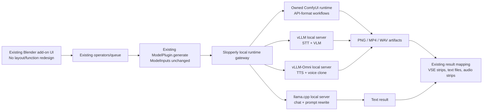
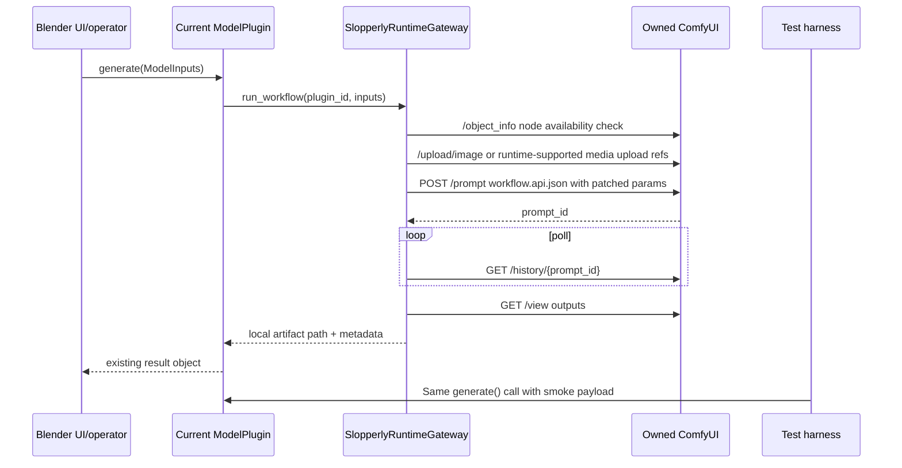
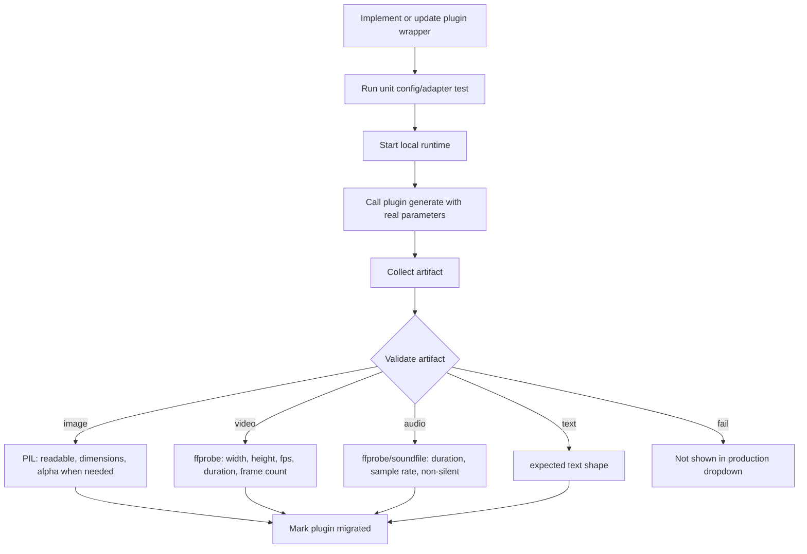

# Slopperly local backend migration specification

This document is the handoff target for the implementation agent. Read and update this document every time you work.

All work must be performed in the **WIP** branch and committed and pushed after each block of changes to maintain a complete history of tracked changes in case anything needs to be fixed or reverted.

Always read this document before starting work and do not deviate from it. Mark each line as completed before moving on to the next one until everything is tested, complete, and production-ready.

For testing, you are free to set up Python environments, ComfyUI, download required models, and test any workflows you create. An example of a working **LTX 2.3** video generation workflow (1080p, 24 FPS, 20 seconds, CPU/GPU weight offloading) for porting to ComfyUI is available in the `workflows` folder.

Run and validate **vLLM**, **Llama**, **ComfyUI**, and related components on the available RTX 4090. When porting functionality, ensure everything works correctly. All functions and workflows must be live-tested using real inputs and generated artifacts.

Be careful when selecting text encoders. If a text encoder can reasonably fit within 16 GB of VRAM with CPU offloading where appropriate, prefer the original **Safetensors** model over **GGUF**, unless GGUF is fully and properly supported as a text encoder for the specific image or video workflow.


You are the lead implementation agent for the Palladium-to-Slopperly fork.

Your task is to build local ai fork of the Palladium. Slopperly implementation must remove all external AI providers and route all generation, inference, speech, transcription, image, video, background removal, and workflow execution through local runtimes only.

This is not a prototype. Do not stub, mock, comment out, or cosmetically rename features. A feature is complete only when the existing UI button/flow still works end-to-end through the new local backend, or when you have documented the exact blocking reason with evidence and preserved a non-breaking UI state.

Primary goal:
Port Palladium into Slopperly as a local-only Ubuntu x64 CUDA application using only these AI execution backends:
1. llama.cpp for direct chat, prompt enhancement, planning, metadata generation, and other low-latency or long-context text inference OpenAI-compatible text, multimodal,
2. vLLM and vLLM-Omni for local  speech-to-text, and text-to-speech voice cloning, etc etc.
3. ComfyUI for image, video, image-editing, video-editing, frame interpolation, background removal, and node-graph workflows.
4. Blender only where the existing app already uses or requires Blender-style 3D/render logic.

No OpenAI, Anthropic, Gemini, Replicate, ElevenLabs, Runway, Stability hosted APIs, cloud Comfy services, hosted Hugging Face inference APIs, or other external inference providers may remain in the production Slopperly path. Hugging Face may be used only as a model artifact source for local download/cache.

## 0. Non-negotiable behavior

The Blender add-on UI is not to be redesigned. The existing panels, buttons, operator flow, strip picking, prompt fields, negative prompt fields, image/video/audio strip selectors, resolution controls, frame controls, seed, steps, guidance, strength, LoRA controls, and output insertion behavior stay intact.

The allowed UI changes are only these:

1. Remove external/cloud provider settings, API key prompts, and remote cloud backend discovery from production Slopperly.
2. Replace provider/runtime settings with local runtime settings for owned ComfyUI, vLLM, vLLM-Omni, and llama.cpp.
3. Replace cloud-only model dropdown entries with direct local model entries only after those direct local entries have passing artifact tests. Do not keep cloud-branded saved-project aliases in production Slopperly.
4. Remove or hide a dropdown model entry when there is no committed local workflow and no passing artifact test.
5. Rename Palladium to Slopperly.

The migration path is not “replace every old model with some newer model.” Existing local models already present in the add-on must be migrated to the permitted execution backends. For image/video/audio diffusion models, that means ComfyUI workflows or Slopperly-owned Comfy custom nodes. For STT/VLM, that means vLLM. For TTS/voice clone, existing models with real Comfy node support stay on Comfy, while Qwen/Fish/OmniVoice/MOSS profiles use vLLM-Omni. For text rewrite/chat/planning, that means llama.cpp.

Hugging Face is allowed only as a model artifact source. Hugging Face hosted inference is not allowed.


## Current code-derived parity report (2026-06-28)

This section is the live progress report. The historical implementation log below is evidence of scaffold work only and does not mark a function complete. A function is **DONE ON SPEC** only when the existing Blender UI flow calls the real `ModelPlugin.generate()` path, patches every relevant UI control into the local runtime workflow, produces a real local artifact on the RTX 4090, validates that artifact, and leaves the production dropdown certified for that exact profile. For image/video generation or edit rows governed by the Q5/GGUF policy, a native Safetensors/FP8 artifact is local evidence only; it is not GGUF-compliant completion unless the submitted workflow loads the required GGUF backbone through the committed local workflow.

Current hard truth:

- **GGUF COMPLIANCE CORRECTION 2026-06-28:** the stricter user requirement is accepted. Image/video generation and edit rows must not be claimed as GGUF-compliant from Safetensors/FP8/native Comfy evidence. The historical block headings below that say DONE ON SPEC for non-GGUF image generation/edit rows are superseded by this hard-truth correction until a GGUF backbone is installed, wired, run through `ModelPlugin.generate()`, and artifact-certified.
- **GGUF-COMPLIANT PASS NOW:** `image/qwen_image.py` through `qwen_image_2512_t2i_gguf`, `image/qwen_image_edit.py` through `qwen_image_edit_2511_multi_gguf`, `image/flux2_dev.py` through `flux2_dev_gguf_quality`, `image/flux2_klein_4b.py` through `flux2_klein_4b_t2i_edit`, `image/flux2_klein_9b.py` through `flux2_klein_9b_t2i_edit`, `image/flux2_klein_9b_schematic.py` through `flux2_klein_9b_schematic_lora`, `image/flux_canny.py` through `flux1_canny_control`, `image/flux_depth.py` through `flux1_depth_control`, `image/flux_redux.py` through `flux_redux_restyle`, `image/flux_kontext.py` through `flux_kontext_edit`, `image/kontext_relight.py` through `kontext_relight`, `image/zimage.py` through `zimage_t2i_i2i` and `zimage_turbo_t2i_i2i`, `image/_krea2_base.py` through `krea2_base_t2i`, `image/krea2_turbo.py` through `krea2_turbo_t2i`, `image/anima.py` through `anima_t2i_i2i`, `image/ernie.py` through `ernie_image_t2i`, `image/ernie_turbo.py` through `ernie_image_turbo_t2i`, `image/ideogram4.py` through `ideogram4_t2i`, `image/lumina2.py` through `lumina2_t2i`, `video/wan_ti2v_5b.py` through `wan22_ti2v_5b_720p24_gguf`, `video/wan_i2v.py` through `wan22_i2v_a14b_720p16_to24_gguf`, `video/ltx2.py` through `ltx23_i2v_q5_gguf` and `ltx23_t2v_q5_gguf`, `video/ltx23_extend.py` through `ltx23_extend_staged_q5_gguf`, and `text/moviigen_rewriter.py` through `llamacpp_prompt_rewriter` currently have PASS records whose primary inference backbone is GGUF. Qwen Image 2512, Qwen Image Edit 2511, FLUX.2 Dev, FLUX.2 Klein 4B/9B, FLUX.2 Klein 9B Schematic, FLUX.1 Canny/Depth/Redux/Kontext/Relight, Z-Image Base/Turbo, Krea 2 Base/Turbo, Anima, ERNIE Image/Turbo, Ideogram 4, Lumina Image 2.0, Wan, and LTX use GGUF diffusion/video backbones with Safetensors text encoders where the text-encoder rule above permits them; MoviiGen uses the local Qwen2.5 Q5 GGUF served by llama.cpp.
- **GGUF CORRECTION COMPLETE FOR FLUX.1 CONTROL:** `image/flux_canny.py` and `image/flux_depth.py` no longer rely on the earlier safetensors scaffold. They now load `flux1-canny-dev-fp16-Q5_0-GGUF.gguf` and `flux1-depth-dev-fp16-Q5_0-GGUF.gguf` through `UnetLoaderGGUF`, call the same `ModelPlugin.generate()` paths, and have fresh RTX 4090 PASS records with GGUF metadata for `smoke_16gb`.
- **GGUF CORRECTION COMPLETE FOR FLUX.1 KONTEXT/RELIGHT:** `image/flux_kontext.py` and `image/kontext_relight.py` no longer rely on the earlier FP8/Safetensors scaffold. They now load `flux1-kontext-dev-Q5_K_M.gguf` through `UnetLoaderGGUF`; Relight also uses the generated `relighting-kontext-dev-lora-v3-comfy.safetensors` adapter whose 990 keys are converted from the upstream prefix into Comfy's FLUX key namespace. Both plugin paths have fresh RTX 4090 PASS records for `smoke_16gb`, and the final Relight runtime log had no `lora key not loaded` messages.
- **GGUF CORRECTION COMPLETE FOR ERNIE:** `image/ernie.py` and `image/ernie_turbo.py` no longer rely on the earlier Safetensors completion evidence. They now load `ernie-image-Q5_K_M.gguf` and `ernie-image-turbo-Q5_K_M.gguf` through `UnetLoaderGGUF`, call the same `ModelPlugin.generate()` paths, and have fresh RTX 4090 PASS records with GGUF metadata for `smoke_16gb`.
- **DONE ON SPEC FOR NON-GGUF-RUNTIME ROWS:** `audio/_stable_audio_3.py` Stable Audio 3, `audio/ace_step.py` ACE-Step, `audio/foundation_music.py` Foundation-1, `audio/mmaudio.py` MMAudio, `audio/chatterbox.py` Chatterbox, `audio/chatterbox_turbo.py` Chatterbox Turbo, `audio/chatterbox_multilingual.py` Chatterbox Multilingual, `audio/omnivoice.py` OmniVoice, `audio/moss_tts.py` MOSS-TTS, `text/faster_whisper_transcribe.py` STT, `text/marlin_video_captions.py` Marlin Video Captions, `text/florence2.py` Florence2, `image/birefnet.py` BiRefNet, `image/maxine_vsr.py` Local Image VSR, and the certified four-stem path of `audio/stem_split.py` Stem Splitter from baseline commit `50cf377bf11349685010acb726a5e2b2e3cb9962` have real local `ModelPlugin.generate()` PASS artifacts on the RTX 4090 profile through their required local runtimes. Stem Splitter's old six-stem option and Chatterbox's true two-audio cross-speaker VC remain documented modes until separate UI/workflow certification exists.
- **DONE ON SPEC FOR SLOPPERLY-OWNED NODE EXCEPTION:** `image/nucleus_moe.py` Nucleus is certified only for its `MIGRATE_SLOPPERLY_NODE` lane. It uses the original local `NucleusAI/Nucleus-Image` snapshot plus the pinned `D-Squarius-Green-Jr/Nucleus-Image-FP8` patch and weights through owned ComfyUI `SlopperlyDiffusersImageGenerate`, with sequential CPU offload and a real RTX 4090 PNG artifact. This is not GGUF evidence and must not be used as a Qwen/FLUX or other `MIGRATE_GGUF_COMFY` substitute.
- **GGUF WORK STILL NOT DONE:** Original `video/wan_t2v.py` still needs the Wan A14B high/low-noise GGUF Comfy workflow and a real T2V artifact. `video/wan_i2v.py` is now certified for the `smoke_16gb` Wan A14B I2V Q5 profile through `wan22_i2v_a14b_720p16_to24_gguf`, producing a native 16fps MP4 and a final 24fps MP4 through local ffmpeg finalization; a longer 10s profile, RIFE/VFI optical interpolation, and arbitrary project LoRA injection still need separate proof before those modes can be claimed. `video/ltx2.py` is certified for short T2V and I2V Q5 paths through `ltx23_t2v_q5_gguf` and `ltx23_i2v_q5_gguf`; `video/ltx23_extend.py` is certified for the Q5 extension-tail concat profile through `ltx23_extend_staged_q5_gguf`. LTX 1080p, lipsync, multi-anchor, IC-LoRA, arbitrary project LoRA injection, and legacy latent staged/full/STEP1/STEP2 Extend behavior still need Comfy workflow ports and real artifacts before any GGUF completion claim.
- **CERTIFIED NEW LOCAL DEFAULT:** new `video/wan_ti2v_5b.py` now has fresh direct T2V and direct I2V PASS records through `WanTI2V5BPlugin.generate()` against owned Slopperly ComfyUI on the RTX 4090 profile. This is not original Palladium parity; original Wan A14B T2V, LTX staged workflows, and other baseline functions still need their own migrations and real artifacts. Original Wan A14B I2V is separately certified through `video/wan_i2v.py` and `wan22_i2v_a14b_720p16_to24_gguf`.
- **CERTIFICATION SUMMARY:** `python -m slopperly.audit.dropdown_certification --profile smoke_16gb --report-only` now reports GGUF-compliant/image-safe `PASS qwen_image_2512_t2i_gguf`, `PASS qwen_image_edit_2511_multi_gguf`, `PASS flux2_dev_gguf_quality`, `PASS flux2_klein_4b_t2i_edit`, `PASS flux2_klein_9b_t2i_edit`, `PASS flux2_klein_9b_schematic_lora`, `PASS flux1_canny_control`, `PASS flux1_depth_control`, `PASS flux_redux_restyle`, `PASS flux_kontext_edit`, `PASS kontext_relight`, `PASS zimage_t2i_i2i`, `PASS zimage_turbo_t2i_i2i`, `PASS krea2_base_t2i`, `PASS krea2_turbo_t2i`, `PASS anima_t2i_i2i`, `PASS ernie_image_t2i`, `PASS ernie_image_turbo_t2i`, `PASS ideogram4_t2i`, `PASS lumina2_t2i`, `PASS wan22_ti2v_5b_720p24_gguf`, `PASS wan22_i2v_a14b_720p16_to24_gguf`, `PASS ltx23_i2v_q5_gguf`, `PASS ltx23_t2v_q5_gguf`, `PASS ltx23_extend_staged_q5_gguf`, plus local-runtime and owned-node `PASS nucleus_image_t2i`, `PASS vllm_whisper_large_v3_turbo_stt`, `PASS vllm_video_caption_vlm`, `PASS florence2_caption_ocr`, `PASS birefnet_rmbg`, `PASS local_image_vsr_upscale`, `PASS audio_stem_split_demucs`, `PASS mmaudio_video_to_audio`, `PASS stable_audio_3_medium_base`, `PASS ace_step_15_music`, `PASS foundation1_music_loop`, `PASS chatterbox_tts_vc_comfy`, `PASS chatterbox_turbo_tts_comfy`, `PASS chatterbox_multilingual_tts_comfy`, `PASS llamacpp_prompt_rewriter`, `PASS omnivoice_vllm_omni`, and `PASS moss_tts_nano_vllm_omni`. It still blocks uncertified scaffold rows that have no real profile certification yet: `local_video_vsr_upscale` and `omnigen_v1_multi_image`. Certification records: 42 passed, 2 blocked.
- **SCAFFOLD ONLY:** Comfy workflow packs, schemas, model registries, integration tests against fake loopback servers, and GPU test files exist for many functions. Those are not completion evidence.
- **NOT VALID COMPLETION:** any report that says a function is done because a fake Comfy/vLLM server accepted a payload is wrong. It must say scaffold only.
- **WORDING RULE:** human progress prose must state the required action when work is incomplete: install nodes/models, copy existing cache files, start the runtime, wire UI controls, or run the real artifact test. Machine certification JSON may contain a non-PASS status, but the AGENTS report must state the next action.
- **CLOUD REMOVAL:** Google Nano Banana, Google Veo, and MiniMax production plugins are deleted and must not return as aliases or dropdown entries. Their replacement local workflows must stand on their own direct certified entries.
- **DIRECT TORCH/DIFFUSERS VIDEO GAP:** `video/ltx23_lipsync.py`, `video/ltx23_multi.py`, `video/ltx23_multi_ic_lora.py`, `video/skyreels.py`, and `video/wan_t2v.py` still contain direct Torch/Diffusers/Transformers generation paths. These are not migrated to the required Comfy gateway.

Runtime and model-cache facts found on disk:

- Owned Slopperly Comfy runtime path: `.slopperly/runtimes/ComfyUI`.
- Owned Slopperly Comfy model cache was populated from `/home/user/Documents/Comfy/ComfyUI/models` into `.slopperly/runtimes/ComfyUI/models` on 2026-06-27 with `rsync -a --ignore-existing --partial`. Verification dry-run reported 0 remaining transfers. Owned cache size after copy: `202G`.
- Existing user Comfy cache to reuse before any download: `/home/user/Documents/Comfy/ComfyUI/models` (`191G` found). Do not redownload model assets that exist there; the copied owned cache still needs model-registry reconciliation before individual workflow certification.
- Existing LTX workflow source to port before making a new graph: `/home/user/Documents/Comfy/workflows/*.json`, including many LTX 2.3 Q5/NVFP4/FP8 API workflows and known-good T2V/I2V variants. The short I2V Q5 variant is now ported/certified as `ltx23_i2v_q5_gguf`, the short T2V Q5 variant is now ported/certified as `ltx23_t2v_q5_gguf`, and the extension-tail concat Q5 profile is now ported/certified as `ltx23_extend_staged_q5_gguf`; LTX 1080p, lipsync, multi, and IC variants still need their own ports and artifacts.
- LTX model assets now present in the owned cache include `ltx-2.3-22b-dev-fp8.safetensors`, `ltx-2.3-22b-dev-nvfp4.safetensors`, `ltx-2.3-22b-dev-UD-Q5_K_M.gguf`, `ltx-2.3-22b-distilled-1.1-Q5_K_M.gguf`, `ltx-2.3-22b-distilled-1.1-Q6_K.gguf`, LTX text projection/connector files, LTX video/audio VAEs, LTX IC-LoRA files, and LTX latent upscaler files.
- Nucleus Image owned-node assets are now present in the owned cache under `.slopperly/runtimes/ComfyUI/models/diffusers/`: `nucleus_image_base` includes the local `NucleusAI/Nucleus-Image` scheduler, processor, text-encoder shards, VAE, and transformer config while intentionally excluding the original transformer weight shards; `nucleus_image_fp8/Nucleus-Image-FP8.safetensors` is `16G`, `nucleus_image_fp8/moe_fp8_patch.py` is `13K`, and `nucleus_image_fp8/config.json` is present. This is a `MIGRATE_SLOPPERLY_NODE` FP8-patch profile, not GGUF evidence.
- Owned Slopperly Comfy was live-tested on `127.0.0.1:8190` for Nucleus Image with API nodes disabled, CUDA 13 PyTorch, DynamicVRAM, and `SlopperlyDiffusersImageGenerate` plus `SaveImage` exposed in `/object_info`. The owned node enabled `sequential_cpu` offload for the large Qwen3-VL text encoder and FP8 transformer path.
- `NucleusMoEPlugin.generate()` produced a real local PNG through owned ComfyUI at `.slopperly/gpu-artifacts/smoke_16gb/nucleus_image_t2i/nucleus_image_t2i.png`, validating PNG/RGB 1024x1024. The PASS record `.slopperly/certification/smoke_16gb/nucleus_image_t2i.json` records the base snapshot, FP8 patch, FP8 weights, workflow pack, runtime URL, and `offload_strategy=sequential_cpu_preferred`.
- Owned Slopperly Comfy was live-tested on `127.0.0.1:8190` for LTX 2.3 I2V Q5 with API nodes disabled, CUDA 13 PyTorch, dynamic VRAM, `ComfyUI-GGUF`, `ComfyUI-MultiGPU`, VideoHelperSuite `CreateVideo`/`SaveVideo`, `UnetLoaderGGUFDisTorch2MultiGPU`, `VAELoaderMultiGPU`, `LTXAVTextEncoderLoader`, `LTXVAudioVAELoader`, `LTXVImgToVideoInplace`, and `SamplerCustomAdvanced` available in `/object_info`. The live model files used were `models/unet/ltx-2.3-22b-distilled-1.1-Q5_K_M.gguf` (`15930424352` bytes), `models/text_encoders/gemma_3_12B_it_fp4_mixed.safetensors` (`9447702218` bytes), `models/text_encoders/ltx-2.3-22b-distilled_embeddings_connectors.safetensors` (`2312144712` bytes), LTX video/audio VAEs, and the committed distilled LoRA.
- `LTX2Plugin.generate()` produced a real local MP4 through owned ComfyUI at `.slopperly/gpu-artifacts/smoke_16gb/ltx23_i2v_q5_gguf/ltx23_i2v_q5.mp4`, validating 1280x704, 24fps, 17 frames, 0.708008s, and AAC audio present. The UI request was 1280x720 and the plugin mapped it to the certified model-safe 1280x704 720-family size.
- Owned Slopperly Comfy was also live-tested on `127.0.0.1:8190` for LTX 2.3 T2V Q5 with the same GGUF/text/connector/video VAE/audio VAE/LoRA files, `UnetLoaderGGUFDisTorch2MultiGPU`, `VAELoaderMultiGPU`, `LTXVAudioVAELoader`, `LTXAVTextEncoderLoader`, `EmptyLTXVLatentVideo`, `LTXVEmptyLatentAudio`, `LTXVConcatAVLatent`, `BasicGuider`, `SamplerCustomAdvanced`, `CreateVideo`, and `SaveVideo` available in `/object_info`.
- `LTX2Plugin.generate()` produced a real local text-to-video MP4 through owned ComfyUI at `.slopperly/gpu-artifacts/smoke_16gb/ltx23_t2v_q5_gguf/ltx23_t2v_q5.mp4`, validating 1280x704, 24fps, 17 frames, 0.708333s, and AAC audio present. The UI request was 1280x720 and the plugin mapped it to the certified model-safe 1280x704 720-family size.
- Owned Slopperly Comfy was live-tested on `127.0.0.1:8188` for LTX 2.3 Extend Q5 tail generation with the same GGUF/text/connector/video VAE/audio VAE/LoRA files and the `ltx23_extend_staged` workflow pack. `LTX2_3ExtendStagedPlugin.generate()` extracted the final frame from `tests/fixtures/video_vsr_source.mp4`, generated a 17-frame Q5 GGUF tail through owned Comfy, normalized the source and tail to 1280x704/24fps/AAC stereo, concatenated them, and produced `.slopperly/gpu-artifacts/smoke_16gb/ltx23_extend_staged_q5_gguf/ltx23_extend_q5.mp4`. The artifact validates 1280x704, 24fps, 42 frames, 1.75s, and AAC audio present from a 1.0s source. This certifies the extension-tail concat profile only; it does not certify the old direct Diffusers latent staged/full/STEP1/STEP2 algorithm, exact 1080p, arbitrary project LoRA injection, or audio-strip override.
- Wan A14B I2V Q5 high/low noise files are present in the owned cache and certified through the plugin path: `.slopperly/runtimes/ComfyUI/models/unet/HighNoise/Wan2.2-I2V-A14B-HighNoise-Q5_K_M.gguf` (`10792055296` bytes) and `.slopperly/runtimes/ComfyUI/models/unet/LowNoise/Wan2.2-I2V-A14B-LowNoise-Q5_K_M.gguf` (`10792055296` bytes).
- Wan A14B I2V auxiliary owned-cache files used by the certificate are `models/text_encoders/umt5_xxl_wan_text_encoder.safetensors` (`6735906897` bytes), `models/vae/wan_2.1_vae.safetensors` (`253815318` bytes), and hardlinked Comfy-visible LoRAs `models/loras/wan2.2_i2v_lightx2v_4steps_lora_v1_high_noise.safetensors` and `models/loras/wan2.2_i2v_lightx2v_4steps_lora_v1_low_noise.safetensors`.
- Owned Slopperly Comfy was live-tested on `127.0.0.1:8190` for Wan A14B I2V Q5 with API nodes disabled, CUDA 13 PyTorch, dynamic VRAM, `ComfyUI-GGUF`, `ComfyUI-MultiGPU`, `WanImageToVideo`, `KSamplerAdvanced`, `CreateVideo`, `SaveVideo`, `VAELoaderMultiGPU`, and `CLIPLoaderMultiGPU` exposed in `/object_info`. Comfy logs showed both high/low GGUFs loaded through `UnetLoaderGGUFDisTorch2MultiGPU` with DisTorch2 allocation `cuda:0,1gb;cpu,*`.
- `WanI2VPlugin.generate()` produced a real native 16fps MP4 at `.slopperly/gpu-artifacts/smoke_16gb/wan22_i2v_a14b_720p16_to24_gguf/wan22_i2v_a14b_24fps_native16.mp4` and returned final 24fps MP4 `.slopperly/gpu-artifacts/smoke_16gb/wan22_i2v_a14b_720p16_to24_gguf/wan22_i2v_a14b_24fps.mp4`. Native validation: 1280x720, 16fps, 17 frames, 1.062012s. Final validation: 1280x720, 24fps, 26 frames, 1.083333s, H.264/yuv420p, no audio expected.
- Existing user Comfy custom nodes include `ComfyUI-GGUF`, `ComfyUI-MultiGPU`, `WhatDreamsCost-ComfyUI`, and `ComfyUI-KJNodes`; owned Slopperly Comfy has now been live-tested with `comfyui_gguf`, `multigpu`, `video_helper_suite`, `mmaudio`, `audio_separation`, `foundation_1`, `chatterbox`, and `florence2` for the certified blocks. Missing future node packs must be installed into `.slopperly/runtimes/ComfyUI/custom_nodes`, not relied on from the user Comfy tree.
- Owned Slopperly Comfy was live-tested on `127.0.0.1:8190` for the Wan2.2 TI2V-5B direct local default with API nodes disabled, CUDA 13 PyTorch, dynamic VRAM, `ComfyUI-GGUF`, `VideoHelperSuite`, UMT5 FP8, Wan VAE, and the Wan TI2V Q5 GGUF model from the owned model cache.
- FLUX.1 Canny/Depth Q5 GGUF files are now installed in the owned Comfy model cache: `models/diffusion_models/flux1-canny-dev-fp16-Q5_0-GGUF.gguf` (`8277009696` bytes, `GGUF` header) from `SporkySporkness/FLUX.1-Canny-dev-GGUF`, `models/diffusion_models/flux1-depth-dev-fp16-Q5_0-GGUF.gguf` (`8277009696` bytes, `GGUF` header) from `SporkySporkness/FLUX.1-Depth-dev-GGUF`, `models/loras/flux1-depth-dev-lora.safetensors` (`1244440512` bytes), and `custom_nodes/controlnet_aux/ckpts/depth-anything/Depth-Anything-V2-Large/depth_anything_v2_vitl.pth` (`1341395338` bytes).
- Owned Slopperly Comfy was live-tested on `127.0.0.1:8190` for FLUX.1 Canny/Depth Q5 with API nodes disabled, CUDA 13 PyTorch, dynamic VRAM, `ComfyUI-GGUF`, and `controlnet_aux`; `/object_info` exposed `UnetLoaderGGUF`, `CannyEdgePreprocessor`, `DepthAnythingV2Preprocessor`, `LoraLoaderModelOnly`, `DualCLIPLoader`, `FluxGuidance`, `InstructPixToPixConditioning`, `KSampler`, `VAELoader`, and `SaveImage`, and listed the exact GGUF/text/VAE/LoRA/depth checkpoint filenames.
- `FluxCannyPlugin.generate()` and `FluxDepthPlugin.generate()` produced real local PNG artifacts through owned ComfyUI with Q5 GGUF backbones: `.slopperly/gpu-artifacts/smoke_16gb/flux1_canny_control/flux1_canny_control.png` and `.slopperly/gpu-artifacts/smoke_16gb/flux1_depth_control/flux1_depth_control.png`, both RGB PNG 1024x1024. Comfy logs showed `gguf qtypes: F32 (466), Q5_0 (304), F16 (10)`, fully loaded `8019.52MB` of each GGUF model, used the DepthAnything V2 Large checkpoint path for Depth, and executed the Canny and Depth prompts in 63.18s and 112.43s.
- FLUX Redux Q5 files are now installed in the owned Comfy model cache: `models/diffusion_models/flux1-dev-Q5_K_M.gguf` (`8419501344` bytes, `GGUF` header) from `unsloth/FLUX.1-dev-GGUF`, `models/style_models/flux1-redux-dev.safetensors` (`129063232` bytes), `models/clip_vision/sigclip_vision_patch14_384.safetensors` (`856505640` bytes), `models/text_encoders/clip_l.safetensors` (`246144152` bytes), `models/text_encoders/t5xxl_fp16.safetensors` (`9787841024` bytes), and `models/vae/ae.safetensors` (`167664710` bytes). The earlier `flux1-dev.safetensors` target is no longer the certified dropdown backbone.
- Owned Slopperly Comfy was live-tested on `127.0.0.1:8190` for FLUX Redux Q5 with API nodes disabled, CUDA 13 PyTorch, dynamic VRAM, and `ComfyUI-GGUF`; `/object_info` exposed `UnetLoaderGGUF`, `StyleModelLoader`, `StyleModelApply`, `CLIPVisionLoader`, `CLIPVisionEncode`, `ModelSamplingFlux`, `BasicGuider`, `BasicScheduler`, `DualCLIPLoader`, and `VAELoader`, and listed the exact GGUF/style/vision/text/VAE filenames.
- `FluxReduxPlugin.generate()` produced a real local PNG artifact through owned ComfyUI with the Q5 GGUF backbone: `.slopperly/gpu-artifacts/smoke_16gb/flux_redux_restyle/flux_redux_restyle.png`, an RGB PNG at 1024x1024 with size `683388` bytes. Comfy logs showed `gguf qtypes: F32 (466), Q5_K (266), Q6_K (38), BF16 (10)`, staged the FLUX text encoder at `9318MB`, fully loaded `8155.41MB` of the Q5 GGUF FLUX model, staged the SigCLIP vision model at `787MB`, ran 25 sampler steps, and executed the prompt in 53.45s.
- FLUX.1 Kontext/Relight Q5 files are now installed in the owned Comfy model cache: `models/diffusion_models/flux1-kontext-dev-Q5_K_M.gguf` (`8419501344` bytes, `GGUF` header), `models/text_encoders/t5xxl_fp8_e4m3fn_scaled.safetensors` (`5157348688` bytes), `models/text_encoders/clip_l.safetensors` (`246144152` bytes), `models/vae/ae.safetensors` (`167664710` bytes), raw `models/loras/relighting-kontext-dev-lora-v3.safetensors` (`306596088` bytes), and generated Comfy adapter `models/loras/relighting-kontext-dev-lora-v3-comfy.safetensors` (`344005912` bytes).
- Owned Slopperly Comfy was live-tested on `127.0.0.1:8190` for FLUX.1 Kontext/Relight Q5 with API nodes disabled, CUDA 13 PyTorch, dynamic VRAM, and `ComfyUI-GGUF`; `/object_info` exposed `UnetLoaderGGUF`, `LoraLoaderModelOnly`, `DualCLIPLoader`, `VAELoader`, `CLIPTextEncode`, `FluxGuidance`, `FluxKontextImageScale`, `ReferenceLatent`, `KSampler`, `VAEDecode`, and `SaveImage`, and listed the exact GGUF/text/VAE/LoRA filenames.
- `FluxKontextPlugin.generate()` and `KontextRelightPlugin.generate()` produced real local PNG artifacts through owned ComfyUI with the Q5 GGUF backbone: `.slopperly/gpu-artifacts/smoke_16gb/flux_kontext_edit/flux_kontext_edit.png` (`781516` bytes) and `.slopperly/gpu-artifacts/smoke_16gb/kontext_relight/kontext_relight.png` (`682598` bytes), both RGB PNG 1024x1024. Comfy logs for the final Relight run showed `gguf qtypes: F32 (466), Q5_K (266), Q6_K (38), BF16 (10)`, the FLUX text encoder staged at `4902MB`, the Q5 GGUF model fully loaded with `8155.41MB`, and no `lora key not loaded` messages after the generated adapter was used.
- Z-Image Q5 GGUF files are now installed in the owned Comfy model cache: `models/diffusion_models/z-image-Q5_K_M.gguf` (`5578099776` bytes, `GGUF` header) from `unsloth/Z-Image-GGUF`, `models/diffusion_models/z-image-turbo-Q5_K_M.gguf` (`5574444096` bytes, `GGUF` header) from `unsloth/Z-Image-Turbo-GGUF`, `models/text_encoders/qwen_3_4b.safetensors` (`8044982048` bytes), and `models/vae/ae.safetensors` (`167664710` bytes). The earlier `z_image_bf16.safetensors` and `z_image_turbo_bf16.safetensors` targets remain local cache evidence only and are no longer the certified dropdown backbones.
- Owned Slopperly Comfy was live-tested on `127.0.0.1:8190` for Z-Image Base/Turbo Q5 with API nodes disabled, CUDA 13 PyTorch, dynamic VRAM, and `ComfyUI-GGUF`; `/object_info` exposed `UnetLoaderGGUF`, `ModelSamplingAuraFlow`, `CLIPLoader`, `VAELoader`, `CLIPTextEncode`, `EmptySD3LatentImage`, `ConditioningZeroOut`, `KSampler`, `VAEDecode`, and `SaveImage`, and listed the exact GGUF/text/VAE filenames.
- `ZImagePlugin.generate()` and `ZImageTurboPlugin.generate()` produced real local T2I and I2I PNG artifacts through owned ComfyUI with Q5 GGUF backbones. Base artifacts are `.slopperly/gpu-artifacts/smoke_16gb/zimage_t2i_i2i/zimage_t2i.png` (`1024x1024` RGB PNG, `1169613` bytes) and `.slopperly/gpu-artifacts/smoke_16gb/zimage_t2i_i2i/zimage_i2i.png` (`1024x1024` RGB PNG, `648828` bytes). Turbo artifacts are `.slopperly/gpu-artifacts/smoke_16gb/zimage_turbo_t2i_i2i/zimage_turbo_t2i.png` (`1024x1024` RGB PNG, `1137060` bytes) and `.slopperly/gpu-artifacts/smoke_16gb/zimage_turbo_t2i_i2i/zimage_turbo_i2i.png` (`1024x1024` RGB PNG, `695626` bytes). Comfy logs showed Z-Image GGUF qtypes including `Q5_K` and `Q6_K`, staged `ZImageTEModel_` at `7671MB`, loaded about `5404MB`/`5400MB` of the Base/Turbo GGUFs, and executed the Base T2I/I2I prompts in 71.31s/67.00s and Turbo T2I/I2I prompts in 10.28s/10.50s.
- Florence-2 Large files are now installed in the owned Comfy model cache under `.slopperly/runtimes/ComfyUI/models/LLM/Florence-2-large/`, including `model.safetensors` (`1.5G`), `config.json`, local modeling/processing files, tokenizer files, and processor files.
- Owned Slopperly Comfy was live-tested on `127.0.0.1:8190` for Florence2 caption/OCR with `DownloadAndLoadFlorence2Model`, `Florence2Run`, and `PreviewAny` available in `/object_info`. `Florence2Plugin.generate()` produced a real caption text artifact plus IDEOGRAM4 JSON from `tests/fixtures/florence2_caption.png`; the fixture caption matched red/green/blue/text/local/test concepts, and the JSON validated required keys plus text/OCR evidence.
- Krea 2 Q5 GGUF files are now installed in the owned Comfy model cache: `models/diffusion_models/krea2_raw-Q5_K_M.gguf` (`8871195936` bytes, `GGUF` header), `models/diffusion_models/krea2_turbo-Q5_K_M.gguf` (`8871195936` bytes, `GGUF` header), `models/text_encoders/qwen3vl_4b_fp8_scaled.safetensors` (`4.9G`), and `models/vae/qwen_image_vae.safetensors` (`243M`). The earlier FP8 files remain local cache evidence only and are no longer the certified dropdown backbones.
- Owned Slopperly Comfy was live-tested on `127.0.0.1:8190` for Krea 2 Base and Krea 2 Turbo Q5 with `UnetLoaderGGUF`, `CLIPLoader(type=krea2)`, `VAELoader`, `TextGenerate`, `CLIPTextEncode`, `ConditioningZeroOut`, `EmptyLatentImage`, `KSampler`, `VAEDecode`, `SaveImage`, and `LoraLoaderModelOnly` available in `/object_info`. The first historical real attempt exposed a codable Comfy v3 dynamic-combo issue: `TextGenerate` requires `sampling_mode` as `"on"` plus dotted child inputs like `sampling_mode.temperature`, not the earlier nested JSON object. The workflow packs and tests now use the live Comfy API shape.
- `Krea2BasePlugin.generate()` and `Krea2TurboPlugin.generate()` produced real local PNG artifacts through owned ComfyUI with Q5 GGUF backbones: `.slopperly/gpu-artifacts/smoke_16gb/krea2_base_t2i/krea2_base_t2i.png` (`1024x1024` RGB PNG, `921K`) and `.slopperly/gpu-artifacts/smoke_16gb/krea2_turbo_t2i/krea2_turbo_t2i.png` (`1024x1024` RGB PNG, `964K`). Comfy logged GGUF qtypes `F32`, `F16`, and `Q5_K`, fully loaded `8842.71MB` of the GGUF diffusion model for both Base and Turbo, staged the Krea text encoder at `4999MB`, staged the Wan/Qwen VAE at `241MB`, and executed the Base and Turbo prompts in 140.73s and 30.95s. The Krea plugins dynamically insert selected UI LoRAs into the Comfy graph with `LoraLoaderModelOnly`; the certified default artifacts used no selected custom LoRA.
- Anima Preview 3 Q5 GGUF files are now installed in the owned Comfy model cache: `models/diffusion_models/anima-preview3-base-Q5_K_M.gguf` (`1592877184` bytes, `GGUF` header) from `Bedovyy/Anima-GGUF`, `models/text_encoders/qwen_3_06b_base.safetensors` (`1.2G`), and `models/vae/qwen_image_vae.safetensors` (`243M`). The earlier `anima-preview3-base.safetensors` file remains local cache evidence only and is no longer the certified dropdown backbone.
- Owned Slopperly Comfy was live-tested on `127.0.0.1:8190` for Anima T2I and I2I Q5 with `UnetLoaderGGUF`, `CLIPLoader(type=stable_diffusion)`, `VAELoader`, `CLIPTextEncode`, `EmptyLatentImage`, `LoadImage`, `ImageScale`, `VAEEncode`, `KSampler`, `VAEDecode`, `SaveImage`, and `LoraLoaderModelOnly` available in `/object_info`. The model lists included `anima-preview3-base-Q5_K_M.gguf`, `qwen_3_06b_base.safetensors`, and `qwen_image_vae.safetensors`.
- `AnimaPlugin.generate()` produced real local T2I and I2I PNG artifacts through owned ComfyUI with the Q5 GGUF backbone: `.slopperly/gpu-artifacts/smoke_16gb/anima_t2i_i2i/anima_t2i.png` (`1024x1024` RGB PNG, `236K`) and `.slopperly/gpu-artifacts/smoke_16gb/anima_t2i_i2i/anima_i2i.png` (`1024x1024` RGB PNG, `587K`). Comfy logged GGUF qtypes `Q5_K`, `Q6_K`, and `F32`; staged `AnimaTEModel_` at `1136MB`; fully loaded `1581.79MB` of the Q5 GGUF diffusion model; staged the Wan/Qwen VAE at `241MB`; and executed the T2I and I2I prompts in 20.11s and 17.50s. The Anima plugin dynamically inserts selected UI LoRAs into either the T2I or I2I Comfy graph with `LoraLoaderModelOnly`; the certified default artifacts used no selected custom LoRA.
- BiRefNet files are now installed in the owned Comfy model cache under `models/RMBG/BiRefNet/` (`5.4G`), including `birefnet.py`, `BiRefNet_config.py`, `config.json`, and `BiRefNet-HR.safetensors` (`444473596` bytes).
- Owned Slopperly Comfy was live-tested on `127.0.0.1:8190` for BiRefNet background removal with `LoadImage`, `BiRefNetRMBG`, and `SaveImage` available in `/object_info`; the live node exposed `BiRefNet-HR`, `background=Alpha`, `mask_blur`, `mask_offset`, and `refine_foreground` inputs that match the committed workflow schema.
- `BiRefNetPlugin.generate()` produced a real local alpha PNG through owned ComfyUI: `.slopperly/gpu-artifacts/smoke_16gb/birefnet_rmbg/birefnet_rmbg.png`, an 8x6 RGBA PNG matching `tests/fixtures/birefnet_source.ppm`. Comfy loaded `BiRefNet-HR` at 2048 processing resolution and executed the prompt in 2.02s.
- ERNIE Q5 GGUF files are now installed in the owned Comfy model cache: `models/diffusion_models/ernie-image-Q5_K_M.gguf` (`5932958400` bytes, `GGUF` header) from `unsloth/ERNIE-Image-GGUF`, `models/diffusion_models/ernie-image-turbo-Q5_K_M.gguf` (`5932958400` bytes, `GGUF` header) from `unsloth/ERNIE-Image-Turbo-GGUF`, `models/text_encoders/ministral-3-3b.safetensors` (`7717637511` bytes), `models/text_encoders/ernie-image-prompt-enhancer.safetensors` (`6877439999` bytes), and `models/vae/flux2-vae.safetensors` (`336213556` bytes). The earlier `ernie-image.safetensors` and `ernie-image-turbo.safetensors` files remain local cache evidence only and are no longer the certified dropdown backbones.
- Owned Slopperly Comfy was live-tested on `127.0.0.1:8190` for ERNIE Image and ERNIE Turbo Q5 with `UnetLoaderGGUF`, `CLIPLoader(type=flux2)`, `VAELoader`, `TextGenerate`, `CLIPTextEncode`, `ConditioningZeroOut`, `EmptyFlux2LatentImage`, `KSampler`, `VAEDecode`, and `SaveImage` available in `/object_info`. The live model lists included `ernie-image-Q5_K_M.gguf`, `ernie-image-turbo-Q5_K_M.gguf`, `ministral-3-3b.safetensors`, `ernie-image-prompt-enhancer.safetensors`, and `flux2-vae.safetensors`. The earlier live preparation exposed the same codable Comfy v3 dynamic-combo issue seen in Krea: `TextGenerate` requires `sampling_mode` as `"on"` plus dotted child inputs such as `sampling_mode.temperature` and `sampling_mode.seed`; the ERNIE workflow packs and tests now use that live API shape.
- `ErniePlugin.generate()` and `ErnieTurboPlugin.generate()` produced real local PNG artifacts through owned ComfyUI with Q5 GGUF backbones: `.slopperly/gpu-artifacts/smoke_16gb/ernie_image_t2i/ernie_image_t2i.png` (`1024x1024` RGB PNG, `1.2M`) and `.slopperly/gpu-artifacts/smoke_16gb/ernie_image_turbo_t2i/ernie_image_turbo_t2i.png` (`1024x1024` RGB PNG, `1.4M`). Comfy logged GGUF qtypes `F32`, `BF16`, `Q6_K`, and `Q5_K`; staged the ERNIE text encoder at `6540MB`; fully loaded `5850.08MB` of the Q5 GGUF diffusion model; staged the FLUX.2 VAE at `160MB`; and executed the base and Turbo prompts in 231.69s and 19.38s.
- FLUX.2 Dev quality-profile files are now installed in the owned Comfy model cache: `models/diffusion_models/flux2-dev-Q5_K_M.gguf` (`24057238496` bytes), `models/text_encoders/mistral_3_small_flux2_fp8.safetensors` (`18034640095` bytes), and `models/vae/flux2-vae.safetensors` (`336213556` bytes). Current owned Comfy model cache size after the FLUX.2 Dev install is `395G`.
- Owned Slopperly Comfy was live-tested on `127.0.0.1:8190` for FLUX.2 Dev with `UnetLoaderGGUF`, `CLIPLoader(type=flux2)`, `VAELoader`, `CLIPTextEncode`, `ConditioningZeroOut`, `CFGGuider`, `RandomNoise`, `KSamplerSelect`, `Flux2Scheduler`, `EmptyFlux2LatentImage`, `ReferenceLatent`, `SamplerCustomAdvanced`, `VAEDecode`, and `SaveImage` available in `/object_info`. The live model lists included `flux2-dev-Q5_K_M.gguf`, `mistral_3_small_flux2_fp8.safetensors`, and `flux2-vae.safetensors`.
- `Flux2DevPlugin.generate()` produced real local T2I and three-reference PNG artifacts through owned ComfyUI: `.slopperly/gpu-artifacts/smoke_16gb/flux2_dev_gguf_quality/flux2_dev_t2i.png` (`1024x1024` RGB PNG, `260593` bytes) and `.slopperly/gpu-artifacts/smoke_16gb/flux2_dev_gguf_quality/flux2_dev_three_ref.png` (`1024x1024` RGB PNG, `775782` bytes). Comfy staged the FLUX.2 text encoder at `17180MB`; the T2I run loaded `11831.78MB` of the GGUF and offloaded `11542.97MB`, executing in 116.09s; the three-reference run loaded `4634.50MB` and offloaded `18740.25MB`, executing in 344.65s.
- FLUX.2 Klein 4B GGUF files are now installed in the owned Comfy model cache: `models/diffusion_models/flux-2-klein-4b-Q5_K_M.gguf` (`3073368640` bytes, `GGUF` header), `models/text_encoders/qwen_3_4b.safetensors` (`8044982048` bytes), and `models/vae/flux2-vae.safetensors` (`336213556` bytes). The earlier FP8 artifact `models/diffusion_models/flux-2-klein-4b-fp8.safetensors` remains local cache evidence only and is no longer the certified dropdown backbone.
- Owned Slopperly Comfy was restarted and live-tested on `127.0.0.1:8190` for FLUX.2 Klein 4B Q5 with `UnetLoaderGGUF`, `CLIPLoader(type=flux2)`, `VAELoader`, `CLIPTextEncode`, `ConditioningZeroOut`, `CFGGuider`, `RandomNoise`, `KSamplerSelect`, `Flux2Scheduler`, `EmptyFlux2LatentImage`, `ReferenceLatent`, `SamplerCustomAdvanced`, `VAEDecode`, `SaveImage`, and `LoraLoaderModelOnly` available in `/object_info`. The live model lists included `flux-2-klein-4b-Q5_K_M.gguf`, `qwen_3_4b.safetensors`, and `flux2-vae.safetensors`.
- `Flux2Klein4BPlugin.generate()` produced real local T2I and two-reference edit PNG artifacts through owned ComfyUI with the Q5 GGUF backbone: `.slopperly/gpu-artifacts/smoke_16gb/flux2_klein_4b_t2i_edit/flux2_klein_4b_t2i.png` (`1024x1024` RGB PNG, `760869` bytes) and `.slopperly/gpu-artifacts/smoke_16gb/flux2_klein_4b_t2i_edit/flux2_klein_4b_edit.png` (`1024x1024` RGB PNG, `683524` bytes). Comfy logged GGUF qtypes `F32`, `Q6_K`, `Q5_K`, and `BF16`; staged the Klein text encoder at `7671MB`; fully loaded `3038.98MB` of the GGUF diffusion model; staged the FLUX.2 VAE at `160MB`; and executed the clean T2I and edit prompts in 9.82s and 9.84s.
- FLUX.2 Klein 9B GGUF files are now installed in the owned Comfy model cache: `models/diffusion_models/flux-2-klein-9b-Q5_K_M.gguf` (`7018699040` bytes, `GGUF` header), `models/text_encoders/qwen_3_8b_fp8mixed.safetensors` (`8664848742` bytes), and `models/vae/full_encoder_small_decoder.safetensors` (`249519092` bytes). The earlier FP8 artifact `models/diffusion_models/flux-2-klein-9b-fp8.safetensors` remains local cache evidence only and is no longer the certified dropdown backbone.
- Owned Slopperly Comfy was live-tested on `127.0.0.1:8190` for FLUX.2 Klein 9B Q5 with `UnetLoaderGGUF`, `CLIPLoader(type=flux2)`, `VAELoader`, `CLIPTextEncode`, `ConditioningZeroOut`, `CFGGuider`, `RandomNoise`, `KSamplerSelect`, `Flux2Scheduler`, `EmptyFlux2LatentImage`, `ReferenceLatent`, `SamplerCustomAdvanced`, `VAEDecode`, `SaveImage`, and `LoraLoaderModelOnly` available in `/object_info`. The live model lists included `flux-2-klein-9b-Q5_K_M.gguf`, `qwen_3_8b_fp8mixed.safetensors`, and `full_encoder_small_decoder.safetensors`; the workflow packs dynamically insert selected UI LoRAs before `CFGGuider.model` and prune unused optional reference branches.
- `Flux2Klein9BPlugin.generate()` produced real local T2I and two-reference edit PNG artifacts through owned ComfyUI with the Q5 GGUF backbone: `.slopperly/gpu-artifacts/smoke_16gb/flux2_klein_9b_t2i_edit/flux2_klein_9b_t2i.png` (`1024x1024` RGB PNG, `519219` bytes) and `.slopperly/gpu-artifacts/smoke_16gb/flux2_klein_9b_t2i_edit/flux2_klein_9b_edit.png` (`1024x1024` RGB PNG, `968848` bytes). Comfy logged GGUF qtypes `F32`, `Q6_K`, `Q5_K`, and `BF16`; staged the 9B text encoder at `8262MB`; fully loaded `6885.54MB` of the GGUF diffusion model; staged the small decoder VAE at `118MB`; and executed the T2I and edit prompts in 13.61s and 19.60s.
- FLUX.2 Klein 9B Schematic Q5 GGUF files are now installed in the owned Comfy model cache: `models/diffusion_models/flux-2-klein-base-9b-Q5_K_M.gguf` (`7018699040` bytes, `GGUF` header) from `unsloth/FLUX.2-klein-base-9B-GGUF`, `models/text_encoders/qwen_3_8b.safetensors` (`16381517176` bytes), `models/vae/flux2-vae.safetensors` (`336213556` bytes), and six schematic LoRAs under `models/loras/`: relative-depth (`165704440` bytes), surface-normal (`165704440` bytes), body-pose (`165704432` bytes), full-pose (`165704432` bytes), binary-segmentation (`165704448` bytes), and amodal-segmentation (`165704448` bytes). The earlier FP8 file remains local cache evidence only and is no longer the certified dropdown backbone.
- Owned Slopperly Comfy was live-tested on `127.0.0.1:8190` for FLUX.2 Klein 9B Schematic Q5 with `LoadImage`, `ImageScale`, `UnetLoaderGGUF`, `LoraLoaderModelOnly`, `CLIPLoader(type=flux2)`, `VAELoader`, `CLIPTextEncode`, `VAEEncode`, `ReferenceLatent`, `CFGGuider`, `RandomNoise`, `KSamplerSelect`, `Flux2Scheduler`, `EmptyFlux2LatentImage`, `SamplerCustomAdvanced`, `VAEDecode`, and `SaveImage` available in `/object_info`. Comfy logged GGUF qtypes `F32`, `Q6_K`, `Q5_K`, and `BF16`; staged `Flux2TEModel_` at `15622MB`; fully loaded `6885.54MB` of the Q5 GGUF diffusion model; staged `AutoencoderKL` at `160MB`; and executed the six prompts in about 132-137 seconds each.
- `Flux2Klein9BSchematicPlugin.generate()` produced real local PNG artifacts for all six exposed schematic modes through owned ComfyUI with the Q5 GGUF backbone: DEPTH (`flux2_klein_schematic_depth.png`, `1024x1024` RGB PNG, `732454` bytes), NORMAL (`flux2_klein_schematic_normal.png`, `1024x1024` RGB PNG, `497186` bytes), BODY_POSE (`flux2_klein_schematic_body_pose.png`, `1024x1024` RGB PNG, `63833` bytes), FULL_POSE (`flux2_klein_schematic_full_pose.png`, `1024x1024` RGB PNG, `51857` bytes), BINARY_SEG (`flux2_klein_schematic_binary_seg.png`, `1024x1024` RGB PNG, `86172` bytes), and AMODAL_SEG (`flux2_klein_schematic_amodal_seg.png`, `1024x1024` RGB PNG, `112969` bytes). The certification manifest is `.slopperly/gpu-artifacts/smoke_16gb/flux2_klein_9b_schematic_lora/flux2_klein_schematic_manifest.json`, and the PASS record names `model_files.gguf = flux-2-klein-base-9b-Q5_K_M.gguf`.
- Stable Audio 3 Medium Base files are now installed in the owned Comfy model cache: `models/checkpoints/stable_audio_3_medium_base.safetensors` and `models/text_encoders/t5gemma_b_b_ul2.safetensors`.
- Owned Slopperly Comfy was restarted on `127.0.0.1:8190` after the Stable Audio 3 files landed, then live-tested through `StableAudio3Plugin.generate()` with StableAudio3, SAT5Gemma, and SA3AudioVAE loads from the owned cache and a real 2.043356s FLAC output.
- ACE-Step 1.5 XL Turbo files are now installed in the owned Comfy model cache: `models/diffusion_models/acestep_v1.5_xl_turbo_bf16.safetensors`, `models/vae/ace_1.5_vae.safetensors`, `models/text_encoders/qwen_0.6b_ace15.safetensors`, and `models/text_encoders/qwen_4b_ace15.safetensors`.
- Owned Slopperly Comfy was restarted on `127.0.0.1:8190` after the ACE-Step files landed, then live-tested through `AceStepPlugin.generate()` with ACE text encoder/diffusion/VAE loads from the owned cache and a real 2.000s FLAC output.
- Foundation-1 files are now installed in the owned Comfy model cache: `models/stable_audio/Foundation-1/Foundation_1.safetensors` and `models/stable_audio/Foundation-1/model_config.json`; the pinned Foundation node pack dependencies and private `k-diffusion==0.1.1` target are installed in `.slopperly/runtimes/comfy-venv`.
- Owned Slopperly Comfy was restarted on `127.0.0.1:8190` after the Foundation-1 files and node dependencies landed, then live-tested through `FoundationMusicPlugin.generate()` with Foundation-1 loading from the owned cache, local k-diffusion sampling, and a real 9.984580s WAV output converted from Comfy's FLAC save.
- MMAudio files are now installed in the owned Comfy model cache: `models/mmaudio/mmaudio_large_44k_v2_fp16.safetensors`, `models/mmaudio/mmaudio_vae_44k_fp16.safetensors`, `models/mmaudio/mmaudio_synchformer_fp16.safetensors`, `models/mmaudio/apple_DFN5B-CLIP-ViT-H-14-384_fp16.safetensors`, and the NVIDIA BigVGAN v2 44 kHz snapshot under `models/mmaudio/nvidia/bigvgan_v2_44khz_128band_512x/`.
- Owned Slopperly Comfy was restarted on `127.0.0.1:8190` after the MMAudio files landed, then live-tested through `MMAudioPlugin.generate()` with VideoHelperSuite MP4 upload through Comfy's real `/upload/image` endpoint, MMAudio/BigVGAN loading from the owned cache, and a real 1.509297s WAV output converted from Comfy's FLAC save.
- Stem Splitter's Hybrid Demucs checkpoint is now installed in the owned Comfy model cache at `models/torchaudio/hdemucs_high_trained.pt` and mirrored to Torchaudio's runtime cache at `/home/user/.cache/torch/hub/torchaudio/models/hdemucs_high_trained.pt`; both files are `320M`.
- Owned Slopperly Comfy was live-tested through `StemSplitterPlugin.generate()` with `AudioSeparation` loading the mirrored local Torchaudio checkpoint and producing four 1.000000s FLAC stems: bass, drums, other, and vocals.
- Chatterbox standard TTS/VC files are now installed in the owned Comfy model cache under `models/chatterbox/chatterbox/` and `models/chatterbox/chatterbox_vc/`, including `ve.safetensors`, `t3_cfg.safetensors`, `s3gen.safetensors`, `s3gen.pt`, `tokenizer.json`, and `conds.pt`; both folders came from the `ResembleAI/chatterbox` local artifact source.
- Owned Slopperly Comfy was live-tested through `ChatterboxPlugin.generate()` with `ComfyUI_Fill-ChatterBox` on CUDA. Comfy logged cached local model use for TTS and VC, and the plugin produced validated WAV artifacts for plain TTS, reference TTS, and the current one-audio VC compatibility mode.
- Chatterbox Turbo files are now installed in the owned Comfy model cache under `models/chatterbox/chatterbox_turbo/`, including `ve.safetensors`, `t3_turbo_v1.safetensors`, `s3gen_meanflow.safetensors`, tokenizer files, and `conds.pt` from the `ResembleAI/chatterbox-turbo` local artifact source.
- Owned Slopperly Comfy was live-tested through `ChatterboxTurboPlugin.generate()` with `FL_ChatterboxTurboTTS` on CUDA. Comfy logged cached local Turbo model use and produced validated WAV artifacts for prompt-only Turbo TTS and reference-audio Turbo TTS.
- Chatterbox Multilingual files are now installed in the owned Comfy model cache under `models/chatterbox/chatterbox_multilingual/`, including `ve.pt` (`5698626` bytes), `t3_mtl23ls_v2.safetensors` (`2143989752` bytes), `s3gen.pt` (`1057165844` bytes), `grapheme_mtl_merged_expanded_v1.json`, `conds.pt`, and `Cangjie5_TC.json`; these were hardlinked from the already-installed `ResembleAI/chatterbox` local artifact snapshot to avoid redownloading duplicate files.
- Owned Slopperly Comfy was live-tested through `ChatterboxMultilingualPlugin.generate()` with `FL_ChatterboxMultilingualTTS` on CUDA. Comfy logged cached local multilingual file use and produced validated WAV artifacts for French prompt-only multilingual TTS and Spanish reference-audio multilingual TTS.
- `.slopperly/vllm-omni-venv` is now installed with matching `vllm-omni==0.22.0` and `vllm==0.22.0`; the installer applies Slopperly patches to the local OmniVoice pipeline so request `extra_params` can drive the existing steps and guidance UI controls (`num_step` and `guidance_scale`), and to MOSS-TTS-Nano serving so request `max_new_tokens`, seed, and text/audio sampling controls are forwarded into per-request runtime information instead of being dropped.
- The local OmniVoice snapshot is now installed under `.slopperly/runtimes/vllm-omni/models/vllm_omni/k2-fsa/OmniVoice` (`3.1G`), including `config.json`, `model.safetensors`, tokenizer files, and the nested `audio_tokenizer/model.safetensors`.
- vLLM-Omni was live-tested on `127.0.0.1:8091` through `OmniVoicePlugin.generate()` with the local OmniVoice model loaded on CUDA. Prompt-only TTS and voice-clone TTS produced validated WAV artifacts; the client inlines local reference audio as `data:` URIs because the pure diffusion vLLM-Omni speech route rejected `file://` references despite the local-media server flag.
- The local MOSS-TTS-Nano snapshot is now installed under `.slopperly/runtimes/vllm-omni/models/vllm_omni/OpenMOSS-Team/MOSS-TTS-Nano` (`227M`), including `config.json`, `pytorch_model.bin`, tokenizer files, and local remote-code files. The auxiliary MOSS audio tokenizer snapshot is installed under `.slopperly/runtimes/vllm-omni/models/vllm_omni/OpenMOSS-Team/MOSS-Audio-Tokenizer-Nano` (`85M`), including `config.json`, `model-00001-of-00001.safetensors` (`87922568` bytes), and local tokenizer/modeling code; the local MOSS config points to this local tokenizer path.
- vLLM-Omni was live-tested on `127.0.0.1:8091` through `MossTTSPlugin.generate()` with the local MOSS-TTS-Nano model and local MOSS audio tokenizer loaded on CUDA. Voice-clone TTS produced a validated WAV artifact; the plugin resolves the actual single served model ID from `/v1/models` when the local server advertises its snapshot path instead of the Hugging Face repo ID.
- `.slopperly/vllm-venv` is now installed with `vllm==0.23.0`, `torch==2.11.0`, CUDA 13 dependencies, `av==17.1.0`, and the `vllm[audio]` install target; the installer manifest is `.slopperly/vllm-install-manifest.json`.
- The local Whisper large-v3-turbo snapshot for STT is now installed under `.slopperly/runtimes/vllm/models/vllm/openai/whisper-large-v3-turbo` (`1.6G`), including `config.json`, `generation_config.json`, `preprocessor_config.json`, tokenizer files, and `model.safetensors` (`1617824864` bytes).
- vLLM was live-tested on `127.0.0.1:8090` through `FasterWhisperTranscribePlugin.generate()` with local `openai/whisper-large-v3-turbo` served from the Slopperly snapshot. The certified launch profile uses `served_model_name=openai/whisper-large-v3-turbo`, `max_num_batched_tokens=2048`, `gpu_memory_utilization=0.35`, `max_num_seqs=1`, eager mode, and local media access under `/home/user/Documents/Slopperly`. vLLM logs showed `WhisperForConditionalGeneration`, supported task `transcription`, max model length 448, 1.51 GiB checkpoint size, 1.51 GiB GPU model memory, 2048-token encoder cache budget, and 35,716 GPU KV-cache tokens; runtime GPU use after load was 6252 MiB of 16376 MiB.
- The STT known-speech fixture is committed at `tests/fixtures/vllm_stt_hello_local_world.wav`, WAV PCM s16le mono 16 kHz, 2.760000s, RMS 4883.239675826595, generated locally from ffmpeg `flite` text `Hello local world. This is a whisper test.` A direct local vLLM transcription probe returned `Hello, local world, this is a whisper test.` before plugin-path certification.
- The local Qwen2.5-VL snapshot for Marlin video captions is now installed under `.slopperly/runtimes/vllm/models/vllm/Qwen/Qwen2.5-VL-7B-Instruct` (`16G`), including `config.json`, `chat_template.json`, `preprocessor_config.json`, tokenizer files, `model.safetensors.index.json`, and five safetensors shards: `3900233256`, `3864726320`, `3864726424`, `3864733680`, and `1089994880` bytes.
- vLLM was live-tested on `127.0.0.1:8090` through `MarlinVideoCaptionsPlugin.generate()` with local `Qwen/Qwen2.5-VL-7B-Instruct` served from the Slopperly snapshot. The certified launch profile uses `max_model_len=16384`, `gpu_memory_utilization=0.82`, `cpu_offload_gb=6`, `max_num_seqs=1`, two sampled video frames, local `file://` video access under `/home/user/Documents/Slopperly`, and no multimodal processor cache. vLLM logs showed the 15.45 GiB checkpoint loaded with 9.55 GiB GPU model memory and 6.08 GiB CPU-offloaded parameters, then accepted real `/v1/chat/completions` calls for caption and find modes.
- No remaining production blocker exists for the certified `vllm_whisper_large_v3_turbo_stt` profile; any future STT model profile still needs its own local server/model artifact certification before exposure.
- Remaining future vLLM-Omni speech profiles require one local speech model per server instance and their own real artifact tests before exposure.
- `.slopperly/runtimes/llama.cpp` is now installed from release `b9803` using the Ubuntu x64 CUDA 13 artifact `llama-b9803-bin-ubuntu-cuda13-x64.tar.gz`; the owned runtime size is `249M`, the binary `.slopperly/runtimes/llama.cpp/llama-b9803/llama-server` passed its launch check, and `.slopperly/runtimes/llamacpp-install-manifest.json` records the exact release asset URL.
- The local Qwen2.5 7B Instruct Q5 GGUF prompt model is now installed at `.slopperly/runtimes/models/llamacpp/Qwen2.5-7B-Instruct-Q5_K_M.gguf` (`5.1G`) from `bartowski/Qwen2.5-7B-Instruct-GGUF`.
- llama.cpp was live-tested on `127.0.0.1:8092` through `MoviiGenRewriterPlugin.generate()` with the local Qwen2.5 Q5 GGUF served from the Slopperly cache. The certified launch profile requests `--ctx-size 60000`, `--n-predict 30000`, `--n-gpu-layers 999`, `--flash-attn on`, and one server slot; llama.cpp loaded on CUDA with runtime GPU use at 8926 MiB of 16376 MiB. The Qwen GGUF reports `n_ctx_train=32768`, so llama.cpp capped the served slot to `n_ctx=32768`; `LlamaCppClient` now records that fallback in plugin diagnostics instead of silently claiming the requested 60k context was honored.

Historical progress-block truth:

| Progress block | Code-derived truth | What is not done | Required proof |
|---|---|---|---|
| Indexed Comfy media schema | Schema helper scaffold exists for indexed fields and media uploads. | It proves no model parity by itself. | At least Qwen edit, OmniGen, and LTX staged workflows must pass real multi-reference artifact tests. |
| GPU certification harness | Test harness and certification JSON writer exist. | Harness does not mean a function passed; most GPU tests have not been run against real runtimes. | Each plugin test must run with real local runtime and validated artifact. |
| Comfy upload endpoint schema | Upload route declarations exist and reject absolute endpoints. Owned Comfy 0.26.0 accepts arbitrary media files for VideoHelperSuite through `/upload/image`; `/upload/video` is not a real core route. | It does not prove video/audio/image workflows run. | Real media-upload workflows must generate artifacts through the Comfy-supported endpoint for that runtime/node pack. |
| No-cloud audit | Audit script exists and cloud files are being removed. | Audit alone does not prove local replacement parity. | No-cloud audit plus local artifact certification per dropdown entry. |

Per-function parity table:

| Function / model | Current code truth | Not done / not on spec | Runtime, models, and UI mapping required before completion | Required real test |
|---|---|---|---|---|
| `audio/ace_step.py` ACE-Step | DONE ON SPEC for `smoke_16gb`: Comfy wrapper and `ace_step_15_music` workflow pack use owned Comfy with ACE-Step 1.5 XL Turbo files, and `AceStepPlugin.generate()` produced a validated local FLAC artifact. | No remaining production blocker for the certified profile; broader devices still need their own certification before exposure there. | Prompt, lyrics, BPM, key, time signature, duration, steps, guidance, and seed are patched into the owned Comfy workflow. | PASS: `.slopperly/gpu-artifacts/smoke_16gb/ace_step_15_music/24680_bright_indie_pop_loop_clean_g_ace_step_15.flac`, FLAC stereo 48 kHz, 2.000s, non-silent validation. |
| `audio/_stable_audio_3.py` Stable Audio 3 | DONE ON SPEC for `smoke_16gb`: Comfy wrapper and `stable_audio_3_medium_base` workflow pack use owned Comfy with Stable Audio 3 Medium Base files, and `StableAudio3Plugin.generate()` produced a validated local FLAC artifact. | No remaining production blocker for the certified profile; broader devices still need their own certification before exposure there. | Prompt, negative prompt, duration, steps, guidance, seed, sampler, scheduler, denoise, checkpoint, and text encoder are patched into the owned Comfy workflow. | PASS: `.slopperly/gpu-artifacts/smoke_16gb/stable_audio_3_medium_base/31415_warm_lo-fi_electric_piano_chords_soft_brushed_drums_rounded_bass_stable_audio_3.flac`, FLAC stereo 44.1 kHz, 2.043356s, non-silent validation. |
| `audio/foundation_music.py` Foundation-1 | DONE ON SPEC for `smoke_16gb`: Comfy wrapper and `foundation1_music_loop` workflow pack use owned Comfy with Foundation-1 files and pinned node dependencies, and `FoundationMusicPlugin.generate()` produced a validated local WAV loop artifact. | No remaining production blocker for the certified profile; broader devices still need their own certification before exposure there. | Prompt, negative prompt folded into tags, BPM, bar count, key, duration-to-loop selection, steps, seed, sampler, cfg, sigma controls, and per-run save prefix are patched into the owned Comfy workflow. | PASS: `.slopperly/gpu-artifacts/smoke_16gb/foundation1_music_loop/424242_warm_analog_bass_clipped_hous_foundation1.wav`, WAV stereo 44.1 kHz, 9.984580s for 100 BPM / 4 bars, non-silent validation. |
| `audio/mmaudio.py` MMAudio | DONE ON SPEC for `smoke_16gb`: Comfy wrapper and `mmaudio_video_to_audio` workflow pack use owned Comfy with VideoHelperSuite, ComfyUI-MMAudio, MMAudio safetensors, and BigVGAN cache, and `MMAudioPlugin.generate()` produced a validated local WAV artifact. | No remaining production blocker for the certified profile; broader devices still need their own certification before exposure there. | Selected video strip upload, prompt, negative prompt, duration, steps, guidance/cfg, seed, mask-away-CLIP, force-offload, exact local model files, and per-run save prefix are patched into the owned Comfy workflow. | PASS: `.slopperly/gpu-artifacts/smoke_16gb/mmaudio_video_to_audio/2468_subtle_cloth_movement_quiet_room_tone_small_mechanical_hum_mmaudio.wav`, WAV mono 44.1 kHz, 1.509297s, non-silent validation from a generated 3s local MP4 source. |
| `audio/stem_split.py` Stem Splitter | DONE ON SPEC for the certified four-stem `smoke_16gb` profile: Comfy Demucs wrapper and `audio_stem_split_demucs` workflow pack use owned Comfy with `audio_separation`, local Hybrid Demucs checkpoint cache, and `StemSplitterPlugin.generate()` produced four validated local FLAC stems. | No remaining production blocker for the certified four-stem profile; the old six-stem `htdemucs_6s` option remains blocked with a concrete diagnostic until a pinned six-stem Comfy workflow passes artifact certification. | Selected audio/video strip audio path, chunk fade shape, chunk length, chunk overlap, selected-stem checkboxes, and the existing `MULTI_STEM` return shape are preserved; the checkpoint is mirrored into Torchaudio's local hub cache before generation. | PASS: `.slopperly/certification/smoke_16gb/audio_stem_split_demucs.json`, manifest plus bass/drums/other/vocals FLAC files, each stereo 44.1 kHz, 1.000000s, duration-matched to `tests/fixtures/stem_split_source.wav`. |
| `audio/chatterbox.py` Chatterbox | DONE ON SPEC for `smoke_16gb`: Comfy wrapper/workflows use owned Comfy with pinned `ComfyUI_Fill-ChatterBox`, local `ResembleAI/chatterbox` TTS/VC files, and `ChatterboxPlugin.generate()` produced validated local WAV artifacts for plain TTS, reference TTS, and the current one-audio VC compatibility path. | No remaining production blocker for the certified prompt/ref/legacy-single-audio VC profile; true cross-speaker VC remains blocked until the existing UI gains a second target voice selector and that two-audio workflow passes artifact certification. | Prompt, audio ref upload, voice-conversion mode, seed, exaggeration, cfg/pace, temperature, use-CPU, keep-loaded, per-run save prefix, and WAV conversion are mapped; audio duration/speed/remove-silence remain explicit unmapped node limitations. | PASS: `.slopperly/certification/smoke_16gb/chatterbox_tts_vc_comfy.json`, manifest plus three WAV files: plain TTS 3.480s, reference TTS 3.200s, and VC 3.480s, all mono 24 kHz and non-silent. |
| `audio/chatterbox_turbo.py` Chatterbox Turbo | DONE ON SPEC for `smoke_16gb`: Comfy wrapper/workflows use owned Comfy with pinned `ComfyUI_Fill-ChatterBox`, local `ResembleAI/chatterbox-turbo` files, and `ChatterboxTurboPlugin.generate()` produced validated local WAV artifacts for prompt-only and reference-audio Turbo TTS. | No remaining production blocker for the certified prompt/ref profile; Turbo is not two-audio speech-to-speech VC, which remains covered by standard Chatterbox's documented compatibility path until a second target selector exists. | Prompt, optional audio ref upload, seed, temperature, top_k, top_p, repetition_penalty, use-CPU, keep-loaded, per-run save prefix, and WAV conversion are mapped; duration, speed, silence trimming, exaggeration, and pace remain explicit unmapped node limitations. | PASS: `.slopperly/certification/smoke_16gb/chatterbox_turbo_tts_comfy.json`, manifest plus prompt-only WAV 11.280s and reference-audio WAV 4.160s, both mono 24 kHz and non-silent. |
| `audio/chatterbox_multilingual.py` Chatterbox Multilingual | DONE ON SPEC for `smoke_16gb`: Comfy wrapper/workflows use owned Comfy with pinned `ComfyUI_Fill-ChatterBox`, local `ResembleAI/chatterbox` multilingual files, and `ChatterboxMultilingualPlugin.generate()` produced validated local WAV artifacts for multilingual prompt-only TTS and reference-audio TTS. | No remaining production blocker for the certified prompt/ref profile; true two-audio speech-to-speech VC remains covered by standard Chatterbox's documented compatibility path until a second target selector exists and a two-audio multilingual VC graph passes certification. | Prompt, language, optional audio ref upload, seed, exaggeration, cfg/pace, temperature, repetition_penalty, min_p, top_p, use-CPU, keep-loaded, per-run save prefix, and WAV conversion are mapped; audio duration/speed/remove-silence remain explicit unmapped node limitations. | PASS: `.slopperly/certification/smoke_16gb/chatterbox_multilingual_tts_comfy.json`, manifest plus French prompt-only WAV 7.270s and Spanish reference-audio WAV 9.030s, both mono 24 kHz and non-silent. |
| `audio/omnivoice.py` OmniVoice | DONE ON SPEC for `smoke_16gb`: vLLM-Omni runtime/client/supervisor use a local `vllm-omni==0.22.0` plus `vllm==0.22.0` venv, the local `k2-fsa/OmniVoice` snapshot is cached under the Slopperly runtime tree, and `OmniVoicePlugin.generate()` produced validated local WAV artifacts for prompt-only TTS and voice-clone TTS. | No remaining production blocker for the certified prompt/clone profile; each other vLLM-Omni speech model still needs its own local server/model and artifact certification. | Prompt, ref audio, ref text, language, instructions, speed, seed, steps, and guidance are mapped to the localhost speech request. Local reference audio is encoded as a `data:` URI for clone mode; the installer patches the local OmniVoice pipeline to honor steps/guidance from `extra_params`. | PASS: `.slopperly/certification/smoke_16gb/omnivoice_vllm_omni.json`, manifest plus prompt-only WAV 2.960s and clone WAV 4.920s, both mono 24 kHz and non-silent through local vLLM-Omni. |
| `audio/moss_tts.py` MOSS-TTS | DONE ON SPEC for `smoke_16gb`: vLLM-Omni runtime/client use the local `OpenMOSS-Team/MOSS-TTS-Nano` snapshot plus the local `OpenMOSS-Team/MOSS-Audio-Tokenizer-Nano` auxiliary snapshot, and `MossTTSPlugin.generate()` produced a validated local WAV voice-clone artifact through the local server. | No remaining production blocker for the certified MOSS-TTS-Nano voice-clone profile; other vLLM-Omni speech profiles still need separate local servers/models and certification. | Prompt, selected/shared audio ref or MOSS custom ref path, language field, seed, duration tokens, max-new-token cap, temperature, top-p, and top-k are mapped into the local speech request; local reference audio is encoded as a `data:` URI and the local vLLM-Omni serving patch forwards MOSS sampling controls into runtime information. | PASS: `.slopperly/certification/smoke_16gb/moss_tts_nano_vllm_omni.json`, manifest plus `moss_tts_nano.wav`, WAV mono 48 kHz, 4.800s, RMS 4441.058497322528, non-silent through local vLLM-Omni. |
| `text/faster_whisper_transcribe.py` STT | DONE ON SPEC for `smoke_16gb`: vLLM STT client/plugin path uses the dedicated local vLLM runtime with local `openai/whisper-large-v3-turbo`, and `FasterWhisperTranscribePlugin.generate()` produced validated VSE text-strip output from a known speech WAV fixture. | No remaining production blocker for the certified Whisper large-v3-turbo STT profile; any future STT model profile still needs separate local runtime/model and artifact certification. | Selected audio path, language selection, served-model resolution, multipart `/v1/audio/transcriptions`, subtitle chunking, free-channel insertion, and existing VSE text-strip output are mapped through the local vLLM transcription client. | PASS: `.slopperly/certification/smoke_16gb/vllm_whisper_large_v3_turbo_stt.json`, artifact `.slopperly/gpu-artifacts/smoke_16gb/vllm_whisper_large_v3_turbo_stt/transcript.txt`, expected words `hello`, `local`, `world`, `whisper`, and `test` from `tests/fixtures/vllm_stt_hello_local_world.wav`. |
| `text/marlin_video_captions.py` video captions | DONE ON SPEC for `smoke_16gb`: vLLM VLM client/plugin path uses the dedicated local vLLM runtime with local `Qwen/Qwen2.5-VL-7B-Instruct`, and `MarlinVideoCaptionsPlugin.generate()` produced validated caption strips plus a Find-mode timeline marker from a real MP4 fixture. | No remaining production blocker for the certified Marlin video-caption/find-marker profile; any future vLLM profile still needs its own server/model and artifact certification. | Selected video path, caption mode, Find query, marker insertion, speed token budget, local served-model resolution, local `file://` video URL, and existing VSE text-strip output are mapped through the local vLLM chat-completions client. | PASS: `.slopperly/certification/smoke_16gb/vllm_video_caption_vlm.json`, artifact `.slopperly/gpu-artifacts/smoke_16gb/vllm_video_caption_vlm/video_captions.txt`, 3 caption strips total and 1 `MARLIN:` marker from `tests/fixtures/video_caption_smoke.mp4`. |
| `text/moviigen_rewriter.py` prompt rewriter | DONE ON SPEC for `smoke_16gb`: llama.cpp client/plugin path uses the owned `b9803` Ubuntu x64 CUDA runtime with local `Qwen2.5-7B-Instruct-Q5_K_M.gguf`, and `MoviiGenRewriterPlugin.generate()` produced a validated local prompt rewrite artifact. | No remaining production blocker for the certified Qwen2.5 Q5 prompt-rewriter profile; future prompt/chat profiles still need their own local GGUF and artifact certification. | Prompt field, system rewrite instruction, temperature, local `/v1/chat/completions`, `n_ctx=60000`, `n_predict/max_tokens=30000`, GPU offload, output text return, and explicit context fallback diagnostics are mapped through the local llama.cpp client. | PASS: `.slopperly/certification/smoke_16gb/llamacpp_prompt_rewriter.json`, artifact `.slopperly/gpu-artifacts/smoke_16gb/llamacpp_prompt_rewriter/prompt_rewrite.txt`, preserving expected concepts `train`, `station`, and `robot` while recording served `n_ctx=32768` after the requested 60k context. |
| `text/florence2.py` Florence2 | DONE ON SPEC for `smoke_16gb`: Comfy wrapper and `florence2_caption_ocr` workflow pack use owned Comfy with pinned Florence2 nodes, local Florence-2 Large files, and `Florence2Plugin.generate()` produced validated local caption text plus IDEOGRAM4 JSON artifacts. | No remaining production blocker for the certified caption/OCR/IDEOGRAM4 profile; broader Florence task modes or future model profiles still need their own artifact certification if exposed separately. | Selected image input, Florence task mode, local model loader, Comfy text/JSON history collection through `PreviewAny`, bbox/quad normalization for real Florence JSON shapes, and existing text return behavior are mapped through the owned Comfy workflow. | PASS: `.slopperly/certification/smoke_16gb/florence2_caption_ocr.json`, manifest plus `caption.txt` and `ideogram4.json` under `.slopperly/gpu-artifacts/smoke_16gb/florence2_caption_ocr/`; caption matched red/green/blue/text/local/test concepts and IDEOGRAM4 JSON validated required keys plus text/OCR evidence. |
| `image/_krea2_base.py` Krea 2 Base | DONE ON SPEC for the certified `smoke_16gb` GGUF profile: Comfy wrapper/workflow pack uses owned Comfy with `UnetLoaderGGUF`, local Krea RAW Q5 GGUF diffusion, Qwen3-VL text encoder, Qwen VAE, local `TextGenerate`, and `Krea2BasePlugin.generate()` produced a validated PNG artifact. | No production blocker remains for the certified default Q5 profile. Broader devices and any specific custom LoRA file still need their own artifact certification before being claimed. | Mapping covers prompt, negative prompt, resolution, frames/batch, steps, guidance/cfg, seed, sampler, scheduler, local model filenames, and selected LoRA filenames/weights. Dynamic LoRA mapping inserts `LoraLoaderModelOnly` nodes before `KSampler`. | Real artifact: `.slopperly/gpu-artifacts/smoke_16gb/krea2_base_t2i/krea2_base_t2i.png`, RGB PNG, 1024x1024, through `Krea2BasePlugin.generate()` with `krea2_raw-Q5_K_M.gguf`. |
| `image/krea2_turbo.py` Krea 2 Turbo | DONE ON SPEC for the certified `smoke_16gb` GGUF profile: Comfy wrapper/workflow pack uses owned Comfy with `UnetLoaderGGUF`, local Krea Turbo Q5 GGUF diffusion, Qwen3-VL text encoder, Qwen VAE, local `TextGenerate`, and `Krea2TurboPlugin.generate()` produced a validated PNG artifact with the 8-step Turbo profile. | No production blocker remains for the certified default Q5 profile. The existing negative prompt field is preserved and surfaced in `usage_note` because the official Turbo Comfy graph uses `ConditioningZeroOut`. | Mapping covers prompt, resolution, frames/batch, steps default 8, guidance/cfg default 1.0, seed, sampler, scheduler, local model filenames, and selected LoRA filenames/weights. Dynamic LoRA mapping inserts `LoraLoaderModelOnly` nodes before `KSampler`; Turbo negative prompt remains an explicit official-graph limitation. | Real artifact: `.slopperly/gpu-artifacts/smoke_16gb/krea2_turbo_t2i/krea2_turbo_t2i.png`, RGB PNG, 1024x1024, through `Krea2TurboPlugin.generate()` with `krea2_turbo-Q5_K_M.gguf`. |
| `image/anima.py` Anima | DONE ON SPEC for the certified `smoke_16gb` GGUF profile: Comfy wrapper and T2I/I2I workflow packs use owned Comfy with `UnetLoaderGGUF`, local Anima Preview 3 Q5 GGUF diffusion, Qwen 0.6B text encoder, Qwen VAE, and `AnimaPlugin.generate()` produced validated local T2I and I2I PNG artifacts. | No production blocker remains for the certified Q5 T2I/I2I profile. Broader devices and any specific custom LoRA file still need their own artifact certification before being claimed. | Prompt, negative prompt, selected image strip upload for I2I, resolution, frames/batch, steps, guidance/cfg, strength-to-denoise, seed, sampler, scheduler, Q5 GGUF model filename, text encoder, VAE, and selected LoRA filenames/weights are mapped. Dynamic LoRA mapping inserts `LoraLoaderModelOnly` nodes before the T2I or I2I `KSampler`. | PASS: `.slopperly/certification/smoke_16gb/anima_t2i_i2i.json`, manifest plus `anima_t2i.png` (`236K`) and `anima_i2i.png` (`587K`), both RGB PNG 1024x1024 through `AnimaPlugin.generate()` using `anima-preview3-base-Q5_K_M.gguf`. |
| `image/birefnet.py` BiRefNet | DONE ON SPEC for `smoke_16gb`: Comfy RMBG wrapper and `birefnet_rmbg` workflow pack use owned Comfy with local BiRefNet-HR files, and `BiRefNetPlugin.generate()` produced a validated same-size alpha PNG artifact. | No remaining production blocker for the certified profile; broader BiRefNet model variants still need their own artifact certification before exposure. | Selected image strip upload, local `BiRefNet-HR` model, background `Alpha`, mask blur, mask offset, refine-foreground, and per-run output path are mapped through the owned Comfy workflow. | PASS: `.slopperly/certification/smoke_16gb/birefnet_rmbg.json`, RGBA PNG 8x6 matching `tests/fixtures/birefnet_source.ppm`. |
| `image/ernie.py` ERNIE Image | DONE ON SPEC for the certified `smoke_16gb` GGUF profile: Comfy wrapper and `ernie_image_t2i` workflow pack use owned Comfy with `UnetLoaderGGUF`, local ERNIE Image Q5 GGUF diffusion, Ministral text encoder, ERNIE prompt enhancer, FLUX.2 VAE, and `ErniePlugin.generate()` produced a validated PNG artifact. | No production blocker remains for the certified Q5 T2I profile. Broader devices and future ERNIE profiles still need their own artifact certification before exposure. | Prompt, negative prompt, resolution, frames/batch, steps, guidance/cfg, seed, sampler, scheduler, Q5 GGUF model filename, text encoder, prompt enhancer, VAE, and local `TextGenerate` prompt-enhancer settings are mapped. | PASS: `.slopperly/certification/smoke_16gb/ernie_image_t2i.json`, RGB PNG 1024x1024 through `ErniePlugin.generate()` using `ernie-image-Q5_K_M.gguf`. |
| `image/ernie_turbo.py` ERNIE Turbo | DONE ON SPEC for the certified `smoke_16gb` GGUF profile: Comfy wrapper and `ernie_image_turbo_t2i` workflow pack use owned Comfy with `UnetLoaderGGUF`, local ERNIE Image Turbo Q5 GGUF diffusion, Ministral text encoder, ERNIE prompt enhancer, FLUX.2 VAE, and `ErnieTurboPlugin.generate()` produced a validated PNG artifact with the 8-step Turbo profile. | No production blocker remains for the certified Q5 Turbo profile. The existing negative prompt field is preserved and surfaced in `usage_note` because the official Turbo Comfy graph uses `ConditioningZeroOut`. | Prompt, resolution, frames/batch, steps default 8, guidance/cfg default 1.0, seed, sampler, scheduler, Q5 GGUF model filename, text encoder, prompt enhancer, VAE, and local `TextGenerate` prompt-enhancer settings are mapped; Turbo negative prompt remains an explicit official-graph limitation. | PASS: `.slopperly/certification/smoke_16gb/ernie_image_turbo_t2i.json`, RGB PNG 1024x1024 through `ErnieTurboPlugin.generate()` using `ernie-image-turbo-Q5_K_M.gguf`. |
| `image/flux2_dev.py` FLUX.2 Dev | DONE ON SPEC for the certified `smoke_16gb` quality profile: Comfy GGUF workflow packs use owned Comfy with `flux2-dev-Q5_K_M.gguf`, Mistral FLUX.2 FP8 text encoder, FLUX.2 VAE, and `Flux2DevPlugin.generate()` produced validated T2I and three-reference PNG artifacts. | No remaining production blocker for the certified quality profile; FLUX.2 Dev Q5 remains a heavy quality profile rather than the 16GB default, and the old 9-slot reference UI submits the first three certified references with a usage note for extra selected refs until a larger graph passes certification. | Prompt, first three image references, resolution, frames/batch, steps, guidance/cfg, seed, sampler, local model filenames, and existing output path are patched into the owned Comfy workflows; arbitrary project LoRA and strength controls are not exposed by this plugin graph. | PASS: `.slopperly/certification/smoke_16gb/flux2_dev_gguf_quality.json`, manifest plus `flux2_dev_t2i.png` and `flux2_dev_three_ref.png`, both RGB PNG 1024x1024 through `Flux2DevPlugin.generate()`. |
| `image/flux2_klein_4b.py` FLUX.2 Klein 4B | DONE ON SPEC for the certified `smoke_16gb` GGUF profile: Comfy workflow packs now use owned Comfy with `UnetLoaderGGUF`, `flux-2-klein-4b-Q5_K_M.gguf`, `qwen_3_4b.safetensors`, FLUX.2 VAE, and `Flux2Klein4BPlugin.generate()` produced validated T2I and two-reference edit PNG artifacts. | No remaining production blocker for the certified Q5 GGUF T2I/edit profile. The official `ReferenceLatent` edit graph has no denoise/strength or mask input; specific user-selected LoRA files still need their own artifact proof before being claimed as compatible. | Prompt, image strip/edit mode, up to three compressed reference inputs, resolution, frames/batch, steps, guidance/cfg, seed, sampler, GGUF model filename, text encoder, VAE, selected LoRA filenames/weights, and optional reference branch pruning are mapped. Dynamic LoRA mapping inserts `LoraLoaderModelOnly` nodes before `CFGGuider.model`. | PASS: `.slopperly/certification/smoke_16gb/flux2_klein_4b_t2i_edit.json`, manifest plus `flux2_klein_4b_t2i.png` (`760869` bytes) and `flux2_klein_4b_edit.png` (`683524` bytes), both RGB PNG 1024x1024 through `Flux2Klein4BPlugin.generate()` using `flux-2-klein-4b-Q5_K_M.gguf`. |
| `image/flux2_klein_9b.py` FLUX.2 Klein 9B | DONE ON SPEC for the certified `smoke_16gb` GGUF profile: Comfy workflow packs now use owned Comfy with `UnetLoaderGGUF`, `flux-2-klein-9b-Q5_K_M.gguf`, `qwen_3_8b_fp8mixed.safetensors`, the small decoder VAE, and `Flux2Klein9BPlugin.generate()` produced validated T2I and two-reference edit PNG artifacts. | No remaining production blocker for the certified Q5 GGUF T2I/edit profile. The official `ReferenceLatent` edit graph has no denoise/strength or mask input; specific user-selected LoRA files still need their own artifact proof before being claimed as compatible. | Prompt, image strip/edit mode, up to three compressed reference inputs, resolution, frames/batch, steps, guidance/cfg, seed, sampler, GGUF model filename, text encoder, VAE, selected LoRA filenames/weights, and optional reference branch pruning are mapped. Dynamic LoRA mapping inserts `LoraLoaderModelOnly` nodes before `CFGGuider.model`. | PASS: `.slopperly/certification/smoke_16gb/flux2_klein_9b_t2i_edit.json`, manifest plus `flux2_klein_9b_t2i.png` (`519219` bytes) and `flux2_klein_9b_edit.png` (`968848` bytes), both RGB PNG 1024x1024 through `Flux2Klein9BPlugin.generate()` using `flux-2-klein-9b-Q5_K_M.gguf`. |
| `image/flux2_klein_9b_schematic.py` schematic LoRA | DONE ON SPEC for the certified `smoke_16gb` GGUF profile: the Comfy workflow pack now uses owned Comfy with `UnetLoaderGGUF`, `flux-2-klein-base-9b-Q5_K_M.gguf`, full Qwen 3 8B text encoder, FLUX.2 VAE, and all six schematic LoRA files; `Flux2Klein9BSchematicPlugin.generate()` produced validated local PNG artifacts for every exposed schematic mode. | No remaining production blocker for the certified six-mode Q5 GGUF schematic profile. The plugin has no negative-prompt UI section, so the upstream fixed negative prompt remains an internal workflow constant. | Required image strip upload, prompt, schematic mode selector to exact LoRA filename, segmentation target for BINARY_SEG/AMODAL_SEG prompts, frames/batch, steps, guidance/cfg, seed, Q5 GGUF base model, text encoder, VAE, and per-run output path are mapped. | PASS: `.slopperly/certification/smoke_16gb/flux2_klein_9b_schematic_lora.json`, manifest plus six RGB PNG 1024x1024 artifacts for DEPTH, NORMAL, BODY_POSE, FULL_POSE, BINARY_SEG, and AMODAL_SEG through `Flux2Klein9BSchematicPlugin.generate()` using `flux-2-klein-base-9b-Q5_K_M.gguf`. |
| `image/flux_canny.py` FLUX Canny | DONE ON SPEC for the certified `smoke_16gb` GGUF profile: Comfy control workflow now uses owned Comfy with `UnetLoaderGGUF`, `flux1-canny-dev-fp16-Q5_0-GGUF.gguf`, FLUX text encoders, FLUX VAE, `CannyEdgePreprocessor`, and `FluxCannyPlugin.generate()` produced a validated PNG artifact. | No remaining production blocker for the certified Q5 Canny profile. The official `InstructPixToPixConditioning` graph has no independent conditioning-strength input, so image strength remains preserved as an explicit usage note; specific custom LoRA files still need their own artifact proof before being claimed compatible. | Selected control image upload, prompt, empty negative conditioning, resolution, frames/batch, steps, guidance, seed, Canny low/high thresholds, Q5 GGUF model filename, `clip_l.safetensors`, `t5xxl_fp16.safetensors`, `ae.safetensors`, and dynamic selected-LoRA insertion before `KSampler` are mapped. | PASS: `.slopperly/certification/smoke_16gb/flux1_canny_control.json`, RGB PNG 1024x1024 at `.slopperly/gpu-artifacts/smoke_16gb/flux1_canny_control/flux1_canny_control.png` through `FluxCannyPlugin.generate()` using `flux1-canny-dev-fp16-Q5_0-GGUF.gguf`. |
| `image/flux_depth.py` FLUX Depth | DONE ON SPEC for the certified `smoke_16gb` GGUF profile: Comfy control workflow now uses owned Comfy with `UnetLoaderGGUF`, `flux1-depth-dev-fp16-Q5_0-GGUF.gguf`, the certified `flux1-depth-dev-lora.safetensors` adapter, `DepthAnythingV2Preprocessor`, FLUX text encoders, FLUX VAE, and `FluxDepthPlugin.generate()` produced a validated PNG artifact. | No remaining production blocker for the certified Q5 Depth profile. The official `InstructPixToPixConditioning` graph has no independent conditioning-strength input, so image strength remains preserved as an explicit usage note; specific custom LoRA files still need their own artifact proof before being claimed compatible. | Selected control image upload, prompt, empty negative conditioning, resolution, frames/batch, steps, guidance, seed, DepthAnything V2 Large checkpoint, Q5 GGUF model filename, depth LoRA adapter, `clip_l.safetensors`, `t5xxl_fp16.safetensors`, `ae.safetensors`, and dynamic selected-LoRA insertion after the certified depth adapter are mapped. | PASS: `.slopperly/certification/smoke_16gb/flux1_depth_control.json`, RGB PNG 1024x1024 at `.slopperly/gpu-artifacts/smoke_16gb/flux1_depth_control/flux1_depth_control.png` through `FluxDepthPlugin.generate()` using `flux1-depth-dev-fp16-Q5_0-GGUF.gguf`. |
| `image/flux_kontext.py` Kontext | DONE ON SPEC for the certified `smoke_16gb` GGUF profile: Comfy edit workflow now uses owned Comfy with `UnetLoaderGGUF`, `flux1-kontext-dev-Q5_K_M.gguf`, FLUX text encoders, FLUX VAE, and `FluxKontextPlugin.generate()` produced a validated semantic-edit PNG artifact. | No remaining production blocker for the certified Q5 semantic-edit profile. The official reference-latent edit graph exposes no independent denoise/strength or mask input, so image strength and inpaint-mask controls remain preserved as explicit usage notes until a real local graph for those controls passes artifact certification; specific custom LoRA files still need their own proof before compatibility is claimed. | Selected image upload, prompt, empty negative conditioning, resolution, frames/batch, steps, guidance, seed, Q5 GGUF model filename, `clip_l.safetensors`, `t5xxl_fp8_e4m3fn_scaled.safetensors`, `ae.safetensors`, and dynamic selected-LoRA insertion before `KSampler` are mapped. | PASS: `.slopperly/certification/smoke_16gb/flux_kontext_edit.json`, RGB PNG 1024x1024 at `.slopperly/gpu-artifacts/smoke_16gb/flux_kontext_edit/flux_kontext_edit.png` through `FluxKontextPlugin.generate()` using `flux1-kontext-dev-Q5_K_M.gguf`. |
| `image/flux_redux.py` Redux | DONE ON SPEC for `smoke_16gb` Q5 GGUF. | No remaining production blocker for the certified reference-image restyle profile; no prompt field exists in the preserved Redux UI. | Owned Comfy Redux/style/vision files installed; image strip, resolution, frames, steps, guidance, and seed map through the local workflow. | PASS `.slopperly/certification/smoke_16gb/flux_redux_restyle.json`; real PNG 1024x1024 through `FluxReduxPlugin.generate()`. |
| `image/kontext_relight.py` Relight | DONE ON SPEC for the certified `smoke_16gb` GGUF profile: Comfy relight workflow now uses owned Comfy with `UnetLoaderGGUF`, `flux1-kontext-dev-Q5_K_M.gguf`, generated `relighting-kontext-dev-lora-v3-comfy.safetensors`, FLUX text encoders, FLUX VAE, and `KontextRelightPlugin.generate()` produced a validated relight PNG artifact. | No remaining production blocker for the certified Q5 Relight profile. The upstream LoRA had incompatible `base_model.model.*` keys until Slopperly postprocessed them into Comfy's FLUX key namespace; the generated adapter must be rebuilt by `slopperly.models.download` if the raw LoRA changes. Specific custom LoRA files still need separate artifact proof before compatibility is claimed. | Selected image upload, prompt plus legacy illumination-style/light-direction prompt builder, resolution, frames/batch, steps, guidance, seed, Q5 GGUF model filename, generated Relight LoRA filename, `clip_l.safetensors`, `t5xxl_fp8_e4m3fn_scaled.safetensors`, and `ae.safetensors` are mapped. | PASS: `.slopperly/certification/smoke_16gb/kontext_relight.json`, RGB PNG 1024x1024 at `.slopperly/gpu-artifacts/smoke_16gb/kontext_relight/kontext_relight.png` through `KontextRelightPlugin.generate()` using `flux1-kontext-dev-Q5_K_M.gguf`; final Comfy log had no `lora key not loaded` messages. |
| `image/ideogram4.py` Ideogram 4 | DONE ON SPEC for the certified `smoke_16gb` GGUF profile: Comfy wrapper/workflow now uses owned Comfy with paired `UnetLoaderGGUF` Q5 conditional/unconditional backbones, local Qwen3-VL 8B text encoder, FLUX.2 VAE, a reproducible Slopperly installer patch for ComfyUI-GGUF Ideogram architecture detection, and `Ideogram4Plugin.generate()` produced a validated PNG artifact. | No remaining production blocker for the certified Q5 T2I profile. Prompt upsampling remains preserved with a usage note until a local llama.cpp prompt-builder path is certified; dynamic project LoRA injection remains usage-note-only until a real Ideogram LoRA graph passes artifact certification. | Prompt/structured JSON prompt, resolution, frames/batch, steps, guidance/cfg, seed, sampler, Ideogram scheduler mu/std, cfg override range, Q5 GGUF conditional/unconditional model filenames, Qwen3-VL 8B text encoder, and FLUX.2 VAE are mapped. | PASS: `.slopperly/certification/smoke_16gb/ideogram4_t2i.json`, RGB PNG 1024x1024 at `.slopperly/gpu-artifacts/smoke_16gb/ideogram4_t2i/ideogram4_t2i.png` through `Ideogram4Plugin.generate()` using `ideogram4-transformer-q5_0.gguf` and `ideogram4-unconditional_transformer-q5_0.gguf`. |
| `image/lumina2.py` Lumina 2 | DONE ON SPEC for the certified `smoke_16gb` GGUF profile: owned Comfy split Lumina workflow loads `lumina_2_model-Q5_K_M.gguf` through `UnetLoaderGGUF`, uses original `gemma_2_2b_fp16.safetensors` text encoder and `lumina2_ae.safetensors` VAE, and `Lumina2Plugin.generate()` produced a validated PNG artifact. | No remaining production blocker for the certified Q5 text-to-image profile. The text encoder remains Safetensors under the explicit text-encoder rule because the original fits with offloading and is the supported Lumina Comfy text path. | Prompt, negative prompt, resolution, frames/batch, steps, guidance, seed, Q5 GGUF diffusion model, Gemma text encoder, Lumina VAE, AuraFlow shift, sampler, scheduler, and system prompt are mapped. | PASS: `.slopperly/certification/smoke_16gb/lumina2_t2i.json`, RGB PNG 1024x1024 at `.slopperly/gpu-artifacts/smoke_16gb/lumina2_t2i/lumina2_t2i.png` through `Lumina2Plugin.generate()`. |
| `image/maxine_vsr.py` local image VSR | DONE ON SPEC for `smoke_16gb`: Comfy VSR wrapper uses owned Comfy core upscale nodes with exact `RealESRGAN_x4.pth`, and `MaxineVSRPlugin.generate()` produced a validated local PNG artifact. | No remaining production blocker for the certified image super-resolution profile; broader upscaler model choices or video VSR remain separate certifications. | Selected image upload, target width/height, RealESRGAN model filename, bicubic final scale, center crop, and existing deterministic frames/seed usage notes are mapped through the owned Comfy workflow. | PASS: `.slopperly/certification/smoke_16gb/local_image_vsr_upscale.json`, RGB PNG 32x24 at `.slopperly/gpu-artifacts/smoke_16gb/local_image_vsr_upscale/local_image_vsr.png` through `MaxineVSRPlugin.generate()`. |
| `image/nucleus_moe.py` Nucleus | DONE ON SPEC for the certified `smoke_16gb` `MIGRATE_SLOPPERLY_NODE` profile: the existing plugin path calls `NucleusMoEPlugin.generate()`, routes through owned ComfyUI `nucleus_image_t2i`, loads the original Nucleus base snapshot plus pinned FP8 transformer patch/weights through `SlopperlyDiffusersImageGenerate`, and produced a validated local PNG artifact. | No remaining production blocker for the certified owned-node Nucleus profile. This is not GGUF evidence, not native Comfy support, and not a Qwen/FLUX substitute. Broader resolutions/device profiles still need separate certification before being claimed. | Owned Comfy local `slopperly_nodes`, Nucleus base snapshot, FP8 patch/weights, prompt, negative prompt, resolution, frames/batch, steps, guidance, seed, local-files-only mode, and sequential CPU offload are mapped. | PASS: `.slopperly/certification/smoke_16gb/nucleus_image_t2i.json`; RGB PNG 1024x1024 at `.slopperly/gpu-artifacts/smoke_16gb/nucleus_image_t2i/nucleus_image_t2i.png` through `NucleusMoEPlugin.generate()`. |
| `image/omnigen.py` OmniGen | Comfy multi-image workflow exists. | Scaffold only; multi-image prompt parity not proven. | Owned Comfy OmniGen nodes/model; map up to three image refs, per-image prompts/placeholders, resolution, frames, steps, guidance, seed. | Real triple-reference PNG. |
| `image/qwen_image.py` Qwen Image 2512 | DONE ON SPEC for `smoke_16gb`: the Q5 GGUF backbone, Qwen text encoder, VAE, and Lightning LoRA are installed in owned Comfy; `QwenImagePlugin.generate()` produced a manifest PASS covering 1024 T2I, 1328 T2I, and 1024 I2I. | Dynamic arbitrary project LoRA injection remains not mapped; the certified graph applies the committed Lightning adapter. Broader device profiles still need their own certification. | Owned Comfy GGUF/Qwen files; prompt, negative prompt, optional image strip, resolution, frames, steps, strength-to-denoise, seed, GGUF model, text encoder, VAE, and Lightning LoRA are mapped. | PASS: `.slopperly/gpu-artifacts/smoke_16gb/qwen_image_2512_t2i_gguf/qwen_image_2512_manifest.json` with 1024x1024 T2I PNG, 1328x1328 T2I PNG, and 1024x1024 I2I PNG. |
| `image/qwen_image_edit.py` Qwen Image Edit 2511 | DONE ON SPEC for `smoke_16gb`: the Q5 GGUF backbone, Qwen text encoder, Qwen VAE, and Qwen Image Edit Lightning LoRA are installed in owned Comfy; `QwenImageEditPlugin.generate()` produced a manifest PASS covering one-reference and three-reference edit PNG artifacts. | Dynamic arbitrary project LoRA injection remains not mapped; the certified graph applies the committed Lightning adapter. Broader device profiles still need their own certification. | Owned Comfy GGUF/Qwen edit files; prompt, negative prompt, 1-3 image references, resolution, frames, steps, seed, GGUF model, text encoder, VAE, and Lightning LoRA are mapped. | PASS: `.slopperly/gpu-artifacts/smoke_16gb/qwen_image_edit_2511_multi_gguf/qwen_image_edit_manifest.json` with one-ref and three-ref RGB PNGs at 1024x1024. |
| `image/zimage.py` Z-Image | DONE ON SPEC for the certified `smoke_16gb` GGUF profile. Base T2I/I2I and Turbo T2I/I2I each have real owned-Comfy `ModelPlugin.generate()` PNG artifacts through Q5 GGUF backbones. | Turbo negative prompt remains deliberately unmapped because the official Turbo graph uses `ConditioningZeroOut`; the UI field is preserved with a usage note. | Owned Comfy with `ComfyUI-GGUF`, `z-image-Q5_K_M.gguf`, `z-image-turbo-Q5_K_M.gguf`, `qwen_3_4b.safetensors`, and `ae.safetensors`; prompt, negative where supported, image strip, resolution, frames, steps, guidance/no-CFG, strength-to-denoise, and seed are mapped. | PASS manifests `zimage_t2i_i2i` and `zimage_turbo_t2i_i2i`; each manifest validates T2I and I2I RGB PNGs at 1024x1024. |
| `image/google_nano_banana.py` Google Nano Banana | Production plugin file deleted. | Cloud removal is correct, but no replacement parity is done. | Do not alias old cloud ID. Qwen Image Edit must be a direct local entry with its own certified UI mapping. | Registry rejects cloud ID; Qwen edit real artifacts pass. |
| `video/google_veo.py` Google Veo | Production plugin file deleted. | Cloud removal is correct, but local video parity is not done. | Do not alias old cloud ID. Wan/LTX entries must be direct certified local entries. | Registry rejects cloud ID; direct local video tests pass. |
| `video/minimax.py` MiniMax txt/img/subject | Production plugin file deleted. | Cloud removal is correct, but saved-project alias path is not acceptable and not parity. | Do not alias old cloud IDs. Direct Wan/LTX/reference-video workflows must be certified independently. | Registry rejects cloud IDs; direct T2V/I2V/subject tests pass. |
| `video/wan_ti2v_5b.py` Wan TI2V-5B | New direct local Comfy default is certified for the `smoke_16gb` dropdown profile with separate T2V and I2V PASS records from `WanTI2V5BPlugin.generate()` against owned ComfyUI on `127.0.0.1:8190`. | Not original Palladium parity; it does not complete `video/wan_t2v.py`, LTX, or old cloud replacement parity beyond this direct local entry. Original Wan A14B I2V is separately certified through `video/wan_i2v.py`. | Owned Comfy with GGUF, UMT5 FP8, Wan VAE, VideoHelperSuite; prompt, negative, optional image strip, 720P-family resolution mapping, frames, steps, guidance, seed, and fps=24 are mapped. | PASS: direct T2V and direct I2V MP4, both 1280x704, 24fps, 49 frames, 2.041667s, validated by `ffprobe` through plugin-path GPU tests. |
| `video/wan_t2v.py` Wan A14B T2V | Current production file still direct Torch/Diffusers/Transformers. | Not migrated; not GGUF workflow; not spec. | Copy/symlink high/low-noise T2V Q5 files if available or download; owned Comfy two-stage workflow; map prompt, negative, resolution, frames, seed, steps/guidance/LoRA. | Real 16fps native to 24fps final MP4. |
| `video/wan_i2v.py` Wan A14B I2V | DONE ON SPEC for the certified `smoke_16gb` A14B I2V Q5 profile: production now routes through owned ComfyUI `wan22_i2v_a14b_720p16_to24_gguf` with high/low Q5 GGUF backbones and local ffmpeg 16fps-to-24fps finalization; `WanI2VPlugin.generate()` produced a real PASS artifact. | No remaining production blocker for the certified short I2V Q5 profile. A longer 10s profile, RIFE/VFI optical interpolation, arbitrary project LoRA injection, and `video/wan_t2v.py` A14B T2V remain separate work. | Image strip or first frame from selected video, prompt, negative prompt, 720-family resolution mapping, target frames to native 16fps frames, seed, steps/guidance, UMT5, Wan VAE, high/low Lightx2v LoRAs, high/low Q5 GGUF loaders, CPU offload, native 16fps save, and local 24fps finalization are mapped. | PASS: `.slopperly/certification/smoke_16gb/wan22_i2v_a14b_720p16_to24_gguf.json`; native MP4 1280x720, 16fps, 17 frames, 1.062012s; final MP4 1280x720, 24fps, 26 frames, 1.083333s through `WanI2VPlugin.generate()`. |
| `video/ltx2.py` LTX2 19B | DONE ON SPEC for the certified short T2V and I2V `smoke_16gb` Q5 profiles: the production plugin now routes through owned ComfyUI with `ltx23_t2v` when no source strip is selected and `ltx23_i2v` when an image/video strip is selected. Both workflows use `UnetLoaderGGUFDisTorch2MultiGPU`, LTX text encoder/connector, video/audio VAEs, and real `LTX2Plugin.generate()` MP4 artifacts. | No remaining production blocker for the certified short T2V/I2V Q5 profiles; LTX 1080p, arbitrary project LoRA injection, lipsync, multi-anchor, and IC-LoRA workflows still need separate ports and real artifact certification before exposure. | Prompt, negative prompt, optional selected image strip or first frame from selected video, 1280x720 UI request mapped to certified 1280x704, frames, fps=24, seed, exact Q5 GGUF model, text encoder, connector, audio/video VAEs, and committed distilled LoRA are patched into the owned Comfy workflows. I2V also maps source strength; steps/guidance stay visible with usage notes because the graph uses a fixed `ManualSigmas` schedule and `BasicGuider`. | PASS: `.slopperly/certification/smoke_16gb/ltx23_t2v_q5_gguf.json` and `.slopperly/certification/smoke_16gb/ltx23_i2v_q5_gguf.json`, both MP4 1280x704, 24fps, 17 frames, AAC audio present, through `LTX2Plugin.generate()`. |
| `video/ltx23_extend.py` LTX 2.3 Extend | DONE ON SPEC for the certified `smoke_16gb` Q5 extension-tail profile: production plugin now routes through owned ComfyUI `ltx23_extend_staged`, extracts the source tail frame, generates a Q5 GGUF LTX tail, normalizes/concats source plus tail, and produced a validated MP4 through `LTX2_3ExtendStagedPlugin.generate()`. | No remaining blocker for the certified tail+concat profile. Legacy latent staged/full/STEP1/STEP2 direct Diffusers behavior, exact 1080p, arbitrary project LoRA injection, and audio-strip override still need separate Comfy graph certification before they can be claimed. | Selected video strip, prompt, negative prompt, extension frames, width/height mapped to 1280x704, fps=24, strength, seed, exact Q5 GGUF model, text encoder, connector, audio/video VAEs, and committed distilled LoRA are patched into the owned Comfy tail workflow. Stage mode remains visible and returns a usage note when not using the certified full tail+concat path. | PASS: `.slopperly/certification/smoke_16gb/ltx23_extend_staged_q5_gguf.json`, artifact `.slopperly/gpu-artifacts/smoke_16gb/ltx23_extend_staged_q5_gguf/ltx23_extend_q5.mp4`, source 1.0s -> final 1.75s, 1280x704, 24fps, 42 frames, AAC audio present. |
| `video/ltx23_lipsync.py` LTX 2.3 Lipsync | Current file still direct Torch/Diffusers/Transformers. | Not migrated; audio-duration/frame mapping not proven. | Owned Comfy LTX lipsync/dialogue workflow; copy LTX audio/video VAE, LoRAs; map audio ref, source image/video, prompt, negative, target fps/frame count. | Real MP4 duration matching audio within tolerance. |
| `video/ltx23_multi.py` LTX 2.3 Multi | Current file still direct Torch/Diffusers/Transformers. | Not migrated; middle anchor UI not proven. | Port existing LTX multi-anchor workflow; copy LTX cache; map image/video refs, middle anchors, prompt, negative, seed, LoRA. | Real staged MP4 with anchor timing smoke. |
| `video/ltx23_multi_ic_lora.py` LTX IC-LoRA | Current file still direct Torch/Diffusers/Transformers. | Not migrated; IC-LoRA files not in owned cache. | Copy LTX IC-LoRA files from user Comfy; owned Comfy workflow; map image refs, prompt, seed, LoRA choice/strength. | Real reference-consistency MP4. |
| `video/skyreels.py` SkyReels | Current file still direct Diffusers/Torch. | Not migrated to Comfy; no real artifact. | Owned Comfy SkyReels/Hunyuan nodes/models; map prompt, negative, image/video strip, resolution, frames, steps, guidance, seed. | Real T2V/I2V MP4. |
| `video/maxine_vsr_video.py` local video VSR | Comfy wrapper exists and display should be local, not Maxine. | Scaffold only; no real upscale MP4. | Owned Comfy VideoHelperSuite/upscale model; map selected video strip, target resolution, seed; preserve fps/duration/audio. | Real MP4 target size with fps/duration/audio validation. |
| `video/cogvideox.py` CogVideoX | Present in original baseline but absent from current production plugins. | Not done; not hidden with explicit certified block in this report before now. | Either restore as local Comfy workflow or keep removed/hidden with documented reason. | If restored, real MP4 through plugin. |
| `image/cosmos3_nano.py` Cosmos3 image | Present in original baseline but absent now. | Not done; no local workflow. | Restore local Comfy/vLLM workflow or hide with explicit block. | Real image artifact if restored. |
| `video/cosmos3_nano.py` Cosmos3 video | Present in original baseline but absent now. | Not done; no local workflow. | Restore local Comfy workflow or hide with explicit block. | Real video artifact if restored. |
| old FLUX2 Klein KV/old files | Present in original baseline variants, absent now. | Not done as original model parity. | Either explicitly supersede with certified direct Klein entries or restore exact local workflow. | Real artifacts for any exposed entry. |

The next implementation block must update this table in place after each function is fixed and tested. Do not create separate progress docs.


## 1. Current repository facts

The uploaded code still has the Pallaidium plugin architecture:

```text
models/base.py                       ModelPlugin, ModelInputs, InputSpec, UISection, ParamSpec
models_plugins/<type>/*.py           actual model plugins
models/remote_base.py                generic OpenAI-style remote plugin factory
remote_backends/comfyui_adapter.py   local Comfy bridge, currently user-supplied Comfy instance
remote_backends/fal_adapter.py       fal.ai cloud bridge
properties/preferences.py            model source + remote/backend/API-key preferences
utils/remote_backend.py              generic backend HTTP client
utils/helpers.py                     direct MiniMax video cloud helpers
```

The current dispatch seam is already correct and must be preserved:

```text
Blender UI/operator
  -> selected ModelPlugin
  -> ModelPlugin.generate(ModelInputs)
  -> runtime implementation
  -> artifact file
  -> existing VSE/output insertion logic
```

The migration must not bypass `ModelPlugin.generate()`. The tests must exercise that same path.

## 2. External/cloud code removal map

| File/path | Current behavior | Production Slopperly action |
|---|---|---|
| `remote_backends/fal_adapter.py` | Forwards to `https://queue.fal.run` for Seedance, Seed Audio, and cloud FLUX. | Remove from production discovery. Keep only in `/reference/palladium` or docs archive. |
| `remote_backends/fal_adapter.manifest.json` | Makes fal visible as a backend. | Remove from production manifests. |
| `models_plugins/image/google_nano_banana.py` | Uses Google Gemini/Nano Banana image API and `GEMINI_API_KEY`. | Remove from production. Do not register old cloud model IDs as production aliases. |
| `models_plugins/video/google_veo.py` | Uses Google Veo cloud video. | Remove from production. Do not register old cloud model IDs as production aliases. |
| `models_plugins/video/minimax.py` | MiniMax/Hailuo cloud video model family. | Remove from production. Do not register old cloud model IDs as production aliases. |
| `MiniMax_API.txt` | Local file for MiniMax API key. | Delete from production tree. |
| `utils/helpers.py` MiniMax functions | `invoke_video_generation`, `query_video_generation`, `fetch_video_result` call `api.minimaxi.chat`. | Delete or move to reference-only. Production grep must fail if these URLs remain reachable. |
| `properties/preferences.py` remote key fields | `gemini_api_key`, `remote_backend_key`, remote URL/key UI. | Replace with local runtime paths/ports/model-cache settings. No cloud keys. |
| `models/base.py` `InputSpec.API_KEY` | External provider API-key input. | Remove from production plugin inputs. Preserve only in reference code. |
| `models/remote_base.py` and `utils/remote_backend.py` | Generic remote backend client. | Either rename/rewrite as localhost-only runtime client or isolate in reference. Production client must reject non-localhost inference URLs. |

Production no-cloud grep must fail on these outside reference/docs/test allowlists:

```text
queue.fal.run
fal.ai
FAL_KEY
google.genai
GEMINI_API_KEY
MiniMax_API.txt
api.minimaxi.chat
OPENAI_API_KEY
ANTHROPIC_API_KEY
ELEVENLABS_API_KEY
REPLICATE_API_TOKEN
api.stability.ai
runway
vertex
bedrock
```

## 3. Runtime architecture







## 4. Runtime responsibilities

| Runtime | Required use in Slopperly | Notes |
|---|---|---|
| ComfyUI owned runtime | Image generation, image editing, video generation, video editing, background removal, super-resolution, frame interpolation, music/audio diffusion, video-to-audio, stem splitting, Florence-style image captioning when implemented as Comfy workflow. | Use API-format workflows. Normal UI-save JSON is not enough. Store editable and API JSON side by side. |
| vLLM | Speech-to-text/transcription and video/image VLM captioning where the chosen local model is served through vLLM. | Use a dedicated vLLM venv. Use `vllm[audio]` for transcription. |
| vLLM-Omni | TTS, voice design, voice cloning, uploaded voice cache, batch speech. | Use dedicated vLLM-Omni server instances. Each server instance runs one model. |
| llama.cpp | Prompt enhancement, prompt rewriting, chat, planning, metadata, script generation. | Use requested Ubuntu x64 CUDA 13 release artifact. Defaults: 60k context, 30k max new tokens, with explicit diagnostics when a model/runtime cannot honor the request. |
| Blender | Existing sequencing, insertion, timeline, render/export logic. | Do not move UI logic into runtime adapters. |

Key upstream facts used by this spec:

- ComfyUI API submission uses API-format workflows; the editable UI workflow and API workflow are different artifacts.
- The requested llama.cpp release lists an Ubuntu x64 CUDA 13 artifact and says CUDA artifacts are built against CUDA 13.2 and do not bundle NVIDIA runtime/driver libraries.
- vLLM exposes OpenAI-compatible transcription APIs and requires audio extras for STT.
- vLLM-Omni exposes OpenAI-compatible speech APIs and lists Qwen3-TTS, Fish Speech S2 Pro, Voxtral TTS, CosyVoice3, OmniVoice, VoxCPM2, and MOSS-TTS-Nano support.

## 5. Required repository layout

```text
slopperly/
  runtime/
    gateway.py
    comfy/
      supervisor.py
      api_client.py
      workflow_runner.py
      install.py
      nodes.lock.yaml
    vllm/
      supervisor.py
      stt_client.py
      vlm_client.py
      install.py
    vllm_omni/
      supervisor.py
      tts_client.py
      voice_client.py
      install.py
    llamacpp/
      supervisor.py
      client.py
      install.py
  workflows/
    comfy/<workflow_id>/
      workflow.editable.json
      workflow.api.json
      params.schema.json
      models.yaml
      test_payload.json
      README.md
  config/
    runtimes.yaml
    models.yaml
    dropdown_profiles.yaml
  tests/
    unit/
    integration/
    gpu/
reference/
  palladium/
```

The original Palladium/Pallaidium reference code remains separate. Production Slopperly code must not import from `/reference`.

Progress and parity status lives in this `AGENTS.md` file only.

## 6. ComfyUI runtime requirements

Slopperly must install and launch its own ComfyUI runtime. It must not depend on the user’s existing Comfy install.

Required Comfy runtime behavior:

1. Install pinned ComfyUI commit or released version into the Slopperly runtime directory.
2. Install pinned custom node packs by git URL and commit SHA.
3. Download model artifacts from `slopperly/config/models.yaml` only when explicitly requested.
4. Validate required node classes by calling `/object_info` before a workflow is marked available.
5. Convert or export every workflow to API format.
6. Execute workflows through `/prompt`, `/history/{prompt_id}`, `/view`, `/upload/image`, and equivalent upload endpoints.
7. Return artifacts in the current add-on result shape.
8. Surface progress/phase through existing `ModelInputs.progress_fn` and `phase_fn`.
9. Reject any workflow that references a cloud Partner Node or external inference endpoint.

### Required Comfy custom node packs

| Pack | Source | Required node classes / use | Used by |
|---|---|---|---|
| ComfyUI core | pinned ComfyUI repo | `LoadImage`, `Load Diffusion Model`, `DualCLIPLoader`, `CLIPTextEncode`, `Load VAE`, `KSampler`/new sampler graph, `VAEDecode`, `SaveImage`, `SaveAudio`, video latent nodes. | Most workflows. |
| ComfyUI-GGUF | `city96/ComfyUI-GGUF` | `UnetLoaderGGUF`, `UnetLoaderGGUFAdvanced`, `CLIPLoaderGGUF`, `DualCLIPLoaderGGUF`, `TripleCLIPLoaderGGUF`, `QuadrupleCLIPLoaderGGUF`. | Q5 GGUF Qwen, FLUX.2 Dev, Wan2.2 GGUF workflows. |
| ComfyUI-VideoHelperSuite | `Kosinkadink/ComfyUI-VideoHelperSuite` | `VHS_LoadVideo`, `VHS_VideoCombine`, audio+video combine behavior. | Video IO, video output, interpolation, video-to-audio workflows. |
| ComfyUI-Frame-Interpolation | `Fannovel16/ComfyUI-Frame-Interpolation` | `RIFE VFI`, `FILM VFI`, `AMT VFI`, `Make Interpolation State List`, `VFI FloatToInt`. | 16 fps to 24 fps interpolation and general VFI. |
| comfyui_controlnet_aux | `Fannovel16/comfyui_controlnet_aux` | `AIO Aux Preprocessor`, `CannyEdgePreprocessor`, `DepthAnythingV2Preprocessor`. | FLUX Canny/Depth and control workflows. |
| ComfyUI-Advanced-ControlNet | `Kosinkadink/ComfyUI-Advanced-ControlNet` | Advanced ControlNet application/scheduling nodes. | FLUX control workflows requiring scheduled strength. |
| ComfyUI-Florence2 | `kijai/ComfyUI-Florence2` | `DownloadAndLoadFlorence2Model`, `Florence2Run`. | Florence2 image caption/OCR/object detection plugin. |
| ComfyUI-MMAudio | `kijai/ComfyUI-MMAudio` | `MMAudioModelLoader`, `MMAudioFeatureUtilsLoader`, `MMAudioSampler`, `MMAudioVoCoderLoader`. | MMAudio video-to-audio plugin. |
| audio-separation-nodes-comfyui | `christian-byrne/audio-separation-nodes-comfyui` | `Audio Separation`, `Audio Combine`, `Audio Crop`, `Audio Tempo Match`, `Audio Speed Shift`, `Audio Get Tempo`, `Audio Video Combine`. | Stem splitting. |
| ComfyUI Chatterbox | `filliptm/ComfyUI_Fill-ChatterBox` or `wildminder/ComfyUI-Chatterbox`, pinned by commit after smoke test | `FL Chatterbox TTS`, `FL Chatterbox Turbo TTS`, `FL Chatterbox Multilingual TTS`, `FL Chatterbox VC`, `FL Chatterbox Dialog TTS` or equivalent class names exposed by the pinned node pack. | Current Chatterbox, Chatterbox Turbo, Chatterbox Multilingual TTS/VC plugins. |
| ACE-Step native/templates | Comfy core templates and/or `ace-step/ACE-Step-ComfyUI` local mode | ACE-Step 1.5 music nodes/templates. Cloud mode is forbidden. | ACE-Step music plugin. |
| ComfyUI-Foundation-1 | `Saganaki22/ComfyUI-Foundation-1` | Foundation-1 structured text-to-sample nodes. | Foundation Music plugin. |
| Comfy RMBG/BiRefNet workflow | Comfy utility workflow and/or `1038lab/ComfyUI-RMBG` | Background-removal node using BiRefNet/RMBG. | BiRefNet background removal. |
| Slopperly Comfy Nodes | new in repo | `SlopperlyDiffusersImageGenerate`, `SlopperlyDiffusersImageEdit`, `SlopperlyDiffusersVideoGenerate`, `SlopperlyDiffusersAudioGenerate`, `SlopperlyArtifactSave`. | Current local models that lack native Comfy/core support. This is how existing local models are migrated without random model swaps. |

Every custom node pack must be pinned in `slopperly/runtime/comfy/nodes.lock.yaml` with URL, commit SHA, install command, required Python extras, and `/object_info` class names to assert.

## 7. Q5/GGUF policy for main image/video models

Q5 GGUF is a target for main local image/video/edit models where actual GGUF artifacts exist and a ComfyUI-GGUF loader can load them. The model registry must be explicit; no code may claim Q5 support without a real model file and a passing workflow artifact test Preffered ggufs from unsloth repos, but others can be used if unsloth doesnt have them.

| Task | Default production model/profile | Q5/GGUF target | Loader/node requirement | Dropdown exposure rule |
|---|---|---|---|---|
| Image generation | Qwen-Image-2512 native/FP8 or GGUF profile | `unsloth/Qwen-Image-2512-GGUF`, `qwen-image-2512-Q5_K_M.gguf` | `UnetLoaderGGUF` or `UnetLoaderGGUFAdvanced`; Qwen text encoder and VAE in Comfy model folders. | Show after 1024 and supported aspect-ratio artifact tests pass. |
| Image editing | Qwen-Image-Edit-2511 native/FP8 or GGUF profile | `unsloth/Qwen-Image-Edit-2511-GGUF`, `qwen-image-edit-2511-Q5_K_M.gguf` | `UnetLoaderGGUF`; multi-image loader patch points; Qwen VAE/text encoder. | Show after one-ref and three-ref edit tests pass. |
| FLUX cloud replacement / quality edit | FLUX.2 Klein 4B Q5 GGUF for 16GB profile; FLUX.2 Dev Q5 GGUF for quality profile | `unsloth/FLUX.2-klein-4B-GGUF`, `flux-2-klein-4b-Q5_K_M.gguf`; `city96/FLUX.2-dev-gguf`, `flux2-dev-Q5_K_M.gguf` is a 24.1GB artifact | `UnetLoaderGGUF`; Qwen 3 4B text encoder for Klein 4B; Mistral-Small FLUX.2 text encoder for Dev; FLUX.2 VAE. | Show Klein 4B after T2I and edit artifact tests pass on the 16GB profile; FLUX.2 Dev Q5 is a heavier quality profile and shows only on certified device profiles. |
| Video default T2V/I2V | Wan2.2 TI2V-5B | `QuantStack/Wan2.2-TI2V-5B-GGUF`, `Wan2.2-TI2V-5B-Q5_K_M.gguf` is 3.81GB | `UnetLoaderGGUF`; UMT5 text encoder; Wan VAE; Wan latent nodes. | 16GB default after 720P-family/24fps artifact test passes. |
| Video quality T2V | Wan2.2 T2V-A14B | `QuantStack/Wan2.2-T2V-A14B-GGUF`, high-noise and low-noise Q5_K_M pair | Two `UnetLoaderGGUF` nodes or matching workflow loaders; UMT5; Wan VAE; two-stage high/low sampler. | Show after 720P-family/16fps generation and 24fps interpolation artifact test passes on target device. |
| Video quality I2V | Wan2.2 I2V-A14B | `QuantStack/Wan2.2-I2V-A14B-GGUF`, high-noise and low-noise Q5_K_M pair; I2V Q5 high/low files are 10.8GB each | Two `UnetLoaderGGUF` nodes; UMT5; Wan VAE; input image loader. | Show after image-conditioned 720P-family/16fps generation and 24fps interpolation artifact test passes. |

## 8. Model/plugin migration matrix

Legend:

- `MIGRATE_NATIVE_COMFY`: use official/native Comfy workflow or established Comfy node pack.
- `MIGRATE_GGUF_COMFY`: use ComfyUI-GGUF and named Q5 GGUF assets recorded in `models.yaml`.
- `MIGRATE_SLOPPERLY_NODE`: move current direct local code into Slopperly-owned Comfy custom node; do not replace model.
- `REMOVED_CLOUD`: delete the old cloud provider plugin from production. Equivalent local functionality must be a direct local model entry with its own workflow and passing artifact test, not a cloud-branded alias.
- `REMOVE_CLOUD`: remove external/cloud backend logic from production.

### 8.1 Image functions

| Current plugin | Current model ID | Action | Local workflow ID | Required backend/nodes | UI contract |
|---|---|---|---|---|---|
| `image/_krea2_base.py` | `ethanfel/Krea-2-Base-Diffusers` | `MIGRATE_GGUF_COMFY` using the Krea 2 RAW/base family | `krea2_base_t2i` | Krea 2 Comfy workflow/template; `UnetLoaderGGUF`, prompt subgraph, resolution selector, sampler, VAE decode, `SaveImage`. | Keep prompt, negative, resolution, frames, steps, guidance, seed, LoRA. |
| `image/krea2_turbo.py` | `OzzyGT/Krea_2_Turbo_sdnq_dynamic_8bit` | `MIGRATE_GGUF_COMFY` using Krea 2 Turbo | `krea2_turbo_t2i` | Krea 2 Turbo Comfy workflow; `UnetLoaderGGUF`, prompt subgraph, resolution selector, sampler, VAE decode, `SaveImage`. | Same as current. |
| `image/anima.py` | `mrfatso/anima-preview3-diffusers` | `MIGRATE_NATIVE_COMFY` using Anima Comfy workflow/template | `anima_t2i_i2i` | Anima Subgraph workflow; prompt/negative, model loader, sampler, VAE decode, `SaveImage`; image-strip path is patched for I2I mode. | Keep prompt, negative, image strip, resolution, frames, steps, guidance, strength, seed, LoRA. |
| `image/birefnet.py` | `ZhengPeng7/BiRefNet_HR` | `MIGRATE_NATIVE_COMFY` | `birefnet_rmbg` | BiRefNet/RMBG workflow: `LoadImage` -> RMBG/BiRefNet node -> `SaveImage`. | Keep selected image behavior; output must be PNG with alpha. |
| `image/ernie.py` | `baidu/ERNIE-Image` | `MIGRATE_GGUF_COMFY` certified with `ernie-image-Q5_K_M.gguf` | `ernie_image_t2i` | ERNIE-Image Comfy template using `UnetLoaderGGUF`, Ministral text encoder, ERNIE prompt enhancer, and FLUX.2 VAE. | Keep prompt, negative, resolution, frames, steps, guidance, seed. |
| `image/ernie_turbo.py` | `baidu/ERNIE-Image-Turbo` | `MIGRATE_GGUF_COMFY` certified with `ernie-image-turbo-Q5_K_M.gguf` | `ernie_image_turbo_t2i` | ERNIE Turbo Comfy template using `UnetLoaderGGUF`, Ministral text encoder, ERNIE prompt enhancer, and FLUX.2 VAE. | Same as current; default steps remain 8. |
| `image/flux2_dev.py` | `diffusers/FLUX.2-dev-bnb-4bit` | `MIGRATE_GGUF_COMFY` for quality profile; use FP8/GGUF workflow, not cloud | `flux2_dev_gguf_quality` | `UnetLoaderGGUF` or `Load Diffusion Model`; FLUX.2 text encoder; FLUX.2 VAE; multi-reference image nodes. | Keep prompt, multi-images, resolution, frames, steps, guidance, seed. Remove HF token UI from normal runtime; gated-download auth belongs in model manager only. |
| `image/flux2_klein_4b.py` | `black-forest-labs/FLUX.2-klein-4B` | `MIGRATE_GGUF_COMFY` certified with `flux-2-klein-4b-Q5_K_M.gguf` | `flux2_klein_4b_t2i_edit` | `UnetLoaderGGUF` plus FLUX.2 Klein 4B Comfy T2I/edit graph; supports T2I and reference edit. | Keep prompt, image strip, resolution, frames, steps, guidance, strength, seed, LoRA. This is the certified 16GB FLUX-family default for the smoke profile. |
| `image/flux2_klein_9b.py` | `ModelsLab/FLUX.2-klein-9B` | `MIGRATE_GGUF_COMFY` certified with `flux-2-klein-9b-Q5_K_M.gguf` | `flux2_klein_9b_t2i_edit` | `UnetLoaderGGUF` plus FLUX.2 Klein 9B Comfy T2I/edit graph. | Same fields; show only after device profile certification. |
| `image/flux2_klein_9b_schematic.py` | `nomadoor/flux-2-klein-9B-schematic-lora` | `MIGRATE_GGUF_COMFY` certified with `flux-2-klein-base-9b-Q5_K_M.gguf` | `flux2_klein_9b_schematic_lora` | `UnetLoaderGGUF` FLUX.2 Klein 9B base + schematic LoRA loader. | Keep prompt, image strip, frames, steps, guidance, seed. |
| `image/flux_canny.py` | `fuliucansheng/FLUX.1-Canny-dev-diffusers-lora` | `MIGRATE_GGUF_COMFY` certified with `flux1-canny-dev-fp16-Q5_0-GGUF.gguf` | `flux1_canny_control` | `LoadImage`; `CannyEdgePreprocessor`/preprocessed image; `UnetLoaderGGUF`; FLUX text encoders; `Load VAE`; sampler; `SaveImage`. | Keep current control image strip, resolution, frames, steps, guidance, strength, seed, LoRA. |
| `image/flux_depth.py` | `romanfratric234/FLUX.1-Depth-dev-lora` | `MIGRATE_GGUF_COMFY` certified with `flux1-depth-dev-fp16-Q5_0-GGUF.gguf` plus the depth LoRA adapter | `flux1_depth_control` | `LoadImage`; `DepthAnythingV2Preprocessor` or supplied depth; `UnetLoaderGGUF`; FLUX Depth LoRA; FLUX text encoders; `Load VAE`; sampler; `SaveImage`. | Same UI fields as current. |
| `image/flux_kontext.py` | `yuvraj108c/FLUX.1-Kontext-dev` | `MIGRATE_GGUF_COMFY` certified with `flux1-kontext-dev-Q5_K_M.gguf` | `flux_kontext_edit` | FLUX Kontext Comfy workflow using `UnetLoaderGGUF`; image edit path. | Keep prompt, image strip, resolution, frames, steps, guidance, strength, seed, LoRA. |
| `image/flux_redux.py` | `Runware/FLUX.1-Redux-dev` | `MIGRATE_NATIVE_COMFY` | `flux_redux_restyle` | FLUX Redux Comfy workflow/reference-image path. | Keep image strip, resolution, frames, steps, guidance, seed. |
| `image/google_nano_banana.py` | `google/nano-banana` | `REMOVED_CLOUD` | None | No Google API and no production alias. | Remove from production. Local Qwen edit must stand on its own direct entry after certification. |
| `image/ideogram4.py` | `ideogram-ai/ideogram-4-nf4-diffusers` | `MIGRATE_NATIVE_COMFY` using Ideogram 4 Comfy workflow/template | `ideogram4_t2i` | Ideogram 4 workflow/template; prompt/structured-prompt controls, model loader, sampler, VAE decode, `SaveImage`. | Keep prompt, resolution, frames, steps, guidance, seed, LoRA. Remove HF token from main UI; gated auth goes to model manager. |
| `image/kontext_relight.py` | `kontext-community/relighting-kontext-dev-lora-v3` | `MIGRATE_GGUF_COMFY` certified with `flux1-kontext-dev-Q5_K_M.gguf` plus generated Comfy Relight LoRA adapter | `kontext_relight` | FLUX Kontext/Relight LoRA workflow using `UnetLoaderGGUF`; illumination controls patched into workflow params. | Keep prompt, image strip, resolution, frames, steps, guidance, illumination, seed. |
| `image/lumina2.py` | `Alpha-VLLM/Lumina-Image-2.0` | `MIGRATE_GGUF_COMFY` certified with locally derived `lumina_2_model-Q5_K_M.gguf` from the original split BF16 Lumina diffusion weights | `lumina2_t2i` | Lumina-Image 2.0 Comfy support/workflow; `UnetLoaderGGUF` diffusion backbone, `CLIPLoader(type=lumina2)` Gemma text encoder, Lumina VAE, AuraFlow sampler graph. | Keep prompt, negative, resolution, frames, steps, guidance, seed. |
| `image/maxine_vsr.py` | `nvidia/maxine-vsr` | Replace backend function with local Comfy super-resolution workflow; do not use NVIDIA Maxine runtime | `local_image_vsr_upscale` | `LoadImage`; `UpscaleModelLoader`; `ImageUpscaleWithModel`; resize/crop node; `SaveImage`. | Keep resolution, frames, seed; display name must become Local Super Resolution, not Maxine. |
| `image/nucleus_moe.py` | `NucleusAI/Nucleus-Image` | `MIGRATE_SLOPPERLY_NODE` using same model | `nucleus_image_t2i` | Slopperly Comfy diffusers node until upstream Comfy support exists. | Keep prompt, negative, resolution, frames, steps, guidance, seed. Do not substitute Qwen/Flux. |
| `image/omnigen.py` | `Shitao/OmniGen-v1-diffusers` | `MIGRATE_NATIVE_COMFY` via `1038lab/ComfyUI-OmniGen` | `omnigen_v1_multi_image` | OmniGen Comfy node pack; multi-image inputs and per-image prompts preserved; `SaveImage`. | Keep triple prompt/image UI, resolution, frames, steps, guidance, seed. |
| `image/qwen_image.py` | `Qwen/Qwen-Image-2512` | `MIGRATE_GGUF_COMFY` and native Comfy profile | `qwen_image_2512_t2i_gguf` | Qwen Image 2512 Comfy native workflow or Q5 GGUF through `UnetLoaderGGUF`; Qwen text encoder; Qwen VAE. | Keep prompt, image strip, resolution, frames, steps, strength, seed, LoRA. |
| `image/qwen_image_edit.py` | `Qwen/Qwen-Image-Edit-2511` | `MIGRATE_GGUF_COMFY` and native Comfy profile | `qwen_image_edit_2511_multi_gguf` | Qwen Image Edit 2511 Comfy native workflow or Q5 GGUF; multi-image reference loader; Qwen VAE/text encoder. | Keep prompt, negative, multi-images, resolution, frames, steps, seed, LoRA. |
| `image/zimage.py` | `Tongyi-MAI/Z-Image` | `MIGRATE_NATIVE_COMFY` using Z-Image Comfy template/workflow | `zimage_t2i_i2i` | Z-Image workflow: model loader, prompt/negative, sampler, VAE decode, image edit path, `SaveImage`. | Keep prompt, negative, image strip, resolution, frames, steps, guidance, strength, seed. |
| `image/zimage.py` | `Tongyi-MAI/Z-Image-Turbo` | `MIGRATE_NATIVE_COMFY` using Z-Image Turbo workflow | `zimage_turbo_t2i_i2i` | Z-Image Turbo workflow; 8-step default path, sampler, VAE decode, `SaveImage`. | Same fields; default steps remain 8. |

### 8.2 Video functions

| Current plugin | Current model ID | Action | Local workflow ID | Required backend/nodes | UI contract |
|---|---|---|---|---|---|
| `video/google_veo.py` | `google/veo` | `REMOVED_CLOUD` | None | No Google API and no production alias. | Remove from production. Direct local video entries must be certified independently. |
| `video/minimax.py` txt2vid | `Hailuo/MiniMax/txt2vid` | `REMOVED_CLOUD` | None | No MiniMax API and no production alias. | Remove from production. Direct local T2V entries must be certified independently. |
| `video/minimax.py` img2vid | `Hailuo/MiniMax/img2vid` | `REMOVED_CLOUD` | None | No MiniMax API and no production alias. | Remove from production. Direct local I2V entries must be certified independently. |
| `video/minimax.py` subject2vid | `Hailuo/MiniMax/subject2vid` | `REMOVED_CLOUD` | None | No MiniMax API and no production alias. | Remove from production. Subject/reference video must be a direct local workflow after certification. |
| `video/ltx2.py` | `rootonchair/LTX-2-19b-distilled` | `MIGRATE_NATIVE_COMFY` | `ltx2_19b_distilled_t2v_i2v` | LTX workflow using same 19B distilled family; model loader, text encoder, VAE, video sampler, `VHS_VideoCombine`. | Keep prompt, negative, video/image strip, resolution, frames, seed, LoRA. |
| `video/ltx23_extend.py` | `LTX-2.3 Extend Staged` | `CERTIFIED_Q5_COMFY` for extension-tail concat profile | `ltx23_extend_staged` | LTX-2.3 Q5 GGUF tail workflow; source final-frame extraction; owned Comfy `SaveVideo`; ffmpeg normalize/concat. | Keep current extend UI. Certified profile maps prompt, negative, selected video, extension frames, strength, seed, 1280x704/24fps output; legacy latent staged/full modes still need separate certification. |
| `video/ltx23_lipsync.py` | `LTX-2.3 Lip Sync` | `MIGRATE_NATIVE_COMFY` | `ltx23_lipsync_dialogue` | LTX-2.3 lipsync/reference workflow; audio ref path; target frame count from audio. | Keep prompt, negative, video strip, image strip/audio ref behavior, resolution, frames, seed, LoRA. |
| `video/ltx23_multi.py` | `LTX-2.3 Multi-Input Staged` | `MIGRATE_NATIVE_COMFY` | `ltx23_multi_staged` | LTX-2.3 multimodal workflow; middle anchors patched from `ModelInputs.middle_images_paths`. | Keep current multi/staged UI. |
| `video/ltx23_multi_ic_lora.py` | `LTX-2.3 IC-LoRA Staged` | `MIGRATE_NATIVE_COMFY` | `ltx23_ic_lora_staged` | LTX-2.3 IC-LoRA workflow; LoRA loader and image refs. | Keep current UI. |
| `video/skyreels.py` | `Skywork/SkyReels-V1-Hunyuan-T2V` | `MIGRATE_NATIVE_COMFY` using Kijai SkyReels/Hunyuan Comfy conversion | `skyreels_hunyuan_t2v_i2v` | Kijai SkyReels/Hunyuan Comfy conversion; Hunyuan wrapper/native workflow nodes; `VHS_VideoCombine`. | Keep prompt, negative, video strip, resolution, frames, steps, guidance, seed. |
| `video/wan_t2v.py` | `Wan-AI/Wan2.2-T2V-A14B-Diffusers` | `MIGRATE_GGUF_COMFY` and native FP8 profile | `wan22_t2v_a14b_720p16_to24_gguf` | Two high/low-noise loaders; UMT5; Wan VAE; `EmptyHunyuanLatentVideo`; sampler; interpolation workflow; `VHS_VideoCombine`. | Keep prompt, negative, resolution, frames, seed, LoRA. Slopperly default: 720P-family, 16fps generation, 24fps final. |
| `video/wan_i2v.py` | `Wan-AI/Wan2.2-I2V-A14B-Diffusers` | `CERTIFIED_Q5_COMFY` for the `smoke_16gb` I2V profile | `wan22_i2v_a14b_720p16_to24_gguf` | Two high/low-noise Q5 GGUF loaders via `UnetLoaderGGUFDisTorch2MultiGPU`; image input; UMT5; Wan VAE; `WanImageToVideo`; two-stage `KSamplerAdvanced`; `SaveVideo` native 16fps; local ffmpeg finalization to 24fps. | Keep prompt, negative, video/image strip, resolution, frames, seed, LoRA. Certified profile records unsupported arbitrary project LoRA injection as separate proof required. |
| new local default | `Wan-AI/Wan2.2-TI2V-5B` | Add dropdown entry as local default, not replacement for existing Wan A14B | `wan22_ti2v_5b_720p24_gguf` | `Wan22ImageToVideoLatent`; Q5 GGUF loader; UMT5; Wan VAE; `VHS_VideoCombine`. | Standard 24fps local default for T2V/I2V. |
| `video/maxine_vsr_video.py` | `nvidia/maxine-vsr-video` | Replace backend function with Comfy video super-resolution/restoration workflow | `local_video_vsr_upscale` | `VHS_LoadVideo`; per-frame `UpscaleModelLoader` + `ImageUpscaleWithModel`; `VHS_VideoCombine`; preserve audio when present. | Keep video strip, resolution, seed. Display name must become Local Video Super Resolution. |

### 8.3 Audio, TTS, music, and STT functions

| Current plugin | Current model ID | Action | Local workflow/runtime ID | Required backend/nodes | UI contract |
|---|---|---|---|---|---|
| `audio/_stable_audio_3.py` | `cocktailpeanut/stable-audio-3-medium-base` | `MIGRATE_NATIVE_COMFY` | `stable_audio_3_medium_base` | Stable Audio 3 Comfy template; checkpoints in `models/checkpoints`; text encoder in `models/text_encoders`; `SaveAudio`. | Keep prompt, negative, audio duration, steps, guidance, seed. |
| `audio/ace_step.py` | `ACE-Step/acestep-v15-xl-turbo-diffusers` | `MIGRATE_NATIVE_COMFY` | `ace_step_15_music` | ACE-Step 1.5 Comfy native/template or local-mode node; cloud mode forbidden. | Keep prompt, duration, steps, guidance, music params, seed. |
| `audio/foundation_music.py` | `tintwotin/Foundation-1-Diffusers` | `MIGRATE_NATIVE_COMFY` | `foundation1_music_loop` | `ComfyUI-Foundation-1` structured text-to-sample nodes. | Keep prompt, negative, duration, steps, seed. BPM/key/time controls are mapped to Foundation-1 loop parameters in the workflow schema. |
| `audio/mmaudio.py` | `MMAudio` | `MIGRATE_NATIVE_COMFY` | `mmaudio_video_to_audio` | `MMAudioModelLoader`, `MMAudioFeatureUtilsLoader`, `MMAudioSampler`, `MMAudioVoCoderLoader`; `SaveAudio` or video+audio combine. | Keep prompt, negative, video strip, duration, steps, guidance, seed. |
| `audio/stem_split.py` | `StemSplitter` | `MIGRATE_NATIVE_COMFY` | `audio_stem_split_demucs` | `Audio Separation` node outputs bass/drums/other/vocals; `SaveAudio` per stem. | Keep selected audio behavior; output four stem artifacts. |
| `audio/chatterbox.py` | `Chatterbox` | `MIGRATE_NATIVE_COMFY` using a pinned Chatterbox Comfy node pack; keep the Chatterbox model family | `chatterbox_tts_vc_comfy` | `FL Chatterbox TTS` or `Chatterbox TTS`; reference-audio input; `SaveAudio`. | Keep prompt, duration, audio ref, chat params, seed. Parameters not exposed by the selected node are recorded in the workflow schema as deliberately unmapped. |
| `audio/chatterbox_multilingual.py` | `ChatterboxMultilingual` | `MIGRATE_NATIVE_COMFY` using Chatterbox multilingual Comfy node | `chatterbox_multilingual_tts_comfy` | `FL Chatterbox Multilingual TTS`; language/ref-audio inputs; `SaveAudio`. | Keep prompt, audio ref, chat params, seed. |
| `audio/chatterbox_turbo.py` | `ChatterboxTurbo` | `MIGRATE_NATIVE_COMFY` using Chatterbox Turbo Comfy node | `chatterbox_turbo_tts_comfy` | `FL Chatterbox Turbo TTS`; reference-audio input; speed/expression controls recorded in schema; `SaveAudio`. | Keep prompt, duration, audio ref, chat params, seed. |
| `audio/moss_tts.py` | `MOSS-TTS` | `MIGRATE_VLLM_OMNI` | `vllm_omni_moss_tts_nano` | `OpenMOSS-Team/MOSS-TTS-Nano` through vLLM-Omni. | Keep prompt and seed. Clone controls are shown only in plugins whose current UI already exposes reference audio. |
| `audio/omnivoice.py` | `OmniVoice` | `MIGRATE_VLLM_OMNI` | `vllm_omni_omnivoice` | `k2-fsa/OmniVoice` through vLLM-Omni; ref audio/ref text mapping. | Keep prompt, speed, steps, guidance, seed; wire audio/text ref fields correctly. |
| `text/faster_whisper_transcribe.py` | `faster-whisper-transcribe` | `MIGRATE_VLLM` | `vllm_whisper_large_v3_turbo_stt` | vLLM `vllm[audio]`; OpenAI-compatible transcription endpoint. | Preserve current transcription output file/text strip behavior. |

### 8.4 Text, caption, VLM, prompt-rewrite functions

| Current plugin | Current model ID | Action | Local runtime/workflow ID | Required backend/nodes | UI contract |
|---|---|---|---|---|---|
| `text/moviigen_rewriter.py` | `ZuluVision/MoviiGen1.1_Prompt_Rewriter` | `MIGRATE_LLAMACPP`; keep the function as a local prompt-rewriter service | `llamacpp_prompt_rewriter` | llama.cpp server; 60k context, 30k max new token defaults; model registry controls the tested Q5 GGUF. | Keep prompt field and result insertion behavior. |
| `text/florence2.py` | `florence-community/Florence-2-large` | `MIGRATE_NATIVE_COMFY` | `florence2_caption_ocr` | `DownloadAndLoadFlorence2Model`, `Florence2Run`; image input patched. | Preserve text/caption output. |
| `text/marlin_video_captions.py` | `_MODEL_ID` / Marlin local captioning | `MIGRATE_VLLM`; serve a pinned local video-capable VLM recorded in `models.yaml` | `vllm_video_caption_vlm` | vLLM multimodal chat completions with video/image inputs and pinned chat template. | Preserve caption output shape and timeline placement. Do not call cloud VLM. |

## 9. Required Comfy workflow packs

Every workflow pack must have this exact structure:

```text
slopperly/workflows/comfy/<workflow_id>/
  workflow.editable.json
  workflow.api.json
  params.schema.json
  models.yaml
  test_payload.json
  README.md
```

The `params.schema.json` must map Slopperly `ModelInputs` fields to exact Comfy node IDs and input names. Node IDs must not be discovered by fuzzy title matching at runtime, except during a developer conversion tool that writes the schema once.

### 9.1 Image workflows

| Workflow ID | Purpose | Core patch nodes/params | Required artifact test |
|---|---|---|---|
| `qwen_image_2512_t2i_gguf` | Qwen text-to-image default. | prompt, negative prompt, width, height, steps, seed, guidance, LoRA; `UnetLoaderGGUF` or native loader; VAE; text encoder; `SaveImage`. | 1024 image and every supported aspect-ratio preset from UI mapping. |
| `qwen_image_edit_2511_multi_gguf` | Qwen multi-reference image editing. | prompt, negative, 1-3 reference image loaders, width/height, steps, seed, LoRA, `SaveImage`. | One-ref edit and three-ref edit; output dimensions match request. |
| `flux2_klein_4b_t2i_edit` | 16GB FLUX-family T2I/edit. | prompt, image input, width/height, steps, guidance, strength, seed, LoRA. | 1024 T2I and image edit. |
| `flux2_klein_9b_t2i_edit` | Higher quality FLUX Klein. | Same as 4B. | 1024 T2I and image edit on certified device profile. |
| `flux2_dev_gguf_quality` | Local FLUX.2 Dev Q5 quality profile. | `UnetLoaderGGUF`, FLUX.2 text encoder, VAE, multi-image refs. | Multi-ref edit and T2I; not shown until certified. |
| `flux1_canny_control` | FLUX Canny control. | image loader, canny preprocessor or supplied canny image, model/LoRA loader, strength, prompt, seed. | Input edge preservation smoke image. |
| `flux1_depth_control` | FLUX depth control. | image loader, depth preprocessor or supplied depth image, model/LoRA loader, strength, prompt, seed. | Input layout preservation smoke image. |
| `flux_kontext_edit` | Kontext image edit. | prompt, input image, strength, LoRA, seed, output. | Semantic edit smoke. |
| `flux_redux_restyle` | Redux restyle/reference. | image input, seed, steps, guidance. | Style transfer smoke. |
| `kontext_relight` | Relight. | image input, illumination style, light direction, prompt, seed. | Lighting direction smoke. |
| `birefnet_rmbg` | Background removal. | image input, model, alpha output. | PNG with alpha, same dimensions as input. |
| `local_image_vsr_upscale` | Image super-resolution. | image input, upscale model, target width/height. | Input low-res image -> target resolution output. |
| `lumina2_t2i` | Lumina-Image 2.0. | Q5 GGUF diffusion model, Gemma text encoder, Lumina VAE, prompt, negative, size, seed, steps, guidance. | PNG artifact through `Lumina2Plugin.generate()`. |
| `ideogram4_t2i` | Ideogram 4. | prompt/structured prompt mode, size, seed, steps. | PNG artifact and text rendering prompt smoke. |
| `omnigen_v1_multi_image` | OmniGen v1 multi-image. | 1-3 input images, image prompt placeholders, output size, seed. | Triple prompt/image test. |
| `zimage_t2i_i2i`, `zimage_turbo_t2i_i2i` | Z-Image family. | prompt, image input, strength, steps, seed. | T2I and I2I smoke. |
| `nucleus_image_t2i` | Nucleus Image via Slopperly node. | prompt, negative, size, steps, guidance, seed. | PNG smoke. |

### 9.2 Video workflows

The Slopperly display may say 720p, but the backend must map to model-supported dimensions. For Wan2.2 TI2V-5B, the safe documented 720P-family examples include 1280×704 and 704×1280. Exact 1280×720 is accepted only after the Comfy workflow test proves it.

| Workflow ID | Purpose | Core patch nodes/params | Default | Required artifact test |
|---|---|---|---|---|
| `wan22_ti2v_5b_720p24_gguf` | Default local T2V/I2V. | prompt, negative, source image for I2V mode, width/height mapped to supported 720P family, frames, fps=24, seed, steps, guidance; `Wan22ImageToVideoLatent`; `UnetLoaderGGUF`; `VHS_VideoCombine`. | 720P-family, 24fps. | MP4 width/height matches supported mapping; fps=24; duration/frame count match request. |
| `wan22_t2v_a14b_720p16_to24_gguf` | Quality T2V. | two high/low-noise Q5 loaders, UMT5, VAE, latent video, seed, two-stage sampler, interpolation to 24fps. | 720P-family, native 16fps, final 24fps. | Native intermediate and final MP4 validated; duration preserved. |
| `wan22_i2v_a14b_720p16_to24_gguf` | Quality I2V. | image input, high/low-noise Q5 loaders, UMT5, VAE, `WanImageToVideo`, two-stage sampler, native 16fps `SaveVideo`, local ffmpeg finalization to 24fps. | 720P-family, native 16fps, final 24fps. | Native intermediate and final MP4 validated; source image conditions the run; final fps=24. |
| `wan22_flf2v_a14b_720p16_to24` | First/last-frame video. | first image, last image, `WanFirstLastFrameToVideo`, high/low loaders, interpolation. | 720P-family. | First and last frame correspondence smoke. |
| `ltx23_t2v` | LTX-2.3 text-to-video. | prompt, negative, width/height, frames/duration, seed, steps, LoRA, save video. | 720P/24fps first target. | MP4 24fps short clip. |
| `ltx23_i2v` | LTX-2.3 image-to-video. | source image, prompt, negative, width/height, duration/fps, seed. | 720P/24fps first target. | MP4 24fps with source-frame coherence. |
| `ltx23_extend_staged` | Extend selected video through the certified Q5 tail+concat profile. | selected video, extracted tail frame, prompt, negative, extension frames, strength, seed. | Normalize source and tail to certified 1280x704/24fps/AAC before concat. | PASS record proves source 1.0s -> final 1.75s; legacy latent staged modes still need separate tests. |
| `ltx23_multi_staged` | Multi-anchor/staged video. | video/image refs, anchor fractions, prompt, seed. | Existing plugin defaults. | Anchor smoke with middle-image timing. |
| `ltx23_ic_lora_staged` | IC-LoRA/reference video. | image refs, LoRA loader, prompt, seed. | Existing plugin defaults. | Subject/reference consistency smoke. |
| `ltx23_lipsync_dialogue` | Dialogue/lipsync video. | audio ref, prompt, source image/video, target frame count from audio duration. | 24fps final. | Audio length drives frame count; final video duration equals audio within tolerance. |
| `skyreels_hunyuan_t2v_i2v` | SkyReels/Hunyuan workflow. | prompt, negative, source image for I2V mode, width/height, frames, seed. | Existing plugin defaults adjusted by device profile. | MP4 smoke. |
| `local_video_vsr_upscale` | Video super-resolution. | input video, target resolution, upscale model, audio passthrough. | UI-selected target size. | MP4 output target size; fps/duration preserved. |
| `frame_interpolation_16_to24` | General 16fps to 24fps interpolation. | input frames/video, generated fps, target fps, VFI node, combine node. | 16 -> 24. | ffprobe fps=24; duration preserved; frame count approx ceil(duration*24). |

### 9.3 Audio workflows

| Workflow ID | Purpose | Core patch nodes/params | Required artifact test |
|---|---|---|---|
| `stable_audio_3_medium_base` | Text-to-audio/music/SFX. | prompt, negative, duration, seed, steps/guidance where exposed; checkpoint and text encoder. | WAV/FLAC with requested duration tolerance, non-silent waveform. |
| `ace_step_15_music` | Music with lyrics/BPM/key. | prompt, lyrics, BPM, key, time signature, duration, seed, steps, guidance. | WAV with duration, non-silent, metadata log includes music params. |
| `foundation1_music_loop` | Structured loop generation. | prompt, negative, BPM, bar count, key, duration. | Loop WAV duration matches BPM/bar mapping. |
| `mmaudio_video_to_audio` | Generate audio from video + prompt. | video frames/images, prompt, negative, duration, steps, cfg, seed; `MMAudioSampler`. | WAV 44.1kHz or model sample rate, duration matches requested/source. |
| `audio_stem_split_demucs` | Stem split. | audio input. | Four files: vocals, drums, bass, other; durations match source. |

## 10. vLLM/vLLM-Omni runtime mapping

### 10.1 STT through vLLM

`text/faster_whisper_transcribe.py` must stop using direct faster-whisper runtime in production and use the vLLM STT provider.

Required local server profile:

```yaml
id: vllm_whisper_large_v3_turbo_stt
runtime: vllm
model: openai/whisper-large-v3-turbo
task: transcription
install: pip install 'vllm[audio]'
endpoint: http://127.0.0.1:${VLLM_STT_PORT}/v1/audio/transcriptions
```

Test:

```text
Call FasterWhisperTranscribePlugin.generate() with a known WAV fixture.
Assert text contains expected words.
Assert no cloud network call occurs.
```

### 10.2 TTS and voice cloning through vLLM-Omni

vLLM-Omni provides the Qwen/Fish/OmniVoice/MOSS local speech profiles. Existing Chatterbox plugins remain Chatterbox-family implementations through Comfy nodes, not Qwen replacements. The speech dropdown shows local models, not cloud/provider names.

Required local model profiles:

| Profile ID | vLLM-Omni model | Task | Used for |
|---|---|---|---|
| `qwen3_tts_customvoice_1_7b` | `Qwen/Qwen3-TTS-12Hz-1.7B-CustomVoice` | predefined voices + style instructions | Default local TTS. |
| `qwen3_tts_based_clone_1_7b` | `Qwen/Qwen3-TTS-12Hz-1.7B-Base` | voice cloning via `ref_audio` + `ref_text` | Voice clone mode. |
| `qwen3_tts_voicedesign_1_7b` | `Qwen/Qwen3-TTS-12Hz-1.7B-VoiceDesign` | natural-language voice design | Voice design UI/settings. |
| `qwen3_tts_customvoice_06b` | `Qwen/Qwen3-TTS-12Hz-0.6B-CustomVoice` | smaller/faster TTS | Low-memory/fast profile. |
| `qwen3_tts_base_06b` | `Qwen/Qwen3-TTS-12Hz-0.6B-Base` | smaller/faster voice clone | Low-memory clone profile. |
| `fish_speech_s2_pro` | `fishaudio/s2-pro` | TTS + reference-audio voice clone | High-quality local TTS/clone profile. |
| `omnivoice_vllm_omni` | `k2-fsa/OmniVoice` | voice clone via ref audio/text | Replacement for current OmniVoice plugin. |
| `moss_tts_nano_vllm_omni` | `OpenMOSS-Team/MOSS-TTS-Nano` | voice cloning only | Replacement for current MOSS plugin. |

Request mapping:

| ModelInputs field | vLLM-Omni field |
|---|---|
| `prompt` | `input` |
| `audio_ref` | `ref_audio` or voice upload sample |
| `text_ref` | `ref_text` |
| `speed` | `speed` |
| `temperature`/chat params | `instructions` only when semantically valid; otherwise logged as unmapped |
| `audio_length` | not forced for TTS unless server/model supports duration; use generated duration for downstream video timing |

Voice-clone test:

```text
1. Start Qwen3-TTS Base server.
2. Upload reference WAV through /v1/audio/voices or send file:// ref_audio with allowed-local-media-path.
3. Generate a 2-sentence WAV.
4. Validate file exists, sample rate is expected, duration > 1s, waveform is non-silent.
```

## 11. llama.cpp runtime mapping

Use the requested release family and Ubuntu x64 CUDA 13 artifact. The installer must verify driver/runtime compatibility and refuse to claim CUDA success without launching the binary.

Default config:

```yaml
runtime: llamacpp
context_length_default: 60000
max_new_tokens_default: 30000
host: 127.0.0.1
port: 8092
model_profile_default: qwen_long_context_prompt_q5
```

The model registry must include at least one 16GB-friendly Q5 GGUF prompt model and one quality prompt model. The exact model file is not hardcoded in UI. The implementation agent must select, record, and test the model in `config/models.yaml`.

Required llama.cpp plugin uses:

| Slopperly function | Current plugin/UI | Runtime behavior |
|---|---|---|
| Prompt enhancement/rewrite | `text/moviigen_rewriter.py` and any prompt-enhance buttons | Call llama.cpp chat/completions endpoint with local prompt-rewriter system prompt. |
| Chat/planning/script metadata | Current text/chat helpers where present | Call llama.cpp. |
| Comfy workflow prompt expansion | Stable Audio/Qwen/Flux prompt expansion when local LLM is needed | Call llama.cpp or embedded Comfy local Qwen prompt node only when it runs locally. |

Acceptance:

```text
- Launch llama.cpp server with configured GGUF.
- Send prompt rewrite request through plugin/service path.
- Assert response text is non-empty and does not exceed max token policy.
- Request n_ctx=60000 and max_new_tokens=30000.
- If the selected model/binary refuses those settings, the service must log the supported fallback and show diagnostics; it must not silently truncate.
```

## 12. UI preservation contract

For each plugin file, preserve these class-level contracts unless a cloud-only entry is being removed from production dropdown:

```text
MODEL_TYPE
INPUTS except InputSpec.API_KEY/HF_TOKEN moved to model manager
UI_SECTIONS except API key sections
PARAMS defaults where model-compatible
supports_batch behavior where current output mapping supports it
generate() return shape
```

`InputSpec.API_KEY` must disappear from production plugins. `InputSpec.HF_TOKEN` must not render in normal generation UI. Gated-download auth belongs in the model manager/install command, not in the generation panel.

Production dropdown policy:

| Entry type | Dropdown behavior |
|---|---|
| Current local model migrated to Comfy/vLLM/llama | Keep or rename only to clarify local runtime; no UI function removed. |
| Current cloud-only model | Remove cloud-branded entry. Do not keep a production saved-project alias. |
| Local model without a passing workflow artifact test | Do not show in production dropdown. Keep code under development profile only. |
| Q5/GGUF quality model too large for current device profile | Hide until `slopperly doctor --certify-profile` passes artifact tests. |

## 13. Resolution and fps rules

Default Slopperly video fps is 24fps.

| Model/workflow | Generation default | Final output default | Notes |
|---|---|---|---|
| Wan2.2 TI2V-5B | 720P-family, 24fps | 24fps | Use model-supported 720P dimensions; do not force unsupported 1280×720. |
| Wan2.2 T2V-A14B | 720P-family, 16fps | 24fps after interpolation | Use high/low-noise pair; final output must preserve duration. |
| Wan2.2 I2V-A14B | 720P-family, 16fps | 24fps after interpolation | Same as T2V with image conditioning. |
| LTX-2.3 | 720p/24fps first production target | 24fps | 1080p profile is shown only after artifact certification. |
| FLUX/Qwen image | Model-supported aspect ratios, UI-size mapping | PNG image | Qwen-Image-2512 supports named aspect-ratio presets; map UI sizes to supported dimensions. |

Dialogue/audio-driven video duration:

```text
audio_duration_seconds = measured duration from generated/supplied audio
target_fps = UI fps or default 24
target_frames = ceil(audio_duration_seconds * target_fps)
workflow_native_fps = model native fps, e.g. 16 for Wan A14B quality profile
native_frames = ceil(audio_duration_seconds * workflow_native_fps)
run video workflow for native_frames
interpolate/resample to target_frames at target_fps
trim or pad final video to audio duration
combine audio and video
log duration, native fps, target fps, native frames, target frames
```

This is mandatory for LTX lipsync/dialogue and any workflow that generates video from speech/dialogue.

## 14. Artifact acceptance tests

A feature is not migrated because a server starts. It is migrated only when the same plugin backend path produces a real artifact.

### 14.1 Test call pattern

```text
pytest tests/gpu/test_<plugin_id>.py --device cuda
  -> imports existing plugin class
  -> constructs ModelInputs with realistic parameters
  -> calls plugin.load(prefs, scene)
  -> calls plugin.generate(pipe_obj, inputs, scene, prefs)
  -> validates returned artifact and metadata
```

Do not test only `ComfyClient.run()` directly. Direct runtime tests are necessary but not sufficient.

### 14.2 Per-output validators

| Output | Validator |
|---|---|
| Image | PIL open succeeds; dimensions equal requested/model-mapped dimensions; alpha exists for background removal; file size > 0. |
| Video | `ffprobe` width/height/fps/duration/frame count; duration tolerance ±1 frame; final fps 24 where required; audio track presence when expected. |
| Audio | `ffprobe` or `soundfile`; duration tolerance; sample rate; non-zero waveform/RMS. |
| Text | Non-empty; expected schema; no provider error string; saved to current text output path. |

### 14.3 Required GPU test matrix

| Test ID | Plugin/workflow | Payload | Required artifact |
|---|---|---|---|
| `test_qwen_image_2512_t2i_and_i2i` | `QwenImagePlugin` | prompt, 1024 and 1328 T2I presets, image strip I2I, seed | Manifest with three PNG artifacts. |
| `test_qwen_image_edit_2511_one_ref_and_three_ref` | `QwenImageEditPlugin` | one reference edit plus three reference edit, both through the same plugin-path run | Manifest with two PNG artifacts. |
| `test_flux2_klein_4b_edit` | `Flux2Klein4BPlugin` | image strip + prompt | PNG. |
| `test_cloud_provider_removed` | old cloud provider ID | direct removal check | Production plugin/model registry rejects the cloud ID; no alias path. |
| `test_birefnet_rmbg` | `BiRefNetPlugin` | image strip | PNG with alpha. |
| `test_wan22_ti2v_5b_t2v_720p24` | Wan TI2V workflow/default video dropdown | prompt, 24fps, short duration | MP4, 24fps. |
| `test_wan22_ti2v_5b_i2v_720p24` | Wan TI2V workflow | image + prompt | MP4, 24fps. |
| `test_wan22_t2v_a14b_16_to24` | `WanT2VPlugin` | prompt, 16fps native, 24fps final | MP4 final fps 24. |
| `test_wan22_i2v_a14b_16_to24` | `WanI2VPlugin` / `tests/gpu/test_wan22_i2v_a14b.py` | image + prompt | Native 16fps MP4 and final 24fps MP4. |
| `test_ltx23_i2v_existing_workflow` | Current LTX 2.3 I2V workflow | image + prompt | MP4. |
| `test_ltx23_t2v_q5` | Current LTX 2.3 T2V workflow | prompt only | MP4. |
| `test_ltx23_lipsync_audio_duration` | `LTX2_3LipSyncPlugin` | audio + prompt + source | MP4 duration equals audio. |
| `test_frame_interpolation` | `frame_interpolation_16_to24` | 16fps fixture | MP4 24fps same duration. |
| `test_mmaudio` | `MMAudioPlugin` | source video + prompt | WAV or MP4 with audio. |
| `test_stable_audio_3` | `StableAudio3Plugin` | prompt, duration | WAV. |
| `test_ace_step` | `AceStepPlugin` | prompt, lyrics/BPM | WAV. |
| `test_foundation_music` | `FoundationMusicPlugin` | prompt/BPM/key | WAV. |
| `test_stem_split` | `StemSplitterPlugin` | WAV fixture | four stem files. |
| `test_vllm_stt` | `FasterWhisperTranscribePlugin` | known WAV | text transcript. |
| `test_vllm_omni_tts` | TTS plugin wrapper | prompt only | WAV. |
| `test_vllm_omni_voice_clone` | TTS/VC wrapper | prompt + ref audio + ref text | WAV. |
| `test_llamacpp_prompt_rewrite` | `MoviiGenRewriterPlugin` | prompt | rewritten text. |
| `test_florence2_caption` | `Florence2Plugin` | image | caption text. |
| `test_video_caption_vlm` | `MarlinVideoCaptionsPlugin` | MP4 fixture | caption text/markers. |

### 14.4 No-cloud network audit

Run artifact tests with network restricted after model downloads are complete. During generation, allowed outbound targets are only:

```text
127.0.0.1
localhost
configured local LAN runtime only when explicitly marked as local/self-hosted
```

CI/test harness must fail on any DNS or HTTP request to cloud inference providers during generation.

## 15. Implementation order

1. Create `/reference/palladium` and `/slopperly` separation.
2. Add runtime config/model registry.
3. Replace remote backend preferences with local runtime preferences.
4. Implement Comfy owned runtime supervisor and API client.
5. Convert the existing `remote_backends/comfyui_adapter.py` logic into the Slopperly Comfy runner; keep its useful output mapping, but remove “user starts Comfy first” as the production assumption.
6. Add Comfy workflow pack schema and validation tool.
7. Port existing `ltx-2.3-i2v.json` into the new workflow pack format.
8. Add Qwen, FLUX Klein, Wan, BiRefNet, interpolation, MMAudio, Stable Audio, ACE-Step, Foundation, Florence workflow packs.
9. Add Slopperly Comfy custom nodes for current models without native Comfy node support.
10. Add vLLM STT supervisor/client.
11. Add vLLM-Omni TTS/VC supervisor/client.
12. Add llama.cpp install/supervisor/client.
13. Rewrite plugins as thin local-runtime wrappers while preserving UI contracts.
14. Remove cloud adapters/manifests/API-key UI from production.
15. Add GPU artifact tests per plugin.
16. Add no-cloud grep and runtime network audit.
17. Certify dropdown entries by device profile.

## 16. Device profile and acceptance command set

Target hardware profile:

```yaml
os: Ubuntu x64
gpu: NVIDIA Ampere or newer
vram_minimum: 16GB
cuda_runtime_target: CUDA 13-compatible environment
primary_test_card: RTX 4090 or equivalent
```

Acceptance commands to implement:

```bash
python -m slopperly.runtime.comfy.install --profile cuda13 --pin slopperly/runtime/comfy/nodes.lock.yaml
python -m slopperly.runtime.vllm.install --venv .slopperly/vllm-venv --extras audio
python -m slopperly.runtime.vllm_omni.install --venv .slopperly/vllm-omni-venv
python -m slopperly.runtime.llamacpp.install --release b9803 --artifact ubuntu-x64-cuda13
python -m slopperly.models.download --profile smoke_16gb --accept-licenses
python -m slopperly.doctor --local-only --cuda --runtimes all
pytest tests/unit
pytest tests/integration
pytest tests/gpu --device cuda --profile smoke_16gb
python -m slopperly.audit.no_cloud
python -m slopperly.audit.dropdown_certification --profile smoke_16gb
```

A dropdown entry is production-visible only when `dropdown_certification` finds a passing plugin artifact test for that entry on the target profile.

## 17. Source notes

The following upstream sources are the factual basis for this spec:

- ComfyUI workflow API format docs: https://docs.comfy.org/development/api-development/workflow-api-format
- llama.cpp release b9803: https://github.com/openresearchtools/llama-cpp-arm64-builds/releases/tag/b9803 (or newer) ubuntu x64 build
- vLLM STT docs: https://docs.vllm.ai/en/latest/serving/online_serving/speech_to_text/
- vLLM multimodal docs: https://docs.vllm.ai/en/latest/features/multimodal_inputs/
- vLLM-Omni speech API: https://docs.vllm.ai/projects/vllm-omni/en/latest/serving/speech_api/
- Comfy Wan2.2 docs: https://docs.comfy.org/tutorials/video/wan/wan2_2
- Wan2.2 TI2V-5B model card: https://huggingface.co/Wan-AI/Wan2.2-TI2V-5B
- QuantStack Wan2.2 TI2V 5B GGUF: https://huggingface.co/QuantStack/Wan2.2-TI2V-5B-GGUF
- QuantStack Wan2.2 I2V A14B GGUF: https://huggingface.co/QuantStack/Wan2.2-I2V-A14B-GGUF
- QuantStack Wan2.2 T2V A14B GGUF: https://huggingface.co/QuantStack/Wan2.2-T2V-A14B-GGUF
- Comfy LTX-2.3 docs: https://docs.comfy.org/tutorials/video/ltx/ltx-2-3
- LTX-2.3 model card: https://huggingface.co/Lightricks/LTX-2.3
- Comfy Qwen-Image-2512 docs: https://docs.comfy.org/tutorials/image/qwen/qwen-image-2512
- Comfy Qwen-Image-Edit-2511 docs: https://docs.comfy.org/tutorials/image/qwen/qwen-image-edit-2511
- Unsloth Qwen-Image-2512 GGUF: https://huggingface.co/unsloth/Qwen-Image-2512-GGUF
- Unsloth Qwen-Image-Edit-2511 GGUF: https://huggingface.co/unsloth/Qwen-Image-Edit-2511-GGUF
- Comfy FLUX.2 Klein docs: https://docs.comfy.org/tutorials/flux/flux-2-klein
- city96 FLUX.2 Dev GGUF: https://huggingface.co/city96/FLUX.2-dev-gguf
- city96 ComfyUI-GGUF nodes: https://github.com/city96/ComfyUI-GGUF
- Comfy FLUX.1 ControlNet docs: https://docs.comfy.org/tutorials/flux/flux-1-controlnet
- Comfy Stable Audio 3 docs: https://docs.comfy.org/tutorials/audio/stable-audio/stable-audio-3
- Comfy ACE-Step 1.5 docs: https://docs.comfy.org/tutorials/audio/ace-step/ace-step-v1-5
- ACE-Step-ComfyUI: https://github.com/ace-step/ACE-Step-ComfyUI
- ComfyUI-Foundation-1: https://github.com/Saganaki22/ComfyUI-Foundation-1
- ComfyUI-MMAudio: https://github.com/kijai/ComfyUI-MMAudio
- ComfyUI-Frame-Interpolation: https://github.com/Fannovel16/ComfyUI-Frame-Interpolation
- ComfyUI-VideoHelperSuite: https://github.com/Kosinkadink/ComfyUI-VideoHelperSuite
- ComfyUI-Florence2 registry/GitHub: https://registry.comfy.org/nodes/comfyui-florence2 and https://github.com/kijai/ComfyUI-Florence2
- audio-separation-nodes-comfyui: https://github.com/christian-byrne/audio-separation-nodes-comfyui
- Lumina Image 2.0 Comfy support: https://github.com/Alpha-VLLM/Lumina-Image-2.0
- SkyReels/Hunyuan Comfy conversion: https://huggingface.co/Kijai/SkyReels-V1-Hunyuan_comfy
- OmniGen Comfy node: https://github.com/1038lab/ComfyUI-OmniGen

- Comfy Krea-2 docs: https://docs.comfy.org/tutorials/image/krea/krea-2
- Vantage Krea-2 Raw GGUF: https://huggingface.co/vantagewithai/Krea-2-Raw-GGUF
- Vantage Krea-2 Turbo GGUF: https://huggingface.co/vantagewithai/Krea-2-Turbo-GGUF
- Comfy ERNIE-Image docs: https://docs.comfy.org/tutorials/image/ernie-image/ernie-image
- Unsloth ERNIE-Image GGUF: https://huggingface.co/unsloth/ERNIE-Image-GGUF
- Unsloth ERNIE-Image-Turbo GGUF: https://huggingface.co/unsloth/ERNIE-Image-Turbo-GGUF
- Comfy Anima docs: https://docs.comfy.org/tutorials/image/anima/anima
- Bedovyy Anima GGUF: https://huggingface.co/Bedovyy/Anima-GGUF
- ComfyUI Chatterbox node packs: https://github.com/filliptm/ComfyUI_Fill-ChatterBox and https://github.com/wildminder/ComfyUI-Chatterbox
- Comfy Z-Image docs: https://docs.comfy.org/tutorials/image/z-image/z-image and https://docs.comfy.org/tutorials/image/z-image/z-image-turbo

## 18. Implementation work log

This work log is historical scaffold evidence only. It does not override the current code-derived parity report at the top of this file. Every block below remains **not done on spec** until the matching function row above is updated with real `ModelPlugin.generate()` artifact proof from the required local runtime.

### 2026-06-27 Comfy model cache reuse block

- Current parity status: CACHE PREP ONLY, NOT DONE ON SPEC. This copied/reused local model files but certifies zero UI functions; every affected model still needs registry reconciliation, owned runtime startup, full UI-to-workflow mapping, and real `ModelPlugin.generate()` artifact tests.

- Cache preparation only: copied missing model artifacts from `/home/user/Documents/Comfy/ComfyUI/models/` into the owned Slopperly Comfy cache at `.slopperly/runtimes/ComfyUI/models/` with `rsync -a --ignore-existing --partial`.
- Evidence: rsync copied 76 regular files and 4 symlinks, `204.25G` literal data, preserving equivalent Comfy model subfolders.
- Evidence: a follow-up `rsync -a --ignore-existing --dry-run --stats` reported 0 created files and 0 regular files transferred.
- Evidence: owned cache size after copy is `202G`; key copied assets include LTX 2.3 GGUF/FP8/NVFP4, LTX LoRA/VAE/text assets, and Wan2.2 I2V A14B high/low Q5 files.
- Not done - install/test required: this copy does not certify any dropdown entry or workflow. Each model still needs model-registry reconciliation where missing plus real `ModelPlugin.generate()` artifact tests through owned ComfyUI.

### 2026-06-27 indexed Comfy media schema block

- Current parity status: SCAFFOLD ONLY, NOT DONE ON SPEC. Indexed patching is required by Qwen edit, OmniGen, and LTX staged/multi workflows, but none counts until real UI selectors map to real Comfy uploads and produce real RTX artifacts.

- Scaffold only: Comfy workflow-pack schemas can now patch indexed scalar fields such as `image_prompts[1]`.
- Scaffold only: Comfy workflow-pack schemas can now upload indexed media fields such as `images[0]`, `images[1]`, and `middle_images_paths[0].path`.
- Evidence: `tests/integration/test_comfy_workflow_runner.py` covers the indexed field path against a local fake Comfy server under the runtime network guard.
- Not done - install/test required: real Qwen/OmniGen/LTX multi-reference workflow packs, owned Comfy runtime execution, model downloads, and GPU artifact certification.

### 2026-06-27 GPU certification harness block

- Current parity status: TEST INFRASTRUCTURE ONLY, NOT DONE ON SPEC. The harness records evidence but does not make a model done; each function needs its own real local-runtime PASS artifact, and stale or alias-tainted records must be marked non-PASS.

- Scaffold only: `tests/gpu/` now contains pytest GPU artifact tests for the currently registered validation commands.
- Scaffold only: GPU tests write JSON certification records under `.slopperly/certification/<profile>/`; only `PASS` with a real artifact certifies a dropdown entry, every non-PASS record means action is still required.
- Scaffold only: Dropdown certification now requires a PASS record for the exact logical model/profile and a real artifact file.
- Evidence: unit coverage validates discovered PASS records and rejected non-PASS records.
- Not done - install/test required: tests have not been run against live RTX 4090 runtimes in this block; Qwen/Wan workflow packs and plugin-path migrations remain incomplete.

### 2026-06-27 Comfy upload endpoint schema block

- Current parity status: SCAFFOLD ONLY, NOT DONE ON SPEC. Upload endpoint support is only plumbing for image/video/audio strip inputs; it proves no button until each plugin uploads real media to owned ComfyUI and returns a validated artifact.

- Scaffold only: Comfy workflow upload schema targets can declare `endpoint`, `form_field`, and `type_field` for image/audio/video-style upload routes.
- Scaffold only: Workflow validation rejects absolute upload endpoint URLs; endpoints must be relative Comfy paths.
- Evidence: `tests/integration/test_comfy_workflow_runner.py` covers video-file upload through Comfy's real `/upload/image` endpoint with multipart field `image`; `tests/unit/test_comfy_workflow_security.py` covers invalid upload endpoints.
- Not done - install/test required: real audio/video Comfy workflow packs and GPU artifact tests have not run against owned ComfyUI.

### 2026-06-27 Faster Whisper vLLM STT block

- Current parity status: `text/faster_whisper_transcribe.py` is DONE ON SPEC for the `smoke_16gb` profile. The existing transcribe UI/plugin path has real local `FasterWhisperTranscribePlugin.generate()` evidence through a local vLLM server, exact local Whisper large-v3-turbo model files, a known-speech fixture with expected-word validation, dropdown PASS certification, and no remaining production blocker for that certified profile.

- Implemented: `slopperly/runtime/vllm/stt_client.py` now resolves a single local vLLM served model ID from `/v1/models` for the default `openai/whisper-large-v3-turbo` profile, preserving explicit non-default model IDs.
- Implemented: `slopperly/runtime/vllm/supervisor.py` can now reproduce the certified Whisper launch profile with `--max-num-batched-tokens`; the first direct launch failed with `Chunked MM input disabled but max_tokens_per_mm_item (1500) is larger than max_num_batched_tokens (448)`, and the implemented `2048` budget fixed that codable vLLM configuration issue.
- Implemented: `slopperly/config/models.yaml` records `vllm_whisper_large_v3_turbo_stt` defaults for `served_model_name=openai/whisper-large-v3-turbo`, `max_num_batched_tokens=2048`, `gpu_memory_utilization=0.35`, `max_num_seqs=1`, and eager mode.
- Implemented: `tests/fixtures/vllm_stt_hello_local_world.wav` is a real local speech WAV fixture generated with ffmpeg `flite`, 16 kHz mono, 2.760000s, with the spoken phrase `Hello local world. This is a whisper test.`
- Implemented: `tests/gpu/test_vllm_stt.py` now uses the committed known-speech fixture, calls `FasterWhisperTranscribePlugin.generate()`, validates the source audio, validates non-empty text, and asserts the expected words `hello`, `local`, `world`, `whisper`, and `test` appear in the VSE text-strip transcript.
- Evidence: `.slopperly/vllm-venv/bin/python -m slopperly.models.download --model vllm_whisper_large_v3_turbo_stt --cache-root .slopperly/runtimes/vllm --profile smoke_16gb --accept-licenses` downloaded the Whisper snapshot into `.slopperly/runtimes/vllm/models/vllm/openai/whisper-large-v3-turbo`.
- Evidence: owned Whisper model files are present under that snapshot (`1.6G`), including `config.json`, `generation_config.json`, `preprocessor_config.json`, tokenizer files, and `model.safetensors` (`1617824864` bytes).
- Evidence: local vLLM was started on `http://127.0.0.1:8090` with `python -m vllm.entrypoints.openai.api_server --model /home/user/Documents/Slopperly/.slopperly/runtimes/vllm/models/vllm/openai/whisper-large-v3-turbo --served-model-name openai/whisper-large-v3-turbo --allowed-local-media-path /home/user/Documents/Slopperly --download-dir /home/user/Documents/Slopperly/.slopperly/runtimes/vllm --max-num-batched-tokens 2048 --gpu-memory-utilization 0.35 --max-num-seqs 1 --enforce-eager`.
- Evidence: vLLM logs showed architecture `WhisperForConditionalGeneration`, task `transcription`, max model length 448, checkpoint size `1.51 GiB`, model loading at `1.51 GiB` GPU memory, encoder cache budget 2048 tokens, `35,716` GPU KV-cache tokens, and `/v1/models` reporting `openai/whisper-large-v3-turbo` with `max_model_len` 448.
- Evidence: a direct `VllmSttClient.transcribe()` probe for `tests/fixtures/vllm_stt_hello_local_world.wav` returned text `Hello, local world, this is a whisper test.` with one segment spanning 2.760000s.
- Evidence: `SLOPPERLY_VLLM_URL=http://127.0.0.1:8090 python -m pytest tests/gpu/test_vllm_stt.py --device cuda --profile smoke_16gb --runtime-timeout 30 -s` passed 1 test through `FasterWhisperTranscribePlugin.generate()`, inserting one subtitle strip on channel 2 with transcript `Hello, local world, this is a whisper test.`
- Evidence: `.slopperly/certification/smoke_16gb/vllm_whisper_large_v3_turbo_stt.json` is PASS for `.slopperly/gpu-artifacts/smoke_16gb/vllm_whisper_large_v3_turbo_stt/transcript.txt`; the record includes source-audio validation as WAV mono 16 kHz, 2.760000s, RMS `4883.239675826595`, and expected-word text validation.
- Evidence: focused tests passed with `python -m pytest tests/unit/test_local_runtime_clients.py tests/integration/test_local_plugin_paths.py::LocalPluginPathTests::test_faster_whisper_generate_uses_vllm_plugin_path -q` reporting 9 passed.
- Evidence: `python -m slopperly.audit.model_registry`, `python -m slopperly.audit.workflow_packs`, `python -m pytest tests/unit tests/integration`, and `python -m slopperly.audit.no_cloud` passed after this certification; the full unit/integration suite reports 132 passed, and workflow-pack audit validates 47 packs.
- Evidence: `python -m slopperly.audit.dropdown_certification --profile smoke_16gb --report-only` reports `PASS vllm_whisper_large_v3_turbo_stt`; dropdown certification now reports 13 passed and 27 blocked entries.

### 2026-06-27 Marlin video caption vLLM block

- Current parity status: `text/marlin_video_captions.py` is DONE ON SPEC for the `smoke_16gb` profile. Caption mode and Find mode have real local `MarlinVideoCaptionsPlugin.generate()` evidence through a local vLLM server, exact local Qwen2.5-VL model files, dropdown PASS certification, and no remaining production blocker for that certified profile.

- Implemented: `.slopperly/vllm-venv` was installed with `vllm==0.23.0`, `torch==2.11.0`, CUDA 13 dependencies, `av==17.1.0`, and the `vllm[audio]` install target using `python -m slopperly.runtime.vllm.install --venv .slopperly/vllm-venv --extras audio`.
- Implemented: `vllm_video_caption_vlm` is registered in `slopperly/config/models.yaml` with local runtime settings for `Qwen/Qwen2.5-VL-7B-Instruct`: served model name, `max_model_len=16384`, `gpu_memory_utilization=0.82`, `cpu_offload_gb=6`, `max_num_seqs=1`, two sampled video frames, `backend=pyav`, zero multimodal processor cache, and eager mode.
- Implemented: `slopperly/runtime/vllm/supervisor.py` can now reproduce the certified multimodal launch profile, including `--served-model-name`, `--download-dir`, max length, CPU offload, media IO kwargs, multimodal limits, and eager mode.
- Implemented: `slopperly/runtime/vllm/vlm_client.py` resolves a single served model ID from `/v1/models` when the default Qwen model is served from a local path, preserving explicit user-configured model IDs.
- Implemented: `MarlinVideoCaptionsPlugin.generate()` keeps the existing Blender UI and output behavior while using a smaller real FAST token budget (`160`) for short local vLLM caption runs.
- Implemented: `tests/fixtures/video_caption_smoke.mp4` is a real 3.000000s H.264 MP4 fixture, 320x240, 8fps, 24 frames, with visible `SLOPPERLY VIDEO`, red block, and green block content for caption/find validation.
- Implemented: `tests/gpu/test_video_caption_vlm.py` now exercises both Marlin Caption mode and Find mode through the plugin path, validating VSE text-strip output plus `MARLIN:` timeline marker insertion.
- Evidence: `.slopperly/vllm-venv/bin/python -m slopperly.models.download --model vllm_video_caption_vlm --cache-root .slopperly/runtimes/vllm --profile smoke_16gb --accept-licenses` downloaded the Qwen2.5-VL snapshot into `.slopperly/runtimes/vllm/models/vllm/Qwen/Qwen2.5-VL-7B-Instruct`.
- Evidence: owned Qwen2.5-VL model files are present under that snapshot (`16G`), including `config.json`, `chat_template.json`, `preprocessor_config.json`, tokenizer files, `model.safetensors.index.json`, and five safetensors shards with sizes `3900233256`, `3864726320`, `3864726424`, `3864733680`, and `1089994880` bytes.
- Evidence: local vLLM was started on `http://127.0.0.1:8090` with `python -m vllm.entrypoints.openai.api_server --model /home/user/Documents/Slopperly/.slopperly/runtimes/vllm/models/vllm/Qwen/Qwen2.5-VL-7B-Instruct --served-model-name Qwen/Qwen2.5-VL-7B-Instruct --allowed-local-media-path /home/user/Documents/Slopperly --max-model-len 16384 --gpu-memory-utilization 0.82 --cpu-offload-gb 6 --max-num-seqs 1 --limit-mm-per-prompt '{"video":{"count":1,"num_frames":2,"width":448,"height":448},"image":0}' --media-io-kwargs '{"video":{"num_frames":2,"backend":"pyav"}}' --mm-processor-cache-gb 0 --enforce-eager`.
- Evidence: vLLM logs showed architecture `Qwen2_5_VLForConditionalGeneration`, dtype `torch.bfloat16`, `max_model_len=16384`, checkpoint size `15.45 GiB`, model loading at `9.55 GiB` GPU memory, `6.08` GiB CPU-offloaded parameters, `53,856` GPU KV cache tokens, and `/v1/models` reporting `Qwen/Qwen2.5-VL-7B-Instruct` with `max_model_len` 16384.
- Evidence: `SLOPPERLY_VLLM_URL=http://127.0.0.1:8090 python -m pytest tests/gpu/test_video_caption_vlm.py --device cuda --profile smoke_16gb --runtime-timeout 30 -s` passed 1 test in 85.51s through `MarlinVideoCaptionsPlugin.generate()`.
- Evidence: the passing run logged a real caption request for `tests/fixtures/video_caption_smoke.mp4` with `max_new_tokens=160`, inserted two event text strips plus the scene overview strip, then ran Find mode for `the SLOPPERLY VIDEO title text` and inserted a marker at frame 129.
- Evidence: `.slopperly/certification/smoke_16gb/vllm_video_caption_vlm.json` is PASS for `.slopperly/gpu-artifacts/smoke_16gb/vllm_video_caption_vlm/video_captions.txt`; the artifact contains caption text for the red and green blocks and `MARLIN: the SLOPPERLY VIDEO title text @ 129`.
- Evidence: focused tests passed with `python -m pytest tests/unit/test_local_runtime_clients.py tests/unit/test_runtime_supervisors.py tests/unit/test_model_download_and_doctor.py -q` reporting 20 passed, plus `python -m pytest tests/integration/test_local_plugin_paths.py::LocalPluginPathTests::test_marlin_video_captions_uses_vllm_vlm_plugin_path -q` reporting 1 passed.
- Evidence: `python -m slopperly.audit.model_registry`, `python -m slopperly.audit.workflow_packs`, `python -m pytest tests/unit tests/integration`, `python -m slopperly.audit.no_cloud`, and `python -m slopperly.audit.dropdown_certification --profile smoke_16gb --report-only` passed after this certification; dropdown certification reports 12 passed and 28 blocked entries.

### 2026-06-27 MoviiGen llama.cpp prompt rewrite block

- Current parity status: `text/moviigen_rewriter.py` is DONE ON SPEC for the `smoke_16gb` profile. The existing prompt-rewrite UI/plugin path has real local `MoviiGenRewriterPlugin.generate()` evidence through a local llama.cpp server, exact local Qwen2.5 7B Q5 GGUF model file, dropdown PASS certification, and no remaining production blocker for that certified prompt-rewriter profile.

- Implemented: `slopperly/runtime/llamacpp/install.py` now selects the actual release asset name `llama-b9803-bin-ubuntu-cuda13-x64.tar.gz` for the requested `ubuntu-x64-cuda13` artifact by matching the requested platform/CUDA tokens instead of requiring one fixed substring order.
- Implemented: `slopperly/runtime/llamacpp/supervisor.py` can reproduce the certified CUDA launch profile with `--ctx-size 60000`, `--n-predict 30000`, `--n-gpu-layers 999`, `--flash-attn on`, and `--parallel 1`.
- Implemented: `slopperly/runtime/llamacpp/client.py` now probes llama.cpp `/props`, records the served context length, and adds an explicit `context_fallback` diagnostic when the server caps the requested 60k context instead of silently claiming the request was honored.
- Implemented: `models_plugins/text/moviigen_rewriter.py` preserves the existing prompt field and text output path while including llama.cpp usage and context-fallback diagnostics in `inputs.usage_note`.
- Implemented: `slopperly/config/models.yaml` records the certified `llamacpp_prompt_rewriter` defaults: Qwen2.5 7B Instruct Q5 GGUF, temperature `0.7`, context length `60000`, max new tokens `30000`, GPU layers `999`, flash attention `on`, and one parallel slot.
- Evidence: `python -m slopperly.runtime.llamacpp.install --release b9803 --artifact ubuntu-x64-cuda13` installed the owned llama.cpp runtime after the asset-selection fix, launched the binary with `--help`, and wrote `.slopperly/runtimes/llamacpp-install-manifest.json` with the exact release asset URL.
- Evidence: `.slopperly/vllm-venv/bin/python -m slopperly.models.download --model llamacpp_prompt_rewriter --cache-root .slopperly/runtimes --profile smoke_16gb --accept-licenses` installed `.slopperly/runtimes/models/llamacpp/Qwen2.5-7B-Instruct-Q5_K_M.gguf` from `bartowski/Qwen2.5-7B-Instruct-GGUF`.
- Evidence: owned runtime files are present: `.slopperly/runtimes/llama.cpp` is `249M`, `.slopperly/runtimes/llama.cpp/llama-b9803/llama-server` passed its launch check, and `.slopperly/runtimes/models/llamacpp/Qwen2.5-7B-Instruct-Q5_K_M.gguf` is `5.1G`.
- Evidence: local llama.cpp was started on `http://127.0.0.1:8092` with `/home/user/Documents/Slopperly/.slopperly/runtimes/llama.cpp/llama-b9803/llama-server --model /home/user/Documents/Slopperly/.slopperly/runtimes/models/llamacpp/Qwen2.5-7B-Instruct-Q5_K_M.gguf --ctx-size 60000 --n-predict 30000 --n-gpu-layers 999 --flash-attn on --parallel 1`.
- Evidence: llama.cpp loaded on CUDA with the NVIDIA RTX 4090 Laptop GPU, served `/health`, `/props`, `/slots`, and `/v1/models`, and runtime GPU use after load was 8926 MiB of 16376 MiB.
- Evidence: the Qwen GGUF reports `n_ctx_train=32768`; llama.cpp warned that the requested slot context exceeded the training context and capped the served slot to `n_ctx=32768`. This is recorded by the plugin diagnostics as the required supported fallback, not treated as an unresolved blocker for the certified Qwen2.5 Q5 profile.
- Evidence: a direct local `LlamaCppClient.chat()` probe returned a non-empty rewrite for `a quiet train station at midnight with one service robot` and diagnostics containing `requested_context_length: 60000`, `requested_max_new_tokens: 30000`, `served_context_length: 32768`, and token usage.
- Evidence: `SLOPPERLY_LLAMACPP_URL=http://127.0.0.1:8092 python -m pytest tests/gpu/test_llamacpp_prompt_rewrite.py --device cuda --profile smoke_16gb --runtime-timeout 30 -s` passed 1 test through `MoviiGenRewriterPlugin.generate()`, producing a real prompt rewrite that preserved the expected concepts `train`, `station`, and `robot`.
- Evidence: `.slopperly/certification/smoke_16gb/llamacpp_prompt_rewriter.json` is PASS for `.slopperly/gpu-artifacts/smoke_16gb/llamacpp_prompt_rewriter/prompt_rewrite.txt`; the record includes `context_fallback_recorded: true` and the plugin usage note says llama.cpp served `n_ctx=32768` after Slopperly requested `n_ctx=60000`.
- Evidence: focused tests passed for llama.cpp installer asset selection, client diagnostics, supervisor launch defaults, and MoviiGen plugin-path integration.
- Evidence: `python -m pytest tests/unit tests/integration -q` reports 133 passed after this certification.
- Evidence: `python -m slopperly.audit.model_registry`, `python -m slopperly.audit.workflow_packs`, and `python -m slopperly.audit.no_cloud` passed after this certification; model registry validates 40 entries and workflow-pack audit validates 47 packs.
- Evidence: `python -m slopperly.audit.dropdown_certification --profile smoke_16gb --report-only` reports `PASS llamacpp_prompt_rewriter`; dropdown certification now reports 14 passed and 26 blocked entries.

### 2026-06-27 Florence2 Comfy workflow block

- Current parity status: `text/florence2.py` is DONE ON SPEC for the `smoke_16gb` profile. Caption mode and IDEOGRAM4 JSON mode have real owned-Comfy `Florence2Plugin.generate()` artifacts, exact Florence-2 Large local model files, dropdown PASS certification, and no remaining production blocker for that certified caption/OCR profile.

- Implemented: `text/florence2.py` routes Florence task inference through the local Comfy workflow pack instead of direct Transformers/PyTorch loading, while preserving the existing image input, task-mode behavior, and text return shape.
- Implemented: `florence2_caption_ocr` workflow pack now routes `Florence2Run` caption and JSON outputs through `PreviewAny` output nodes so owned Comfy accepts the graph as a real output-producing workflow.
- Implemented: Comfy workflow output collection recursively reads nested `ui`/`result` history payloads, which matches the real `PreviewAny` output shape for text and JSON.
- Implemented: `models_plugins/text/florence2.py` normalizes real Florence bbox and quad JSON variants, including nested single-box lists, before IDEOGRAM4 geometry conversion; the first real IDEOGRAM4 attempt exposed this as a codable plugin data-shape issue.
- Implemented: IDEOGRAM4 palette extraction no longer requires `numpy`; it uses the image/Pillow data already available to the plugin path.
- Evidence: `.slopperly/runtimes/ComfyUI/custom_nodes/florence2` is installed and owned Comfy `/object_info` on `http://127.0.0.1:8190` exposes `LoadImage`, `DownloadAndLoadFlorence2Model`, `Florence2Run`, and `PreviewAny`.
- Evidence: local Florence-2 Large files are present under `.slopperly/runtimes/ComfyUI/models/LLM/Florence-2-large/`, including `model.safetensors` (`1.5G`), `config.json`, local modeling/processing files, tokenizer files, and processor files.
- Evidence: `tests/fixtures/florence2_caption.png` is a real 512x320 RGB fixture with visible `SLOPPERLY LOCAL TEST` text, a red block, a green circle, and colored local test shapes.
- Evidence: `SLOPPERLY_COMFYUI_URL=http://127.0.0.1:8190 python -m pytest tests/gpu/test_florence2_caption.py --device cuda --profile smoke_16gb --runtime-timeout 30 -s` passed 1 test in 12.57s through `Florence2Plugin.generate()`, running both caption mode and IDEOGRAM4 mode against owned Comfy.
- Evidence: the passing caption artifact says the image contains a red block, green circle, yellow pencil, white background, and the blue text `SLOPPERLY LOCAL TEST`.
- Evidence: `.slopperly/certification/smoke_16gb/florence2_caption_ocr.json` is PASS for `.slopperly/gpu-artifacts/smoke_16gb/florence2_caption_ocr/florence2_manifest.json`; the manifest points to `caption.txt` and `ideogram4.json`.
- Evidence: certification validation matched caption concepts `block`, `blue`, `circle`, `green`, `local`, `red`, `slopperly`, `test`, and `text`; IDEOGRAM4 JSON validated required keys, two compositional elements, and text/OCR evidence from `local`, `slopperly`, `test`, and `text`.
- Evidence: focused integration coverage now verifies the real output-node contract and the plugin path against loopback Comfy: `test_comfy_workflow_runner.py::ComfyWorkflowRunnerIntegrationTests::test_florence_pack_collects_text_and_json_history_outputs` and `test_local_plugin_paths.py::LocalPluginPathTests::test_florence2_caption_uses_comfy_plugin_path`.
- Evidence: `python -m slopperly.audit.dropdown_certification --profile smoke_16gb --report-only` reports `PASS florence2_caption_ocr`; dropdown certification now reports 15 passed and 25 blocked entries.

### 2026-06-27 BiRefNet Comfy workflow block

- Current parity status: `image/birefnet.py` is DONE ON SPEC for the `smoke_16gb` profile. It has a real owned-Comfy `BiRefNetPlugin.generate()` same-size alpha PNG artifact, exact local BiRefNet-HR model files, dropdown PASS certification, and no remaining production blocker for that certified profile.

- Implemented: `image/birefnet.py` routes background removal through the local Comfy workflow gateway instead of direct Torch/Transformers inference in the add-on process.
- Implemented: `birefnet_rmbg` workflow pack is committed with API/editable workflow JSON, schema, model manifest, test payload, and README.
- Implemented: `comfyui_rmbg` is pinned in `slopperly/runtime/comfy/nodes.lock.yaml` with exact `BiRefNetRMBG`/`RMBG` node classes from `1038lab/ComfyUI-RMBG`.
- Implemented: `birefnet_rmbg` is registered in `slopperly/config/models.yaml` with legacy alias `ZhengPeng7/BiRefNet_HR`.
- Evidence: `.slopperly/runtimes/comfy-venv/bin/python -m slopperly.models.download --model birefnet_rmbg --cache-root .slopperly/runtimes/ComfyUI --profile smoke_16gb --accept-licenses` installed the BiRefNet snapshot into the owned Comfy model folder.
- Evidence: owned BiRefNet files are present under `.slopperly/runtimes/ComfyUI/models/RMBG/BiRefNet/` (`5.4G`), including `birefnet.py` (`92068` bytes), `BiRefNet_config.py` (`298` bytes), `config.json` (`402` bytes), and `BiRefNet-HR.safetensors` (`444473596` bytes).
- Evidence: owned Slopperly ComfyUI on `http://127.0.0.1:8190` exposes `LoadImage`, `BiRefNetRMBG`, and `SaveImage` in `/object_info`; the live `BiRefNetRMBG` node exposes the `BiRefNet-HR` model option plus `background=Alpha`, `mask_blur`, `mask_offset`, and `refine_foreground` inputs used by the committed workflow.
- Evidence: `SLOPPERLY_COMFYUI_URL=http://127.0.0.1:8190 python -m pytest tests/gpu/test_birefnet_rmbg.py --device cuda --profile smoke_16gb --runtime-timeout 30 -s` passed 1 test in 3.13s through `BiRefNetPlugin.generate()`.
- Evidence: Comfy logged `Using BiRefNet-HR model with 2048 resolution` and executed the prompt in 2.02s.
- Evidence: `.slopperly/certification/smoke_16gb/birefnet_rmbg.json` is PASS for `.slopperly/gpu-artifacts/smoke_16gb/birefnet_rmbg/birefnet_rmbg.png`.
- Evidence: `file` validates the generated artifact as PNG image data, 8 x 6, 8-bit/color RGBA, non-interlaced; the certification validator records `alpha: true`, `format: PNG`, `width: 8`, and `height: 6`, matching `tests/fixtures/birefnet_source.ppm`.
- Evidence: integration coverage calls `BiRefNetPlugin.load()` and `generate()` against a loopback fake Comfy server under the local-network guard and verifies the patched `LoadImage -> BiRefNetRMBG -> SaveImage` graph.

### 2026-06-27 Local image VSR Comfy workflow block

- Current parity status: `image/maxine_vsr.py` / Local Image VSR is DONE ON SPEC for the certified `smoke_16gb` profile. The existing plugin path calls `MaxineVSRPlugin.generate()`, routes through owned ComfyUI `local_image_vsr_upscale`, loads `RealESRGAN_x4.pth` from the owned model cache, maps the selected image and target dimensions, and has a real RTX 4090 PASS PNG artifact.

- Implemented: `image/maxine_vsr.py` routes the legacy image super-resolution plugin through the local Comfy workflow gateway instead of NVIDIA Maxine/nvvfx in the add-on process.
- Implemented: `local_image_vsr_upscale` workflow pack is committed with API/editable workflow JSON, schema, model manifest, smoke payload, README, and an 8x6 PPM input fixture.
- Implemented: Comfy core upscale node classes `UpscaleModelLoader`, `ImageUpscaleWithModel`, and `ImageScale` are asserted in `slopperly/runtime/comfy/nodes.lock.yaml`.
- Implemented: `local_image_vsr_upscale` is registered in `slopperly/config/models.yaml` with legacy alias `nvidia/maxine-vsr` and artifact source `ai-forever/Real-ESRGAN`, file `RealESRGAN_x4.pth`.
- Evidence: integration coverage calls `MaxineVSRPlugin.load()` and `generate()` against a loopback fake Comfy server under the local-network guard and verifies the patched `LoadImage -> UpscaleModelLoader -> ImageUpscaleWithModel -> ImageScale -> SaveImage` graph.
- Evidence: `.slopperly/runtimes/comfy-venv/bin/python -m slopperly.models.download --model local_image_vsr_upscale --cache-root .slopperly/runtimes/ComfyUI --profile smoke_16gb --accept-licenses` installed `RealESRGAN_x4.pth` into `.slopperly/runtimes/ComfyUI/models/upscale_models/`.
- Evidence: owned model file is present at `.slopperly/runtimes/ComfyUI/models/upscale_models/RealESRGAN_x4.pth` (`64M`).
- Evidence: owned Slopperly ComfyUI on `http://127.0.0.1:8190` exposed `LoadImage`, `UpscaleModelLoader`, `ImageUpscaleWithModel`, `ImageScale`, and `SaveImage` in `/object_info`; `UpscaleModelLoader` listed `RealESRGAN_x4.pth`.
- Evidence: `SLOPPERLY_COMFYUI_URL=http://127.0.0.1:8190 python -m pytest tests/gpu/test_local_image_vsr_upscale.py --device cuda --profile smoke_16gb --runtime-timeout 30 -s` passed 1 test in 1.33s through `MaxineVSRPlugin.generate()`.
- Evidence: `.slopperly/certification/smoke_16gb/local_image_vsr_upscale.json` is PASS for `.slopperly/gpu-artifacts/smoke_16gb/local_image_vsr_upscale/local_image_vsr.png`.
- Evidence: the generated artifact validates as PNG/RGB, 32x24, no alpha, from source fixture `tests/fixtures/vsr_source.ppm`, matching the requested target dimensions.

### 2026-06-27 Local video VSR Comfy workflow block

- Current parity status: `video/maxine_vsr_video.py` / Local Video VSR is NOT DONE ON SPEC. Needs owned Comfy VideoHelperSuite/upscale model install, video-strip and target-resolution UI mapping, audio passthrough verification, and a real MP4 with size/fps/duration validated.

- Scaffold only: `video/maxine_vsr_video.py` now routes the legacy video super-resolution plugin through the local Comfy workflow gateway instead of NVIDIA Maxine/nvvfx in the add-on process.
- Scaffold only: `local_video_vsr_upscale` workflow pack is committed with API/editable workflow JSON, schema, model manifest, smoke payload, README, and a 1-second MP4 fixture with audio.
- Scaffold only: Comfy workflow artifact collection now recognizes VideoHelperSuite `gifs` outputs, which are used for MP4 results from `VHS_VideoCombine`.
- Scaffold only: `local_video_vsr_upscale` is registered in `slopperly/config/models.yaml` with legacy alias `nvidia/maxine-vsr-video` and artifact source `ai-forever/Real-ESRGAN`, file `RealESRGAN_x4.pth`.
- Scaffold only: `pytest.ini` now keeps pytest collection rooted at `tests`, allowing the acceptance command `python -m pytest tests/unit` to run outside Blender without importing `bpy`.
- Evidence: integration coverage calls `MaxineVSRVideoPlugin.load()` and `generate()` against a loopback fake Comfy server under the local-network guard and verifies video upload through Comfy's `/upload/image` endpoint, source-fps patching, `VHS_LoadVideo -> UpscaleModelLoader -> ImageUpscaleWithModel -> ImageScale -> VHS_VideoCombine`, H.264 MP4 format, and source-audio wiring.
- Evidence: `python -m pytest tests/unit` passes 40 tests.
- Evidence: `python -m slopperly.audit.workflow_packs` validates 5 committed Comfy workflow packs including `local_video_vsr_upscale`.
- Not done - install/test required: real RTX 4090 local video VSR artifact certification requires owned ComfyUI running with VideoHelperSuite, core upscale nodes, and `RealESRGAN_x4.pth` installed in `models/upscale_models/`.

### 2026-06-27 Stem Splitter Comfy workflow block

- Current parity status: the certified four-stem path of `audio/stem_split.py` is DONE ON SPEC for the `smoke_16gb` profile. It has a real owned-Comfy `StemSplitterPlugin.generate()` multi-stem artifact, exact Hybrid Demucs checkpoint cache, dropdown PASS certification, and no remaining production blocker for the certified four-stem profile. The old six-stem `htdemucs_6s` option remains blocked with a concrete diagnostic until a separate pinned six-stem local workflow passes artifact certification.

- Implemented: `audio/stem_split.py` routes the legacy `StemSplitter` plugin through the local Comfy workflow gateway instead of direct `demucs_onnx` execution in the add-on process.
- Implemented: the dedicated `sequencer.stem_split` operator renders the selected strip to WAV and calls `StemSplitterPlugin.generate()`, preserving the existing stem insertion behavior while using the same local runtime path.
- Implemented: `audio_stem_split_demucs` workflow pack is committed with API/editable workflow JSON, schema, model manifest, smoke payload, README, and a 1-second 44.1 kHz stereo WAV fixture.
- Implemented: the workflow uses `LoadAudio -> AudioSeparation -> SaveAudio` x4, preserving selected audio/video strip input, chunk fade shape, chunk length, chunk overlap, selected-stem filtering, and the existing `MULTI_STEM` return shape.
- Implemented: Comfy core audio nodes `LoadAudio` and `SaveAudio` are asserted in `slopperly/runtime/comfy/nodes.lock.yaml`, and the audio-separation node pack lock records exact Comfy class keys such as `AudioSeparation`.
- Implemented: `audio_stem_split_demucs` is registered in `slopperly/config/models.yaml` with legacy alias `StemSplitter` and artifact source `paobukaidecha/hdemucs_high_trained`, file `hdemucs_high_trained.pt`.
- Implemented: `slopperly.models.download` mirrors model entries with `torchaudio_asset_key` into Torchaudio's hub cache, so generation does not need a network download when `HDEMUCS_HIGH_MUSDB_PLUS.get_model()` runs inside the Comfy node.
- Evidence: `/home/user/Documents/Slopperly/.slopperly/runtimes/comfy-venv/bin/python -m slopperly.models.download --model audio_stem_split_demucs --cache-root .slopperly/runtimes/ComfyUI --accept-licenses` downloaded `hdemucs_high_trained.pt` into `.slopperly/runtimes/ComfyUI/models/torchaudio/` and mirrored it to `/home/user/.cache/torch/hub/torchaudio/models/hdemucs_high_trained.pt`.
- Evidence: both Hybrid Demucs files are present and `320M`: `.slopperly/runtimes/ComfyUI/models/torchaudio/hdemucs_high_trained.pt` and `/home/user/.cache/torch/hub/torchaudio/models/hdemucs_high_trained.pt`.
- Evidence: owned Slopperly ComfyUI on `http://127.0.0.1:8190` exposes `LoadAudio`, `AudioSeparation`, `AudioCombine`, and `SaveAudio` in `/object_info`.
- Evidence: `SLOPPERLY_COMFYUI_URL=http://127.0.0.1:8190 python -m pytest tests/gpu/test_stem_split.py --device cuda --profile smoke_16gb --runtime-timeout 30 -s` passed 1 test in 2.22s through `StemSplitterPlugin.generate()`.
- Evidence: Comfy/Torchaudio logged `The local file (/home/user/.cache/torch/hub/torchaudio/models/hdemucs_high_trained.pt) exists. Skipping the download.` and executed the prompt in 1.10s.
- Evidence: `.slopperly/certification/smoke_16gb/audio_stem_split_demucs.json` is PASS for `.slopperly/gpu-artifacts/smoke_16gb/audio_stem_split_demucs/stems_manifest.json` with bass, drums, other, and vocals artifacts.
- Evidence: `ffprobe` validates all four generated stem artifacts as FLAC stereo 44.1 kHz, 1.000000s: `bass_stem_split_source.flac` (`38557` bytes), `drums_stem_split_source.flac` (`38266` bytes), `other_stem_split_source.flac` (`43981` bytes), and `vocals_stem_split_source.flac` (`29550` bytes).
- Evidence: integration coverage calls `StemSplitterPlugin.load()` and `generate()` against a loopback fake Comfy server under the local-network guard and verifies `LoadAudio -> AudioSeparation -> SaveAudio`, four audio outputs, and the existing `MULTI_STEM` result shape.
- Evidence: workflow-runner integration coverage verifies the committed audio pack uploads the WAV fixture and collects four Comfy audio artifacts.
- Evidence: `python -m slopperly.audit.model_registry`, `python -m slopperly.audit.workflow_packs`, `python -m pytest tests/unit tests/integration`, `python -m slopperly.audit.no_cloud`, and `python -m slopperly.audit.dropdown_certification --profile smoke_16gb --report-only` passed after this certification; dropdown certification reports 6 passed and 34 blocked entries.

### 2026-06-27 MMAudio Comfy workflow block

- Current parity status: `audio/mmaudio.py` is DONE ON SPEC for the `smoke_16gb` profile. It has a real owned-Comfy `MMAudioPlugin.generate()` WAV artifact, exact MMAudio model files, local BigVGAN cache, dropdown PASS certification, and no remaining production blocker for that certified profile.

- Implemented: `audio/mmaudio.py` routes the legacy `MMAudio` plugin through the local Comfy workflow gateway instead of direct Torch/Torchaudio/Librosa/MMAudio execution in the add-on process.
- Implemented: `mmaudio_video_to_audio` workflow pack is committed with API/editable workflow JSON, schema, model manifest, smoke payload, and README.
- Implemented: the workflow uses `VHS_LoadVideo -> MMAudioModelLoader -> MMAudioFeatureUtilsLoader -> MMAudioSampler -> SaveAudio`, preserving prompt, negative prompt, selected video strip, duration, steps, guidance, seed, mask-away-CLIP, and force-offload controls.
- Implemented: `MMAudioPlugin.generate()` patches a per-invocation `SaveAudio.filename_prefix` so repeated identical prompts still save a fresh Comfy output, then converts Comfy's FLAC save to a real `.wav` UI artifact before returning.
- Implemented: `mmaudio_video_to_audio` is registered in `slopperly/config/models.yaml` with legacy alias `MMAudio`, the four required `Kijai/MMAudio_safetensors` files, and an auxiliary source for the NVIDIA BigVGAN 44k snapshot.
- Implemented: `slopperly.models.download` and `slopperly.audit.model_registry` support `auxiliary_sources` so workflow-required local artifacts from a second Hugging Face repo can be planned without adding a fake dropdown entry.
- Implemented: MMAudio and Local Video VSR video uploads now use Comfy's real `/upload/image` endpoint with the `image` multipart field. Owned Comfy 0.26.0 does not expose a core `/upload/video` route, and direct testing confirmed `/upload/image` accepts MP4 inputs for VideoHelperSuite.
- Evidence: `/home/user/Documents/Slopperly/.slopperly/runtimes/comfy-venv/bin/python -m slopperly.models.download --model mmaudio_video_to_audio --cache-root .slopperly/runtimes/ComfyUI --accept-licenses` installed the MMAudio and BigVGAN files into the owned Comfy model folder.
- Evidence: owned model files are present at `.slopperly/runtimes/ComfyUI/models/mmaudio/mmaudio_large_44k_v2_fp16.safetensors` (`2061198424` bytes), `mmaudio_vae_44k_fp16.safetensors` (`610966060` bytes), `mmaudio_synchformer_fp16.safetensors` (`474981098` bytes), `apple_DFN5B-CLIP-ViT-H-14-384_fp16.safetensors` (`1973509450` bytes), and `models/mmaudio/nvidia/bigvgan_v2_44khz_128band_512x/bigvgan_generator.pt` (`489041291` bytes).
- Evidence: owned Slopperly ComfyUI was restarted on `http://127.0.0.1:8190` with API nodes disabled, CUDA 13 PyTorch, dynamic VRAM, `VHS_LoadVideo`, `MMAudioModelLoader`, `MMAudioFeatureUtilsLoader`, `MMAudioSampler`, `MMAudioVoCoderLoader`, and `SaveAudio` available in `/object_info`; the loader model lists included the exact committed MMAudio filenames.
- Evidence: `SLOPPERLY_COMFYUI_URL=http://127.0.0.1:8190 python -m pytest tests/gpu/test_mmaudio.py --device cuda --profile smoke_16gb --runtime-timeout 30 -s` passed 1 test in 3.18s through `MMAudioPlugin.generate()`.
- Evidence: Comfy loaded MotionFormer, BigVGAN, CLIP, MMAudio model weights, encoded 12 clip frames and 37 sync frames from the generated local 3s MP4 source, ran 8 flow-matching steps, and executed the prompt in 2.67s.
- Evidence: `.slopperly/certification/smoke_16gb/mmaudio_video_to_audio.json` is PASS for `.slopperly/gpu-artifacts/smoke_16gb/mmaudio_video_to_audio/2468_subtle_cloth_movement_quiet_room_tone_small_mechanical_hum_mmaudio.wav`, WAV mono 44.1 kHz, 1.509297s, 133198 bytes, non-silent RMS `151.36270703356507`.
- Evidence: integration coverage calls `MMAudioPlugin.load()` and `generate()` against a loopback fake Comfy server under the local-network guard and verifies Comfy `/upload/image` media upload, exact node/input patching, per-run save prefix patching, and WAV artifact return.
- Evidence: workflow-runner integration coverage verifies the committed `mmaudio_video_to_audio` pack uploads an MP4 fixture through Comfy's real upload endpoint and collects one Comfy audio artifact.
- Evidence: `python -m slopperly.audit.model_registry`, `python -m slopperly.audit.workflow_packs`, `python -m pytest tests/unit tests/integration`, `python -m slopperly.audit.no_cloud`, and `python -m slopperly.audit.dropdown_certification --profile smoke_16gb --report-only` passed after this MMAudio certification; at that point dropdown certification reported 5 passed and 35 blocked entries. The current certification summary above supersedes this historical count.

### 2026-06-27 Stable Audio 3 Comfy workflow block

- Current parity status: `audio/_stable_audio_3.py` is DONE ON SPEC for the `smoke_16gb` profile. It has a real owned-Comfy `StableAudio3Plugin.generate()` FLAC artifact, exact Stable Audio 3 Medium Base files, dropdown PASS certification, and no remaining production blocker for that certified profile.

- Implemented: `audio/_stable_audio_3.py` routes the legacy Stable Audio 3 plugin through the local Comfy workflow gateway instead of direct Torch/Torchaudio/stable-audio-tools execution and generation-time Hugging Face downloads in the add-on process.
- Implemented: `stable_audio_3_medium_base` workflow pack is committed with API/editable workflow JSON, schema, model manifest, smoke payload, and README.
- Implemented: the workflow uses `CheckpointLoaderSimple -> CLIPLoader -> CLIPTextEncode -> ConditioningStableAudio -> EmptyLatentAudio -> KSampler -> VAEDecodeAudio -> SaveAudio`, preserving prompt, negative prompt, duration, steps, guidance, seed, sampler, scheduler, and denoise.
- Implemented: `stable_audio_3_medium_base` is registered in `slopperly/config/models.yaml` with legacy alias `cocktailpeanut/stable-audio-3-medium-base`, exact `hf_file` downloads from `Comfy-Org/stable-audio-3`, and Comfy-visible target paths under `models/checkpoints` and `models/text_encoders`.
- Implemented: `slopperly/runtime/comfy/nodes.lock.yaml` asserts core Stable Audio node classes including `ConditioningStableAudio`, `EmptyLatentAudio`, and `VAEDecodeAudio`.
- Evidence: `/home/user/Documents/Slopperly/.slopperly/runtimes/comfy-venv/bin/python -m slopperly.models.download --model stable_audio_3_medium_base --cache-root .slopperly/runtimes/ComfyUI --accept-licenses` downloaded `stable_audio_3_medium_base.safetensors` and `t5gemma_b_b_ul2.safetensors` into the owned Comfy model folders.
- Evidence: owned Slopperly ComfyUI was restarted on `http://127.0.0.1:8190` with API nodes disabled, CUDA 13 PyTorch, dynamic VRAM, and Stable Audio nodes available in `/object_info`.
- Evidence: `SLOPPERLY_COMFYUI_URL=http://127.0.0.1:8190 python -m pytest tests/gpu/test_stable_audio_3.py --device cuda --profile smoke_16gb --runtime-timeout 30 -s` passed 1 test in 4.27s through `StableAudio3Plugin.generate()`.
- Evidence: Comfy loaded `SAT5GemmaModel`, `StableAudio3`, and `SA3AudioVAE` from the owned cache and executed the prompt in 3.99s.
- Evidence: `.slopperly/certification/smoke_16gb/stable_audio_3_medium_base.json` is PASS for `.slopperly/gpu-artifacts/smoke_16gb/stable_audio_3_medium_base/31415_warm_lo-fi_electric_piano_chords_soft_brushed_drums_rounded_bass_stable_audio_3.flac`.
- Evidence: `ffprobe` validates the generated artifact as FLAC, stereo, 44100 Hz, 2.043356s, 159996 bytes; the certification validator also recorded non-silent audio.
- Evidence: integration coverage calls `StableAudio3Plugin.load()` and `generate()` against a loopback fake Comfy server under the local-network guard and verifies exact node/input patching plus FLAC artifact collection.
- Evidence: workflow-runner integration coverage verifies the committed `stable_audio_3_medium_base` pack patches the graph and collects one Comfy audio artifact.

### 2026-06-27 ACE-Step 1.5 Comfy workflow block

- Current parity status: `audio/ace_step.py` is DONE ON SPEC for the `smoke_16gb` profile. It has a real owned-Comfy `AceStepPlugin.generate()` FLAC artifact, exact ACE-Step 1.5 XL Turbo model files, dropdown PASS certification, and no remaining production blocker for that certified profile.

- Implemented: `audio/ace_step.py` routes the legacy ACE-Step plugin through the local Comfy workflow gateway instead of direct Torch/Diffusers/Accelerate execution and generation-time Hugging Face model loading in the add-on process.
- Implemented: `ace_step_15_music` workflow pack is committed with API/editable workflow JSON, schema, model manifest, smoke payload, and README.
- Implemented: the workflow uses `UNETLoader -> ModelSamplingAuraFlow -> KSampler -> VAEDecodeAudio -> SaveAudio` plus `DualCLIPLoader -> TextEncodeAceStepAudio1.5`, preserving prompt/tags, lyrics, duration, steps, guidance, BPM, key, time signature, and seed.
- Implemented: `ace_step_15_music` is registered in `slopperly/config/models.yaml` with legacy alias `ACE-Step/acestep-v15-xl-turbo-diffusers`, exact `hf_file` downloads from `Comfy-Org/ace_step_1.5_ComfyUI_files`, and the production diffusion default `acestep_v1.5_xl_turbo_bf16.safetensors`.
- Implemented: `slopperly/runtime/comfy/nodes.lock.yaml` asserts core ACE-Step 1.5 node classes including `TextEncodeAceStepAudio1.5`, `EmptyAceStep1.5LatentAudio`, and `ModelSamplingAuraFlow`.
- Evidence: `/home/user/Documents/Slopperly/.slopperly/runtimes/comfy-venv/bin/python -m slopperly.models.download --model ace_step_15_music --cache-root .slopperly/runtimes/ComfyUI --accept-licenses` downloaded `acestep_v1.5_xl_turbo_bf16.safetensors`, `ace_1.5_vae.safetensors`, `qwen_0.6b_ace15.safetensors`, and `qwen_4b_ace15.safetensors` into the owned Comfy model folders.
- Evidence: owned Slopperly ComfyUI was restarted on `http://127.0.0.1:8190` with API nodes disabled, CUDA 13 PyTorch, dynamic VRAM, and the ACE nodes available in `/object_info`.
- Evidence: `SLOPPERLY_COMFYUI_URL=http://127.0.0.1:8190 python -m pytest tests/gpu/test_ace_step.py --device cuda --profile smoke_16gb --runtime-timeout 30 -s` passed 1 test in 9.14s through `AceStepPlugin.generate()`.
- Evidence: Comfy loaded `ACE15TEModel_`, `ACEStep15`, and `AudioOobleckVAE` from the owned cache and executed the prompt in 8.82s.
- Evidence: `.slopperly/certification/smoke_16gb/ace_step_15_music.json` is PASS for `.slopperly/gpu-artifacts/smoke_16gb/ace_step_15_music/24680_bright_indie_pop_loop_clean_g_ace_step_15.flac`.
- Evidence: `ffprobe` validates the generated artifact as FLAC, stereo, 48000 Hz, 2.000000s, 233644 bytes; the certification validator also recorded non-silent audio.
- Evidence: integration coverage calls `AceStepPlugin.load()` and `generate()` against a loopback fake Comfy server under the local-network guard and verifies exact node/input patching plus FLAC artifact collection.
- Evidence: workflow-runner integration coverage verifies the committed `ace_step_15_music` pack patches the graph and collects one Comfy audio artifact.

### 2026-06-27 Foundation-1 Comfy workflow block

- Current parity status: `audio/foundation_music.py` is DONE ON SPEC for the `smoke_16gb` profile. It has a real owned-Comfy `FoundationMusicPlugin.generate()` WAV artifact, exact Foundation-1 model files, pinned node dependencies, dropdown PASS certification, and no remaining production blocker for that certified profile.

- Implemented: `audio/foundation_music.py` routes the legacy Foundation-1 plugin through the local Comfy workflow gateway instead of direct Torch/SciPy/Diffusers execution and generation-time Hugging Face model loading in the add-on process.
- Implemented: `foundation1_music_loop` workflow pack is committed with API/editable workflow JSON, schema, model manifest, smoke payload, and README.
- Implemented: the workflow uses `Foundation1ModelLoader -> Foundation1Generate -> SaveAudio`, preserving prompt, negative prompt as an avoidance tag, requested duration through BPM/bar mapping, BPM, bars, key, steps, seed, sampler, cfg, sigma controls, and returned artifact path.
- Implemented: `FoundationMusicPlugin.generate()` patches a per-invocation `SaveAudio.filename_prefix` so repeated identical prompts still save a fresh Comfy output, then converts Comfy's FLAC save to a real `.wav` UI artifact before returning.
- Implemented: `foundation1_music_loop` is registered in `slopperly/config/models.yaml` with legacy alias `tintwotin/Foundation-1-Diffusers` and artifact source `RoyalCities/Foundation-1`.
- Implemented: `slopperly/runtime/comfy/nodes.lock.yaml` asserts `Foundation1ModelLoader` and `Foundation1Generate` from pinned `Saganaki22/ComfyUI-Foundation-1`.
- Evidence: `/home/user/Documents/Slopperly/.slopperly/runtimes/comfy-venv/bin/python -m slopperly.models.download --model foundation1_music_loop --cache-root .slopperly/runtimes/ComfyUI --accept-licenses` downloaded the Foundation-1 snapshot into the owned Comfy model folder.
- Evidence: owned model files are present at `.slopperly/runtimes/ComfyUI/models/stable_audio/Foundation-1/Foundation_1.safetensors` (`2426992388` bytes) and `.slopperly/runtimes/ComfyUI/models/stable_audio/Foundation-1/model_config.json`.
- Evidence: `/home/user/Documents/Slopperly/.slopperly/runtimes/comfy-venv/bin/python .slopperly/runtimes/ComfyUI/custom_nodes/foundation_1/install.py` installed the Foundation node dependencies plus private `k-diffusion==0.1.1` into the owned Comfy venv/runtime.
- Evidence: owned Slopperly ComfyUI was restarted on `http://127.0.0.1:8190` with API nodes disabled, CUDA 13 PyTorch, dynamic VRAM, and `Foundation1ModelLoader`, `Foundation1Generate`, and `SaveAudio` available in `/object_info`; the loader model list included `Foundation-1/Foundation_1.safetensors`.
- Evidence: `SLOPPERLY_COMFYUI_URL=http://127.0.0.1:8190 python -m pytest tests/gpu/test_foundation_music.py --device cuda --profile smoke_16gb --runtime-timeout 30 -s` passed 1 test in 9.25s after a fresh Comfy restart through `FoundationMusicPlugin.generate()`.
- Evidence: Comfy loaded Foundation-1 on CUDA from the owned cache, injected private k-diffusion `VDenoiser`, generated a 100 BPM / 4 bars loop with 20 steps, and executed the prompt in 8.90s.
- Evidence: `.slopperly/certification/smoke_16gb/foundation1_music_loop.json` is PASS for `.slopperly/gpu-artifacts/smoke_16gb/foundation1_music_loop/424242_warm_analog_bass_clipped_hous_foundation1.wav`.
- Evidence: `ffprobe` validates the generated artifact as WAV PCM s16le, stereo, 44100 Hz, 9.984580s, 1761358 bytes; the certification validator also recorded non-silent audio.
- Evidence: integration coverage calls `FoundationMusicPlugin.load()` and `generate()` against a loopback fake Comfy server under the local-network guard and verifies exact node/input patching, per-run save prefix patching, and WAV artifact return.
- Evidence: workflow-runner integration coverage verifies the committed `foundation1_music_loop` pack patches the graph and collects one Comfy audio artifact.
- Evidence: `python -m slopperly.audit.model_registry`, `python -m slopperly.audit.workflow_packs`, `python -m pytest tests/unit`, `python -m pytest tests/integration`, `python -m slopperly.audit.no_cloud`, and `python -m slopperly.audit.dropdown_certification --profile smoke_16gb --report-only` all passed after this Foundation certification; at that point dropdown certification reported 4 passed and 36 blocked entries. The current certification summary above supersedes this historical count.

### 2026-06-27 Chatterbox Comfy workflow block

- Current parity status: `audio/chatterbox.py` is DONE ON SPEC for the `smoke_16gb` profile. Plain TTS, reference TTS, and the current one-audio VC compatibility path have real owned-Comfy `ChatterboxPlugin.generate()` WAV artifacts, exact Chatterbox model files, dropdown PASS certification, and no remaining production blocker for that certified profile. True cross-speaker VC remains blocked until the existing UI exposes a second target voice selector and that two-audio graph passes artifact certification.

- Implemented: `audio/chatterbox.py` routes the legacy Chatterbox plugin through the local Comfy workflow gateway instead of direct Torch/Torchaudio/Chatterbox package execution in the add-on process.
- Implemented: `ChatterboxPlugin.generate()` now asks Comfy to save FLAC internally, patches a per-invocation `SaveAudio.filename_prefix`, converts/copies the result to a real `.wav` UI artifact, and returns that WAV path.
- Implemented: `chatterbox_tts_comfy`, `chatterbox_tts_vc_comfy`, and `chatterbox_vc_comfy` workflow packs are committed with API/editable workflow JSON, schemas, model manifests, smoke payloads, and READMEs.
- Implemented: the TTS workflows use `FL_ChatterboxTTS -> SaveAudio`, with optional `LoadAudio` feeding `audio_prompt` for reference voice generation, preserving prompt, reference audio, chat params, seed, use-CPU, keep-loaded, and returned artifact path.
- Implemented: the VC compatibility workflow uses `LoadAudio -> FL_ChatterboxVC -> SaveAudio` and wires the current one audio path to both VC audio inputs, with the true two-audio target-voice limitation recorded in schema and `usage_note`.
- Implemented: `chatterbox_tts_vc_comfy` is registered in `slopperly/config/models.yaml` with legacy alias `Chatterbox`, artifact source `ResembleAI/chatterbox`, and an auxiliary VC source for `s3gen.pt`/`conds.pt`.
- Implemented: `slopperly/runtime/comfy/nodes.lock.yaml` asserts exact Chatterbox `/object_info` class keys from pinned `filliptm/ComfyUI_Fill-ChatterBox`.
- Evidence: `/home/user/Documents/Slopperly/.slopperly/runtimes/comfy-venv/bin/python -m slopperly.models.download --model chatterbox_tts_vc_comfy --cache-root .slopperly/runtimes/ComfyUI --accept-licenses` downloaded/cached the standard and auxiliary VC Chatterbox snapshots into the owned Comfy model folder.
- Evidence: owned model files are present under `.slopperly/runtimes/ComfyUI/models/chatterbox/chatterbox/` and `.slopperly/runtimes/ComfyUI/models/chatterbox/chatterbox_vc/`, including `ve.safetensors`, `t3_cfg.safetensors`, `s3gen.safetensors`, `s3gen.pt`, `tokenizer.json`, and `conds.pt`.
- Evidence: owned Slopperly ComfyUI on `http://127.0.0.1:8190` exposes `FL_ChatterboxTTS`, `FL_ChatterboxVC`, `FL_ChatterboxTurboTTS`, `FL_ChatterboxMultilingualTTS`, `LoadAudio`, and `SaveAudio` in `/object_info`.
- Evidence: `SLOPPERLY_COMFYUI_URL=http://127.0.0.1:8190 python -m pytest tests/gpu/test_chatterbox.py --device cuda --profile smoke_16gb --runtime-timeout 30 -s` passed 1 test in 19.44s through `ChatterboxPlugin.generate()`, generating plain TTS, reference TTS using the first artifact as the reference voice, and VC using the same generated speech sample as the legacy single audio input.
- Evidence: Comfy logged cached local Chatterbox file use for `ve.safetensors`, `t3_cfg.safetensors`, `s3gen.safetensors`, `tokenizer.json`, `conds.pt`, `s3gen.pt`, cached TTS/VC models on CUDA, and executed the three prompts in 6.91s, 9.34s, and 2.00s.
- Evidence: `.slopperly/certification/smoke_16gb/chatterbox_tts_vc_comfy.json` is PASS for `.slopperly/gpu-artifacts/smoke_16gb/chatterbox_tts_vc_comfy/chatterbox_manifest.json`.
- Evidence: `ffprobe` validates the generated WAV artifacts as PCM s16le mono 24 kHz: `9090_A_calm_local_Chatterbox_voice_confirms_the_Slopp_chatterbox.wav` is 3.480000s and 167118 bytes, `9091_This_second_local_Chatterbox_line_uses_the_gener_chatterbox.wav` is 3.200000s and 153678 bytes, and `9092_chatterbox_voice_clone_chatterbox.wav` is 3.480000s and 167118 bytes; the certification validator recorded non-silent RMS values for all three.
- Evidence: the certification manifest records the compatibility note: `Chatterbox VC used the legacy single audio picker for both source and target voice; cross-speaker VC needs a future second target selector.`
- Evidence: integration coverage calls `ChatterboxPlugin.load()` and `generate()` against a loopback fake Comfy server under the local-network guard and verifies plain TTS, reference TTS, and VC compatibility graph patching plus WAV artifact return.
- Evidence: workflow-runner integration coverage verifies the committed Chatterbox packs upload audio, patch exact node inputs, and collect one Comfy audio artifact.
- Evidence: `python -m slopperly.audit.model_registry`, `python -m slopperly.audit.workflow_packs`, `python -m pytest tests/unit tests/integration`, `python -m slopperly.audit.no_cloud`, and `python -m slopperly.audit.dropdown_certification --profile smoke_16gb --report-only` passed after this certification; dropdown certification reports 7 passed and 33 blocked entries.

### 2026-06-27 Chatterbox Turbo and Multilingual Comfy workflow block

- Current parity status: `audio/chatterbox_turbo.py` and `audio/chatterbox_multilingual.py` are DONE ON SPEC for the `smoke_16gb` profile. Turbo prompt-only/ref-audio and Multilingual prompt-only/ref-audio each have real owned-Comfy `ModelPlugin.generate()` WAV artifacts, exact local Chatterbox-family model files, dropdown PASS certification, and no remaining production blocker for those certified profiles. True two-audio speech-to-speech VC remains covered only by the standard Chatterbox VC compatibility profile until a second target voice selector exists and a two-audio graph passes artifact certification.

- Implemented: `audio/chatterbox_turbo.py` routes the legacy Chatterbox Turbo plugin through the local Comfy workflow gateway instead of direct Torch/Torchaudio/Chatterbox package execution and runtime conditional patching in the add-on process.
- Implemented: `ChatterboxTurboPlugin.generate()` now asks Comfy to save FLAC internally, patches a per-invocation `SaveAudio.filename_prefix`, converts/copies the result to a real `.wav` UI artifact, and returns that WAV path.
- Implemented: `audio/chatterbox_multilingual.py` routes the legacy Chatterbox Multilingual plugin through the local Comfy workflow gateway instead of direct Torch/Torchaudio/Chatterbox package execution in the add-on process.
- Implemented: `chatterbox_turbo_tts_comfy` and `chatterbox_turbo_ref_tts_comfy` workflow packs are committed with API/editable workflow JSON, schemas, model manifests, smoke payloads, and READMEs.
- Implemented: `chatterbox_multilingual_tts_comfy` and `chatterbox_multilingual_ref_tts_comfy` workflow packs are committed with API/editable workflow JSON, schemas, model manifests, smoke payloads, and READMEs and now have real RTX artifact certification through the plugin path.
- Implemented: Turbo workflows use `FL_ChatterboxTurboTTS -> SaveAudio`, with optional `LoadAudio` feeding `audio_prompt`, preserving prompt, reference audio, temperature, top_k, top_p, repetition_penalty, seed, use-CPU, keep-loaded, per-run save prefix, and returned WAV artifact path; unsupported old chat params are recorded as unmapped.
- Implemented: Multilingual workflows use `FL_ChatterboxMultilingualTTS -> SaveAudio`, with optional `LoadAudio` feeding `audio_prompt`, preserving prompt, reference audio, language, exaggeration, cfg/pace, temperature, repetition_penalty, min_p, top_p, seed, use-CPU, keep-loaded, per-run save prefix, and returned WAV artifact path.
- Implemented: `chatterbox_turbo_tts_comfy` is registered in `slopperly/config/models.yaml` with legacy alias `ChatterboxTurbo` and exact `ResembleAI/chatterbox-turbo` local artifact files.
- Implemented: `chatterbox_multilingual_tts_comfy` is registered in `slopperly/config/models.yaml` with legacy alias `ChatterboxMultilingual` and exact local `ResembleAI/chatterbox` multilingual artifact files.
- Evidence: `/home/user/Documents/Slopperly/.slopperly/runtimes/comfy-venv/bin/python -m slopperly.models.download --model chatterbox_turbo_tts_comfy --cache-root .slopperly/runtimes/ComfyUI --accept-licenses` downloaded/cached the Turbo snapshot into the owned Comfy model folder.
- Evidence: owned Turbo model files are present at `.slopperly/runtimes/ComfyUI/models/chatterbox/chatterbox_turbo/`: `ve.safetensors` (`5695784` bytes), `t3_turbo_v1.safetensors` (`1915480052` bytes), `s3gen_meanflow.safetensors` (`1064875036` bytes), `tokenizer_config.json`, `special_tokens_map.json`, `vocab.json`, `merges.txt`, `added_tokens.json`, and `conds.pt`.
- Evidence: owned Slopperly ComfyUI on `http://127.0.0.1:8190` exposes `FL_ChatterboxTurboTTS`, `LoadAudio`, and `SaveAudio` in `/object_info`.
- Evidence: `SLOPPERLY_COMFYUI_URL=http://127.0.0.1:8190 python -m pytest tests/gpu/test_chatterbox_turbo.py --device cuda --profile smoke_16gb --runtime-timeout 30 -s` passed 1 test in 8.29s through `ChatterboxTurboPlugin.generate()`, generating prompt-only Turbo TTS and reference-audio Turbo TTS. The prompt-only Turbo WAV was 11.280s, so it directly satisfied the pinned node's >5s reference-audio requirement and no padding was needed.
- Evidence: Comfy logged cached local Turbo file use for `ve.safetensors`, `t3_turbo_v1.safetensors`, `s3gen_meanflow.safetensors`, tokenizer files, and `conds.pt`, cached the Turbo model on CUDA, then executed the prompt-only and ref-audio prompts in 6.37s and 0.84s.
- Evidence: `.slopperly/certification/smoke_16gb/chatterbox_turbo_tts_comfy.json` is PASS for `.slopperly/gpu-artifacts/smoke_16gb/chatterbox_turbo_tts_comfy/chatterbox_turbo_manifest.json`.
- Evidence: `ffprobe` validates the generated Turbo WAV artifacts as PCM s16le mono 24 kHz: `9191_A_quick_local_Chatterbox_Turbo_voice_confirms_th_chatterbox_turbo.wav` is 11.280000s and 541518 bytes, and `9192_This_Chatterbox_Turbo_line_uses_a_local_generate_chatterbox_turbo.wav` is 4.160000s and 199758 bytes; the certification validator recorded non-silent RMS values for both generated outputs.
- Evidence: owned Multilingual model files are present at `.slopperly/runtimes/ComfyUI/models/chatterbox/chatterbox_multilingual/`: `ve.pt` (`5698626` bytes), `t3_mtl23ls_v2.safetensors` (`2143989752` bytes), `s3gen.pt` (`1057165844` bytes), `grapheme_mtl_merged_expanded_v1.json`, `conds.pt`, and `Cangjie5_TC.json`; these were hardlinked from the already-installed `ResembleAI/chatterbox` local artifact snapshot to avoid duplicate downloads.
- Evidence: owned Slopperly ComfyUI on `http://127.0.0.1:8190` exposes `FL_ChatterboxMultilingualTTS`, `LoadAudio`, and `SaveAudio` in `/object_info`, including the exact Comfy language enum entries for French and Spanish plus `audio_prompt`.
- Evidence: `SLOPPERLY_COMFYUI_URL=http://127.0.0.1:8190 python -m pytest tests/gpu/test_chatterbox_multilingual.py --device cuda --profile smoke_16gb --runtime-timeout 30 -s` passed 1 test in 11.50s through `ChatterboxMultilingualPlugin.generate()`, generating French prompt-only multilingual TTS and Spanish reference-audio multilingual TTS.
- Evidence: Comfy logged cached local multilingual file use for `ve.pt`, `t3_mtl23ls_v2.safetensors`, `s3gen.pt`, `grapheme_mtl_merged_expanded_v1.json`, `conds.pt`, and `Cangjie5_TC.json`, cached the multilingual model on CUDA, then executed the prompt-only and ref-audio prompts in 8.00s and 2.96s.
- Evidence: `.slopperly/certification/smoke_16gb/chatterbox_multilingual_tts_comfy.json` is PASS for `.slopperly/gpu-artifacts/smoke_16gb/chatterbox_multilingual_tts_comfy/chatterbox_multilingual_manifest.json`.
- Evidence: `ffprobe` validates the generated Multilingual WAV artifacts as PCM s16le mono 24 kHz: `9292_French_fr__Bonjour_cette_voix_Chatterbox_multilingue_local_chatterbox_mtl.wav` is 7.270000s and 349038 bytes, and `9293_Spanish_es__Esta_segunda_voz_multilingue_usa_una_referencia__chatterbox_mtl.wav` is 9.030000s and 433518 bytes; the certification validator recorded non-silent RMS values for both generated outputs.
- Evidence: integration coverage calls both plugin `load()`/`generate()` paths against a loopback fake Comfy server under the local-network guard and verifies plain/ref graph patching plus WAV artifact return for Turbo and Multilingual.
- Evidence: workflow-runner integration coverage verifies the committed Turbo and Multilingual reference packs upload audio, patch exact node inputs, and collect one Comfy audio artifact.
- Evidence: `python -m slopperly.audit.model_registry`, `python -m slopperly.audit.workflow_packs`, `python -m pytest tests/unit tests/integration`, `python -m slopperly.audit.no_cloud`, and `python -m slopperly.audit.dropdown_certification --profile smoke_16gb --report-only` passed after the Multilingual certification; dropdown certification reports 9 passed and 31 blocked entries.
- Not done - UI/workflow required: Turbo and Multilingual reference-audio paths are zero-shot TTS conditioning; true two-audio speech-to-speech VC remains covered only by the standard Chatterbox VC compatibility profile until a second target voice selector is wired and a two-audio workflow passes artifact certification.

### 2026-06-27 OmniVoice vLLM-Omni block

- Current parity status: `audio/omnivoice.py` is DONE ON SPEC for the `smoke_16gb` profile. Prompt-only TTS and reference-audio voice-clone TTS have real local `OmniVoicePlugin.generate()` WAV artifacts through a local vLLM-Omni server, exact local OmniVoice model files, dropdown PASS certification, and no remaining production blocker for that certified profile.

- Implemented: `.slopperly/vllm-omni-venv` was installed with matching `vllm-omni==0.22.0` and `vllm==0.22.0`; the installer manifest records both packages and the Slopperly OmniVoice sampling-controls patch.
- Implemented: `slopperly/runtime/vllm_omni/supervisor.py` launches the current CLI shape, `vllm-omni serve <model> --omni`, with localhost host/port, local-media path, and Slopperly download directory instead of the stale module entrypoint.
- Implemented: `slopperly/runtime/vllm_omni/tts_client.py` keeps the local URL guard, posts to `/v1/audio/speech`, omits bogus `voice="default"` for OmniVoice, maps `language`, `seed`, and `extra_params`, and encodes local reference audio files as `data:` URIs so pure-diffusion vLLM-Omni clone mode can consume them without relying on server-side file loading.
- Implemented: `audio/omnivoice.py` now maps prompt, reference audio, reference text, language, instruction text, speed, seed, steps, and guidance into the local speech request. Steps/guidance are sent as `extra_params: {"num_step": ..., "guidance_scale": ...}`.
- Implemented: the vLLM-Omni installer applies a deterministic local patch to `vllm_omni/diffusion/models/omnivoice/pipeline_omnivoice.py`, making the installed OmniVoice pipeline honor request-time `num_step` and `guidance_scale` instead of hardcoding the config defaults for those existing UI controls.
- Implemented: `operators/main_ops.py` now preserves `scene.ref_text` as transcript text instead of treating it as a path via `bpy.path.abspath`, so the existing reference-text UI field reaches TTS/voice-clone plugins correctly.
- Evidence: `.slopperly/vllm-omni-venv/bin/python -m slopperly.models.download --model omnivoice_vllm_omni --cache-root .slopperly/runtimes/vllm-omni --accept-licenses` downloaded the local `k2-fsa/OmniVoice` snapshot into `.slopperly/runtimes/vllm-omni/models/vllm_omni/k2-fsa/OmniVoice`.
- Evidence: owned OmniVoice model files are present in that snapshot: `config.json`, `model.safetensors` (`2450344112` bytes), `tokenizer.json`, tokenizer config, and `audio_tokenizer/model.safetensors` (`805665628` bytes); snapshot size is `3.1G`.
- Evidence: local vLLM-Omni was started on `http://127.0.0.1:8091` with `vllm-omni serve /home/user/Documents/Slopperly/.slopperly/runtimes/vllm-omni/models/vllm_omni/k2-fsa/OmniVoice --omni --host 127.0.0.1 --port 8091 --allowed-local-media-path /home/user/Documents/Slopperly --download-dir /home/user/Documents/Slopperly/.slopperly/runtimes/vllm-omni`.
- Evidence: server health at `/v1/models` reported the local OmniVoice model path, and vLLM-Omni logs showed the OmniVoice pipeline and HiggsAudioV2 tokenizer loaded on CUDA with about 4.8 GiB in the diffusion worker.
- Evidence: the first GPU certification attempt produced a real prompt-only WAV, then clone mode failed because pure-diffusion vLLM-Omni returned `Cannot load local files without --allowed-local-media-path` for a `file://` reference even though the server was launched with that flag. This was fixed by data-URI encoding local reference audio in the client, not documented as a final blocker.
- Evidence: `SLOPPERLY_VLLM_OMNI_URL=http://127.0.0.1:8091 python -m pytest tests/gpu/test_vllm_omni_tts.py --device cuda --profile smoke_16gb --runtime-timeout 30 -s` passed 1 test in 1.47s through `OmniVoicePlugin.generate()`, generating prompt-only and clone WAV artifacts.
- Evidence: `.slopperly/certification/smoke_16gb/omnivoice_vllm_omni.json` is PASS for `.slopperly/gpu-artifacts/smoke_16gb/omnivoice_vllm_omni/omnivoice_manifest.json`.
- Evidence: the manifest validates `omnivoice_plain.wav` as WAV mono 24 kHz, 2.960s, RMS 3985.2982825841727, and `omnivoice_clone.wav` as WAV mono 24 kHz, 4.920s, RMS 2472.5453814020925.
- Evidence: focused vLLM-Omni client/supervisor/plugin integration tests passed with `python -m pytest tests/unit/test_runtime_supervisors.py tests/unit/test_runtime_installers.py tests/unit/test_local_runtime_clients.py tests/integration/test_local_plugin_paths.py -q` after the implementation.
- Evidence: `python -m slopperly.audit.model_registry`, `python -m slopperly.audit.workflow_packs`, `python -m pytest tests/unit tests/integration`, `python -m slopperly.audit.no_cloud`, and `python -m slopperly.audit.dropdown_certification --profile smoke_16gb --report-only` passed after the OmniVoice certification; dropdown certification reports 10 passed and 30 blocked entries.

### 2026-06-27 MOSS-TTS vLLM-Omni block

- Current parity status: `audio/moss_tts.py` is DONE ON SPEC for the `smoke_16gb` profile. Voice-clone TTS has a real local `MossTTSPlugin.generate()` WAV artifact through a local vLLM-Omni server, exact local MOSS-TTS-Nano and MOSS audio tokenizer files, dropdown PASS certification, and no remaining production blocker for that certified profile.

- Implemented: `audio/moss_tts.py` now declares and consumes `InputSpec.AUDIO_REF` while preserving the existing custom MOSS reference-audio picker. It uses `ModelInputs.audio_ref` first and falls back to `scene.moss_ref_audio_path`.
- Implemented: MOSS-TTS-Nano no longer sends bogus `voice="default"` or decorative generation settings in `instructions`; it sends a real clone request with local reference audio, normalized language, seed, `max_new_tokens`, and `extra_params` for `max_new_frames`, text/audio temperature, top-p, and top-k.
- Implemented: `slopperly/runtime/vllm_omni/tts_client.py` now supports the OpenAI-compatible `max_new_tokens` speech field while preserving the local URL guard and local reference-audio `data:` URI encoding.
- Implemented: the vLLM-Omni installer applies a deterministic local patch to `vllm_omni/entrypoints/openai/serving_speech.py`, making the MOSS-TTS-Nano path forward request-time `max_new_frames`, seed, text/audio sampling controls, and repetition penalty into per-request runtime information read by `MossTTSNanoForGeneration`.
- Implemented: `MossTTSPlugin.generate()` resolves the actual single served model ID from `/v1/models` when the local vLLM-Omni server advertises the local snapshot path instead of the Hugging Face repo ID, which keeps local-path serving compatible with the plugin request path.
- Implemented: `slopperly/config/models.yaml` now records the auxiliary `OpenMOSS-Team/MOSS-Audio-Tokenizer-Nano` snapshot required by the MOSS-TTS-Nano model, and `slopperly.models.download` rewrites the local cached MOSS `config.json` to point at that local tokenizer path after both snapshots are present.
- Evidence: `.slopperly/vllm-omni-venv/bin/python -m slopperly.models.download --model moss_tts_nano_vllm_omni --cache-root .slopperly/runtimes/vllm-omni --accept-licenses` installed the local MOSS-TTS-Nano snapshot and the auxiliary MOSS audio tokenizer snapshot into `.slopperly/runtimes/vllm-omni/models/vllm_omni/`; a repeat run reported the main snapshot cached, the tokenizer snapshot cached, and `MOSS config already points at local audio tokenizer`.
- Evidence: owned MOSS files are present under `.slopperly/runtimes/vllm-omni/models/vllm_omni/OpenMOSS-Team/MOSS-TTS-Nano` (`227M`) and `.slopperly/runtimes/vllm-omni/models/vllm_omni/OpenMOSS-Team/MOSS-Audio-Tokenizer-Nano` (`85M`), with `model-00001-of-00001.safetensors` at `87922568` bytes for the tokenizer.
- Evidence: the local cached MOSS `config.json` points `audio_tokenizer_pretrained_name_or_path` to `/home/user/Documents/Slopperly/.slopperly/runtimes/vllm-omni/models/vllm_omni/OpenMOSS-Team/MOSS-Audio-Tokenizer-Nano`, so server startup loads the codec locally rather than resolving a hosted repo.
- Evidence: local vLLM-Omni was started on `http://127.0.0.1:8091` with `vllm-omni serve /home/user/Documents/Slopperly/.slopperly/runtimes/vllm-omni/models/vllm_omni/OpenMOSS-Team/MOSS-TTS-Nano --omni --host 127.0.0.1 --port 8091 --allowed-local-media-path /home/user/Documents/Slopperly --download-dir /home/user/Documents/Slopperly/.slopperly/runtimes/vllm-omni`.
- Evidence: server logs showed `MOSS-TTS-Nano LM loaded on cuda` from the local MOSS snapshot and `MOSS-Audio-Tokenizer-Nano loaded on cuda` from the local tokenizer snapshot, with the MOSS worker using about 628 MiB VRAM after load.
- Evidence: the first GPU certification attempt was not final evidence because the local server rejected the Hugging Face repo ID while serving the snapshot path. This was fixed in code by resolving the single served model ID from `/v1/models`, then the same plugin-path test was rerun successfully.
- Evidence: `SLOPPERLY_VLLM_OMNI_URL=http://127.0.0.1:8091 python -m pytest tests/gpu/test_vllm_omni_voice_clone.py --device cuda --profile smoke_16gb --runtime-timeout 30 -s` passed 1 test in 2.43s through `MossTTSPlugin.generate()`.
- Evidence: server logs for the passing request showed `TTS speech request ... model=moss_tts_nano`, `Applied extra_params: {'max_new_frames': 128, 'text_temperature': 1.1, 'text_top_p': 0.8, 'text_top_k': 25, 'audio_temperature': 1.1, 'audio_top_p': 0.8, 'audio_top_k': 25}`, and a 200 OK WAV response.
- Evidence: `.slopperly/certification/smoke_16gb/moss_tts_nano_vllm_omni.json` is PASS for `.slopperly/gpu-artifacts/smoke_16gb/moss_tts_nano_vllm_omni/moss_tts_nano_manifest.json`.
- Evidence: `ffprobe` validates `.slopperly/gpu-artifacts/smoke_16gb/moss_tts_nano_vllm_omni/moss_tts_nano.wav` as WAV PCM s16le mono 48 kHz, 4.800000s, 460844 bytes; the artifact validator recorded non-silent RMS `4441.058497322528`.
- Evidence: focused MOSS/vLLM-Omni tests passed with `python -m pytest tests/unit/test_runtime_installers.py tests/unit/test_local_runtime_clients.py tests/integration/test_local_plugin_paths.py -q` reporting 60 passed.
- Evidence: `python -m slopperly.audit.model_registry`, `python -m slopperly.audit.workflow_packs`, `python -m pytest tests/unit tests/integration`, `python -m slopperly.audit.no_cloud`, and `python -m slopperly.audit.dropdown_certification --profile smoke_16gb --report-only` passed after the MOSS certification; dropdown certification reports 11 passed and 29 blocked entries.

### 2026-06-27 OmniGen Comfy workflow block

- Current parity status: `image/omnigen.py` is NOT DONE ON SPEC. Needs owned Comfy OmniGen nodes/model files, all selected image slots and per-image prompt placeholders mapped, optional-slot pruning verified with real uploads, and a real multi-reference PNG.

- Scaffold only: `image/omnigen.py` now routes the legacy `Shitao/OmniGen-v1-diffusers` plugin through the local Comfy workflow gateway instead of direct Torch/Diffusers `OmniGenPipeline` execution in the add-on process.
- Scaffold only: the existing triple prompt/image UI is preserved; the wrapper resolves the same scene strip pickers to local paths, composes the prompt placeholders, preserves the old `img_guidance_scale` default, and returns the existing PNG artifact path shape.
- Scaffold only: `omnigen_v1_multi_image` workflow pack is committed with API/editable workflow JSON, schema, model manifest, smoke payload, and README.
- Scaffold only: Comfy workflow upload schemas can now mark media slots optional and declare disconnect/prune targets, so empty OmniGen reference slots are removed before `/object_info` and queueing.
- Scaffold only: `omnigen_v1_multi_image` is registered in `slopperly/config/models.yaml` with legacy alias `Shitao/OmniGen-v1-diffusers` and artifact source `Shitao/OmniGen-v1`.
- Scaffold only: `slopperly/runtime/comfy/nodes.lock.yaml` now asserts `ailab_OmniGen` from pinned `1038lab/ComfyUI-OmniGen`.
- Evidence: integration coverage calls `OmniGenPlugin.load()` and `generate()` against a loopback fake Comfy server under the local-network guard and verifies selected strip uploads, prompt placeholders, optional slot pruning, and PNG artifact collection.
- Evidence: workflow-runner integration coverage verifies `omnigen_v1_multi_image` indexed image uploads, exact node/input patching, optional third-slot pruning, and single image-output collection.
- Not done - install/test required: real RTX 4090 OmniGen artifact certification requires owned ComfyUI running with `ailab_OmniGen`, core image nodes, `Shitao/OmniGen-v1` files installed under `models/LLM/OmniGen-v1/`, and the OmniGen node's code dependency available before generation so the node does not use its first-run downloader.

### 2026-06-27 Qwen Image Edit Comfy workflow block

- Current parity status: `image/qwen_image_edit.py` is DONE ON SPEC for the `smoke_16gb` GGUF profile. One-reference and three-reference edit modes have real owned-Comfy `QwenImageEditPlugin.generate()` PNG artifacts through the Q5 GGUF workflow, exact local model files, dropdown PASS certification, and no remaining production blocker for that certified profile. Dynamic arbitrary project LoRA injection remains not mapped; the certified graph applies the committed Lightning adapter.

- Implemented: `image/qwen_image_edit.py` now routes `Qwen/Qwen-Image-Edit-2511` through the local Comfy workflow gateway instead of direct Torch/Transformers/Diffusers/SDNQ execution and Hugging Face runtime downloads in the add-on process.
- Implemented: the existing input-strip selector, three Qwen reference pickers, prompt, negative prompt, resolution, frames, steps, seed, and LoRA UI sections remain present; the wrapper resolves local reference strips, uses the first three references, and returns the existing PNG artifact path shape.
- Implemented: `qwen_image_edit_2511_multi_gguf` workflow pack is committed with API/editable workflow JSON, schema, model manifest, smoke payload, and README.
- Implemented: the workflow uses Comfy core Qwen/Kontext edit nodes plus ComfyUI-GGUF `UnetLoaderGGUF` for `qwen-image-edit-2511-Q5_K_M.gguf`, and applies the local Lightning 4-step LoRA profile.
- Implemented: `slopperly/config/models.yaml` records the Qwen GGUF plus auxiliary Comfy text encoder, Qwen VAE, and Lightning LoRA artifacts; the downloader/registry audit supports exact Hugging Face source-path-to-target mappings for `split_files/...` assets.
- Evidence: integration coverage calls `QwenImageEditPlugin.load()` and `generate()` against a loopback fake Comfy server under the local-network guard and verifies image uploads, prompt/negative patching, optional reference-slot pruning, and PNG artifact collection.
- Evidence: workflow-runner integration coverage verifies the committed Qwen pack directly, and `tests/gpu/test_qwen_image_edit_2511.py` now writes one certification manifest after both one-reference and three-reference plugin-path runs validate.
- Evidence: direct ranged downloads installed `.slopperly/runtimes/ComfyUI/models/diffusion_models/qwen-image-edit-2511-Q5_K_M.gguf` (`15027501664` bytes, `GGUF` header). The already-owned text encoder `.slopperly/runtimes/ComfyUI/models/text_encoders/qwen_2.5_vl_7b_fp8_scaled.safetensors` is `9384670680` bytes; the already-owned VAE `.slopperly/runtimes/ComfyUI/models/vae/qwen_image_vae.safetensors` is `253806246` bytes. The Qwen Edit Lightning LoRA `.slopperly/runtimes/ComfyUI/models/loras/Qwen-Image-Edit-2511-Lightning-4steps-V1.0-bf16.safetensors` is `849608296` bytes and passed a safetensors header read with `2160` keys.
- Evidence: `.slopperly/runtimes/comfy-venv/bin/python -m slopperly.models.download --model qwen_image_edit_2511_multi_gguf --cache-root .slopperly/runtimes/ComfyUI --profile smoke_16gb --report-only` reports all four required Qwen Image Edit artifacts cached with `0 blocked`.
- Evidence: owned Slopperly ComfyUI on `http://127.0.0.1:8190` exposes `UnetLoaderGGUF`, `ModelSamplingAuraFlow`, `LoraLoaderModelOnly`, `CLIPLoader`, `VAELoader`, `TextEncodeQwenImageEditPlus`, `FluxKontextImageScale`, `FluxKontextMultiReferenceLatentMethod`, `VAEEncode`, `KSampler`, `VAEDecode`, and `SaveImage`; `/object_info` lists `qwen-image-edit-2511-Q5_K_M.gguf`, `qwen_2.5_vl_7b_fp8_scaled.safetensors`, `qwen_image_vae.safetensors`, and `Qwen-Image-Edit-2511-Lightning-4steps-V1.0-bf16.safetensors`.
- Evidence: `SLOPPERLY_COMFYUI_URL=http://127.0.0.1:8190 python -m pytest tests/gpu/test_qwen_image_edit_2511.py --device cuda --profile smoke_16gb --runtime-timeout 30 -s` passed 1 manifest-producing test in 108.30s through `QwenImageEditPlugin.generate()`, running one-reference and three-reference edit modes.
- Evidence: Comfy logs for the passing run showed `gguf qtypes: F32 (1088), BF16 (6), Q6_K (278), Q8_0 (2), Q5_K (560)`, the Qwen text encoder staged at `7910MB`, the Qwen Edit GGUF diffusion model loaded partially with `13476.50MB` loaded and `962.70MB` offloaded for the one-reference run, then `12397.84MB` loaded and `2041.36MB` offloaded for the three-reference run. Prompt execution times were 53.78s and 50.00s.
- Evidence: `.slopperly/certification/smoke_16gb/qwen_image_edit_2511_multi_gguf.json` is PASS for `.slopperly/gpu-artifacts/smoke_16gb/qwen_image_edit_2511_multi_gguf/qwen_image_edit_manifest.json`; the manifest points to `qwen_image_edit_one_ref.png` (`1024x1024`, RGB PNG, `825K`) and `qwen_image_edit_three_ref.png` (`1024x1024`, RGB PNG, `562K`).
- Evidence: `python -m slopperly.audit.dropdown_certification --profile smoke_16gb --report-only` reports `PASS qwen_image_edit_2511_multi_gguf`; dropdown certification now reports 27 passed and 13 blocked entries.
- Not done - separate mapping/certification required: arbitrary project LoRA injection is not dynamically mapped in this workflow pack yet; the committed graph applies the certified Lightning adapter and records custom LoRA injection as a follow-up rather than loading placeholder filenames.

### 2026-06-27 Qwen Image 2512 Comfy workflow block

- Current parity status: `image/qwen_image.py` is DONE ON SPEC for the `smoke_16gb` GGUF profile. Text-to-image at 1024x1024, text-to-image at the registered 1328x1328 preset, and img2img at 1024x1024 each have real owned-Comfy `QwenImagePlugin.generate()` PNG artifacts through the Q5 GGUF workflow, exact local model files, dropdown PASS certification, and no remaining production blocker for that certified profile. Dynamic arbitrary project LoRA injection remains not mapped; the certified graph applies the committed Lightning adapter.

- Implemented: `image/qwen_image.py` now routes `Qwen/Qwen-Image-2512` through the local Comfy workflow gateway instead of direct Torch/Transformers/Diffusers execution and generation-time Hugging Face downloads in the add-on process.
- Implemented: the existing prompt, negative prompt, image strip, resolution, frames, steps, image strength, seed, and LoRA UI sections remain present; the wrapper selects text-to-image or img2img workflow packs from the existing `ModelInputs.mode` and `ModelInputs.image` values.
- Implemented: `qwen_image_2512_t2i_gguf` and `qwen_image_2512_i2i_gguf` workflow packs are committed with API/editable workflow JSON, schemas, model manifests, smoke payloads, and READMEs.
- Implemented: the workflows use ComfyUI-GGUF `UnetLoaderGGUF` for `qwen-image-2512-Q5_K_M.gguf`, Comfy core Qwen image nodes, and the local Lightning 4-step LoRA profile.
- Implemented: `slopperly/config/models.yaml` records the Qwen Image 2512 GGUF plus auxiliary Comfy text encoder, Qwen VAE, and Lightning LoRA artifacts; `slopperly/runtime/comfy/nodes.lock.yaml` asserts `EmptySD3LatentImage`.
- Implemented: `slopperly/runtime/comfy/workflow_runner.py` now appends a per-run nonce to any Comfy `filename_prefix` input before queueing, preserving workflow prefixes while forcing save nodes to return fresh artifacts for repeated identical prompt/seed calls. This fixed a live Comfy cache hit where a repeated Qwen T2I prompt executed in `0.00s` and returned no file outputs.
- Evidence: integration coverage calls `QwenImagePlugin.load()` and `generate()` against a loopback fake Comfy server under the local-network guard and verifies text-to-image graph patching, img2img image upload, and the preserved `denoise = 1.0 - strength` mapping.
- Evidence: workflow-runner integration coverage verifies both committed Qwen Image 2512 packs directly, and `tests/gpu/test_qwen_image_2512.py` now writes one manifest certification proving all required cases instead of allowing the last case to overwrite the first.
- Evidence: direct ranged downloads installed `.slopperly/runtimes/ComfyUI/models/diffusion_models/qwen-image-2512-Q5_K_M.gguf` (`15000074784` bytes, `GGUF` header), `.slopperly/runtimes/ComfyUI/models/text_encoders/qwen_2.5_vl_7b_fp8_scaled.safetensors` (`9384670680` bytes, 1446 safetensors keys), and `.slopperly/runtimes/ComfyUI/models/loras/Qwen-Image-2512-Lightning-4steps-V1.0-bf16.safetensors` (`849608296` bytes, 2160 safetensors keys); the already-owned VAE `.slopperly/runtimes/ComfyUI/models/vae/qwen_image_vae.safetensors` is `253806246` bytes with 194 safetensors keys.
- Evidence: `.slopperly/runtimes/comfy-venv/bin/python -m slopperly.models.download --model qwen_image_2512_t2i_gguf --cache-root .slopperly/runtimes/ComfyUI --profile smoke_16gb --report-only` reports all four required Qwen Image 2512 artifacts cached with `0 blocked`.
- Evidence: owned Slopperly ComfyUI on `http://127.0.0.1:8190` exposes `UnetLoaderGGUF`, `ModelSamplingAuraFlow`, `CLIPLoader`, `VAELoader`, `LoraLoaderModelOnly`, `EmptySD3LatentImage`, `KSampler`, `VAEDecode`, and `SaveImage`; `/object_info` lists `qwen-image-2512-Q5_K_M.gguf`, `qwen_2.5_vl_7b_fp8_scaled.safetensors`, `qwen_image_vae.safetensors`, and `Qwen-Image-2512-Lightning-4steps-V1.0-bf16.safetensors`.
- Evidence: `SLOPPERLY_COMFYUI_URL=http://127.0.0.1:8190 python -m pytest tests/gpu/test_qwen_image_2512.py --device cuda --profile smoke_16gb --runtime-timeout 30 -s` passed 1 manifest-producing test in 39.90s through `QwenImagePlugin.generate()`, running 1024 T2I, 1328 T2I, and 1024 I2I.
- Evidence: Comfy logs for the passing expanded run showed the Qwen text encoder staged at `7910MB`, the Qwen GGUF diffusion model loaded partially with `13772.71MB` loaded and `640.34MB` offloaded for the 1328 run, four sampler steps, VAE decode, and prompt execution in 23.23s for 1328 T2I and 13.33s for I2I.
- Evidence: `.slopperly/certification/smoke_16gb/qwen_image_2512_t2i_gguf.json` is PASS for `.slopperly/gpu-artifacts/smoke_16gb/qwen_image_2512_t2i_gguf/qwen_image_2512_manifest.json`; the manifest points to `qwen_image_2512_t2i.png` (`1024x1024`, `1.5M`), `qwen_image_2512_t2i_1328.png` (`1328x1328`, `1.9M`), and `qwen_image_2512_i2i.png` (`1024x1024`, `642K`).
- Evidence: `python -m slopperly.audit.dropdown_certification --profile smoke_16gb --report-only` now reports `PASS qwen_image_2512_t2i_gguf`; dropdown certification reports 26 passed and 14 blocked entries.
- Not done - separate mapping/certification required: arbitrary project LoRA injection is not dynamically mapped in these workflow packs yet; the committed graph applies the certified Lightning adapter and records custom LoRA injection as a follow-up rather than loading placeholder filenames.

### 2026-06-27 Z-Image Comfy workflow block

- Current parity status: historical scaffold evidence only, superseded by the 2026-06-28 Z-Image Base/Turbo Q5 GGUF certification block below. This block proved the early Comfy wrapper shape against fake-loopback tests, but it is no longer the live completion status.

- Scaffold only: `image/zimage.py` now routes `Tongyi-MAI/Z-Image` and `Tongyi-MAI/Z-Image-Turbo` through the local Comfy workflow gateway instead of direct Torch/Diffusers execution and generation-time Hugging Face downloads in the add-on process.
- Scaffold only: the existing prompt, negative prompt, image strip, resolution, frames, steps, guidance, image strength, and seed UI sections remain present; the wrapper selects text-to-image or img2img workflow packs from the existing `ModelInputs.mode` and `ModelInputs.image` values.
- Scaffold only: `zimage_t2i_i2i`, `zimage_t2i_i2i_img2img`, `zimage_turbo_t2i_i2i`, and `zimage_turbo_t2i_i2i_img2img` workflow packs are committed with API/editable workflow JSON, schemas, model manifests, smoke payloads, and READMEs.
- Scaffold only: the workflows use official Comfy core Z-Image template nodes: `UNETLoader`, `ModelSamplingAuraFlow`, `CLIPLoader`, `VAELoader`, `CLIPTextEncode`, `KSampler`, `VAEDecode`, and `SaveImage`; img2img adds `LoadImage`, `ImageScale`, and `VAEEncode`; Turbo uses `ConditioningZeroOut` for the official no-CFG negative path.
- Scaffold only: `slopperly/config/models.yaml` now records exact local artifact sources for `z_image_bf16.safetensors`, `z_image_turbo_bf16.safetensors`, `qwen_3_4b.safetensors`, and `ae.safetensors`.
- Evidence: integration coverage calls `ZImagePlugin.load()`/`generate()` and `ZImageTurboPlugin.load()`/`generate()` against a loopback fake Comfy server under the local-network guard and verifies text-to-image graph patching, img2img image upload, Turbo negative-prompt usage note, and preserved `denoise = 1.0 - strength` mapping.
- Evidence: workflow-runner integration coverage verifies all four committed Z-Image packs directly, and `tests/gpu/test_zimage.py` now performs base/Turbo text-to-image and img2img plugin-path certification attempts instead of reporting an unwired-test block.
- Superseded: the real certification block below installs and tests Q5 GGUF backbones instead of the old BF16 safetensors targets.
- Not done - separate workflow/certification required: Z-Image Turbo negative prompts are deliberately unmapped because the official Comfy Turbo graph uses `ConditioningZeroOut`; the wrapper records this in `inputs.usage_note` when a negative prompt is supplied.

### 2026-06-28 Z-Image Base/Turbo Q5 GGUF Comfy certification block

- Current parity status: `ZImagePlugin` and `ZImageTurboPlugin` are DONE ON SPEC for the certified `smoke_16gb` GGUF profile. Base T2I, base I2I, Turbo T2I, and Turbo I2I each have real owned-Comfy `ModelPlugin.generate()` PNG artifacts through Q5 GGUF backbones, exact local Qwen 3 4B text encoder and VAE files, dropdown PASS certification, and no remaining production blocker for those certified profile entries. Turbo's negative prompt field remains preserved with an explicit usage note because the official Turbo graph uses `ConditioningZeroOut`.

- Implemented: `image/zimage.py` now patches `z-image-Q5_K_M.gguf` and `z-image-turbo-Q5_K_M.gguf` instead of `z_image_bf16.safetensors` and `z_image_turbo_bf16.safetensors`.
- Implemented: `zimage_t2i_i2i`, `zimage_t2i_i2i_img2img`, `zimage_turbo_t2i_i2i`, and `zimage_turbo_t2i_i2i_img2img` workflow packs now use `UnetLoaderGGUF` from `ComfyUI-GGUF`; the obsolete safetensors `UNETLoader.weight_dtype` input was removed from the submitted API graphs.
- Implemented: workflow READMEs, editable notes, workflow model manifests, focused integration assertions, GPU certification metadata, and `slopperly/config/models.yaml` now point at `unsloth/Z-Image-GGUF`, `unsloth/Z-Image-Turbo-GGUF`, and the owned cache paths `models/diffusion_models/z-image-Q5_K_M.gguf` and `models/diffusion_models/z-image-turbo-Q5_K_M.gguf`.
- Implemented: `tests/gpu/test_zimage.py` now writes manifest certifications so the base PASS record proves both T2I and I2I artifacts, and the Turbo PASS record proves both T2I and I2I artifacts, instead of allowing same-logical-name cases to overwrite each other.
- Evidence: Hugging Face primary repo listing from the owned Comfy venv showed `unsloth/Z-Image-GGUF` and `unsloth/Z-Image-Turbo-GGUF` are public/ungated and contain Q5 files. `HfApi(..., files_metadata=True)` reported `z-image-Q5_K_M.gguf` at `5578099776` bytes and `z-image-turbo-Q5_K_M.gguf` at `5574444096` bytes.
- Evidence: the normal Slopperly/Hugging Face helper entered `hf_hub_download` and stalled inside `httpx` body streaming before creating target files. This was not a final blocker; direct resumable `wget -c` against the public Hub resolve URLs completed both owned GGUF files at the exact advertised sizes.
- Evidence: HTTP range probes returned `302` public Hub redirects with `accept-ranges: bytes` and `x-linked-size` headers for both GGUF files before direct download.
- Evidence: owned model files are present at `.slopperly/runtimes/ComfyUI/models/diffusion_models/z-image-Q5_K_M.gguf` (`5578099776` bytes, `GGUF` header), `.slopperly/runtimes/ComfyUI/models/diffusion_models/z-image-turbo-Q5_K_M.gguf` (`5574444096` bytes, `GGUF` header), `.slopperly/runtimes/ComfyUI/models/text_encoders/qwen_3_4b.safetensors` (`8044982048` bytes), and `.slopperly/runtimes/ComfyUI/models/vae/ae.safetensors`.
- Evidence: `HF_HUB_DISABLE_XET=1 .slopperly/runtimes/comfy-venv/bin/python -m slopperly.models.download --model zimage_t2i_i2i --model zimage_turbo_t2i_i2i --cache-root .slopperly/runtimes/ComfyUI --profile smoke_16gb --report-only --accept-licenses` reported all six Z-Image artifacts cached with `0 planned` and `0 blocked`.
- Evidence: owned Slopperly ComfyUI was started on `http://127.0.0.1:8190` with API nodes disabled, CUDA 13 PyTorch, DynamicVRAM, and `ComfyUI-GGUF`; `/object_info` exposed `UnetLoaderGGUF`, `ModelSamplingAuraFlow`, `CLIPLoader`, `VAELoader`, `CLIPTextEncode`, `EmptySD3LatentImage`, `ConditioningZeroOut`, `KSampler`, `VAEDecode`, and `SaveImage`, and listed both Z-Image Q5 GGUF files plus `qwen_3_4b.safetensors` and `ae.safetensors`.
- Evidence: `SLOPPERLY_COMFYUI_URL=http://127.0.0.1:8190 python -m pytest tests/gpu/test_zimage.py --device cuda --profile smoke_16gb --runtime-timeout 30 -s` passed 2 manifest-producing tests in 161.72s through `ZImagePlugin.generate()` and `ZImageTurboPlugin.generate()`, running base T2I, base I2I, Turbo T2I, and Turbo I2I.
- Evidence: Comfy logs for the passing Q5 run showed Z-Image GGUF qtypes including `Q5_K` and `Q6_K`, `ZImageTEModel_` staged at `7671MB`, about `5404MB`/`5400MB` of the GGUF model loaded for Base/Turbo, and prompt execution times of 71.31s and 67.00s for Base T2I/I2I and 10.28s and 10.50s for Turbo T2I/I2I.
- Evidence: `.slopperly/certification/smoke_16gb/zimage_t2i_i2i.json` is PASS for `.slopperly/gpu-artifacts/smoke_16gb/zimage_t2i_i2i/zimage_manifest.json`; metadata records `model_files.gguf` as `z-image-Q5_K_M.gguf`.
- Evidence: `.slopperly/certification/smoke_16gb/zimage_turbo_t2i_i2i.json` is PASS for `.slopperly/gpu-artifacts/smoke_16gb/zimage_turbo_t2i_i2i/zimage_turbo_manifest.json`; metadata records `model_files.gguf` as `z-image-turbo-Q5_K_M.gguf`.
- Evidence: generated artifacts validate as RGB PNGs at 1024x1024: `.slopperly/gpu-artifacts/smoke_16gb/zimage_t2i_i2i/zimage_t2i.png` (`1169613` bytes), `.slopperly/gpu-artifacts/smoke_16gb/zimage_t2i_i2i/zimage_i2i.png` (`648828` bytes), `.slopperly/gpu-artifacts/smoke_16gb/zimage_turbo_t2i_i2i/zimage_turbo_t2i.png` (`1137060` bytes), and `.slopperly/gpu-artifacts/smoke_16gb/zimage_turbo_t2i_i2i/zimage_turbo_i2i.png` (`695626` bytes).
- Evidence: focused integration coverage calls the Z-Image plugin paths against a loopback fake Comfy server under the local-network guard and verifies `UnetLoaderGGUF`, the Q5 GGUF filenames, image upload, strength-to-denoise mapping, Turbo `ConditioningZeroOut`, and PNG artifact collection.
- Evidence: `python -m slopperly.audit.model_registry`, `python -m slopperly.audit.workflow_packs`, `python -m slopperly.audit.no_cloud`, `python -m compileall -q models_plugins slopperly tests`, `python -m pytest tests/unit tests/integration -q`, `git diff --check`, and `python -m slopperly.audit.dropdown_certification --profile smoke_16gb --report-only` all passed after this certification. The full unit/integration suite reports 138 passed, and dropdown certification reports `PASS zimage_t2i_i2i`, `PASS zimage_turbo_t2i_i2i`, 35 passed entries, and 6 blocked entries.

### 2026-06-27 Anima Safetensors Comfy workflow block

- Current parity status: historical local-artifact evidence only, superseded by the 2026-06-28 Anima Q5 GGUF certification block below. This block proved the plugin/UI path, T2I/I2I mapping, and dynamic selected-LoRA graph insertion, but it is not GGUF-compliant completion under the stricter migration rule.

- Implemented: `image/anima.py` routes `mrfatso/anima-preview3-diffusers` through the local Comfy workflow gateway instead of direct Torch/Diffusers `AnimaAutoBlocks` execution and generation-time Hugging Face downloads in the add-on process.
- Implemented: the existing prompt, negative prompt, image strip, resolution, frames, steps, guidance, image strength, seed, and LoRA UI sections remain present; the wrapper selects text-to-image or img2img workflow packs from the existing `ModelInputs.mode` and `ModelInputs.image` values.
- Implemented: `anima_t2i_i2i` and `anima_t2i_i2i_img2img` workflow packs are committed with API/editable workflow JSON, schemas, model manifests, smoke payloads, and READMEs.
- Implemented: the workflows use official Comfy core Anima Preview template nodes: `UNETLoader`, `CLIPLoader`, `VAELoader`, `CLIPTextEncode`, `KSampler`, `VAEDecode`, and `SaveImage`; text-to-image uses `EmptyLatentImage`; img2img adds `LoadImage`, `ImageScale`, and `VAEEncode`.
- Implemented: selected project LoRAs are now dynamically inserted before the relevant Anima `KSampler` with one `LoraLoaderModelOnly` node per selected filename/weight, so the existing LoRA UI is mapped in the real submitted Comfy graph.
- Implemented: `slopperly/config/models.yaml` records exact local artifact sources for `anima-preview3-base.safetensors`, `qwen_3_06b_base.safetensors`, and `qwen_image_vae.safetensors`, plus `lora_injection: dynamic_lora_loader_model_only`.
- Evidence: `.slopperly/runtimes/comfy-venv/bin/python -m slopperly.models.download --model anima_t2i_i2i --cache-root .slopperly/runtimes/ComfyUI --profile smoke_16gb --accept-licenses` installed the Anima diffusion/text encoder and reused the already cached Qwen VAE.
- Evidence: owned Anima files are present at `.slopperly/runtimes/ComfyUI/models/diffusion_models/anima-preview3-base.safetensors` (`3.9G`), `.slopperly/runtimes/ComfyUI/models/text_encoders/qwen_3_06b_base.safetensors` (`1.2G`), and `.slopperly/runtimes/ComfyUI/models/vae/qwen_image_vae.safetensors` (`243M`).
- Evidence: owned Slopperly ComfyUI on `http://127.0.0.1:8190` exposes `UNETLoader`, `CLIPLoader`, `VAELoader`, `CLIPTextEncode`, `EmptyLatentImage`, `LoadImage`, `ImageScale`, `VAEEncode`, `KSampler`, `VAEDecode`, `SaveImage`, and `LoraLoaderModelOnly` in `/object_info`; the live model lists included the exact Anima diffusion, text encoder, VAE, and `stable_diffusion` clip type.
- Evidence: `SLOPPERLY_COMFYUI_URL=http://127.0.0.1:8190 python -m pytest tests/gpu/test_anima.py --device cuda --profile smoke_16gb --runtime-timeout 30 -s` passed 1 manifest-producing test in 28.24s through `AnimaPlugin.generate()`, running both T2I and I2I.
- Evidence: Comfy logs for the passing Anima runs showed local `AnimaTEModel_` staged at `1136MB`, local `Anima` staged at `3988MB`, local Wan/Qwen VAE staging at `241MB`, and 25-step prompt execution in 13.35s and 13.61s.
- Evidence: `.slopperly/certification/smoke_16gb/anima_t2i_i2i.json` is PASS for `.slopperly/gpu-artifacts/smoke_16gb/anima_t2i_i2i/anima_manifest.json`; the manifest points to `anima_t2i.png` and `anima_i2i.png`.
- Evidence: the generated artifacts validate as RGB PNGs at 1024x1024: `.slopperly/gpu-artifacts/smoke_16gb/anima_t2i_i2i/anima_t2i.png` (`312454` bytes) and `.slopperly/gpu-artifacts/smoke_16gb/anima_t2i_i2i/anima_i2i.png` (`599177` bytes).
- Evidence: focused integration coverage calls `AnimaPlugin.load()`/`generate()` against a loopback fake Comfy server under the local-network guard and verifies text-to-image graph patching, img2img image upload, preserved `denoise = 1.0 - strength` mapping, dynamic `LoraLoaderModelOnly` insertion, and `KSampler` rewiring for selected LoRAs.
- Evidence: `python -m pytest tests/unit tests/integration -q`, `python -m slopperly.audit.model_registry`, `python -m slopperly.audit.workflow_packs`, `python -m slopperly.audit.no_cloud`, and `python -m slopperly.audit.dropdown_certification --profile smoke_16gb --report-only` passed after Anima certification; dropdown certification reports 18 passed and 22 blocked entries.

### 2026-06-27 ERNIE-Image Safetensors Comfy workflow block

- Current parity status: historical local-artifact evidence only, superseded by the 2026-06-28 ERNIE Image/Turbo Q5 GGUF certification block below. This Safetensors block proved the plugin/UI path, local prompt-enhancer shape, and Turbo negative-prompt limitation, but it is not GGUF-compliant completion under the stricter migration rule.

- Implemented: `image/ernie.py` and `image/ernie_turbo.py` route `baidu/ERNIE-Image` and `baidu/ERNIE-Image-Turbo` through the local Comfy workflow gateway instead of direct Torch/Diffusers/Transformers/SDNQ execution and generation-time Hugging Face loading in the add-on process.
- Implemented: the existing prompt, negative prompt, resolution, frames, steps, guidance, and seed UI sections remain present. Base maps the negative prompt into the second `CLIPTextEncode`; Turbo preserves the negative prompt field in the UI and records it as deliberately unmapped because the official Turbo Comfy graph uses `ConditioningZeroOut`.
- Implemented: `ernie_image_t2i` and `ernie_image_turbo_t2i` workflow packs are committed with API/editable workflow JSON, schemas, model manifests, smoke payloads, and READMEs.
- Implemented: the workflows use official Comfy core ERNIE template nodes: `UNETLoader`, `CLIPLoader`, `VAELoader`, `TextGenerate`, `CLIPTextEncode`, `EmptyFlux2LatentImage`, `KSampler`, `VAEDecode`, and `SaveImage`; Turbo adds `ConditioningZeroOut`.
- Implemented: ERNIE workflow packs use Comfy's live v3 dynamic-combo API shape for `TextGenerate`: `sampling_mode` is set to `"on"` and child settings are patched as dotted inputs such as `sampling_mode.temperature`, `sampling_mode.top_k`, `sampling_mode.top_p`, `sampling_mode.min_p`, `sampling_mode.repetition_penalty`, `sampling_mode.presence_penalty`, and `sampling_mode.seed`.
- Implemented: `slopperly/config/models.yaml` records exact local artifact sources from `Comfy-Org/ERNIE-Image` for `ernie-image.safetensors`, `ernie-image-turbo.safetensors`, `ministral-3-3b.safetensors`, `ernie-image-prompt-enhancer.safetensors`, and `flux2-vae.safetensors`.
- Implemented: `slopperly/runtime/comfy/nodes.lock.yaml` asserts the core `EmptyFlux2LatentImage` and `TextGenerate` nodes used by the ERNIE workflows.
- Evidence: `.slopperly/runtimes/comfy-venv/bin/python -m slopperly.models.download --model ernie_image_t2i --cache-root .slopperly/runtimes/ComfyUI --profile smoke_16gb --accept-licenses` first stalled inside Hugging Face Xet transfer; rerunning with `HF_HUB_DISABLE_XET=1` resumed normal HTTP downloads and installed base ERNIE artifacts without a final blocker.
- Evidence: `.slopperly/runtimes/comfy-venv/bin/python -m slopperly.models.download --model ernie_image_turbo_t2i --cache-root .slopperly/runtimes/ComfyUI --profile smoke_16gb --accept-licenses` with `HF_HUB_DISABLE_XET=1` installed the Turbo diffusion file and reused the shared text encoder, prompt enhancer, and VAE from the owned cache.
- Evidence: owned ERNIE files are present in `.slopperly/runtimes/ComfyUI/models`: `diffusion_models/ernie-image.safetensors` (`16067025480` bytes), `diffusion_models/ernie-image-turbo.safetensors` (`16067025480` bytes), `text_encoders/ministral-3-3b.safetensors` (`7717637511` bytes), `text_encoders/ernie-image-prompt-enhancer.safetensors` (`6877439999` bytes), and `vae/flux2-vae.safetensors` (`336213556` bytes).
- Evidence: owned Slopperly ComfyUI on `http://127.0.0.1:8190` exposes `UNETLoader`, `CLIPLoader`, `VAELoader`, `TextGenerate`, `CLIPTextEncode`, `ConditioningZeroOut`, `EmptyFlux2LatentImage`, `KSampler`, `VAEDecode`, and `SaveImage` in `/object_info`; model lists included both ERNIE diffusion files, `ministral-3-3b.safetensors`, `ernie-image-prompt-enhancer.safetensors`, `flux2-vae.safetensors`, and `clip_type` option `flux2`.
- Evidence: `SLOPPERLY_COMFYUI_URL=http://127.0.0.1:8190 python -m pytest tests/gpu/test_ernie.py --device cuda --profile smoke_16gb --runtime-timeout 30 -s` passed 2 tests in 218.94s through `ErniePlugin.generate()` and `ErnieTurboPlugin.generate()`.
- Evidence: Comfy logs for the passing base run showed local `ErnieTEModel_` staged at `6540MB`, local `ErnieImage` staged at `15322MB`, local `AutoencoderKL` staged at `160MB`, 50 KSampler steps, and prompt execution in 197.51s.
- Evidence: Comfy logs for the passing Turbo run showed local `ErnieTEModel_` staged at `6540MB`, local `ErnieImage` staged at `15322MB`, local `AutoencoderKL` staged at `160MB`, 8 KSampler steps, and prompt execution in 20.05s.
- Evidence: `.slopperly/certification/smoke_16gb/ernie_image_t2i.json` is PASS for `.slopperly/gpu-artifacts/smoke_16gb/ernie_image_t2i/ernie_image_t2i.png`, RGB PNG, 1024x1024, `1299982` bytes.
- Evidence: `.slopperly/certification/smoke_16gb/ernie_image_turbo_t2i.json` is PASS for `.slopperly/gpu-artifacts/smoke_16gb/ernie_image_turbo_t2i/ernie_image_turbo_t2i.png`, RGB PNG, 1024x1024, `1331252` bytes.
- Evidence: focused integration coverage calls both plugin paths against a loopback fake Comfy server under the local-network guard and verifies local `TextGenerate` dotted dynamic-combo fields and graph patching.
- Evidence: `python -m pytest tests/unit tests/integration -q`, `python -m slopperly.audit.model_registry`, `python -m slopperly.audit.workflow_packs`, `python -m slopperly.audit.no_cloud`, and `python -m slopperly.audit.dropdown_certification --profile smoke_16gb --report-only` passed after ERNIE certification; dropdown certification reports 21 passed and 19 blocked entries.

### 2026-06-27 Krea 2 FP8 Comfy workflow block

- Current parity status: historical local-artifact evidence only, superseded by the 2026-06-28 Krea 2 Q5 GGUF certification block below. This FP8 block proved the plugin/UI path, local `TextGenerate` shape, and dynamic selected-LoRA graph insertion, but it is not GGUF-compliant completion under the stricter migration rule.

- Implemented: `image/_krea2_base.py` and `image/krea2_turbo.py` route `ethanfel/Krea-2-Base-Diffusers` and `OzzyGT/Krea_2_Turbo_sdnq_dynamic_8bit` through the local Comfy workflow gateway instead of direct Torch/Diffusers/Transformers/BitsAndBytes/SDNQ execution in the add-on process.
- Implemented: the existing prompt, negative prompt, resolution, frames, steps, guidance, seed, and LoRA UI sections remain present. Base maps the negative prompt into the second `CLIPTextEncode`; Turbo records the negative prompt field as a deliberate official-graph limitation because its Comfy Turbo graph uses `ConditioningZeroOut`.
- Implemented: Krea selected-LoRA UI mapping is now dynamic instead of usage-note-only. The plugins insert one `LoraLoaderModelOnly` node per selected LoRA filename/weight and rewire `KSampler.model` to the final LoRA node before queueing the local Comfy workflow.
- Implemented: `krea2_base_t2i` and `krea2_turbo_t2i` workflow packs use Comfy's real v3 dynamic-combo API shape for `TextGenerate`: `sampling_mode` is set to `"on"` and child settings are patched as dotted inputs such as `sampling_mode.temperature`, `sampling_mode.top_k`, and `sampling_mode.seed`. The first real GPU attempt failed with `TextGenerate.execute() missing 1 required positional argument: 'sampling_mode'`; this codable workflow-shape bug is fixed and covered by integration tests.
- Implemented: `slopperly/config/models.yaml` records exact local artifact sources from `Comfy-Org/Krea-2` for `krea2_raw_fp8_scaled.safetensors`, `krea2_turbo_fp8_scaled.safetensors`, `qwen3vl_4b_fp8_scaled.safetensors`, and `qwen_image_vae.safetensors`; the default parameters now record `lora_injection: dynamic_lora_loader_model_only`.
- Evidence: owned Krea files are present in `.slopperly/runtimes/ComfyUI/models`: `diffusion_models/krea2_raw_fp8_scaled.safetensors` (`13G`), `diffusion_models/krea2_turbo_fp8_scaled.safetensors` (`13G`), `text_encoders/qwen3vl_4b_fp8_scaled.safetensors` (`4.9G`), and `vae/qwen_image_vae.safetensors` (`243M`).
- Evidence: owned Slopperly ComfyUI was started on `http://127.0.0.1:8190` with API nodes disabled, CUDA 13 PyTorch, DynamicVRAM, and `/object_info` exposing `UNETLoader`, `CLIPLoader`, `VAELoader`, `TextGenerate`, `CLIPTextEncode`, `ConditioningZeroOut`, `EmptyLatentImage`, `KSampler`, `VAEDecode`, `SaveImage`, and `LoraLoaderModelOnly`; model lists included both Krea diffusion files, `qwen3vl_4b_fp8_scaled.safetensors`, `qwen_image_vae.safetensors`, and `clip_type` option `krea2`.
- Evidence: `SLOPPERLY_COMFYUI_URL=http://127.0.0.1:8190 python -m pytest tests/gpu/test_krea2.py --device cuda --profile smoke_16gb --runtime-timeout 30 -s` passed 2 tests in 110.35s through `Krea2BasePlugin.generate()` and `Krea2TurboPlugin.generate()`.
- Evidence: Comfy logs for the passing Base run showed local `Krea2TEModel_` staged at `4999MB`, local `Krea2` staged at `12530MB`, 28 KSampler steps, local Wan/Qwen VAE staging at `241MB`, and prompt execution in 90.28s.
- Evidence: Comfy logs for the passing Turbo run showed local `Krea2TEModel_` staged at `4999MB`, local `Krea2` staged at `12530MB`, 8 KSampler steps, local VAE staging at `241MB`, and prompt execution in 18.86s.
- Evidence: `.slopperly/certification/smoke_16gb/krea2_base_t2i.json` is PASS for `.slopperly/gpu-artifacts/smoke_16gb/krea2_base_t2i/krea2_base_t2i.png`, RGB PNG, 1024x1024, `956546` bytes.
- Evidence: `.slopperly/certification/smoke_16gb/krea2_turbo_t2i.json` is PASS for `.slopperly/gpu-artifacts/smoke_16gb/krea2_turbo_t2i/krea2_turbo_t2i.png`, RGB PNG, 1024x1024, `931232` bytes.
- Evidence: focused integration coverage calls both plugin paths against a loopback fake Comfy server under the local-network guard and verifies local `TextGenerate` dotted dynamic-combo fields plus dynamic `LoraLoaderModelOnly` insertion and `KSampler` rewiring for selected LoRAs.
- Evidence at the time: `python -m pytest tests/unit tests/integration -q`, `python -m slopperly.audit.model_registry`, `python -m slopperly.audit.workflow_packs`, `python -m slopperly.audit.no_cloud`, and `python -m slopperly.audit.dropdown_certification --profile smoke_16gb --report-only` passed after Krea FP8 certification; dropdown certification then reported 17 passed and 23 blocked entries. This is superseded by the stricter GGUF gate and the fresh Q5 GGUF certification below.

### 2026-06-27 Lumina Image 2.0 Comfy workflow block

- Current parity status: historical scaffold evidence only, superseded by the 2026-06-28 Lumina Image 2.0 Q5 GGUF certification block below. This block proved the early Comfy wrapper shape against fake-loopback tests, but it is not the live completion status.

- Scaffold only: `image/lumina2.py` now routes `Alpha-VLLM/Lumina-Image-2.0` through the local Comfy workflow gateway instead of direct Torch/Diffusers `Lumina2Pipeline` execution and generation-time Hugging Face loading in the add-on process.
- Scaffold only: the existing prompt, negative prompt, resolution, frames, steps, guidance, and seed UI sections remain present.
- Scaffold only: `lumina2_t2i` workflow pack is committed with API/editable workflow JSON, schema, model manifest, smoke payload, and README.
- Scaffold only at that time: the first workflow used official Comfy core Lumina nodes/classes: `CheckpointLoaderSimple`, `ModelSamplingAuraFlow`, `CLIPTextEncodeLumina2`, `CLIPTextEncode`, `EmptySD3LatentImage`, `KSampler`, `VAEDecode`, and `SaveImage`.
- Scaffold only at that time: the first `slopperly/config/models.yaml` entry recorded exact local artifact source `Comfy-Org/Lumina_Image_2.0_Repackaged` with `all_in_one/lumina_2.safetensors` installed as `models/checkpoints/lumina_2.safetensors`.
- Scaffold only: `slopperly/runtime/comfy/nodes.lock.yaml` now asserts the pinned core `CLIPTextEncodeLumina2` node used by the Lumina workflow.
- Evidence: integration coverage calls `Lumina2Plugin.load()`/`generate()` against a loopback fake Comfy server under the local-network guard and verifies text-to-image graph patching.
- Evidence: workflow-runner integration coverage verifies the committed Lumina pack directly, and `tests/gpu/test_lumina2.py` now performs a text-to-image plugin-path certification attempt.
- Superseded: the real certification block below installs split Lumina files, derives and tests a Q5 GGUF diffusion backbone, and certifies the plugin path with a real RTX artifact instead of the old all-in-one checkpoint target.

### 2026-06-28 Lumina Image 2.0 Q5 GGUF Comfy certification block

- Current parity status: `image/lumina2.py` is DONE ON SPEC for the certified `smoke_16gb` GGUF profile. The existing Lumina plugin path calls `Lumina2Plugin.generate()`, routes through owned ComfyUI `lumina2_t2i`, loads `lumina_2_model-Q5_K_M.gguf` through `UnetLoaderGGUF`, uses the original `gemma_2_2b_fp16.safetensors` text encoder and `lumina2_ae.safetensors` VAE, and has a real RTX 4090 PASS PNG artifact.
- Implemented: `models_plugins/image/lumina2.py` now patches `lumina_model`, `lumina_text_encoder`, and `lumina_vae` into the workflow instead of the old `lumina_2.safetensors` all-in-one checkpoint.
- Implemented: `lumina2_t2i` workflow pack now uses split `UnetLoaderGGUF -> ModelSamplingAuraFlow`, `CLIPLoader(type=lumina2) -> CLIPTextEncodeLumina2`, `VAELoader`, `KSampler`, `VAEDecode`, and `SaveImage`. The stale output-schema node from the old graph was removed so the committed schema names only the real `SaveImage` node `10`.
- Implemented: `slopperly/config/models.yaml` now registers `lumina2_t2i` as `download_mode: local_derived`, with source BF16 diffusion, original Gemma text encoder, Lumina VAE auxiliary files, `gguf_backbone_required: true`, and `primary_backbone_format: gguf`.
- Implemented: `slopperly.models.download` can reproduce the Lumina Q5 artifact by converting the original BF16 split diffusion safetensors with ComfyUI-GGUF `tools/convert.py`, then quantizing with a patched llama.cpp image quantizer. Stock llama.cpp b9803 `llama-quantize` failed with `unknown model architecture: 'lumina2'`; the implemented path builds llama.cpp tag `b3962`, applies ComfyUI-GGUF `tools/lcpp.patch`, and runs `llama-quantize Q5_K_M`.
- Evidence: owned source files are present at `.slopperly/runtimes/ComfyUI/models/diffusion_models/lumina_2_model_bf16.safetensors` (`5219585680` bytes), `.slopperly/runtimes/ComfyUI/models/text_encoders/gemma_2_2b_fp16.safetensors` (`5232958283` bytes), and `.slopperly/runtimes/ComfyUI/models/vae/lumina2_ae.safetensors` (`335304388` bytes).
- Evidence: the derived owned files are present at `.slopperly/runtimes/ComfyUI/models/diffusion_models/lumina_2_model-BF16.gguf` (`5220677760` bytes, `GGUF` header) and `.slopperly/runtimes/ComfyUI/models/diffusion_models/lumina_2_model-Q5_K_M.gguf` (`2345645184` bytes, `GGUF` header).
- Evidence: `.slopperly/runtimes/comfy-venv/bin/python -m slopperly.models.download --model lumina2_t2i --cache-root .slopperly/runtimes/ComfyUI --profile smoke_16gb --accept-licenses` reported five cached/downloaded records, zero planned, and zero blocked, including the locally derived Q5 GGUF.
- Evidence: owned Slopperly ComfyUI on `http://127.0.0.1:8190` exposed `UnetLoaderGGUF`, `CLIPLoader`, `CLIPTextEncodeLumina2`, `VAELoader`, `ModelSamplingAuraFlow`, `KSampler`, and `SaveImage`; `/object_info` listed `lumina_2_model-Q5_K_M.gguf`, `gemma_2_2b_fp16.safetensors`, `lumina2`, and `lumina2_ae.safetensors`.
- Evidence: `SLOPPERLY_COMFYUI_URL=http://127.0.0.1:8190 python -m pytest tests/gpu/test_lumina2.py --device cuda --profile smoke_16gb --runtime-timeout 30 -s` passed 1 test in 29.39s through `Lumina2Plugin.generate()`.
- Evidence: Comfy logs for the passing Q5 run showed `LuminaTEModel_` staged at `4986MB`, GGUF qtypes `F32 (216), BF16 (28), Q5_K (104), Q6_K (52)`, `model_type FLOW`, `Lumina2` loaded with `2277.45 MB`, and prompt execution in `29.01` seconds.
- Evidence: `.slopperly/certification/smoke_16gb/lumina2_t2i.json` is PASS for `.slopperly/gpu-artifacts/smoke_16gb/lumina2_t2i/lumina2_t2i.png`; validation records PNG/RGB, 1024x1024, no alpha, and metadata records the Q5 GGUF, source BF16 diffusion file, text encoder, VAE, workflow pack, and runtime URL.
- Evidence: focused support checks passed with `python -m json.tool` for the Lumina workflow API and schema, the two focused Lumina fake-runtime integration tests, `python -m slopperly.audit.model_registry`, `python -m slopperly.audit.workflow_packs`, `python -m compileall -q models_plugins slopperly tests`, `python -m slopperly.audit.no_cloud`, `git diff --check`, and `python -m pytest tests/unit tests/integration -q` reporting 141 passed.
- Evidence: at that point, `python -m slopperly.audit.dropdown_certification --profile smoke_16gb --report-only` reported `PASS lumina2_t2i`, 40 passed entries, and 4 blocked entries before the later Local Image VSR certification.

### 2026-06-27 Ideogram 4 Comfy workflow block

- Current parity status: historical scaffold evidence only, superseded by the 2026-06-28 Ideogram 4 Q5 GGUF certification block below. This block proved the early Comfy wrapper shape against fake-loopback tests, but it is not the live completion status.

- Scaffold only: `image/ideogram4.py` now routes `ideogram-ai/ideogram-4-nf4-diffusers` through the local Comfy workflow gateway instead of direct Torch/Diffusers `Ideogram4Pipeline` execution and generation-time Hugging Face loading in the add-on process.
- Scaffold only: the existing prompt, resolution, frames, steps, guidance, seed, LoRA UI sections, and prompt-upsampling post-enhance toggle remain present; active LoRA or prompt-upsampling use records a usage note because those paths are not in the certified Comfy graph yet.
- Scaffold only: `ideogram4_t2i` workflow pack is committed with API/editable workflow JSON, schema, model manifest, smoke payload, and README.
- Scaffold only: the workflow uses official Comfy core Ideogram/custom sampling nodes: `UNETLoader`, `CLIPLoader`, `CLIPTextEncode`, `ConditioningZeroOut`, `CFGOverride`, `DualModelGuider`, `EmptyFlux2LatentImage`, `RandomNoise`, `KSamplerSelect`, `Ideogram4Scheduler`, `SamplerCustomAdvanced`, `VAELoader`, `VAEDecode`, and `SaveImage`.
- Scaffold only: `slopperly/config/models.yaml` now records exact local artifact source `Comfy-Org/Ideogram-4` with the conditional/unconditional diffusion files, Qwen3-VL text encoder, and `flux2-vae.safetensors`.
- Scaffold only: `slopperly/runtime/comfy/nodes.lock.yaml` now asserts the pinned core Ideogram/custom-sampler node classes used by the workflow.
- Evidence: integration coverage calls `Ideogram4Plugin.load()`/`generate()` against a loopback fake Comfy server under the local-network guard and verifies exact graph patching plus LoRA/prompt-upsampling usage notes.
- Evidence: workflow-runner integration coverage verifies the committed Ideogram pack directly, and `tests/gpu/test_ideogram4.py` now performs a text-to-image plugin-path certification attempt.
- Superseded - next action now required only for remaining unmapped modes: prompt upsampling still needs a local llama.cpp prompt-builder certification, and dynamic Ideogram LoRA injection still needs a real local graph/artifact certification before those controls can be claimed.

### 2026-06-27 FLUX.2 Klein 4B FP8 Comfy workflow block

- Current parity status: historical local-artifact evidence only, superseded by the 2026-06-28 Q5 GGUF certification block below. This FP8 block proved the plugin/UI path and reference-edit mapping, but it is not GGUF-compliant completion under the stricter migration rule.

- Implemented: `image/flux2_klein_4b.py` routes `black-forest-labs/FLUX.2-klein-4B` through the local Comfy workflow gateway instead of direct Torch/Diffusers `Flux2KleinPipeline` execution and generation-time Hugging Face loading in the add-on process.
- Implemented: the existing prompt, image strip, three Klein reference selectors, resolution, frames, steps, guidance, image strength, seed, and LoRA UI sections remain present; the wrapper selects text-to-image or reference-edit workflow packs from `ModelInputs.mode` and `ModelInputs.image`.
- Implemented: selected project LoRAs are now dynamically inserted before the relevant `CFGGuider.model` input with one `LoraLoaderModelOnly` node per selected filename/weight, so the existing LoRA UI is mapped in the submitted local Comfy graph when the selected LoRA file exists in Comfy's LoRA list.
- Implemented: optional second/third reference upload branches now prune their `LoadImage`/`ImageScale`/`VAEEncode` branch nodes when no real input is supplied, while leaving `ReferenceLatent` pass-through nodes connected. The first real certification run exposed a codable missing-placeholder warning for `flux2_klein_optional_ref_3.png`; the cleaned rerun passed without that warning.
- Implemented: `flux2_klein_4b_t2i_edit` and `flux2_klein_4b_t2i_edit_img2img` workflow packs are committed with API/editable workflow JSON, schemas, model manifests, smoke payloads, and READMEs.
- Implemented: the workflows use official Comfy core FLUX.2 Klein nodes and graph structure: `UNETLoader`, `CLIPLoader`, `VAELoader`, `CLIPTextEncode`, `ConditioningZeroOut`, `CFGGuider`, `RandomNoise`, `KSamplerSelect`, `Flux2Scheduler`, `EmptyFlux2LatentImage`, `SamplerCustomAdvanced`, `VAEDecode`, and `SaveImage`; edit adds `LoadImage`, `ImageScale`, `VAEEncode`, and `ReferenceLatent`.
- Implemented: `slopperly/config/models.yaml` records exact local artifact sources for `flux-2-klein-4b-fp8.safetensors`, `qwen_3_4b.safetensors`, and `flux2-vae.safetensors`, plus `lora_injection: dynamic_lora_loader_model_only`.
- Evidence: `wget -c` ranged downloads installed `flux-2-klein-4b-fp8.safetensors` and `qwen_3_4b.safetensors` after the normal Hugging Face downloader stalled; this was an install tactic, not a final blocker. `HF_HUB_DISABLE_XET=1 .slopperly/runtimes/comfy-venv/bin/python -m slopperly.models.download --model flux2_klein_4b_t2i_edit --cache-root .slopperly/runtimes/ComfyUI --profile smoke_16gb --accept-licenses` then reported all three required artifacts cached and 0 planned/blocked.
- Evidence: owned FP8 Klein files are present in `.slopperly/runtimes/ComfyUI/models`: `diffusion_models/flux-2-klein-4b-fp8.safetensors` (`4070624520` bytes), `text_encoders/qwen_3_4b.safetensors` (`8044982048` bytes), and `vae/flux2-vae.safetensors` (`336213556` bytes). These are no longer the certified production dropdown backbone after the Q5 GGUF conversion.
- Evidence: owned Slopperly ComfyUI on `http://127.0.0.1:8190` exposes `UNETLoader`, `CLIPLoader`, `VAELoader`, `CLIPTextEncode`, `ConditioningZeroOut`, `CFGGuider`, `RandomNoise`, `KSamplerSelect`, `Flux2Scheduler`, `EmptyFlux2LatentImage`, `ReferenceLatent`, `SamplerCustomAdvanced`, `VAEDecode`, `SaveImage`, and `LoraLoaderModelOnly` in `/object_info`; the live model lists include the exact Klein diffusion, Qwen text encoder, and VAE filenames.
- Evidence: `SLOPPERLY_COMFYUI_URL=http://127.0.0.1:8190 python -m pytest tests/gpu/test_flux2_klein_4b.py --device cuda --profile smoke_16gb --runtime-timeout 30 -s` passed 1 manifest-producing test through `Flux2Klein4BPlugin.generate()`, running both T2I and two-reference edit.
- Evidence: Comfy logs for the clean passing run showed local `Flux2TEModel_` staged at `7671MB`, local `Flux2` staged at `3882MB`, local `AutoencoderKL` staged at `160MB`, 4 sampler steps for both prompts, and prompt execution in 2.45s and 8.05s with no missing optional-reference placeholder warning.
- Evidence: `.slopperly/certification/smoke_16gb/flux2_klein_4b_t2i_edit.json` is PASS for `.slopperly/gpu-artifacts/smoke_16gb/flux2_klein_4b_t2i_edit/flux2_klein_4b_manifest.json`; the manifest points to `flux2_klein_4b_t2i.png` and `flux2_klein_4b_edit.png`.
- Evidence: generated artifacts validate as RGB PNGs at 1024x1024: `.slopperly/gpu-artifacts/smoke_16gb/flux2_klein_4b_t2i_edit/flux2_klein_4b_t2i.png` (`687191` bytes) and `.slopperly/gpu-artifacts/smoke_16gb/flux2_klein_4b_t2i_edit/flux2_klein_4b_edit.png` (`703338` bytes).
- Evidence: focused integration coverage calls `Flux2Klein4BPlugin.load()`/`generate()` against a loopback fake Comfy server under the local-network guard and verifies T2I patching, edit image uploads, optional branch pruning, dynamic `LoraLoaderModelOnly` insertion, and `CFGGuider.model` rewiring for selected LoRAs.
- Evidence at the time: the old dropdown audit reported `PASS flux2_klein_4b_t2i_edit` before the GGUF gate correction. This is superseded by the stricter 2026-06-28 gate and then by the fresh Q5 GGUF certification below.
- Not done - separate workflow/certification required: the live Comfy `ReferenceLatent` node exposes only `conditioning` and optional `latent`, with no denoise/strength or mask input. The certified graph keeps image strength and masked inpaint visible as non-breaking UI controls with usage notes until a real local graph for those controls is implemented and certified.

### 2026-06-28 FLUX.2 Klein 9B FP8 Comfy certification block

- Current parity status: historical local-artifact evidence only, superseded by the 2026-06-28 Q5 GGUF certification block below. This FP8 block proved the plugin/UI path, reference-edit mapping, dynamic selected-LoRA graph insertion, and optional reference branch pruning, but it is not GGUF-compliant completion under the stricter migration rule.

- Implemented: `image/flux2_klein_9b.py` now matches the certified 4B control mapping: selected project LoRAs are dynamically inserted before `CFGGuider.model` with `LoraLoaderModelOnly`, and the temporary workflow mutator is cleared after each generate call.
- Implemented: `flux2_klein_9b_t2i_edit_img2img` now prunes the unused optional second/third reference upload branch nodes while leaving `ReferenceLatent` pass-through nodes connected, avoiding stale placeholder image warnings.
- Implemented: the model registry and workflow manifests now point the FP8 diffusion artifact to the public `titomatus0203/flux-2-klein-9b-fp8` mirror used for the local install. The official BFL FP8 repo exists but returned `401 Unauthorized` / `X-Error-Code: GatedRepo` without a configured HF token, so it was not used for this certified local cache.
- Implemented: `tests/gpu/test_flux2_klein_9b.py` now writes a single certification manifest containing both T2I and edit artifacts, so the PASS record proves both required cases instead of overwriting the first case with the second.
- Evidence: no required 9B files existed in either the owned cache or `/home/user/Documents/Comfy/ComfyUI/models` before this block. Disk headroom was sufficient (`1.4T` free on `/`), so model install was a codable step rather than a storage blocker.
- Evidence: the built-in Hugging Face downloader stalled inside `httpx` on the Qwen text encoder body; the transfer was cleanly interrupted and replaced with explicit resumable HTTP downloads. The Qwen text encoder completed at `8664848742` bytes.
- Evidence: the BFL FP8 diffusion source returned gated 401 without a local `HF_TOKEN`; Hub search found public `titomatus0203/flux-2-klein-9b-fp8`, whose `flux-2-klein-9b-fp8.safetensors` endpoint advertised `9433061528` bytes and accepted byte ranges. The final owned file was assembled from a resumable prefix plus eight verified range parts and passed a safetensors header check with 425 tensors and `_quantization_metadata`.
- Evidence: owned 9B files are present in `.slopperly/runtimes/ComfyUI/models`: `diffusion_models/flux-2-klein-9b-fp8.safetensors` (`9433061528` bytes), `text_encoders/qwen_3_8b_fp8mixed.safetensors` (`8664848742` bytes), and `vae/full_encoder_small_decoder.safetensors` (`249519092` bytes). All three files passed safetensors header reads; owned Comfy model cache size after install is `423G`.
- Evidence: `HF_HUB_DISABLE_XET=1 .slopperly/runtimes/comfy-venv/bin/python -m slopperly.models.download --model flux2_klein_9b_t2i_edit --cache-root .slopperly/runtimes/ComfyUI --profile smoke_16gb --accept-licenses` reports all three 9B artifacts already cached and `0 blocked`.
- Evidence: owned Slopperly ComfyUI was started on `http://127.0.0.1:8190` with API nodes disabled, CUDA 13 PyTorch, DynamicVRAM, and core FLUX.2 Klein nodes available. Comfy logs for the 9B run showed `Flux2TEModel_` staged at `8262MB`, `Flux2` staged at `8996MB`, `AutoencoderKL` staged at `118MB`, and prompt execution in 4.44s and 12.52s on the manifest-producing rerun.
- Evidence: `SLOPPERLY_COMFYUI_URL=http://127.0.0.1:8190 python -m pytest tests/gpu/test_flux2_klein_9b.py --device cuda --profile smoke_16gb --runtime-timeout 30 -s` passed 1 manifest-producing test in 18.25s through `Flux2Klein9BPlugin.generate()`, running both T2I and two-reference edit.
- Evidence: `.slopperly/certification/smoke_16gb/flux2_klein_9b_t2i_edit.json` is PASS for `.slopperly/gpu-artifacts/smoke_16gb/flux2_klein_9b_t2i_edit/flux2_klein_9b_manifest.json`; the manifest points to `flux2_klein_9b_t2i.png` and `flux2_klein_9b_edit.png`.
- Evidence: generated artifacts validate as RGB PNGs at 1024x1024: `.slopperly/gpu-artifacts/smoke_16gb/flux2_klein_9b_t2i_edit/flux2_klein_9b_t2i.png` (`465484` bytes) and `.slopperly/gpu-artifacts/smoke_16gb/flux2_klein_9b_t2i_edit/flux2_klein_9b_edit.png` (`968235` bytes).
- Evidence: focused integration coverage calls `Flux2Klein9BPlugin.load()`/`generate()` against a loopback fake Comfy server under the local-network guard and verifies T2I patching, edit image uploads, optional branch pruning, dynamic `LoraLoaderModelOnly` insertion, and `CFGGuider.model` rewiring for selected LoRAs.
- Evidence at the time: the old dropdown audit reported `PASS flux2_klein_9b_t2i_edit` before the GGUF gate correction. This is superseded by the stricter 2026-06-28 gate and then by the fresh Q5 GGUF certification below.
- Evidence: `python -m pytest tests/unit tests/integration -q` reports 133 passed; `python -m slopperly.audit.model_registry`, `python -m slopperly.audit.workflow_packs`, `python -m slopperly.audit.no_cloud`, and `python -m compileall -q models_plugins slopperly tests` all passed after the 9B certification changes. No `pyproject.toml`, `setup.py`, or `setup.cfg` exists in this repo for a wheel/package build command.

### 2026-06-28 FLUX.2 Klein 9B Schematic LoRA Q5 GGUF Comfy certification block

- Current parity status: `image/flux2_klein_9b_schematic.py` is DONE ON SPEC for the certified `smoke_16gb` GGUF profile. Every exposed schematic mode has real owned-Comfy `Flux2Klein9BSchematicPlugin.generate()` PNG evidence through the `flux-2-klein-base-9b-Q5_K_M.gguf` backbone, exact local text/VAE/LoRA files, dropdown PASS certification, and no remaining production blocker for that certified six-mode profile.

- Implemented: `image/flux2_klein_9b_schematic.py` routes `nomadoor/flux-2-klein-9B-schematic-lora` through the local Comfy workflow gateway instead of direct Torch/Diffusers/Transformers `Flux2KleinPipeline` execution and generation-time Hugging Face LoRA downloads in the add-on process.
- Implemented: the existing prompt, required image strip, schematic mode selector, segmentation target field, frames, steps, guidance, and seed UI sections remain present; the wrapper maps each selected schematic mode to its exact committed local LoRA filename.
- Implemented: `flux2_klein_9b_schematic_lora` workflow pack is committed with API/editable workflow JSON, schema, model manifest, smoke payload, and README. The model registry and workflow manifest now point the base 9B Q5 GGUF artifact to public `unsloth/FLUX.2-klein-base-9B-GGUF`; the earlier FP8 mirror remains local cache evidence only and is no longer the certified dropdown backbone.
- Implemented: the workflow uses FLUX.2 Klein 9B base, matching the upstream schematic LoRA README, with ComfyUI-GGUF `UnetLoaderGGUF` plus Comfy core `LoadImage`, `ImageScale`, `LoraLoaderModelOnly`, `CLIPLoader`, `VAELoader`, `CLIPTextEncode`, `VAEEncode`, `ReferenceLatent`, `CFGGuider`, `RandomNoise`, `KSamplerSelect`, `Flux2Scheduler`, `EmptyFlux2LatentImage`, `SamplerCustomAdvanced`, `VAEDecode`, and `SaveImage`.
- Implemented: `tests/gpu/test_flux2_klein_schematic.py` now writes one certification manifest containing all six mode artifacts, so the PASS record proves DEPTH, NORMAL, BODY_POSE, FULL_POSE, BINARY_SEG, and AMODAL_SEG rather than a single shallow smoke.
- Evidence: Hugging Face primary repo listing from the owned Comfy venv showed `unsloth/FLUX.2-klein-base-9B-GGUF` is ungated and contains `flux-2-klein-base-9b-Q5_K_M.gguf`; `HfApi(..., files_metadata=True)` reported size `7018699040` bytes.
- Evidence: the built-in Hugging Face downloader stalled inside `httpx` body streaming before creating target files; the transfer was cleanly interrupted and replaced with direct resumable `wget -c` against the public Hub resolve URL. This was a codable install tactic, not a final blocker.
- Evidence: owned schematic files are present in `.slopperly/runtimes/ComfyUI/models`: `diffusion_models/flux-2-klein-base-9b-Q5_K_M.gguf` (`7018699040` bytes, `GGUF` header), `text_encoders/qwen_3_8b.safetensors` (`16381517176` bytes), `vae/flux2-vae.safetensors` (`336213556` bytes), and six LoRAs in `loras/` with exact sizes `165704440`, `165704440`, `165704432`, `165704432`, `165704448`, and `165704448` bytes.
- Evidence: `HF_HUB_DISABLE_XET=1 .slopperly/runtimes/comfy-venv/bin/python -m slopperly.models.download --model flux2_klein_9b_schematic_lora --cache-root .slopperly/runtimes/ComfyUI --profile smoke_16gb --report-only` reports all nine schematic artifacts cached and `0 blocked`.
- Evidence: owned Slopperly ComfyUI was started on `http://127.0.0.1:8190` with API nodes disabled, CUDA 13 PyTorch, DynamicVRAM, and `ComfyUI-GGUF`. `/object_info` exposed `UnetLoaderGGUF`, `LoraLoaderModelOnly`, `CLIPLoader`, `VAELoader`, `Flux2Scheduler`, and `SaveImage`, and listed the exact Q5 GGUF, text encoder, VAE, and schematic LoRA filenames.
- Evidence: Comfy logs for the six-mode Q5 run showed GGUF qtypes `F32`, `Q6_K`, `Q5_K`, and `BF16`; `Flux2TEModel_` staged at `15622MB`; the Q5 GGUF `Flux2` model loaded fully with `6885.54MB`; `AutoencoderKL` staged at `160MB`; and each selected schematic mode ran through the GGUF loader path.
- Evidence: `SLOPPERLY_COMFYUI_URL=http://127.0.0.1:8190 python -m pytest tests/gpu/test_flux2_klein_schematic.py --device cuda --profile smoke_16gb --runtime-timeout 30 -s` passed 1 manifest-producing test in 800.92s through `Flux2Klein9BSchematicPlugin.generate()`, running DEPTH, NORMAL, BODY_POSE, FULL_POSE, BINARY_SEG, and AMODAL_SEG.
- Evidence: `.slopperly/certification/smoke_16gb/flux2_klein_9b_schematic_lora.json` is PASS for `.slopperly/gpu-artifacts/smoke_16gb/flux2_klein_9b_schematic_lora/flux2_klein_schematic_manifest.json`; the metadata records `model_files.gguf` as `flux-2-klein-base-9b-Q5_K_M.gguf`.
- Evidence: generated artifacts validate as RGB PNGs at 1024x1024: `flux2_klein_schematic_depth.png` (`732454` bytes), `flux2_klein_schematic_normal.png` (`497186` bytes), `flux2_klein_schematic_body_pose.png` (`63833` bytes), `flux2_klein_schematic_full_pose.png` (`51857` bytes), `flux2_klein_schematic_binary_seg.png` (`86172` bytes), and `flux2_klein_schematic_amodal_seg.png` (`112969` bytes).
- Evidence: loopback integration coverage still calls `Flux2Klein9BSchematicPlugin.load()`/`generate()` and verifies selected LoRA patching, source image upload, fixed upstream negative prompt, source-dimension patching, and PNG artifact collection; this remains support evidence only, with the real RTX plugin-path run above serving as completion proof.
- Evidence: `python -m slopperly.audit.dropdown_certification --profile smoke_16gb --report-only` reports `PASS flux2_klein_9b_schematic_lora`; dropdown certification now reports 23 passed and 18 blocked entries.

### 2026-06-27 FLUX.1 Canny and Depth Comfy workflow scaffold block

- Current parity status: historical scaffold evidence only, superseded by the 2026-06-28 FLUX.1 Canny/Depth Q5 GGUF certification block below. This block proved the early Comfy wrapper shape against fake-loopback tests, but it is no longer the live completion status.

- Scaffold only: `image/flux_canny.py` now routes `fuliucansheng/FLUX.1-Canny-dev-diffusers-lora` through the local Comfy workflow gateway instead of direct Torch/Diffusers/OpenCV execution in the add-on process.
- Scaffold only: `image/flux_depth.py` now routes `romanfratric234/FLUX.1-Depth-dev-lora` through the local Comfy workflow gateway instead of direct Torch/Diffusers/Transformers execution in the add-on process.
- Scaffold only: the existing prompt, image strip, resolution, frames, steps, guidance, image strength, seed, and LoRA UI sections remain present for both control plugins.
- Scaffold only: `flux1_canny_control` and `flux1_depth_control` workflow packs are committed with API/editable workflow JSON, schemas, model manifests, smoke payloads, and READMEs.
- Scaffold only: the Canny workflow uses Comfy core `LoadImage`, `ImageScale`, `UNETLoader`, `VAELoader`, `DualCLIPLoader`, `CLIPTextEncode`, `FluxGuidance`, `InstructPixToPixConditioning`, `KSampler`, `VAEDecode`, and `SaveImage`, plus `CannyEdgePreprocessor` from pinned `Fannovel16/comfyui_controlnet_aux`.
- Scaffold only: the Depth workflow uses the same FLUX control graph plus `LoraLoaderModelOnly` for `flux1-depth-dev-lora.safetensors` and `DepthAnythingV2Preprocessor` from pinned `Fannovel16/comfyui_controlnet_aux`.
- Scaffold only: `slopperly/config/models.yaml` now records exact local artifact sources for FLUX.1 Canny, FLUX.1 Depth, text encoders, VAE, depth LoRA, and the DepthAnything V2 Large checkpoint.
- Scaffold only: `slopperly/runtime/comfy/nodes.lock.yaml` now asserts `FluxGuidance` and `InstructPixToPixConditioning`.
- Evidence: integration coverage calls `FluxCannyPlugin.load()`/`generate()` and `FluxDepthPlugin.load()`/`generate()` against a loopback fake Comfy server under the local-network guard and verifies exact graph patching plus PNG artifact collection.
- Evidence: workflow-runner integration coverage verifies both committed FLUX.1 control packs directly, and `tests/gpu/test_flux1_control.py` now performs plugin-path certification attempts.
- Superseded: the real certification block below installs and tests Q5 GGUF backbones instead of the old safetensors targets. The official Comfy control graphs still do not expose a separate conditioning-strength input, so image strength remains preserved in the UI and recorded as deliberately unmapped.

### 2026-06-28 FLUX.1 Canny/Depth Q5 GGUF Comfy certification block

- Current parity status: `image/flux_canny.py` and `image/flux_depth.py` are DONE ON SPEC for the certified `smoke_16gb` GGUF profile. Both existing plugin/UI paths call `ModelPlugin.generate()`, route through owned ComfyUI, load Q5 GGUF FLUX.1 control backbones through `UnetLoaderGGUF`, and have real RTX 4090 PNG PASS artifacts.
- Implemented: `models_plugins/image/flux_canny.py` now patches `flux1-canny-dev-fp16-Q5_0-GGUF.gguf` through `UnetLoaderGGUF` instead of the old safetensors loader path, and selected project LoRAs are dynamically inserted with `LoraLoaderModelOnly` before `KSampler`.
- Implemented: `models_plugins/image/flux_depth.py` now patches `flux1-depth-dev-fp16-Q5_0-GGUF.gguf` through `UnetLoaderGGUF`, keeps the certified `flux1-depth-dev-lora.safetensors` adapter, and dynamically inserts additional selected LoRAs after the certified depth adapter before `KSampler`.
- Implemented: `flux1_canny_control` and `flux1_depth_control` workflow packs, schemas, READMEs, workflow model manifests, integration assertions, GPU certification metadata, and `slopperly/config/models.yaml` now point at the Q5 GGUF backbones and remove obsolete `weight_dtype` inputs.
- Implemented: `slopperly.models.download --report-only` now respects dry-run behavior; this regression is covered by `tests/unit/test_model_download_and_doctor.py::ModelDownloadAndDoctorTests::test_download_report_only_uses_dry_run`.
- Evidence: direct resumable/ranged public Hub downloads completed the owned GGUF files after the normal helper stalled in `httpx` body streaming. The final files are `.slopperly/runtimes/ComfyUI/models/diffusion_models/flux1-canny-dev-fp16-Q5_0-GGUF.gguf` and `.slopperly/runtimes/ComfyUI/models/diffusion_models/flux1-depth-dev-fp16-Q5_0-GGUF.gguf`, each `8277009696` bytes with `GGUF` header.
- Evidence: required auxiliary files are present at `.slopperly/runtimes/ComfyUI/models/loras/flux1-depth-dev-lora.safetensors` (`1244440512` bytes), `.slopperly/runtimes/ComfyUI/models/text_encoders/clip_l.safetensors`, `.slopperly/runtimes/ComfyUI/models/text_encoders/t5xxl_fp16.safetensors`, `.slopperly/runtimes/ComfyUI/models/vae/ae.safetensors`, and `.slopperly/runtimes/ComfyUI/custom_nodes/controlnet_aux/ckpts/depth-anything/Depth-Anything-V2-Large/depth_anything_v2_vitl.pth` (`1341395338` bytes).
- Evidence: `.slopperly/runtimes/comfy-venv/bin/python -m slopperly.models.download --model flux1_canny_control --model flux1_depth_control --cache-root .slopperly/runtimes/ComfyUI --profile smoke_16gb --report-only --accept-licenses` reported 10 cached/downloaded records, 0 planned, and 0 blocked after manual exact-size/header validation.
- Evidence: owned Slopperly ComfyUI on `http://127.0.0.1:8190` exposed `UnetLoaderGGUF`, `CannyEdgePreprocessor`, `DepthAnythingV2Preprocessor`, `LoraLoaderModelOnly`, `DualCLIPLoader`, `FluxGuidance`, `InstructPixToPixConditioning`, `KSampler`, `VAELoader`, and `SaveImage`; `/object_info` listed the exact GGUF/text/VAE/LoRA/depth checkpoint filenames.
- Evidence: `SLOPPERLY_COMFYUI_URL=http://127.0.0.1:8190 python -m pytest tests/gpu/test_flux1_control.py --device cuda --profile smoke_16gb --runtime-timeout 30 -s` passed 2 tests in 177.60s through `FluxCannyPlugin.generate()` and `FluxDepthPlugin.generate()`.
- Evidence: Comfy logs for the passing runs showed `gguf qtypes: F32 (466), Q5_0 (304), F16 (10)`, fully loaded `8019.52MB` of the GGUF `Flux` model, staged the FLUX text encoder at `9318MB`, used the DepthAnything V2 Large checkpoint path for Depth, and executed the Canny and Depth prompts in 63.18s and 112.43s.
- Evidence: `.slopperly/certification/smoke_16gb/flux1_canny_control.json` is PASS for `.slopperly/gpu-artifacts/smoke_16gb/flux1_canny_control/flux1_canny_control.png`; metadata records `model_files.gguf` as `flux1-canny-dev-fp16-Q5_0-GGUF.gguf`.
- Evidence: `.slopperly/certification/smoke_16gb/flux1_depth_control.json` is PASS for `.slopperly/gpu-artifacts/smoke_16gb/flux1_depth_control/flux1_depth_control.png`; metadata records `model_files.gguf` as `flux1-depth-dev-fp16-Q5_0-GGUF.gguf`.
- Evidence: generated artifacts validate as RGB PNGs at 1024x1024: `flux1_canny_control.png` and `flux1_depth_control.png`.
- Evidence: focused checks passed with `python -m slopperly.audit.model_registry`, `python -m slopperly.audit.workflow_packs`, `python -m slopperly.audit.no_cloud`, `python -m compileall -q models_plugins/image/flux_canny.py models_plugins/image/flux_depth.py slopperly tests/gpu/test_flux1_control.py tests/unit/test_model_download_and_doctor.py tests/integration/test_comfy_workflow_runner.py tests/integration/test_local_plugin_paths.py`, `python -m pytest tests/unit tests/integration -q`, and `git diff --check`. The full unit/integration suite reports 137 passed.
- Evidence: `python -m slopperly.audit.dropdown_certification --profile smoke_16gb --report-only` reports `PASS flux1_canny_control`, `PASS flux1_depth_control`, 30 passed entries, and 11 blocked entries.
- Not done - separate workflow/certification required: the official `InstructPixToPixConditioning` graph exposes no independent conditioning-strength input, so the existing image-strength UI remains non-breaking and explicit in usage notes until a real local graph for that control passes artifact certification. Specific custom LoRA files still need their own artifact proof before compatibility is claimed.

### 2026-06-27 FLUX Redux Comfy workflow block

- Current parity status: historical scaffold evidence only, superseded by the 2026-06-28 FLUX Redux Q5 GGUF certification block below. This block proved the early Comfy wrapper shape against fake-loopback tests, but it is no longer the live completion status.

- Scaffold only: `image/flux_redux.py` now routes `Runware/FLUX.1-Redux-dev` through the local Comfy workflow gateway instead of direct Torch/Diffusers execution in the add-on process.
- Scaffold only: the existing image-strip, resolution, frames, steps, guidance, and seed UI sections remain present; the wrapper patches empty text conditioning because the current Redux UI intentionally has no prompt field.
- Scaffold only: `flux_redux_restyle` workflow pack is committed with API/editable workflow JSON, schema, model manifest, smoke payload, and README.
- Scaffold only: the workflow uses Comfy core FLUX Redux graph nodes: `LoadImage`, `UNETLoader`, `DualCLIPLoader`, `VAELoader`, `CLIPTextEncode`, `FluxGuidance`, `CLIPVisionLoader`, `CLIPVisionEncode`, `StyleModelLoader`, `StyleModelApply`, `BasicGuider`, `BasicScheduler`, `ModelSamplingFlux`, `EmptySD3LatentImage`, `RandomNoise`, `KSamplerSelect`, `SamplerCustomAdvanced`, `VAEDecode`, and `SaveImage`.
- Scaffold only: `slopperly/config/models.yaml` now records exact local artifact sources for FLUX.1 Dev diffusion, the Redux style model, SigCLIP vision model, FLUX text encoders, and VAE.
- Scaffold only: `slopperly/runtime/comfy/nodes.lock.yaml` now asserts the Redux-related core classes.
- Evidence: integration coverage calls `FluxReduxPlugin.load()`/`generate()` against a loopback fake Comfy server under the local-network guard and verifies exact graph patching plus PNG artifact collection.
- Evidence: workflow-runner integration coverage verifies the committed Redux pack directly, and `tests/gpu/test_flux_redux.py` now performs a plugin-path certification attempt.
- Superseded: the real certification block below installs and tests the Q5 GGUF backbone instead of the old `flux1-dev.safetensors` target.

### 2026-06-28 FLUX Redux Q5 GGUF Comfy certification block

- Current parity status: `image/flux_redux.py` is DONE ON SPEC for the certified `smoke_16gb` GGUF profile. The existing Redux image-strip UI path calls `FluxReduxPlugin.generate()`, routes through owned ComfyUI, loads the FLUX.1 Dev Q5 GGUF backbone through `UnetLoaderGGUF`, applies the Redux style model and SigCLIP vision conditioning, and has a real RTX 4090 PNG PASS artifact.
- Implemented: `image/flux_redux.py` now patches `flux1-dev-Q5_K_M.gguf` instead of `flux1-dev.safetensors`, and the workflow pack now uses `UnetLoaderGGUF` from `ComfyUI-GGUF` with no stale `weight_dtype` input.
- Implemented: the current Comfy Redux node contract is wired explicitly: `CLIPVisionEncode.crop = center`, `StyleModelApply.strength = 1.0`, and `StyleModelApply.strength_type = multiply`.
- Implemented: `flux_redux_restyle` workflow API JSON, schema, README, workflow model manifest, focused integration assertions, GPU certification metadata, and `slopperly/config/models.yaml` now point at `unsloth/FLUX.1-dev-GGUF` and `models/diffusion_models/flux1-dev-Q5_K_M.gguf`. The registry also marks `gguf_backbone_required: true` and `primary_backbone_format: gguf`.
- Evidence: Hugging Face primary repo listing from the owned Comfy venv showed `unsloth/FLUX.1-dev-GGUF` is public/ungated and contains `flux1-dev-Q5_K_M.gguf`; `HfApi(..., files_metadata=True)` reported size `8419501344` bytes.
- Evidence: the normal Slopperly/Hugging Face downloader stalled inside `httpx` body streaming for the Redux GGUF. This was not a final blocker; a direct ranged downloader completed 32 byte-range parts and assembled `.slopperly/runtimes/ComfyUI/models/diffusion_models/flux1-dev-Q5_K_M.gguf` at the exact advertised size with `GGUF` header.
- Evidence: owned Redux files are present at `.slopperly/runtimes/ComfyUI/models/diffusion_models/flux1-dev-Q5_K_M.gguf` (`8419501344` bytes), `.slopperly/runtimes/ComfyUI/models/style_models/flux1-redux-dev.safetensors` (`129063232` bytes), `.slopperly/runtimes/ComfyUI/models/clip_vision/sigclip_vision_patch14_384.safetensors` (`856505640` bytes), `.slopperly/runtimes/ComfyUI/models/text_encoders/clip_l.safetensors` (`246144152` bytes), `.slopperly/runtimes/ComfyUI/models/text_encoders/t5xxl_fp16.safetensors` (`9787841024` bytes), and `.slopperly/runtimes/ComfyUI/models/vae/ae.safetensors` (`167664710` bytes).
- Evidence: `HF_HUB_DISABLE_XET=1 .slopperly/runtimes/comfy-venv/bin/python -m slopperly.models.download --model flux_redux_restyle --cache-root .slopperly/runtimes/ComfyUI --profile smoke_16gb --report-only --accept-licenses` reports all six Redux artifacts cached and `0 blocked`.
- Evidence: owned Slopperly ComfyUI was started on `http://127.0.0.1:8190` with API nodes disabled, CUDA 13 PyTorch, DynamicVRAM, and `ComfyUI-GGUF`; `/object_info` exposed `UnetLoaderGGUF`, `StyleModelLoader`, `StyleModelApply`, `CLIPVisionLoader`, `CLIPVisionEncode`, `ModelSamplingFlux`, `BasicGuider`, `BasicScheduler`, `DualCLIPLoader`, and `VAELoader`, and listed the exact GGUF/style/vision/text/VAE filenames.
- Evidence: the first real GPU queue attempt exposed a codable live-Comfy validation issue, not a blocker: current `CLIPVisionEncode` requires `crop`, and current `StyleModelApply` requires `strength` and `strength_type`. The workflow/schema/plugin/tests were patched before the final PASS.
- Evidence: `SLOPPERLY_COMFYUI_URL=http://127.0.0.1:8190 python -m pytest tests/gpu/test_flux_redux.py --device cuda --profile smoke_16gb --runtime-timeout 30 -s` passed 1 test in 54.17s through `FluxReduxPlugin.generate()`.
- Evidence: Comfy logs for the passing Redux run showed `gguf qtypes: F32 (466), Q5_K (266), Q6_K (38), BF16 (10)`, `FluxClipModel_` staged at `9318MB`, `CLIPVisionModelProjection` staged at `787MB`, the Q5 GGUF `Flux` model fully loaded with `8155.41MB`, 25 sampler steps, and prompt execution in 53.45s.
- Evidence: `.slopperly/certification/smoke_16gb/flux_redux_restyle.json` is PASS for `.slopperly/gpu-artifacts/smoke_16gb/flux_redux_restyle/flux_redux_restyle.png`; metadata records `model_files.gguf` as `flux1-dev-Q5_K_M.gguf`, `model_files.style_model` as `flux1-redux-dev.safetensors`, and `model_files.clip_vision` as `sigclip_vision_patch14_384.safetensors`.
- Evidence: the generated artifact validates as RGB PNG at 1024x1024: `.slopperly/gpu-artifacts/smoke_16gb/flux_redux_restyle/flux_redux_restyle.png` (`683388` bytes).
- Evidence: focused integration coverage calls `FluxReduxPlugin.load()`/`generate()` and the workflow runner against a loopback fake Comfy server under the local-network guard and verifies `UnetLoaderGGUF`, the Q5 GGUF filename, image upload, `CLIPVisionEncode.crop`, `StyleModelApply.strength`, `StyleModelApply.strength_type`, and PNG artifact collection.
- Evidence: `python -m slopperly.audit.dropdown_certification --profile smoke_16gb --report-only` now reports `PASS flux_redux_restyle`; dropdown certification reports 33 passed entries and 8 blocked entries.
- Evidence: post-certification checks passed with `python -m compileall -q models_plugins slopperly tests`, `python -m slopperly.audit.no_cloud`, `python -m slopperly.audit.model_registry`, `python -m slopperly.audit.workflow_packs`, `git diff --check`, and `python -m pytest tests/unit tests/integration -q` reporting 138 passed.

### 2026-06-27 FLUX Kontext Comfy workflow block

- Current parity status: historical scaffold evidence only, superseded by the 2026-06-28 FLUX.1 Kontext/Relight Q5 GGUF certification block below. This block proved the early Comfy wrapper shape against fake-loopback tests, but it is no longer the live completion status.

- Scaffold only: `image/flux_kontext.py` now routes `yuvraj108c/FLUX.1-Kontext-dev` through the local Comfy workflow gateway instead of direct Torch/Diffusers execution in the add-on process.
- Scaffold only: the existing prompt, image strip, resolution, frames, steps, guidance, image strength, seed, LoRA, and inpaint-capable UI contract remains present. Direct `inputs.image`, `scene.kontext_strip_1`, and `scene.kontext_strip_1_path` still resolve to a local file upload.
- Scaffold only: `flux_kontext_edit` workflow pack is committed with API/editable workflow JSON, schema, model manifest, smoke payload, and README.
- Scaffold only: the workflow uses Comfy core `LoadImage`, `UNETLoader`, `DualCLIPLoader`, `VAELoader`, `CLIPTextEncode`, `FluxGuidance`, `FluxKontextImageScale`, `VAEEncode`, `ReferenceLatent`, `ConditioningZeroOut`, `EmptySD3LatentImage`, `KSampler`, `VAEDecode`, and `SaveImage`.
- Scaffold only: `slopperly/config/models.yaml` now records exact local artifact sources for `flux1-dev-kontext_fp8_scaled.safetensors`, `clip_l.safetensors`, `t5xxl_fp8_e4m3fn_scaled.safetensors`, and `ae.safetensors`.
- Evidence: integration coverage calls `FluxKontextPlugin.load()`/`generate()` against a loopback fake Comfy server under the local-network guard and verifies exact graph patching plus PNG artifact collection.
- Evidence: workflow-runner integration coverage verifies the committed Kontext pack directly, and `tests/gpu/test_flux_kontext.py` now performs a plugin-path certification attempt.
- Superseded: the real certification block below installs and tests the Q5 GGUF backbone instead of the old FP8 target.
- Not done - install/test required: the committed workflow is the official reference-latent edit path; the old inpaint mask and image strength controls remain non-breaking UI inputs and are recorded as unmapped until separate local Comfy graphs are certified for those controls.

### 2026-06-27 Kontext Relight Comfy workflow block

- Current parity status: historical scaffold evidence only, superseded by the 2026-06-28 FLUX.1 Kontext/Relight Q5 GGUF certification block below. This block proved the early Comfy wrapper shape against fake-loopback tests, but it is no longer the live completion status.

- Scaffold only: `image/kontext_relight.py` now routes `kontext-community/relighting-kontext-dev-lora-v3` through the local Comfy workflow gateway instead of direct Torch/Diffusers execution in the add-on process.
- Scaffold only: the existing prompt, image strip, resolution, frames, steps, guidance, illumination style, light direction, and seed UI sections remain present; the wrapper preserves the legacy relight prompt builder using `ILLUMINATION_OPTIONS`.
- Scaffold only: `kontext_relight` workflow pack is committed with API/editable workflow JSON, schema, model manifest, smoke payload, and README.
- Scaffold only: the workflow uses Comfy core `LoadImage`, `UNETLoader`, `LoraLoaderModelOnly`, `DualCLIPLoader`, `VAELoader`, `CLIPTextEncode`, `FluxGuidance`, `FluxKontextImageScale`, `VAEEncode`, `ReferenceLatent`, `ConditioningZeroOut`, `EmptySD3LatentImage`, `KSampler`, `VAEDecode`, and `SaveImage`.
- Scaffold only: `slopperly/config/models.yaml` now records exact local artifact sources for `flux1-dev-kontext_fp8_scaled.safetensors`, `relighting-kontext-dev-lora-v3.safetensors`, `clip_l.safetensors`, `t5xxl_fp8_e4m3fn_scaled.safetensors`, and `ae.safetensors`.
- Evidence: integration coverage calls `KontextRelightPlugin.load()`/`generate()` against a loopback fake Comfy server under the local-network guard and verifies exact graph patching plus PNG artifact collection.
- Evidence: workflow-runner integration coverage verifies the committed Relight pack directly, and `tests/gpu/test_kontext_relight.py` now performs a plugin-path certification attempt.
- Superseded: the real certification block below installs and tests the Q5 GGUF backbone and generated Comfy-format Relight LoRA adapter instead of the old FP8 target.

### 2026-06-28 FLUX.1 Kontext/Relight Q5 GGUF Comfy certification block

- Current parity status: `image/flux_kontext.py` and `image/kontext_relight.py` are DONE ON SPEC for the certified `smoke_16gb` GGUF profile. Both existing plugin/UI paths call `ModelPlugin.generate()`, route through owned ComfyUI, load the FLUX.1 Kontext Q5 GGUF backbone through `UnetLoaderGGUF`, and have real RTX 4090 PNG PASS artifacts. The Relight path also loads a generated Comfy-format adapter for the upstream Relight LoRA with no unloaded-key warnings in the final runtime log.
- Implemented: `image/flux_kontext.py` now patches `flux1-kontext-dev-Q5_K_M.gguf` through `UnetLoaderGGUF` instead of the earlier `flux1-dev-kontext_fp8_scaled.safetensors` scaffold.
- Implemented: `image/kontext_relight.py` now patches `flux1-kontext-dev-Q5_K_M.gguf` through `UnetLoaderGGUF` and applies `relighting-kontext-dev-lora-v3-comfy.safetensors`, the generated Comfy-format adapter produced from the raw upstream LoRA.
- Implemented: `slopperly.models.download` now postprocesses the raw Relight LoRA by converting the upstream `base_model.model.*` FLUX keys into Comfy's `transformer.*` LoRA namespace. The converter handles double-block qkv splits, image/text attention projections, MLP/modulation keys, single-block combined linear splits, and final output projection keys, and rejects stale or unknown patterns instead of silently writing a partial adapter.
- Implemented: `flux_kontext_edit` and `kontext_relight` workflow packs, schemas, READMEs, workflow model manifests, integration assertions, GPU certification metadata, and `slopperly/config/models.yaml` now point at the Q5 GGUF backbone. Relight model manifests record the generated adapter as the runtime LoRA and the raw LoRA as the source.
- Evidence: owned model files are present at `.slopperly/runtimes/ComfyUI/models/diffusion_models/flux1-kontext-dev-Q5_K_M.gguf` (`8419501344` bytes, `GGUF` header), `.slopperly/runtimes/ComfyUI/models/text_encoders/t5xxl_fp8_e4m3fn_scaled.safetensors` (`5157348688` bytes), `.slopperly/runtimes/ComfyUI/models/text_encoders/clip_l.safetensors` (`246144152` bytes), `.slopperly/runtimes/ComfyUI/models/vae/ae.safetensors` (`167664710` bytes), raw `.slopperly/runtimes/ComfyUI/models/loras/relighting-kontext-dev-lora-v3.safetensors` (`306596088` bytes), and generated `.slopperly/runtimes/ComfyUI/models/loras/relighting-kontext-dev-lora-v3-comfy.safetensors` (`344005912` bytes).
- Evidence: `.slopperly/runtimes/comfy-venv/bin/python -m slopperly.models.download --model kontext_relight --cache-root .slopperly/runtimes/ComfyUI --profile smoke_16gb --accept-licenses` reported `PASS kontext_relight:kontext_relight_lora_comfy: normalized 990 Relight LoRA keys for Comfy`.
- Evidence: header inspection of the generated adapter found 990 keys, all under `transformer.*`, including `transformer.proj_out.lora_A.weight` and `transformer.proj_out.lora_B.weight`, with no stale `base_model.model.*`, bare `double_blocks.*`, or `transformer.final_layer.linear.*` keys.
- Evidence: owned Slopperly ComfyUI was started on `http://127.0.0.1:8190` with API nodes disabled, CUDA 13 PyTorch, DynamicVRAM, and `ComfyUI-GGUF`; `/object_info` exposed `UnetLoaderGGUF`, `LoraLoaderModelOnly`, `DualCLIPLoader`, `VAELoader`, `CLIPTextEncode`, `FluxGuidance`, `FluxKontextImageScale`, `ReferenceLatent`, `KSampler`, `VAEDecode`, and `SaveImage`, and listed the exact Q5 GGUF, text encoder, VAE, and Relight LoRA filenames.
- Evidence: `SLOPPERLY_COMFYUI_URL=http://127.0.0.1:8190 python -m pytest tests/gpu/test_kontext_relight.py --device cuda --profile smoke_16gb --runtime-timeout 30 -s` passed 1 test in 98.23s through `KontextRelightPlugin.generate()`.
- Evidence: Comfy logs for the final Relight run showed `gguf qtypes: F32 (466), Q5_K (266), Q6_K (38), BF16 (10)`, `FluxClipModel_` staged at `4902MB`, the Q5 GGUF `Flux` model fully loaded with `8155.41MB`, and prompt execution in 97.35s. The final run had no `lora key not loaded` messages after the generated adapter fix.
- Evidence: `.slopperly/certification/smoke_16gb/kontext_relight.json` is PASS for `.slopperly/gpu-artifacts/smoke_16gb/kontext_relight/kontext_relight.png`; metadata records `model_files.gguf` as `flux1-kontext-dev-Q5_K_M.gguf`, `model_files.lora` as `relighting-kontext-dev-lora-v3-comfy.safetensors`, `illumination_style` as `golden time`, and `light_direction` as `left`.
- Evidence: `SLOPPERLY_COMFYUI_URL=http://127.0.0.1:8190 python -m pytest tests/gpu/test_flux_kontext.py --device cuda --profile smoke_16gb --runtime-timeout 30 -s` passed 1 test in 85.21s through `FluxKontextPlugin.generate()`.
- Evidence: `.slopperly/certification/smoke_16gb/flux_kontext_edit.json` is PASS for `.slopperly/gpu-artifacts/smoke_16gb/flux_kontext_edit/flux_kontext_edit.png`; metadata records `model_files.gguf` as `flux1-kontext-dev-Q5_K_M.gguf`.
- Evidence: generated artifacts validate as RGB PNGs at 1024x1024: `.slopperly/gpu-artifacts/smoke_16gb/flux_kontext_edit/flux_kontext_edit.png` (`781516` bytes) and `.slopperly/gpu-artifacts/smoke_16gb/kontext_relight/kontext_relight.png` (`682598` bytes).
- Evidence: focused tests passed with `python -m pytest tests/unit/test_model_download_and_doctor.py tests/integration/test_comfy_workflow_runner.py tests/integration/test_local_plugin_paths.py -q`, reporting 92 passed. The full unit/integration suite passed with `python -m pytest tests/unit tests/integration -q`, reporting 138 passed.
- Evidence: `python -m slopperly.audit.model_registry`, `python -m slopperly.audit.workflow_packs`, `python -m slopperly.audit.no_cloud`, `python -m compileall -q models_plugins slopperly tests`, and `python -m slopperly.audit.dropdown_certification --profile smoke_16gb --report-only` all passed after this certification. Dropdown certification now reports `PASS flux_kontext_edit`, `PASS kontext_relight`, 32 passed entries, and 9 blocked entries.
- Not done - separate workflow/certification required: the official Kontext reference-latent edit graph exposes no independent image-strength/denoise or inpaint-mask input, so those existing UI controls remain non-breaking with usage notes until a real local graph for those controls passes artifact certification. Specific custom LoRA files still need their own artifact proof before compatibility is claimed.

### 2026-06-27 Nucleus Image Slopperly node block

- Current parity status: historical scaffold evidence only, superseded by the 2026-06-28 Nucleus Image Slopperly-owned node certification block below. This block proved the wrapper shape against loopback/fake-runtime tests but did not certify a real artifact.

- Scaffold only: `image/nucleus_moe.py` now routes `NucleusAI/Nucleus-Image` through the local Comfy workflow gateway instead of direct Torch/Diffusers execution in the add-on process.
- Scaffold only: the existing prompt, negative prompt, resolution, frames, steps, guidance, and seed UI sections remain present.
- Scaffold only: the repo-local `slopperly_nodes` Comfy custom node package now exposes `SlopperlyDiffusersImageGenerate`, which wraps the existing Nucleus diffusers pipeline and pinned FP8 patch/weights inside owned ComfyUI.
- Scaffold only: the Comfy installer and `slopperly/runtime/comfy/nodes.lock.yaml` now support a `source: local` custom-node entry so owned ComfyUI can install the in-repo node package.
- Scaffold only: `nucleus_image_t2i` workflow pack is committed with API/editable workflow JSON, schema, model manifest, smoke payload, and README.
- Scaffold only: `slopperly/config/models.yaml` now records exact local artifact sources for the `NucleusAI/Nucleus-Image` snapshot and `D-Squarius-Green-Jr/Nucleus-Image-FP8` patch, config, and weights.
- Evidence: integration coverage calls `NucleusMoEPlugin.load()`/`generate()` against a loopback fake Comfy server under the local-network guard and verifies custom-node parameter patching plus PNG artifact collection.
- Evidence: workflow-runner integration coverage verifies the committed Nucleus pack directly, and `tests/gpu/test_nucleus_image.py` now performs a plugin-path certification attempt.
- Superseded: the real certification block below installs the local Nucleus snapshot plus FP8 patch/weights, fixes low-VRAM offload, and proves a real RTX 4090 PNG through `NucleusMoEPlugin.generate()`.

### 2026-06-28 Nucleus Image Slopperly-owned node certification block

- Current parity status: `image/nucleus_moe.py` is DONE ON SPEC for the certified `smoke_16gb` `MIGRATE_SLOPPERLY_NODE` profile. The existing plugin path calls `NucleusMoEPlugin.generate()`, routes through owned ComfyUI `nucleus_image_t2i`, loads the original local `NucleusAI/Nucleus-Image` snapshot plus the pinned `D-Squarius-Green-Jr/Nucleus-Image-FP8` patch and weights through `SlopperlyDiffusersImageGenerate`, and has a real RTX 4090 PNG PASS artifact. This is not GGUF evidence, not native Comfy support, and not a Qwen/FLUX substitute.

- Implemented: `models_plugins/image/nucleus_moe.py` now defaults its model cache root to the owned Slopperly Comfy runtime `.slopperly/runtimes/ComfyUI` when no preference override is present, so plugin-path tests and production generation use the owned cache rather than the stale `.slopperly/model-cache` path.
- Implemented: `nucleus_image_t2i` workflow API JSON and smoke payload now patch Comfy-relative owned-cache paths under `models/diffusers/nucleus_image_base` and `models/diffusers/nucleus_image_fp8`.
- Implemented: the Nucleus model registry and workflow model manifest now require the base scheduler, processor, text encoder shards, transformer config, and VAE files while intentionally ignoring the original transformer weight shards, because the Slopperly-owned node injects the pinned FP8 transformer weights.
- Implemented: `SlopperlyDiffusersImageGenerate` now prefers Diffusers `enable_sequential_cpu_offload()` for Nucleus before falling back to module-level CPU offload or CUDA. The first real run exposed a codable OOM when the Qwen3-VL text encoder was moved as a whole module while the FP8 path still occupied VRAM; the sequential-offload fix was applied and rerun instead of being recorded as a final blocker.
- Implemented: `tests/gpu/test_nucleus_image.py` records the base snapshot, FP8 patch, FP8 weights, workflow pack, runtime URL, and `offload_strategy=sequential_cpu_preferred` in the PASS certification metadata.
- Evidence: `.slopperly/runtimes/comfy-venv/bin/python -m slopperly.models.download --model nucleus_image_t2i --cache-root .slopperly/runtimes/ComfyUI --profile smoke_16gb --accept-licenses` installed the Nucleus base snapshot and FP8 artifacts into the owned Comfy cache, ending with 4 cached/downloaded records, 0 planned, and 0 blocked.
- Evidence: owned Nucleus files are present under `.slopperly/runtimes/ComfyUI/models/diffusers/`: `nucleus_image_base` contains the scheduler, processor, text encoder shards, transformer config, and VAE; `nucleus_image_fp8/Nucleus-Image-FP8.safetensors` is `16G`, `nucleus_image_fp8/moe_fp8_patch.py` is `13K`, and `nucleus_image_fp8/config.json` is present. The FP8 safetensors header opened successfully with 1022 keys, and the first text encoder shard opened successfully with 109 keys.
- Evidence: owned Slopperly ComfyUI was restarted on `http://127.0.0.1:8190` with API nodes disabled, CUDA 13 PyTorch, DynamicVRAM, and the patched repo-local `slopperly_nodes` package installed. `/object_info` exposed `SlopperlyDiffusersImageGenerate` and `SaveImage`.
- Evidence: the final real Comfy log showed `load_fp8_safetensors_transformer: installed 354 fp8 Linears`, `SlopperlyDiffusersImageGenerate: enabled sequential_cpu offload`, 20 denoise steps completed, and `Prompt executed in 142.14 seconds`.
- Evidence: `SLOPPERLY_COMFYUI_URL=http://127.0.0.1:8190 python -m pytest tests/gpu/test_nucleus_image.py --device cuda --profile smoke_16gb --runtime-timeout 30 -s` passed 1 test in 145.73s through `NucleusMoEPlugin.generate()`.
- Evidence: `.slopperly/certification/smoke_16gb/nucleus_image_t2i.json` is PASS for `.slopperly/gpu-artifacts/smoke_16gb/nucleus_image_t2i/nucleus_image_t2i.png`; validation records PNG/RGB, 1024x1024, no alpha, and metadata records the local base snapshot plus FP8 patch and weights.
- Evidence: generated artifact `.slopperly/gpu-artifacts/smoke_16gb/nucleus_image_t2i/nucleus_image_t2i.png` is a 492K PNG image data file, 1024 x 1024, 8-bit/color RGB, non-interlaced.
- Evidence: focused support checks passed with `python -m pytest tests/unit/test_model_download_and_doctor.py::ModelDownloadAndDoctorTests::test_snapshot_download_passes_allow_and_ignore_patterns tests/unit/test_model_download_and_doctor.py::ModelDownloadAndDoctorTests::test_download_dry_run_plans_files_and_snapshots -q`, `python -m slopperly.audit.model_registry`, and `python -m slopperly.audit.workflow_packs`. Workflow-pack audit validates 50 packs including `PASS nucleus_image_t2i`.
- Evidence: final support checks passed with `HF_HUB_DISABLE_XET=1 .slopperly/runtimes/comfy-venv/bin/python -m slopperly.models.download --model nucleus_image_t2i --cache-root .slopperly/runtimes/ComfyUI --profile smoke_16gb --report-only --accept-licenses`, `python -m slopperly.audit.no_cloud`, `python -m compileall -q models_plugins slopperly tests`, `python -m pytest tests/unit tests/integration -q`, and `git diff --check`. The full unit/integration suite reports 142 passed, and the Nucleus report-only model check reports 4 cached/downloaded records, 0 planned, and 0 blocked.
- Evidence: `python -m slopperly.audit.dropdown_certification --profile smoke_16gb --report-only` now reports `PASS nucleus_image_t2i`, 42 passed entries, and 2 blocked entries.
- Not done - next action required: `local_video_vsr_upscale` and `omnigen_v1_multi_image` still lack real `smoke_16gb` certification records and remain blocked in dropdown certification until their own plugin-path artifacts pass.

### 2026-06-27 FLUX.2 Dev GGUF quality workflow block

- Current parity status: `image/flux2_dev.py` is DONE ON SPEC for the certified `smoke_16gb` quality profile. The existing FLUX.2 Dev UI/plugin path has real owned-Comfy `Flux2DevPlugin.generate()` evidence for T2I and three-reference generation, exact local GGUF/text/VAE model files, dropdown PASS certification, and no remaining production blocker for the certified quality profile. FLUX.2 Dev Q5 remains a heavy quality profile rather than the default 16GB FLUX-family entry, and old reference slots beyond the first three remain usage-note-only until a larger graph passes certification.

- Implemented: `image/flux2_dev.py` routes `diffusers/FLUX.2-dev-bnb-4bit` through the local Comfy workflow gateway instead of direct Torch/Diffusers/Transformers execution and the hosted `fal/FLUX.2-dev-Turbo` LoRA load.
- Implemented: the existing prompt, multi-image selectors, resolution, frames, steps, guidance, and seed UI sections remain present.
- Implemented: `flux2_dev_gguf_quality` and `flux2_dev_gguf_quality_refs` workflow packs are committed with API/editable workflow JSON, schemas, model manifests, smoke payloads, and READMEs.
- Implemented: the workflows use pinned `UnetLoaderGGUF` from `city96/ComfyUI-GGUF` plus Comfy core FLUX.2 nodes; the reference workflow adds `LoadImage`, `ImageScale`, `VAEEncode`, and `ReferenceLatent`.
- Implemented: `slopperly/config/models.yaml` records exact local artifact sources for `flux2-dev-Q5_K_M.gguf`, `mistral_3_small_flux2_fp8.safetensors`, and `flux2-vae.safetensors`.
- Implemented: `tests/gpu/test_flux2_dev.py` now writes one certification manifest for the logical profile after both T2I and three-reference plugin-path artifacts validate, so the dropdown PASS record contains both required cases instead of the second case overwriting the first.
- Evidence: the normal Hugging Face HTTP downloader initially crawled on `flux2-dev-Q5_K_M.gguf`, and the Xet high-performance attempt stalled at 0 bytes. A direct ranged download against the public Hub resolve URL verified HTTP `206` range support and completed `.slopperly/runtimes/ComfyUI/models/diffusion_models/flux2-dev-Q5_K_M.gguf` at `24057238496` bytes. This was an install tactic, not a final blocker.
- Evidence: `HF_HUB_DISABLE_XET=1 .slopperly/runtimes/comfy-venv/bin/python -m slopperly.models.download --model flux2_dev_gguf_quality --cache-root .slopperly/runtimes/ComfyUI --profile smoke_16gb --accept-licenses` then reported the GGUF cached, downloaded `mistral_3_small_flux2_fp8.safetensors`, reused `flux2-vae.safetensors`, and ended with 3 cached/downloaded records, 0 planned, and 0 blocked.
- Evidence: owned FLUX.2 Dev files are present in `.slopperly/runtimes/ComfyUI/models`: `diffusion_models/flux2-dev-Q5_K_M.gguf` (`24057238496` bytes), `text_encoders/mistral_3_small_flux2_fp8.safetensors` (`18034640095` bytes), and `vae/flux2-vae.safetensors` (`336213556` bytes). Owned Comfy model cache size after this install is `395G`.
- Evidence: owned Slopperly ComfyUI on `http://127.0.0.1:8190` exposes `UnetLoaderGGUF`, `CLIPLoader`, `VAELoader`, `CLIPTextEncode`, `ConditioningZeroOut`, `CFGGuider`, `RandomNoise`, `KSamplerSelect`, `Flux2Scheduler`, `EmptyFlux2LatentImage`, `ReferenceLatent`, `SamplerCustomAdvanced`, `VAEDecode`, and `SaveImage` in `/object_info`; the live model lists include the exact GGUF, text encoder, and VAE filenames.
- Evidence: integration coverage calls `Flux2DevPlugin.load()`/`generate()` against a loopback fake Comfy server under the local-network guard and verifies T2I patching, three-reference upload/path mapping, local filenames, and PNG artifact collection.
- Evidence: workflow-runner integration coverage verifies both committed FLUX.2 Dev packs directly.
- Evidence: `SLOPPERLY_COMFYUI_URL=http://127.0.0.1:8190 python -m pytest tests/gpu/test_flux2_dev.py --device cuda --profile smoke_16gb --runtime-timeout 30 -s` passed 1 manifest-producing test in 461.92s through `Flux2DevPlugin.generate()`, running both T2I and three-reference modes.
- Evidence: Comfy logs for the passing T2I run showed `Flux2TEModel_` staged at `17180MB`, `Flux2` loaded partially with `11831.78MB` loaded and `11542.97MB` offloaded, 8 sampler steps, VAE decode, and prompt execution in 116.09s.
- Evidence: Comfy logs for the passing three-reference run showed `Flux2` loaded partially with `4634.50MB` loaded and `18740.25MB` offloaded, 8 sampler steps, VAE decode, and prompt execution in 344.65s.
- Evidence: `.slopperly/certification/smoke_16gb/flux2_dev_gguf_quality.json` is PASS for `.slopperly/gpu-artifacts/smoke_16gb/flux2_dev_gguf_quality/flux2_dev_manifest.json`; the manifest points to T2I and multi-reference artifacts plus the three local reference fixtures.
- Evidence: generated artifacts validate as RGB PNGs at 1024x1024: `.slopperly/gpu-artifacts/smoke_16gb/flux2_dev_gguf_quality/flux2_dev_t2i.png` (`260593` bytes) and `.slopperly/gpu-artifacts/smoke_16gb/flux2_dev_gguf_quality/flux2_dev_three_ref.png` (`775782` bytes).
- Evidence: `python -m slopperly.audit.dropdown_certification --profile smoke_16gb --report-only` now reports `PASS flux2_dev_gguf_quality`; dropdown certification reports 22 passed and 18 blocked entries.

### 2026-06-27 Wan2.2 TI2V-5B local default workflow block

- Current parity status: `video/wan_ti2v_5b.py` is CERTIFIED AS A NEW DIRECT LOCAL DEFAULT for the `smoke_16gb` dropdown profile. This does not count as original Palladium baseline parity for `video/wan_t2v.py`, LTX, or removed cloud providers; those rows remain not done until their own direct local plugin-path artifacts pass. Original Wan A14B I2V is now separately certified in the 2026-06-28 block below.

- Scaffold only: added `video/wan_ti2v_5b.py` as the production local default for `Wan-AI/Wan2.2-TI2V-5B`, routing T2V/I2V through the local Comfy workflow gateway instead of direct Diffusers or any cloud provider.
- Scaffold only: the existing video UI contract is preserved: prompt, negative prompt, optional image strip, resolution, frames, steps, guidance, and seed.
- Scaffold only: the wrapper maps UI dimensions to the supported 720P-family sizes `1280x704` or `704x1280`, fixes output to 24fps, and patches the exact Wan Q5 GGUF, UMT5 FP8 text encoder, Wan VAE, sampler, scheduler, shift, and MP4 output profile into the workflow.
- Scaffold only: `wan22_ti2v_5b_720p24_gguf` workflow pack is committed with API/editable workflow JSON, schema, model manifest, smoke payload, and README.
- Scaffold only: the workflow uses pinned `UnetLoaderGGUF`, Comfy core `ModelSamplingSD3`, `CLIPLoader`, `CLIPTextEncode`, `VAELoader`, `Wan22ImageToVideoLatent`, `KSampler`, `VAEDecodeTiled`, and VideoHelperSuite `VHS_VideoCombine`.
- Scaffold only: optional I2V image upload is implemented through `/upload/image`; T2V mode prunes `LoadImage` and disconnects `Wan22ImageToVideoLatent.start_image` before `/object_info` validation.
- Certified: `slopperly/config/models.yaml` now records the direct local `Wan-AI/Wan2.2-TI2V-5B` artifacts, the QuantStack `Wan2.2-TI2V-5B-Q5_K_M.gguf`, Comfy-Org UMT5 FP8 text encoder, and Wan VAE files. Cloud aliases are not valid production evidence.
- Scaffold only: `slopperly/runtime/comfy/nodes.lock.yaml` now asserts `ModelSamplingSD3`, `VAEDecodeTiled`, and `Wan22ImageToVideoLatent`.
- Evidence: loopback fake-server and workflow-runner coverage exists, but the certification evidence is the real RTX 4090 plugin-path run below, not fake-server acceptance.
- Evidence: owned Slopperly ComfyUI was started from `.slopperly/runtimes/ComfyUI` on `http://127.0.0.1:8190` with API nodes disabled, CUDA 13 PyTorch, dynamic VRAM, `ComfyUI-GGUF`, and VideoHelperSuite.
- Evidence: `SLOPPERLY_COMFYUI_URL=http://127.0.0.1:8190 python -m pytest tests/gpu/test_wan22_ti2v_5b.py --device cuda --profile smoke_16gb --runtime-timeout 30 -s` passed 2 tests in 261.51s.
- Evidence: `.slopperly/certification/smoke_16gb/wan22_ti2v_5b_720p24_gguf_t2v.json` is PASS for a direct `WanTI2V5BPlugin.generate()` T2V artifact at `.slopperly/gpu-artifacts/smoke_16gb/wan22_ti2v_5b_720p24_gguf_t2v/wan22_ti2v_5b_t2v.mp4`.
- Evidence: `.slopperly/certification/smoke_16gb/wan22_ti2v_5b_720p24_gguf_i2v.json` is PASS for a direct `WanTI2V5BPlugin.generate()` I2V artifact at `.slopperly/gpu-artifacts/smoke_16gb/wan22_ti2v_5b_720p24_gguf_i2v/wan22_ti2v_5b_i2v.mp4`.
- Evidence: both generated MP4 files validate at 1280x704, 24fps, 49 frames, 2.041667s, no audio expected.
- Evidence: dropdown certification now requires separate T2V and I2V PASS records for `wan22_ti2v_5b_720p24_gguf`; `python -m slopperly.audit.dropdown_certification --profile smoke_16gb --report-only` reports `PASS wan22_ti2v_5b_720p24_gguf` and 39 blocked entries still needing real artifacts.
- Evidence: `python -m pytest tests/unit`, `python -m slopperly.audit.model_registry`, `python -m slopperly.audit.workflow_packs`, and `python -m slopperly.audit.no_cloud` passed after the certification change.

### 2026-06-28 LTX 2.3 Q5 I2V Comfy certification block

- Current parity status: `video/ltx2.py` is DONE ON SPEC for the certified short I2V `smoke_16gb` Q5 profile. The existing LTX image/video-strip UI path now calls `LTX2Plugin.generate()`, routes through owned ComfyUI, loads the LTX 2.3 distilled Q5 GGUF backbone, and has a real RTX 4090 MP4 PASS artifact. This I2V block by itself did not certify LTX T2V; the later 2026-06-28 T2V block certifies the short T2V Q5 profile, and the later Extend block certifies the Q5 extension-tail concat profile. LTX 1080p, lipsync, multi-anchor, and IC-LoRA workflows still require their own ports and artifact tests.

- Implemented: `models_plugins/video/ltx2.py` no longer uses direct Diffusers/Torch generation for the certified path; it is a thin local Comfy wrapper around `ltx23_i2v`.
- Implemented: the existing prompt, negative prompt, selected image strip, selected video first-frame fallback, resolution, frames, seed, strength, and LoRA UI contract remains present. The certified graph uses the committed distilled LTX LoRA; arbitrary project LoRA injection remains usage-note-only until a separate graph mutation passes artifact certification.
- Implemented: `ltx23_i2v` workflow pack metadata now records the actual owned-cache connector location under `models/text_encoders`, the Q5 GGUF under `models/unet`, and the certified 720-family output size `1280x704`.
- Implemented: `slopperly/config/models.yaml` registers `ltx23_i2v_q5_gguf` with legacy alias `rootonchair/LTX-2-19b-distilled`, exact Q5 GGUF/text encoder/connector/video VAE/audio VAE/LoRA artifacts, `required_node_pack: comfyui_gguf + multigpu + comfyui core LTX + video_helper_suite`, and certified supported resolution `1280x704`.
- Implemented: `slopperly/runtime/comfy/nodes.lock.yaml` records the owned `ComfyUI-MultiGPU` node pack and required `UnetLoaderGGUFDisTorch2MultiGPU`, `VAELoaderMultiGPU`, and `DeviceSelectorMultiGPU` classes used by the LTX workflow.
- Implemented: `python -m slopperly.runtime.comfy.install --report-only` now correctly runs as a planning/report command instead of mutating the owned runtime. The first report attempt exposed a codable bug where `--report-only` still tried to recreate the active `comfy-venv` and failed with `Text file busy`; the CLI now forwards report-only as dry-run behavior and has unit coverage.
- Evidence: `.slopperly/runtimes/comfy-venv/bin/python -m slopperly.models.download --model ltx23_i2v_q5_gguf --cache-root .slopperly/runtimes/ComfyUI --profile smoke_16gb --report-only` reports all six required LTX artifacts cached and `0 blocked`.
- Evidence: owned files are present at `.slopperly/runtimes/ComfyUI/models/unet/ltx-2.3-22b-distilled-1.1-Q5_K_M.gguf` (`15930424352` bytes), `models/text_encoders/gemma_3_12B_it_fp4_mixed.safetensors` (`9447702218` bytes), `models/text_encoders/ltx-2.3-22b-distilled_embeddings_connectors.safetensors` (`2312144712` bytes), `models/vae/ltx-2.3-22b-distilled_video_vae.safetensors`, `models/vae/ltx-2.3-22b-distilled_audio_vae.safetensors`, and `models/loras/ltx-2.3-22b-distilled-lora-384.safetensors`.
- Evidence: owned Slopperly ComfyUI on `http://127.0.0.1:8190` exposes `UnetLoaderGGUFDisTorch2MultiGPU`, `VAELoaderMultiGPU`, `LTXVAudioVAELoader`, `LTXAVTextEncoderLoader`, `LTXVConditioning`, `LTXVImgToVideoInplace`, `SamplerCustomAdvanced`, `CreateVideo`, and `SaveVideo`.
- Evidence: the first real GPU run produced a valid local MP4 but wrote a FAIL certification because the test incorrectly expected exact 1280x720 while the workflow correctly mapped the UI request to 1280x704. The test, workflow pack, and registry were corrected before the final PASS; exact 1280x720 is not claimed.
- Evidence: `SLOPPERLY_COMFYUI_URL=http://127.0.0.1:8190 python -m pytest tests/gpu/test_ltx23_i2v_existing_workflow.py --device cuda --profile smoke_16gb --runtime-timeout 30 -s` passed 1 test in 79.86s through `LTX2Plugin.generate()`. Comfy logged a fresh prompt, eight sampler steps, audio/video VAE loading, and `Prompt executed in 79.32 seconds`.
- Evidence: `.slopperly/certification/smoke_16gb/ltx23_i2v_q5_gguf.json` is PASS for `.slopperly/gpu-artifacts/smoke_16gb/ltx23_i2v_q5_gguf/ltx23_i2v_q5.mp4`.
- Evidence: `ffprobe` validates the generated artifact as MP4/H.264, 1280x704, 24fps, 17 frames, 0.708008s, with AAC stereo 48 kHz audio present; certification metadata records requested size 1280x720, mapped size 1280x704, source fixture `tests/fixtures/vsr_source.ppm`, and seed `230518`.
- Evidence: `python -m slopperly.audit.model_registry`, `python -m slopperly.audit.workflow_packs`, `python -m compileall -q models_plugins/video/ltx2.py tests/gpu/test_ltx23_i2v_existing_workflow.py`, and `python -m slopperly.audit.dropdown_certification --profile smoke_16gb --report-only` passed after this certification; dropdown certification reports `PASS ltx23_i2v_q5_gguf`, 28 passed entries, and 13 blocked entries.
- Evidence: `python -m slopperly.runtime.comfy.install --profile cuda13 --pin slopperly/runtime/comfy/nodes.lock.yaml --runtime-root .slopperly/runtimes --report-only` now reports 1 passed, 50 planned, and 0 blocked while owned ComfyUI is live, without attempting to recreate `.slopperly/runtimes/comfy-venv`.
- Evidence: final post-edit checks passed with `git diff --check`, `python -m compileall -q models_plugins/video/ltx2.py slopperly tests/gpu/test_ltx23_i2v_existing_workflow.py tests/unit/test_runtime_installers.py`, `python -m slopperly.audit.no_cloud`, and `python -m pytest tests/unit tests/integration -q` reporting 134 passed.
- Not done - next action required: port and artifact-certify LTX 1080p, `video/ltx23_lipsync.py`, `video/ltx23_multi.py`, and `video/ltx23_multi_ic_lora.py` through owned ComfyUI before claiming those LTX workflows complete.

### 2026-06-28 LTX 2.3 Q5 T2V Comfy certification block

- Current parity status: `video/ltx2.py` is DONE ON SPEC for the certified short T2V `smoke_16gb` Q5 profile. The existing LTX plugin path now calls `LTX2Plugin.generate()` with no selected source strip, routes through owned ComfyUI, loads the LTX 2.3 distilled Q5 GGUF backbone, and has a real RTX 4090 MP4 PASS artifact. This does not certify LTX 1080p, lipsync, multi-anchor, or IC-LoRA workflows; those rows still require their own ports and artifact tests. The later Extend block certifies the separate Q5 extension-tail concat profile only.

- Implemented: `models_plugins/video/ltx2.py` now branches between `ltx23_t2v` when no source image/video strip is supplied and the existing certified `ltx23_i2v` path when selected media is supplied. The I2V path was rerun after this change to prove the branch did not regress the existing certificate.
- Implemented: `ltx23_t2v` workflow pack is committed with API/editable workflow JSON, schema, model manifest, test payload, and README.
- Implemented: `slopperly/config/models.yaml` registers `ltx23_t2v_q5_gguf` with exact Q5 GGUF/text encoder/connector/video VAE/audio VAE/LoRA artifacts, `required_node_pack: comfyui_gguf + multigpu + comfyui core LTX + video_helper_suite`, and certified supported resolution `1280x704`.
- Implemented: `tests/gpu/test_ltx23_t2v_q5.py` calls the real `LTX2Plugin.generate()` no-source-media path, validates the MP4 with `ffprobe`, and writes the `ltx23_t2v_q5_gguf` PASS record with explicit GGUF metadata.
- Evidence: `HF_HUB_DISABLE_XET=1 .slopperly/runtimes/comfy-venv/bin/python -m slopperly.models.download --model ltx23_t2v_q5_gguf --cache-root .slopperly/runtimes/ComfyUI --profile smoke_16gb --report-only --accept-licenses` reported all six required LTX artifacts cached and `0 blocked`.
- Evidence: owned model files are present at `.slopperly/runtimes/ComfyUI/models/unet/ltx-2.3-22b-distilled-1.1-Q5_K_M.gguf` (`15930424352` bytes), `.slopperly/runtimes/ComfyUI/models/text_encoders/gemma_3_12B_it_fp4_mixed.safetensors` (`9447702218` bytes), `.slopperly/runtimes/ComfyUI/models/text_encoders/ltx-2.3-22b-distilled_embeddings_connectors.safetensors` (`2312144712` bytes), LTX video/audio VAEs, and `.slopperly/runtimes/ComfyUI/models/loras/ltx-2.3-22b-distilled-lora-384.safetensors`.
- Evidence: owned Slopperly ComfyUI on `http://127.0.0.1:8190` exposed all required LTX T2V workflow classes: `UnetLoaderGGUFDisTorch2MultiGPU`, `VAELoaderMultiGPU`, `LTXVAudioVAELoader`, `LTXAVTextEncoderLoader`, `EmptyLTXVLatentVideo`, `LTXVEmptyLatentAudio`, `LTXVConcatAVLatent`, `BasicGuider`, `SamplerCustomAdvanced`, `CreateVideo`, and `SaveVideo`.
- Evidence: `SLOPPERLY_COMFYUI_URL=http://127.0.0.1:8190 python -m pytest tests/gpu/test_ltx23_t2v_q5.py --device cuda --profile smoke_16gb --runtime-timeout 30 -s` passed 1 test in 172.86s through `LTX2Plugin.generate()`.
- Evidence: Comfy logs for the passing T2V run showed `gguf qtypes: F32 (2672), BF16 (28), Q5_K (1376), Q6_K (368)`, `LTXAVTEModel_` loaded from the local text encoder with `11201.91 MB`, the Q5 GGUF LTX model distributed through the MultiGPU/DisTorch2 CPU-offload path, eight sampler steps, AudioVAE load at `693.46 MB`, VideoVAE staged at `1384MB`, and prompt execution in `171.52` seconds.
- Evidence: `.slopperly/certification/smoke_16gb/ltx23_t2v_q5_gguf.json` is PASS for `.slopperly/gpu-artifacts/smoke_16gb/ltx23_t2v_q5_gguf/ltx23_t2v_q5.mp4`.
- Evidence: `ffprobe` validates the generated T2V artifact as MP4/H.264, 1280x704, 24fps, 17 frames, 0.708333s, with AAC stereo 48 kHz audio present; certification metadata records requested size 1280x720, mapped size 1280x704, seed `230519`, and `model_files.gguf = ltx-2.3-22b-distilled-1.1-Q5_K_M.gguf`.
- Evidence: `SLOPPERLY_COMFYUI_URL=http://127.0.0.1:8190 python -m pytest tests/gpu/test_ltx23_i2v_existing_workflow.py --device cuda --profile smoke_16gb --runtime-timeout 30 -s` passed 1 regression test in 106.74s after the T2V branch was added, refreshing the existing I2V PASS record.
- Evidence: final checks passed with `python -m slopperly.audit.no_cloud`, `python -m slopperly.audit.model_registry`, `python -m slopperly.audit.workflow_packs`, `python -m compileall -q models_plugins slopperly tests`, `python -m pytest tests/unit tests/integration -q`, `git diff --check`, and `python -m slopperly.audit.dropdown_certification --profile smoke_16gb --report-only`. The full unit/integration suite reports 138 passed, workflow-pack audit validates 48 packs, model registry validates 42 entries, and dropdown certification reports `PASS ltx23_t2v_q5_gguf`, 36 passed entries, and 6 blocked entries before the later Extend certification.
- Not done - next action required: port and artifact-certify LTX 1080p, `video/ltx23_lipsync.py`, `video/ltx23_multi.py`, and `video/ltx23_multi_ic_lora.py` through owned ComfyUI before claiming those LTX workflows complete.

### 2026-06-28 GGUF dropdown gate correction block

- Current parity status: CERTIFICATION GATE FIX, NOT MODEL COMPLETION. This block fixes the machine report so native/FP8/safetensors image rows with local RTX artifacts cannot be counted as GGUF-compliant production dropdown passes. It does not install any new model or complete any additional workflow artifact test.

- Implemented: `slopperly.audit.dropdown_certification` now enforces `certification_requirements.gguf_backbone_required`. A PASS artifact is blocked when the registry says the primary backbone format is `safetensors` or when a Comfy entry lacks a GGUF local cache path / GGUF loader node pack.
- Implemented: `slopperly.audit.model_registry` validates the new `certification_requirements` mapping, accepted `primary_backbone_format` values, boolean `gguf_backbone_required`, and string `next_action` diagnostics.
- Implemented: `slopperly/config/models.yaml` now explicitly marks Qwen Image 2512, Qwen Image Edit 2511, FLUX.2 Dev, Wan TI2V-5B, and LTX 2.3 I2V as GGUF-backed certified entries. At the time of this gate fix it also marked FLUX.2 Klein 4B, FLUX.2 Klein 9B, FLUX.2 Klein 9B Schematic, Anima, ERNIE Image, ERNIE Turbo, Krea 2 Base, and Krea 2 Turbo as GGUF-required but safetensors/native/FP8 evidence only; the later 2026-06-28 Q5 blocks below move FLUX.2 Klein 4B, FLUX.2 Klein 9B, FLUX.2 Klein 9B Schematic, Krea 2 Base, Krea 2 Turbo, and Anima out of that blocked group.
- Evidence: `python -m pytest tests/unit/test_dropdown_certification.py -q` reports 5 passed, including a regression test that rejects a safetensors PASS when GGUF is required and a test that accepts a real `.gguf` registry entry with a GGUF loader.
- Evidence: `python -m slopperly.audit.model_registry` validates 41 model registry entries after the new policy metadata.
- Evidence at the time: `python -m slopperly.audit.dropdown_certification --profile smoke_16gb --report-only` reported 20 passed and 21 blocked. The rows newly blocked by the GGUF gate were `flux2_klein_4b_t2i_edit`, `flux2_klein_9b_t2i_edit`, `flux2_klein_9b_schematic_lora`, `anima_t2i_i2i`, `ernie_image_t2i`, `ernie_image_turbo_t2i`, `krea2_base_t2i`, and `krea2_turbo_t2i`.
- Not done - next action required: install or create GGUF-backed workflow profiles for the remaining blocked image rows where a suitable GGUF backbone exists, then rerun the existing plugin-path artifact tests. Rows without a real GGUF artifact must stay blocked or hidden rather than claimed complete.

### 2026-06-28 FLUX.2 Klein 4B Q5 GGUF Comfy certification block

- Current parity status: `image/flux2_klein_4b.py` is DONE ON SPEC for the certified `smoke_16gb` GGUF profile. Text-to-image and two-reference edit each have real owned-Comfy `Flux2Klein4BPlugin.generate()` PNG artifacts, exact local Q5 GGUF backbone, local Qwen 3 4B text encoder, local FLUX.2 VAE, dynamic selected-LoRA graph insertion, dropdown PASS certification, and no remaining production blocker for that certified profile. Masked inpaint and image-strength/denoise remain documented official-graph limitations until a separate local workflow exposes those controls and passes artifact certification.

- Implemented: `image/flux2_klein_4b.py` now patches `flux-2-klein-4b-Q5_K_M.gguf` instead of `flux-2-klein-4b-fp8.safetensors`.
- Implemented: `flux2_klein_4b_t2i_edit` and `flux2_klein_4b_t2i_edit_img2img` now use `UnetLoaderGGUF` from `ComfyUI-GGUF`; the obsolete FP8 `UNETLoader.weight_dtype` input was removed from the submitted API graphs.
- Implemented: workflow READMEs, editable references, test payloads, workflow model manifests, integration assertions, and `slopperly/config/models.yaml` now point at `unsloth/FLUX.2-klein-4B-GGUF` and `models/diffusion_models/flux-2-klein-4b-Q5_K_M.gguf`.
- Implemented: `tests/gpu/test_flux2_klein_4b.py` records `model_files.gguf = flux-2-klein-4b-Q5_K_M.gguf` in the certification metadata so the new PASS record is tied to the GGUF backbone rather than stale FP8 evidence.
- Evidence: Hugging Face primary repo listing from the owned Comfy venv showed `unsloth/FLUX.2-klein-4B-GGUF` contains `flux-2-klein-4b-Q5_K_M.gguf`; `HfApi(..., files_metadata=True)` reported size `3073368640` bytes.
- Evidence: `.slopperly/runtimes/comfy-venv/bin/python -m slopperly.models.download --model flux2_klein_4b_t2i_edit --cache-root .slopperly/runtimes/ComfyUI --profile smoke_16gb --accept-licenses` downloaded the Q5 GGUF and reported text encoder/VAE already cached, with `0 blocked`.
- Evidence: owned model files are present at `.slopperly/runtimes/ComfyUI/models/diffusion_models/flux-2-klein-4b-Q5_K_M.gguf` (`3073368640` bytes, `GGUF` header), `.slopperly/runtimes/ComfyUI/models/text_encoders/qwen_3_4b.safetensors` (`8044982048` bytes), and `.slopperly/runtimes/ComfyUI/models/vae/flux2-vae.safetensors` (`336213556` bytes).
- Evidence: owned Slopperly ComfyUI was started on `http://127.0.0.1:8190` with API nodes disabled, CUDA 13 PyTorch, DynamicVRAM, and `ComfyUI-GGUF`; `/object_info` exposed `UnetLoaderGGUF` and listed `flux-2-klein-4b-Q5_K_M.gguf`, `qwen_3_4b.safetensors`, and `flux2-vae.safetensors`.
- Evidence: `SLOPPERLY_COMFYUI_URL=http://127.0.0.1:8190 python -m pytest tests/gpu/test_flux2_klein_4b.py --device cuda --profile smoke_16gb --runtime-timeout 30 -s` passed 1 manifest-producing test in 20.49s through `Flux2Klein4BPlugin.generate()`, running both T2I and two-reference edit.
- Evidence: Comfy logs for the passing Q5 run showed `gguf qtypes: F32 (60), Q6_K (30), Q5_K (50), BF16 (9)`, `Flux2TEModel_` staged at `7671MB`, the GGUF `Flux2` model loaded fully with `3038.98MB`, `AutoencoderKL` staged at `160MB`, and prompt execution in 9.82s and 9.84s.
- Evidence: `.slopperly/certification/smoke_16gb/flux2_klein_4b_t2i_edit.json` is PASS for `.slopperly/gpu-artifacts/smoke_16gb/flux2_klein_4b_t2i_edit/flux2_klein_4b_manifest.json`; metadata records `model_files.gguf` as `flux-2-klein-4b-Q5_K_M.gguf`.
- Evidence: generated artifacts validate as RGB PNGs at 1024x1024: `.slopperly/gpu-artifacts/smoke_16gb/flux2_klein_4b_t2i_edit/flux2_klein_4b_t2i.png` (`760869` bytes) and `.slopperly/gpu-artifacts/smoke_16gb/flux2_klein_4b_t2i_edit/flux2_klein_4b_edit.png` (`683524` bytes).
- Evidence: focused integration coverage calls `Flux2Klein4BPlugin.load()`/`generate()` against a loopback fake Comfy server under the local-network guard and verifies the submitted T2I and edit graphs use `UnetLoaderGGUF`, the Q5 GGUF filename, image uploads, optional branch pruning, dynamic `LoraLoaderModelOnly` insertion, and `CFGGuider.model` rewiring for selected LoRAs.
- Evidence: `python -m slopperly.audit.dropdown_certification --profile smoke_16gb --report-only` now reports `PASS flux2_klein_4b_t2i_edit`; dropdown certification reports 21 passed and 20 blocked entries.
- Not done - separate workflow/certification required: the live Comfy `ReferenceLatent` node exposes only `conditioning` and optional `latent`, with no denoise/strength or mask input. The certified graph keeps image strength and masked inpaint visible as non-breaking UI controls with usage notes until a real local graph for those controls is implemented and certified.

### 2026-06-28 FLUX.2 Klein 9B Q5 GGUF Comfy certification block

- Current parity status: `image/flux2_klein_9b.py` is DONE ON SPEC for the certified `smoke_16gb` GGUF profile. Text-to-image and two-reference edit each have real owned-Comfy `Flux2Klein9BPlugin.generate()` PNG artifacts, exact local Q5 GGUF backbone, local Qwen 3 8B FP8 mixed text encoder, local small decoder VAE, dynamic selected-LoRA graph insertion, dropdown PASS certification, and no remaining production blocker for that certified profile. Masked inpaint and image-strength/denoise remain documented official-graph limitations until a separate local workflow exposes those controls and passes artifact certification.

- Implemented: `image/flux2_klein_9b.py` now patches `flux-2-klein-9b-Q5_K_M.gguf` instead of `flux-2-klein-9b-fp8.safetensors`.
- Implemented: `flux2_klein_9b_t2i_edit` and `flux2_klein_9b_t2i_edit_img2img` now use `UnetLoaderGGUF` from `ComfyUI-GGUF`; the obsolete FP8 `UNETLoader.weight_dtype` input was removed from the submitted API graphs.
- Implemented: workflow READMEs, editable references, test payloads, workflow model manifests, integration assertions, and `slopperly/config/models.yaml` now point at `unsloth/FLUX.2-klein-9B-GGUF` and `models/diffusion_models/flux-2-klein-9b-Q5_K_M.gguf`.
- Implemented: `tests/gpu/test_flux2_klein_9b.py` records `model_files.gguf = flux-2-klein-9b-Q5_K_M.gguf` in the certification metadata so the new PASS record is tied to the GGUF backbone rather than stale FP8 evidence.
- Evidence: Hugging Face primary repo listing from the owned Comfy venv showed `unsloth/FLUX.2-klein-9B-GGUF` contains `flux-2-klein-9b-Q5_K_M.gguf`; `HfApi(..., files_metadata=True)` reported size `7018699040` bytes.
- Evidence: the normal Slopperly/Hugging Face download helper held only a `.lock` file for more than four minutes while blocked inside `httpx` body streaming. This was not a final blocker; direct resumable `wget -c` against the public Hub resolve URL completed the owned GGUF file at the exact advertised size.
- Evidence: `HF_HUB_DISABLE_XET=1 .slopperly/runtimes/comfy-venv/bin/python -m slopperly.models.download --model flux2_klein_9b_t2i_edit --cache-root .slopperly/runtimes/ComfyUI --profile smoke_16gb --report-only` reported the GGUF, text encoder, and VAE already cached with `0 blocked`.
- Evidence: owned model files are present at `.slopperly/runtimes/ComfyUI/models/diffusion_models/flux-2-klein-9b-Q5_K_M.gguf` (`7018699040` bytes, `GGUF` header), `.slopperly/runtimes/ComfyUI/models/text_encoders/qwen_3_8b_fp8mixed.safetensors` (`8664848742` bytes), and `.slopperly/runtimes/ComfyUI/models/vae/full_encoder_small_decoder.safetensors` (`249519092` bytes).
- Evidence: owned Slopperly ComfyUI was started on `http://127.0.0.1:8190` with API nodes disabled, CUDA 13 PyTorch, DynamicVRAM, and `ComfyUI-GGUF`; `/object_info` exposed `UnetLoaderGGUF` and listed `flux-2-klein-9b-Q5_K_M.gguf`, `qwen_3_8b_fp8mixed.safetensors`, and `full_encoder_small_decoder.safetensors`.
- Evidence: `SLOPPERLY_COMFYUI_URL=http://127.0.0.1:8190 python -m pytest tests/gpu/test_flux2_klein_9b.py --device cuda --profile smoke_16gb --runtime-timeout 30 -s` passed 1 manifest-producing test in 34.46s through `Flux2Klein9BPlugin.generate()`, running both T2I and two-reference edit.
- Evidence: Comfy logs for the passing Q5 run showed `gguf qtypes: F32 (80), Q6_K (36), Q5_K (76), BF16 (9)`, `Flux2TEModel_` staged at `8262MB`, the GGUF `Flux2` model loaded fully with `6885.54MB`, `AutoencoderKL` staged at `118MB`, and prompt execution in 13.61s and 19.60s.
- Evidence: `.slopperly/certification/smoke_16gb/flux2_klein_9b_t2i_edit.json` is PASS for `.slopperly/gpu-artifacts/smoke_16gb/flux2_klein_9b_t2i_edit/flux2_klein_9b_manifest.json`; metadata records `model_files.gguf` as `flux-2-klein-9b-Q5_K_M.gguf`.
- Evidence: generated artifacts validate as RGB PNGs at 1024x1024: `.slopperly/gpu-artifacts/smoke_16gb/flux2_klein_9b_t2i_edit/flux2_klein_9b_t2i.png` (`519219` bytes) and `.slopperly/gpu-artifacts/smoke_16gb/flux2_klein_9b_t2i_edit/flux2_klein_9b_edit.png` (`968848` bytes).
- Evidence: focused integration coverage calls `Flux2Klein9BPlugin.load()`/`generate()` against a loopback fake Comfy server under the local-network guard and verifies the submitted T2I and edit graphs use `UnetLoaderGGUF`, the Q5 GGUF filename, image uploads, optional branch pruning, dynamic `LoraLoaderModelOnly` insertion, and `CFGGuider.model` rewiring for selected LoRAs.
- Evidence: `python -m slopperly.audit.dropdown_certification --profile smoke_16gb --report-only` now reports `PASS flux2_klein_9b_t2i_edit`; dropdown certification reports 22 passed and 19 blocked entries.
- Not done - separate workflow/certification required: the live Comfy `ReferenceLatent` node exposes only `conditioning` and optional `latent`, with no denoise/strength or mask input. The certified graph keeps image strength and masked inpaint visible as non-breaking UI controls with usage notes until a real local graph for those controls is implemented and certified.

### 2026-06-28 Krea 2 Base/Turbo Q5 GGUF Comfy certification block

- Current parity status: `image/_krea2_base.py` and `image/krea2_turbo.py` are DONE ON SPEC for the certified `smoke_16gb` GGUF profile. Base and Turbo each have real owned-Comfy `ModelPlugin.generate()` PNG artifacts through Q5 GGUF backbones, exact local Qwen3-VL text encoder and Qwen VAE files, dynamic selected-LoRA graph insertion, dropdown PASS certification, and no remaining production blocker for those certified default profiles. Krea Turbo's negative prompt field remains preserved with an explicit usage note because the official Turbo graph uses `ConditioningZeroOut`.

- Implemented: `image/_krea2_base.py` now patches `krea2_raw-Q5_K_M.gguf` instead of `krea2_raw_fp8_scaled.safetensors`.
- Implemented: `image/krea2_turbo.py` now patches `krea2_turbo-Q5_K_M.gguf` instead of `krea2_turbo_fp8_scaled.safetensors`.
- Implemented: `krea2_base_t2i` and `krea2_turbo_t2i` workflow packs now use `UnetLoaderGGUF` from `ComfyUI-GGUF`; the obsolete FP8 `UNETLoader.weight_dtype` input was removed from the submitted API graphs.
- Implemented: workflow READMEs, editable notes, workflow model manifests, focused integration assertions, GPU certification metadata, and `slopperly/config/models.yaml` now point at `vantagewithai/Krea-2-Raw-GGUF`, `vantagewithai/Krea-2-Turbo-GGUF`, and the owned cache paths `models/diffusion_models/krea2_raw-Q5_K_M.gguf` and `models/diffusion_models/krea2_turbo-Q5_K_M.gguf`.
- Evidence: Hugging Face primary repo listing from the owned Comfy venv showed both Krea GGUF repos are public/ungated. `HfApi(..., files_metadata=True)` reported `krea2_raw-Q5_K_M.gguf` and `krea2_turbo-Q5_K_M.gguf` at `8871195936` bytes each.
- Evidence: the normal Slopperly/Hugging Face download helper for Krea RAW held only a zero-byte lock and was interrupted while blocked inside `httpx` body streaming. This was not a final blocker; direct resumable `wget -c` against the public Hub resolve URLs completed both owned GGUF files at the exact advertised size.
- Evidence: owned model files are present at `.slopperly/runtimes/ComfyUI/models/diffusion_models/krea2_raw-Q5_K_M.gguf` (`8871195936` bytes, `GGUF` header), `.slopperly/runtimes/ComfyUI/models/diffusion_models/krea2_turbo-Q5_K_M.gguf` (`8871195936` bytes, `GGUF` header), `.slopperly/runtimes/ComfyUI/models/text_encoders/qwen3vl_4b_fp8_scaled.safetensors`, and `.slopperly/runtimes/ComfyUI/models/vae/qwen_image_vae.safetensors`.
- Evidence: `HF_HUB_DISABLE_XET=1 .slopperly/runtimes/comfy-venv/bin/python -m slopperly.models.download --model krea2_base_t2i --cache-root .slopperly/runtimes/ComfyUI --profile smoke_16gb --report-only` and the matching `krea2_turbo_t2i` report both ended with 3 cached/downloaded records, 0 planned, and 0 blocked.
- Evidence: owned Slopperly ComfyUI was started on `http://127.0.0.1:8190` with API nodes disabled, CUDA 13 PyTorch, DynamicVRAM, and `ComfyUI-GGUF`; `/object_info` exposed `UnetLoaderGGUF`, `CLIPLoader`, `VAELoader`, `TextGenerate`, `KSampler`, and `SaveImage`, and listed both Krea Q5 GGUF files plus `qwen3vl_4b_fp8_scaled.safetensors` and `qwen_image_vae.safetensors`.
- Evidence: `SLOPPERLY_COMFYUI_URL=http://127.0.0.1:8190 python -m pytest tests/gpu/test_krea2.py --device cuda --profile smoke_16gb --runtime-timeout 30 -s` passed 2 tests in 172.75s through `Krea2BasePlugin.generate()` and `Krea2TurboPlugin.generate()`.
- Evidence: Comfy logs for the passing Q5 runs showed GGUF qtypes `F32`, `F16`, and `Q5_K`; `Krea2TEModel_` staged at `4999MB`; the Q5 GGUF `Krea2` diffusion model loaded fully with `8842.71MB`; the Wan/Qwen VAE staged at `241MB`; and prompt execution times were 140.73s for Base and 30.95s for Turbo.
- Evidence: `.slopperly/certification/smoke_16gb/krea2_base_t2i.json` is PASS for `.slopperly/gpu-artifacts/smoke_16gb/krea2_base_t2i/krea2_base_t2i.png`; metadata records `model_files.gguf` as `krea2_raw-Q5_K_M.gguf`.
- Evidence: `.slopperly/certification/smoke_16gb/krea2_turbo_t2i.json` is PASS for `.slopperly/gpu-artifacts/smoke_16gb/krea2_turbo_t2i/krea2_turbo_t2i.png`; metadata records `model_files.gguf` as `krea2_turbo-Q5_K_M.gguf`.
- Evidence: generated artifacts validate as RGB PNGs at 1024x1024: `.slopperly/gpu-artifacts/smoke_16gb/krea2_base_t2i/krea2_base_t2i.png` (`921K`) and `.slopperly/gpu-artifacts/smoke_16gb/krea2_turbo_t2i/krea2_turbo_t2i.png` (`964K`).
- Evidence: focused integration coverage calls both Krea plugin paths against a loopback fake Comfy server under the local-network guard and verifies `UnetLoaderGGUF`, the Q5 GGUF filenames, local `TextGenerate` dotted dynamic-combo fields, dynamic `LoraLoaderModelOnly` insertion, and `KSampler` rewiring for selected LoRAs.
- Evidence: `python -m slopperly.audit.dropdown_certification --profile smoke_16gb --report-only` now reports `PASS krea2_base_t2i` and `PASS krea2_turbo_t2i`; dropdown certification reports 25 passed and 16 blocked entries.

### 2026-06-28 Anima Preview 3 Q5 GGUF Comfy certification block

- Current parity status: `image/anima.py` is DONE ON SPEC for the certified `smoke_16gb` GGUF profile. Text-to-image and img2img each have real owned-Comfy `AnimaPlugin.generate()` PNG artifacts through the Anima Preview 3 Q5 GGUF backbone, exact local Qwen 0.6B text encoder and Qwen VAE files, dynamic selected-LoRA graph insertion, dropdown PASS certification, and no remaining production blocker for that certified profile.

- Implemented: `image/anima.py` now patches `anima-preview3-base-Q5_K_M.gguf` instead of `anima-preview3-base.safetensors`.
- Implemented: `anima_t2i_i2i` and `anima_t2i_i2i_img2img` now use `UnetLoaderGGUF` from `ComfyUI-GGUF`; the obsolete safetensors `UNETLoader.weight_dtype` input was removed from the submitted API graphs.
- Implemented: workflow READMEs, editable references, workflow model manifests, focused integration assertions, GPU certification metadata, and `slopperly/config/models.yaml` now point at `Bedovyy/Anima-GGUF` and the owned cache path `models/diffusion_models/anima-preview3-base-Q5_K_M.gguf`.
- Implemented: `tests/gpu/test_anima.py` records `model_files.gguf = anima-preview3-base-Q5_K_M.gguf` in the certification metadata so the PASS record is tied to the GGUF backbone rather than stale safetensors evidence.
- Evidence: Hugging Face primary repo listing from the owned Comfy venv showed `Bedovyy/Anima-GGUF` is public/ungated and contains `anima-preview3-base-Q5_K_M.gguf`; `HfApi(..., files_metadata=True)` reported size `1592877184` bytes.
- Evidence: the normal Slopperly/Hugging Face download helper stalled inside `httpx` body streaming without creating a target file; the transfer was cleanly interrupted and replaced with direct resumable `wget -c` against the public Hub resolve URL. This was a codable install tactic, not a final blocker.
- Evidence: owned model files are present at `.slopperly/runtimes/ComfyUI/models/diffusion_models/anima-preview3-base-Q5_K_M.gguf` (`1592877184` bytes, `GGUF` header), `.slopperly/runtimes/ComfyUI/models/text_encoders/qwen_3_06b_base.safetensors`, and `.slopperly/runtimes/ComfyUI/models/vae/qwen_image_vae.safetensors`.
- Evidence: `HF_HUB_DISABLE_XET=1 .slopperly/runtimes/comfy-venv/bin/python -m slopperly.models.download --model anima_t2i_i2i --cache-root .slopperly/runtimes/ComfyUI --profile smoke_16gb --report-only --accept-licenses` reported the GGUF, text encoder, and VAE already cached with `0 blocked`.
- Evidence: owned Slopperly ComfyUI was started on `http://127.0.0.1:8190` with API nodes disabled, CUDA 13 PyTorch, DynamicVRAM, and `ComfyUI-GGUF`; `/object_info` exposed `UnetLoaderGGUF` and listed `anima-preview3-base-Q5_K_M.gguf`, `qwen_3_06b_base.safetensors`, and `qwen_image_vae.safetensors`.
- Evidence: `SLOPPERLY_COMFYUI_URL=http://127.0.0.1:8190 python -m pytest tests/gpu/test_anima.py --device cuda --profile smoke_16gb --runtime-timeout 30 -s` passed 1 manifest-producing test in 39.42s through `AnimaPlugin.generate()`, running both T2I and I2I.
- Evidence: Comfy logs for the passing Q5 run showed `gguf qtypes: Q5_K (386), Q6_K (124), F32 (175)`, `AnimaTEModel_` staged at `1136MB`, the GGUF `Anima` model fully loaded with `1581.79MB`, the Wan/Qwen VAE staged at `241MB`, and prompt execution in 20.11s and 17.50s.
- Evidence: `.slopperly/certification/smoke_16gb/anima_t2i_i2i.json` is PASS for `.slopperly/gpu-artifacts/smoke_16gb/anima_t2i_i2i/anima_manifest.json`; metadata records `model_files.gguf` as `anima-preview3-base-Q5_K_M.gguf`.
- Evidence: generated artifacts validate as RGB PNGs at 1024x1024: `.slopperly/gpu-artifacts/smoke_16gb/anima_t2i_i2i/anima_t2i.png` (`236K`) and `.slopperly/gpu-artifacts/smoke_16gb/anima_t2i_i2i/anima_i2i.png` (`587K`).
- Evidence: focused integration coverage calls the Anima plugin paths against a loopback fake Comfy server under the local-network guard and verifies `UnetLoaderGGUF`, the Q5 GGUF filename, image upload, strength-to-denoise mapping, dynamic `LoraLoaderModelOnly` insertion, and `KSampler` rewiring for selected LoRAs.
- Evidence: `python -m slopperly.audit.dropdown_certification --profile smoke_16gb --report-only` now reports `PASS anima_t2i_i2i`; dropdown certification reports 26 passed and 15 blocked entries.

### 2026-06-28 ERNIE Image/Turbo Q5 GGUF Comfy certification block

- Current parity status: `image/ernie.py` and `image/ernie_turbo.py` are DONE ON SPEC for the certified `smoke_16gb` GGUF profile. Base and Turbo each have real owned-Comfy `ModelPlugin.generate()` PNG artifacts through Q5 GGUF backbones, exact local Ministral text encoder, ERNIE prompt enhancer, FLUX.2 VAE files, dropdown PASS certification, and no remaining production blocker for those certified profiles. ERNIE Turbo's negative prompt field remains preserved with an explicit usage note because the official Turbo graph uses `ConditioningZeroOut`.

- Implemented: `image/ernie.py` now patches `ernie-image-Q5_K_M.gguf` instead of `ernie-image.safetensors`.
- Implemented: `image/ernie_turbo.py` now patches `ernie-image-turbo-Q5_K_M.gguf` instead of `ernie-image-turbo.safetensors`.
- Implemented: `ernie_image_t2i` and `ernie_image_turbo_t2i` workflow packs now use `UnetLoaderGGUF` from `ComfyUI-GGUF`; the obsolete safetensors `UNETLoader.weight_dtype` input was removed from the submitted API graphs.
- Implemented: workflow READMEs, editable notes, workflow model manifests, focused integration assertions, GPU certification metadata, and `slopperly/config/models.yaml` now point at `unsloth/ERNIE-Image-GGUF`, `unsloth/ERNIE-Image-Turbo-GGUF`, and the owned cache paths `models/diffusion_models/ernie-image-Q5_K_M.gguf` and `models/diffusion_models/ernie-image-turbo-Q5_K_M.gguf`.
- Implemented: `tests/gpu/test_ernie.py` records `model_files.gguf` as `ernie-image-Q5_K_M.gguf` and `ernie-image-turbo-Q5_K_M.gguf` in the certification metadata so the PASS records are tied to the GGUF backbones rather than stale Safetensors evidence.
- Evidence: Hugging Face primary repo listing from the owned Comfy venv showed `unsloth/ERNIE-Image-GGUF` and `unsloth/ERNIE-Image-Turbo-GGUF` are public/ungated and contain Q5 files. `HfApi(..., files_metadata=True)` reported `ernie-image-Q5_K_M.gguf` and `ernie-image-turbo-Q5_K_M.gguf` at `5932958400` bytes each.
- Evidence: the normal Slopperly/Hugging Face helper entered `hf_hub_download` and stalled inside `httpx` body streaming for both ERNIE GGUF files; both transfers were cleanly interrupted and replaced with direct resumable `wget -c` against the public Hub resolve URLs. This was a codable install tactic, not a final blocker.
- Evidence: HTTP range probes returned `206` with `content-range: bytes 0-0/5932958400` for both GGUF files before direct download.
- Evidence: owned model files are present at `.slopperly/runtimes/ComfyUI/models/diffusion_models/ernie-image-Q5_K_M.gguf` (`5932958400` bytes, `GGUF` header), `.slopperly/runtimes/ComfyUI/models/diffusion_models/ernie-image-turbo-Q5_K_M.gguf` (`5932958400` bytes, `GGUF` header), `.slopperly/runtimes/ComfyUI/models/text_encoders/ministral-3-3b.safetensors` (`7717637511` bytes), `.slopperly/runtimes/ComfyUI/models/text_encoders/ernie-image-prompt-enhancer.safetensors` (`6877439999` bytes), and `.slopperly/runtimes/ComfyUI/models/vae/flux2-vae.safetensors` (`336213556` bytes).
- Evidence: `HF_HUB_DISABLE_XET=1 .slopperly/runtimes/comfy-venv/bin/python -m slopperly.models.download --model ernie_image_t2i --cache-root .slopperly/runtimes/ComfyUI --profile smoke_16gb --report-only --accept-licenses` and the matching `ernie_image_turbo_t2i` report both ended with 4 cached/downloaded records, 0 planned, and 0 blocked.
- Evidence: owned Slopperly ComfyUI was started on `http://127.0.0.1:8190` with API nodes disabled, CUDA 13 PyTorch, DynamicVRAM, and `ComfyUI-GGUF`; `/object_info` exposed `UnetLoaderGGUF`, `CLIPLoader`, `VAELoader`, `TextGenerate`, `CLIPTextEncode`, `ConditioningZeroOut`, `EmptyFlux2LatentImage`, `KSampler`, `VAEDecode`, and `SaveImage`, and listed both ERNIE Q5 GGUF files plus `ministral-3-3b.safetensors`, `ernie-image-prompt-enhancer.safetensors`, and `flux2-vae.safetensors`.
- Evidence: `SLOPPERLY_COMFYUI_URL=http://127.0.0.1:8190 python -m pytest tests/gpu/test_ernie.py --device cuda --profile smoke_16gb --runtime-timeout 30 -s` passed 2 tests in 252.75s through `ErniePlugin.generate()` and `ErnieTurboPlugin.generate()`.
- Evidence: Comfy logs for the passing Q5 runs showed GGUF qtypes `F32`, `BF16`, `Q6_K`, and `Q5_K`; `ErnieTEModel_` staged at `6540MB`; the Q5 GGUF `ErnieImage` model loaded fully with `5850.08MB`; the FLUX.2 VAE staged at `160MB`; and prompt execution times were 231.69s for Base and 19.38s for Turbo.
- Evidence: `.slopperly/certification/smoke_16gb/ernie_image_t2i.json` is PASS for `.slopperly/gpu-artifacts/smoke_16gb/ernie_image_t2i/ernie_image_t2i.png`; metadata records `model_files.gguf` as `ernie-image-Q5_K_M.gguf`.
- Evidence: `.slopperly/certification/smoke_16gb/ernie_image_turbo_t2i.json` is PASS for `.slopperly/gpu-artifacts/smoke_16gb/ernie_image_turbo_t2i/ernie_image_turbo_t2i.png`; metadata records `model_files.gguf` as `ernie-image-turbo-Q5_K_M.gguf`.
- Evidence: generated artifacts validate as RGB PNGs at 1024x1024: `.slopperly/gpu-artifacts/smoke_16gb/ernie_image_t2i/ernie_image_t2i.png` (`1.2M`) and `.slopperly/gpu-artifacts/smoke_16gb/ernie_image_turbo_t2i/ernie_image_turbo_t2i.png` (`1.4M`).
- Evidence: focused integration coverage calls both ERNIE plugin paths against a loopback fake Comfy server under the local-network guard and verifies `UnetLoaderGGUF`, the Q5 GGUF filenames, local `TextGenerate` dotted dynamic-combo fields, Base negative-prompt mapping, Turbo `ConditioningZeroOut`, and PNG artifact collection.
- Evidence: `python -m slopperly.audit.model_registry`, `python -m slopperly.audit.workflow_packs`, `python -m slopperly.audit.no_cloud`, `python -m compileall -q models_plugins slopperly tests`, `python -m pytest tests/unit tests/integration -q`, `git diff --check`, and `python -m slopperly.audit.dropdown_certification --profile smoke_16gb --report-only` all passed after this certification. The full unit/integration suite reports 136 passed, and dropdown certification reports `PASS ernie_image_t2i`, `PASS ernie_image_turbo_t2i`, 28 passed entries, and 13 blocked entries.

### 2026-06-28 LTX 2.3 Extend Q5 Comfy certification block

- Current parity status: `video/ltx23_extend.py` is DONE ON SPEC for the certified `smoke_16gb` Q5 extension-tail concat profile. The existing Extend plugin path now calls `LTX2_3ExtendStagedPlugin.generate()`, extracts the final frame from the selected source video, generates a Q5 GGUF LTX tail through owned ComfyUI, normalizes source and tail, concatenates them, and has a real RTX 4090 MP4 PASS artifact. This does not certify the old direct Diffusers latent staged/full/STEP1/STEP2 algorithm, exact 1080p, arbitrary project LoRA injection, audio-strip override, lipsync, multi-anchor, or IC-LoRA workflows.

- Implemented: `models_plugins/video/ltx23_extend.py` no longer contains the production direct Torch/Diffusers/Transformers generation path; it is now a local Comfy tail workflow plus local ffmpeg normalize/concat wrapper.
- Implemented: the existing prompt, negative prompt, selected video strip, extension frames, width/height, fps, strength, seed, stage-mode, audio-strip, and LoRA UI fields remain present. The certified path maps selected video, prompt, negative, extension frames, strength, seed, and the 1280x720 UI request to certified 1280x704/24fps output; unsupported legacy stage/audio/LoRA modes return usage notes instead of false completion.
- Implemented: `ltx23_extend_staged` workflow pack is committed with API/editable workflow JSON, schema, model manifest, test payload, and README. The workflow uses the certified LTX 2.3 Q5 I2V tail graph with `UnetLoaderGGUFDisTorch2MultiGPU`, LTX text encoder/connector, video/audio VAEs, and the committed distilled LoRA.
- Implemented: `slopperly/config/models.yaml` registers `ltx23_extend_staged_q5_gguf` with legacy alias `LTX-2.3 Extend Staged`, exact Q5 GGUF/text encoder/connector/video VAE/audio VAE/LoRA artifacts, `required_node_pack: comfyui_gguf + multigpu + comfyui core LTX + video_helper_suite`, certified supported resolution `1280x704`, and `gguf_backbone_required: true`.
- Implemented: `tests/gpu/test_ltx23_extend_staged.py` calls the real `LTX2_3ExtendStagedPlugin.generate()` path, validates the final MP4 with `ffprobe`, asserts final duration is greater than source duration, requires AAC audio, and writes the `ltx23_extend_staged_q5_gguf` PASS record with explicit GGUF metadata.
- Evidence: `HF_HUB_DISABLE_XET=1 .slopperly/runtimes/comfy-venv/bin/python -m slopperly.models.download --model ltx23_extend_staged_q5_gguf --cache-root .slopperly/runtimes/ComfyUI --profile smoke_16gb --report-only --accept-licenses` reported all six required LTX artifacts cached and `0 blocked`.
- Evidence: `python -m slopperly.audit.workflow_packs` validates 49 workflow packs, including `PASS ltx23_extend_staged`; `python -m slopperly.audit.model_registry` validates 43 model registry entries.
- Evidence: owned Slopperly ComfyUI on `http://127.0.0.1:8188` exposed the required LTX Extend workflow classes, including `UnetLoaderGGUFDisTorch2MultiGPU`, `LTXVImgToVideoInplace`, `CreateVideo`, and `SaveVideo`.
- Evidence: the first real run exposed a codable ffmpeg concat issue from source/tail sample-aspect-ratio mismatch. The plugin now applies `setsar=1` during normalization before concat; this was fixed and rerun, not recorded as a final blocker.
- Evidence: `SLOPPERLY_COMFYUI_URL=http://127.0.0.1:8188 python -m pytest tests/gpu/test_ltx23_extend_staged.py --device cuda --profile smoke_16gb --runtime-timeout 30 -s` passed 1 test in 36.23s through `LTX2_3ExtendStagedPlugin.generate()` with fresh seed `230521`.
- Evidence: `.slopperly/certification/smoke_16gb/ltx23_extend_staged_q5_gguf.json` is PASS for `.slopperly/gpu-artifacts/smoke_16gb/ltx23_extend_staged_q5_gguf/ltx23_extend_q5.mp4`; metadata records `model_files.gguf = ltx-2.3-22b-distilled-1.1-Q5_K_M.gguf`, text encoder `gemma_3_12B_it_fp4_mixed.safetensors`, connector, video/audio VAEs, and distilled LoRA.
- Evidence: `ffprobe` validates the final artifact as MP4/H.264, 1280x704, 24fps, 42 frames, 1.750000s, with AAC audio. Source fixture `tests/fixtures/video_vsr_source.mp4` validates as 16x12, 12fps, 12 frames, 1.0s, with audio, so the certified output duration is greater than the source.
- Evidence: final checks passed with `python -m slopperly.audit.no_cloud`, `python -m slopperly.audit.model_registry`, `python -m slopperly.audit.workflow_packs`, `python -m compileall -q models_plugins slopperly tests`, `python -m pytest tests/unit tests/integration -q`, `git diff --check`, and `python -m slopperly.audit.dropdown_certification --profile smoke_16gb --report-only`. The full unit/integration suite reports 138 passed, and dropdown certification reports `PASS ltx23_extend_staged_q5_gguf`, 37 passed entries, and 6 blocked entries.
- Not done - next action required: port and artifact-certify LTX 1080p, `video/ltx23_lipsync.py`, `video/ltx23_multi.py`, and `video/ltx23_multi_ic_lora.py` through owned ComfyUI before claiming those LTX workflows complete. Original Wan A14B `video/wan_t2v.py` remains direct Torch/Diffusers and requires its own GGUF Comfy port; original Wan A14B I2V is now separately certified in the 2026-06-28 block below.

### 2026-06-28 Wan2.2 A14B I2V Q5 GGUF Comfy certification block

- Current parity status: `video/wan_i2v.py` is DONE ON SPEC for the certified `smoke_16gb` Wan A14B I2V Q5 profile. The existing plugin path now calls `WanI2VPlugin.generate()`, routes through owned ComfyUI `wan22_i2v_a14b_720p16_to24_gguf`, loads high/low Q5 GGUF backbones through `UnetLoaderGGUFDisTorch2MultiGPU`, generates a native 16fps MP4, finalizes the returned artifact to 24fps locally with ffmpeg, and has a real RTX 4090 PASS artifact.

- Implemented: `models_plugins/video/wan_i2v.py` no longer contains the production direct Torch/Diffusers/Transformers generation path or import-time model downloads. It is now a local Comfy wrapper plus local ffmpeg finalization while preserving the existing prompt, negative prompt, selected image/video strip, resolution, frames, steps, guidance, seed, and LoRA UI sections.
- Implemented: `wan22_i2v_a14b_720p16_to24_gguf` workflow pack is committed with API/editable workflow JSON, schema, model manifest, test payload, and README. The workflow uses `LoadImage`, `WanImageToVideo`, high/low `UnetLoaderGGUFDisTorch2MultiGPU`, high/low `LoraLoaderModelOnly`, `CLIPLoaderMultiGPU`, `VAELoaderMultiGPU`, two `KSamplerAdvanced` stages, `VAEDecode`, `CreateVideo`, and `SaveVideo`.
- Implemented: `slopperly/config/models.yaml` registers `wan22_i2v_a14b_720p16_to24_gguf` with legacy aliases `Wan-AI/Wan2.2-I2V-A14B-Diffusers` and `Wan-AI/Wan2.2-I2V-A14B`, exact high/low Q5 GGUF artifacts from `QuantStack/Wan2.2-I2V-A14B-GGUF`, UMT5, Wan VAE, Lightx2v high/low LoRAs, `gguf_backbone_required: true`, native fps 16, final fps 24, and validation command `pytest tests/gpu/test_wan22_i2v_a14b.py --device cuda`.
- Implemented: `tests/gpu/test_wan22_i2v_a14b.py` calls the real `WanI2VPlugin.generate()` path, validates the native and final MP4s with `ffprobe`, asserts dimensions/fps/frame counts/durations, and writes the `wan22_i2v_a14b_720p16_to24_gguf` PASS record with explicit GGUF high/low backbone metadata.
- Evidence: `HF_HUB_DISABLE_XET=1 .slopperly/runtimes/comfy-venv/bin/python -m slopperly.models.download --model wan22_i2v_a14b_720p16_to24_gguf --cache-root .slopperly/runtimes/ComfyUI --profile smoke_16gb --report-only --accept-licenses` reported all six required Wan A14B I2V artifacts cached/downloaded, 0 planned, and 0 blocked.
- Evidence: owned model files are present at `.slopperly/runtimes/ComfyUI/models/unet/HighNoise/Wan2.2-I2V-A14B-HighNoise-Q5_K_M.gguf` (`10792055296` bytes), `.slopperly/runtimes/ComfyUI/models/unet/LowNoise/Wan2.2-I2V-A14B-LowNoise-Q5_K_M.gguf` (`10792055296` bytes), `.slopperly/runtimes/ComfyUI/models/text_encoders/umt5_xxl_wan_text_encoder.safetensors` (`6735906897` bytes), `.slopperly/runtimes/ComfyUI/models/vae/wan_2.1_vae.safetensors` (`253815318` bytes), and hardlinked high/low Lightx2v LoRAs under `models/loras/`.
- Evidence: owned Slopperly ComfyUI on `http://127.0.0.1:8190` exposed `WanImageToVideo`, `UnetLoaderGGUFDisTorch2MultiGPU`, `VAELoaderMultiGPU`, `CLIPLoaderMultiGPU`, `LoraLoaderModelOnly`, `KSamplerAdvanced`, `CreateVideo`, and `SaveVideo` in `/object_info`.
- Evidence: Comfy logs for the passing run showed the UMT5 text encoder loaded on CPU (`6419.48 MB loaded`), Wan VAE staged (`241MB`), both high and low GGUFs reporting qtypes `F16 (694), Q5_K (280), Q6_K (120), F32 (1)`, and both 10.4GB models split through DisTorch2 allocation `cuda:0,1gb;cpu,*` with about 1.00GB on the RTX 4090 and about 9.18GB on CPU.
- Evidence: `SLOPPERLY_COMFYUI_URL=http://127.0.0.1:8190 python -m pytest tests/gpu/test_wan22_i2v_a14b.py --device cuda --profile smoke_16gb --runtime-timeout 30 -s` passed 1 test in 132.07s through `WanI2VPlugin.generate()`.
- Evidence: `.slopperly/certification/smoke_16gb/wan22_i2v_a14b_720p16_to24_gguf.json` is PASS for `.slopperly/gpu-artifacts/smoke_16gb/wan22_i2v_a14b_720p16_to24_gguf/wan22_i2v_a14b_24fps.mp4`; metadata records the high/low Q5 GGUF backbones and the native 16fps artifact path.
- Evidence: `ffprobe` validates the native artifact `.slopperly/gpu-artifacts/smoke_16gb/wan22_i2v_a14b_720p16_to24_gguf/wan22_i2v_a14b_24fps_native16.mp4` as MP4/H.264, 1280x720, 16fps, 17 frames, 1.062012s. It validates the returned final artifact `.slopperly/gpu-artifacts/smoke_16gb/wan22_i2v_a14b_720p16_to24_gguf/wan22_i2v_a14b_24fps.mp4` as MP4/H.264/yuv420p, 1280x720, 24fps, 26 frames, 1.083333s, no audio expected.
- Evidence: focused support checks passed with `python -m compileall -q models_plugins/video/wan_i2v.py tests/gpu/test_wan22_i2v_a14b.py tests/integration/test_comfy_workflow_runner.py tests/integration/test_local_plugin_paths.py`, `python -m slopperly.audit.model_registry`, `python -m slopperly.audit.workflow_packs`, the focused unit/integration pytest command for Wan A14B I2V, `python -m slopperly.audit.no_cloud`, `git diff --check`, and `python -m slopperly.audit.dropdown_certification --profile smoke_16gb --report-only`. Dropdown certification now reports `PASS wan22_i2v_a14b_720p16_to24_gguf`, 38 passed entries, and 6 blocked entries.
- Not done - next action required: port original `video/wan_t2v.py` A14B T2V through owned ComfyUI with high/low Q5 GGUFs and real native/final MP4 artifacts. `video/ltx23_lipsync.py`, `video/ltx23_multi.py`, `video/ltx23_multi_ic_lora.py`, `video/skyreels.py`, longer Wan A14B I2V profiles, RIFE/VFI optical interpolation, and arbitrary project LoRA injection still need their own workflow ports and artifact certificates.

### 2026-06-28 Ideogram 4 Q5 GGUF Comfy certification block

- Current parity status: `image/ideogram4.py` is DONE ON SPEC for the certified `smoke_16gb` Q5 GGUF text-to-image profile. The existing plugin path now calls `Ideogram4Plugin.generate()`, routes through owned ComfyUI `ideogram4_t2i`, loads paired conditional/unconditional Q5 GGUF backbones through `UnetLoaderGGUF`, uses the original Safetensors Qwen3-VL 8B text encoder and FLUX.2 VAE, and has a real RTX 4090 PASS PNG artifact. Prompt upsampling and dynamic project LoRA injection are preserved as existing UI controls but remain usage-note-only until separate local workflow certifications exist.
- Implemented: `models_plugins/image/ideogram4.py` now uses the direct local GGUF source `molbal/ideogram-4-gguf` and patches `ideogram4-transformer-q5_0.gguf` plus `ideogram4-unconditional_transformer-q5_0.gguf` instead of the old FP8 safetensors files.
- Implemented: `ideogram4_t2i` workflow pack now uses `UnetLoaderGGUF` for both model loaders. The API/editable workflow JSON, workflow model manifest, README, integration assertions, GPU certification metadata, and `slopperly/config/models.yaml` all point at the paired Q5 GGUF files while retaining `qwen3vl_8b_fp8_scaled.safetensors` and `flux2-vae.safetensors`.
- Implemented: `slopperly/config/models.yaml` now marks `ideogram4_t2i` with `gguf_backbone_required: true` and `primary_backbone_format: gguf`, so future FP8 evidence cannot satisfy the dropdown gate for this row.
- Implemented: `slopperly.runtime.comfy.install` now applies a reproducible `comfyui_gguf-ideogram4` post-install patch. The patch adds `ideogram4` to the ComfyUI-GGUF image architecture set and adds a `ModelIdeogram4` detector for GGUF files with `embed_image_indicator.weight`, `layers.0.attention.qkv.weight`, and `final_layer.adaln_modulation.weight`. This is required because the pinned ComfyUI core already detects Ideogram 4, but the pinned ComfyUI-GGUF compatibility detector did not.
- Evidence: Hugging Face primary repo listing from the owned Comfy venv showed `molbal/ideogram-4-gguf` contains paired Q5 files: `ideogram4-transformer-q5_0.gguf` and `ideogram4-unconditional_transformer-q5_0.gguf`, each `6766845728` bytes. It also showed `Comfy-Org/Ideogram-4` provides `text_encoders/qwen3vl_8b_fp8_scaled.safetensors` at `10588637512` bytes.
- Evidence: the normal Slopperly/Hugging Face helper stalled inside `httpx` body streaming and then incorrectly advanced past a partial target file during one retry. This was not recorded as a final blocker; the files were fetched with direct resumable `curl` into the owned cache and then verified by exact byte size.
- Evidence: owned files are present at `.slopperly/runtimes/ComfyUI/models/diffusion_models/ideogram4-transformer-q5_0.gguf` (`6766845728` bytes, `GGUF` header), `.slopperly/runtimes/ComfyUI/models/diffusion_models/ideogram4-unconditional_transformer-q5_0.gguf` (`6766845728` bytes, `GGUF` header), `.slopperly/runtimes/ComfyUI/models/text_encoders/qwen3vl_8b_fp8_scaled.safetensors` (`10588637512` bytes), and `.slopperly/runtimes/ComfyUI/models/vae/flux2-vae.safetensors` (`336213556` bytes).
- Evidence: `HF_HUB_DISABLE_XET=1 .slopperly/runtimes/comfy-venv/bin/python -m slopperly.models.download --model ideogram4_t2i --cache-root .slopperly/runtimes/ComfyUI --profile smoke_16gb --report-only --accept-licenses` reports all four Ideogram artifacts cached with `0 planned` and `0 blocked`.
- Evidence: owned Slopperly ComfyUI on `http://127.0.0.1:8190` exposed `UnetLoaderGGUF`, `CLIPLoader`, `DualModelGuider`, `Ideogram4Scheduler`, `SamplerCustomAdvanced`, `VAELoader`, `VAEDecode`, `SaveImage`, and listed the two Q5 GGUF files plus `qwen3vl_8b_fp8_scaled.safetensors` and `flux2-vae.safetensors` in `/object_info`.
- Evidence: the first real GPU attempt exposed the exact codable runtime gap: ComfyUI-GGUF rejected the Q5 files with `This model is not currently supported - (Unknown model architecture!)`. The installer patch was added, unit-tested, applied to the live owned runtime, and Comfy was restarted before rerunning the real artifact test.
- Evidence: after the patch, Comfy logs for the passing run showed both GGUF files loading in compatibility mode `sd.cpp` with `arch:ideogram4`, qtypes `BF16 (254), Q5_0 (204)`, the Qwen3-VL Ideogram text encoder staged at `10097MB`, both Ideogram4 models loaded at `6923.91 MB` with DynamicVRAM partial unload/reload, the FLUX.2 VAE staged at `160MB`, and prompt execution in `93.79` seconds.
- Evidence: `SLOPPERLY_COMFYUI_URL=http://127.0.0.1:8190 python -m pytest tests/gpu/test_ideogram4.py --device cuda --profile smoke_16gb --runtime-timeout 30 -s` passed 1 test in `94.32s` through `Ideogram4Plugin.generate()`.
- Evidence: `.slopperly/certification/smoke_16gb/ideogram4_t2i.json` is PASS for `.slopperly/gpu-artifacts/smoke_16gb/ideogram4_t2i/ideogram4_t2i.png`; validation records PNG/RGB, 1024x1024, no alpha, and metadata records both Q5 GGUF backbones plus the text encoder and VAE.
- Evidence: focused support checks passed with `python -m pytest tests/unit/test_runtime_installers.py::RuntimeInstallerTests::test_comfyui_gguf_patch_detects_ideogram4_arch -q`, the two focused Ideogram fake-runtime integration tests, `python -m slopperly.audit.model_registry`, `python -m slopperly.audit.workflow_packs`, `python -m slopperly.audit.no_cloud`, and `python -m slopperly.audit.dropdown_certification --profile smoke_16gb --report-only`. The later Lumina and Local Image VSR blocks supersede this historical count; current dropdown certification reports `PASS ideogram4_t2i`, `PASS lumina2_t2i`, `PASS local_image_vsr_upscale`, 41 passed entries, and 3 blocked entries.
- Not done - next action required: `nucleus_image_t2i`, `local_video_vsr_upscale`, and `omnigen_v1_multi_image` remain blocked in the dropdown certification because they still lack real `smoke_16gb` artifact records. Prompt upsampling for Ideogram 4 still requires a local llama.cpp prompt-builder certification, and dynamic Ideogram LoRA injection still requires a real local workflow artifact before those UI controls can be claimed as mapped.
